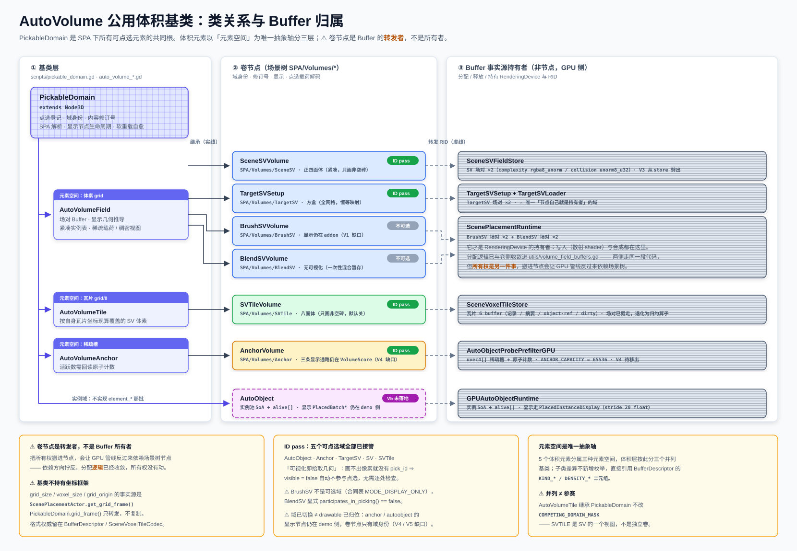

# AutoVolume 公用体积基类计划

把 SPA 下的 `SV` / `TargetSV` / `SVTile` / `Anchor` / `BrushSV` / `AutoObject` 收敛到共同基类
`PickableDomain`（点选入口）→ 其中体积元素走 `AutoVolumeField` / `AutoVolumeTile` / `AutoVolumeAnchor`
三层体积抽象，消除各自重复的 Buffer 分配、修订号与显示接线。

**结论先行**：`PickableDomain` 是所有 SPA 下可点选元素的共同根——统一点选入口、节点归属、软重载自愈。
体积元素经由 `AutoVolumeField` / `AutoVolumeTile` / `AutoVolumeAnchor` 三层体积抽象共享 Buffer 分配与
内容修订号。5 个体积元素分属三种元素空间（体素 / 瓦片 / 稀疏槽），体积层必须以**元素空间**为唯一抽象轴，
且**不得持有坐标框架**（§2.3）。范围内最大的一块实工不是写基类，而是把 `SceneVoxelTileStore` 劈成
`SV` 与 `SVTile` 两个卷（§1.2）。

> **上游文档**：本文多处引用《体素格式统一与点选统一计划》（`点选统一计划.md`），下文一律简称
> **《点选统一》**。凡标 §x.y 而未注明文档者，均指本文自身章节。

## 实施进度（2026-08-07）

| 期 | 状态 | 落地内容 |
| --- | --- | --- |
| **P0** | ✅ 已落地、`-e` 门禁 + bridge 实调验证 | 三条前提修正，见 §8 |
| **V0** | ✅ 已落地、`-e` 门禁 + bridge 实调验证 | `scripts/pickable_domain.gd`、`auto_volume_field.gd`、`auto_volume_tile.gd`、`auto_volume_anchor.gd`、`utils/volume_field_buffers.gd`；BrushSV + BlendSV 分配段收敛 |
| **V1** | ◐ 部分落地、`-e` 门禁 + bridge 实调验证 | 三个裸 `Node` 换成 `SceneSVVolume` / `BrushSVVolume` / `BlendSVVolume`；域身份 / 元素空间 / 场对读口 / 修订号就位。**显示半边只剩 BrushSV**（SV 已随 V5 前置补齐）——见 §4 的 V1 行 |
| **V2** | ✅ 已落地、`-e` 门禁 + bridge 实调验证 | `TargetSVSetup extends AutoVolumeField`；SPA 解析 / 修订号 / 显示节点清理 / 可见性开关 / 显示 AABB / cell 尺寸六项上交基类；`TargetSVVoxels.visible` 从三个写入方收敛到一个；所有权报告的两条按名字写死的例外分支删除 |
| **V3** | ✅ 已落地、`-e` 门禁 + bridge 实调验证；**未经 golden**（用户 2026-08-07 明确同意先行） | 新增 `SVTileVolume`（补上「SVTile 没有节点」缺口）+ `SceneSVFieldStore`（场对从 store 劈出）。store 退化为归约算子，对场对只剩转发 |
| **V4** | ◐ 节点半边落地、`-e` 门禁 + bridge 实调验证；**Buffer 与显示两半未做**，见 §4 的 V4 行 | 新增 `AnchorVolume`（补上「Anchor 域没有节点」缺口）；删掉零调用点的死释放路径 `_release_resident_anchor_handoff()` |
| **额外** | ✅ 已落地并验证 | **摘要刷新修复**（真根因是 `ok` 门恒 false，见 §4）；**SVTile 八面体几何**；`set_volume_display` 的域节点接线缺口 |
| **V5 前置** | ✅ 已落地、`-e` 门禁 + bridge **生产点击链**实调验证 | SV / SVTile 切进 ID 路：五个可点选域全部由 ID pass 接管，`DATA_PICK_MODE_PREFERENCE` 三项被全部摘出旧路。顺带修掉一个让 SV 域**根本建不出显示**的既有缺陷（`write_packed_field` 的尺寸门按实例数算，紧凑模式下 100% 判死）。见下方「SV / SVTile 切 ID 路落地记」 |
| **V5 批 A** | ✅ 已落地、`-e` 门禁 + bridge 实调（11 项全过） | 新增 `AutoObjectDomain`（`scripts/auto_object_domain.gd`）+ 接进 `SPA/Volumes/AutoObject`。⚠ **计划 §3 原文的 `AutoObject → PickableDomain` 字面上落不下去**——那个 class_name 已被 `scripts/auto_object.gd`（`extends MeshInstance3D`，单个放置实例）占用，见下方「V5 命名裁决」 |
| V5 批 B | ○ 未开始 | 显示节点归属迁移（`PlacedAutoObjects` → 域节点下）+ `rebuild_display()` 的六项外部输入怎么进来 |
| **额外** | ✅ 已落地、`-e` 门禁 + bridge 实调 | **选中框 Y 摆位修复**——见下方「选中框与显示错位修复」。这是切 ID 路那一轮明说"欠着"的两条之一 |

### ⚠ golden 门禁当前不可用（2026-08-07 实测）

`node tools/golden_snapshot_check.js` → **GOLDEN DIFF**，4266 行。四条证据表明**与本轮改动无关**：

1. diff **100% 落在 anchor 评分行**（`valid=0 gain=-1000000` → `valid=1 gain=1007` 一类），
   没有一行涉及 buffer / 卷 / 修订号 / 显示。
2. 基线文件 `goldens/volume_score_golden.approved.txt` **自身在工作区被改过**（+5126 / −196），
   即基线与代码本就不同步。
3. `has_brush_sv_content() == false` ⇒ `scene_placement_runtime.gd` 的 BlendSV 合成门根本不进，
   V0 唯一可能碰管线的改动**可证明是惰性的**。
4. 整趟 golden 跑完编辑器控制台零错误——本轮新加的 fail-loud 硬门一个都没触发。

⚠ 无法做标准 A/B（`git stash` 回退）：本工作区含大量他人未提交改动，且我改过的 7 个文件里有 3 个
**根本不在 HEAD**（`scene_placement_runtime.gd` / `buffer_descriptor.gd` / `spa_selection_host.gd`），
stash 会连带回退他人在同一文件里的工作。

⇒ 用户 2026-08-07 裁定：**先别管 golden，硬做 V3 后半**，以 `-e` 门禁 + bridge 实调 + 状态报告
逐字段比对代劳。本期因此**未经 golden 验证**——重建基线后应补跑一次。

⚠ 实施中**推翻了原文三处判断**，已就地改正并在 §8 记录成因。读旧版本的人请先看 §8。

## 0. 体素格式规范：每个 voxel 在 buffer 中装什么数据

规范本身**不在基类**（原文写"基类持有唯一真实源"，已作废，成因见 §8-2）：格式权威留在
`BufferDescriptor` / `SceneVoxelTileCodec` / `VolumeFieldBuffers`，基类只声明「**本域**的规格是哪一份」。

| 规格项 | 定义 | 事实源与基类的角色 |
| --- | --- | --- |
| 场对 schema v1 | `complexity` = `rgba8_unorm`（4 B），`collision` = `unorm8_u32`（4 B），同一索引并列 | 规格本体在 `VolumeFieldBuffers.schema_v1_field_specs()`；`AutoVolumeField` 只 re-export 场名 |
| Buffer 排布/密度二元组 | `BufferDescriptor.KIND_*` / `DENSITY_*` | 子类差异轴，直接引用 `BufferDescriptor`，**不新增枚举** |
| 规范索引式 | `x + gx * (z + gz * y)` | 唯一实现在 `VoxelGeneral.voxel_index()`；`BufferDescriptor.voxel_index()` 的 xzy 分支转发到它（P0 落地） |
| 坐标框架 | `grid_size` / `voxel_size` / `grid_origin` | 事实源是 `ScenePlacementActor.get_grid_frame()`（P0 新增）；`PickableDomain.grid_frame()` 转发，不复制 |

⚠ **原文写「基类持有此规范的唯一真实源」「取代分散在 `buffer_descriptor.gd` / `SceneVoxelTileCodec`」——
这两句已作废**（成因见 §8-2）。`BufferDescriptor` 不是散落常量，它是带 `_static_init()` 自检、
`validate()`、逐通道 decode 分派的**纯 CPU、不碰 RenderingDevice** 的格式权威；
`PickableDomain extends Node3D` 把它吞进来只会给它套上一层 Node 依赖。
正确形态是：格式规范留在 `BufferDescriptor` 与 `SceneVoxelTileCodec`，
基类只声明「**本域**的规格是哪一份」。

`SPA/Volumes` 分组与 `VOLUME_KEYS`（`scene_placement_actor.gd:31-36`）也已存在，但只覆盖
`TargetSV / SceneSV / BrushSV / BlendSV` 四项。

## 1. 现状：5 个元素的实际形状

### 1.1 形状对照

| 元素 | 元素空间 | 元素数 | Buffer | 事实源持有者 | 节点位置 | 修订号 | 显示通路 |
| --- | --- | --- | --- | --- | --- | --- | --- |
| `SV` | 体素 `grid` | `voxel_count` | 场对 ×2 | ~~`SceneVoxelTileStore`~~ → V3 起是 `SceneSVFieldStore` | `SPA/Volumes/SceneSV`（~~裸 `Node`~~ → V1 起是 `SceneSVVolume`） | ~~`_volume_revisions`，恒 0~~ → V1 起转发 SVTile 的 `gpu_revision` | ~~**无任何可视化节点**~~ → 正四面体紧凑显示 + ID pass（V5 前置） |
| `TargetSV` | 体素 `grid` | `voxel_count` | 场对 ×2 | `TargetSVSetup` + `TargetSVLoader` | `SPA/Volumes/TargetSV`（`Node3D`） | 节点自管 `_content_revision` | 消费侧硬编码字面量 `spa_selection_host.gd:2112`，绕开权威常量 `target_sv_setup.gd:18` 的 `DISPLAY_NODE` |
| `SVTile` | 瓦片 `grid/8` | `tile_count` | 记录/摘要/object-ref/dirty ×6（V3 起场对已劈走） | `SceneVoxelTileStore` | ~~**无节点**~~ → V3 起是 `SPA/Volumes/SVTile`（`SVTileVolume`） | ~~**无**~~ → 转发 `gpu_revision` | ~~`set_mode_visual_bindings`~~ → 八面体（只画非空砖）+ ID pass（V5 前置） |
| `Anchor` | 稀疏槽 | `ANCHOR_CAPACITY = 65536` | `uvec4[]` + 原子计数 | `AutoObjectProbePrefilterGPU` | 三个 drawable 在 `SPA/Volumes/VolumeScore/VolumeScoreDisplay` | **无** | 组 `register_voxel_display_node` |
| `BrushSV` | 体素 `grid` | `voxel_count` | 场对 ×2 | `ScenePlacementRuntime`（GPU 侧全权持有） | ~~裸 `Node`~~ → V1 起是 `BrushSVVolume`；输入端 `SPA/Interaction/MeshFillBrush` | `get_brush_sv_revision()`（卷转发） | `set_brush_visible`（V1 仍在 addon，等《点选统一》§6.5） |

四条显示通路、三种修订号来源（两个元素干脆没有）、两个元素没有节点——这就是体积抽象层要收敛的面。

各元素的可视化形状已规定（《点选统一》§5.4）：TargetSV 方盒、SV 正四面体、SVTile 八面体（现为扁平方盒、
待切换）、AutoObject 资产真实网格、Anchor 小球+胜出物体+profile 盒、BrushSV 正四面体、
BlendSV 无可视化。

### 1.2 `SV` 与 `SVTile` 今天是同一个对象的两半

`SceneVoxelTileStore` 同时拥有瓦片元数据**和** SV 场对本身：

```gdscript
# scripts/scene_voxel_tile_store.gd:22-23 —— 同一个对象里的场对 buffer
const SCENE_VOXEL_TILE_COMPLEXITY_FIELD_BUFFER := SceneVoxelTileCodecScript.SCENE_VOXEL_TILE_COMPLEXITY_FIELD_BUFFER
const SCENE_VOXEL_TILE_COLLISION_FIELD_BUFFER := SceneVoxelTileCodecScript.SCENE_VOXEL_TILE_COLLISION_FIELD_BUFFER
```

**决定劈开**：场对归 `SV` 卷，瓦片 6 buffer 归 `SVTile` 卷，`SceneVoxelTileStore` 退化为归约算子。
`committer` 的提交路径需重新穿线。分离后 `AutoVolumeTile` 不持有对 `SceneSV` 的引用——仅在需要时
根据自身瓦片坐标推算当前哪些 SV 体素落在自己范围内。

### 1.3 `Anchor` 持有自己的 Buffer

Anchor 自行分配 GPU Buffer：`uvec4[]`（每槽 16 B，存体素坐标 xyz + 标志位）+
原子计数 `_resident_anchor_count_buf`，容量 `ANCHOR_CAPACITY = 65536`。
通过 `init()` / `release()` 管理生命周期，外部通过 RID 指针引用其 buffer 句柄。

`AutoObjectProbePrefilterGPU` 管线的角色退化为纯调度器：收集活跃 Anchor 的 buffer 句柄
→ 一次 `dispatch` 批处理 → 读取结果。管线不分配、不释放、不知道 buffer 的生命周期，
只通过指针引用。（批处理约束决定了不能每个 Anchor 单独发一次 compute shader——
N 个 Anchor 合并为一次 dispatch，若 Anchor 持有管线所有权，则单 Anchor 消亡即导致管线失效。）

三种可视化**互斥**，每次只有一种出现：
- **小球**（`SphereMesh`）：评分阶段，标记锚点位置
- **胜出物体网格**（资产真实 mesh）：放置后，显示该锚点最终放置的物体
- **profile 盒**（`BoxMesh`）：Ctrl+H 观察态，显示锚点关联的体素轮廓

三个 drawable 归 `demos/placement-score-3d/volume_score_demo.gd`，挂在借用节点下的自建显示根
`SPA/Volumes/VolumeScore/VolumeScoreDisplay`（`volume_score_demo.gd:3293`），Buffer 同为 `anchor_index`。

### 1.4 `BrushSV` 是纯 GPU 卷，与插件输入严格分离

**输入侧**（`MeshFillBrush`，addon）：仅做点击捕获，将笔刷操作的"哪些体素变了、变成什么"
以 instance change 的形式喂给 `BrushSV`。不持有 Buffer、不管理可视化、不知道体素如何存储。

**数据与显示侧**（`BrushSV extends AutoVolumeField`，SPA）：
- 自己持有 `_brush_sv_complexity_buffer` 与 `_brush_sv_collision_buffer`（全权归属
  `ScenePlacementRuntime`，`scripts/scene_placement_runtime.gd:1203-1204`）
- 接收 instance change → 修改自己的 GPU buffer → 触发内容修订号递增
- 显示走 `AutoVolumeField` 的共享可视化逻辑（可见性、点选、显示键），自己仅实现三角形的填充逻辑
  ——即正四面体的 `_make_cell_mesh(SHAPE_TETRA)` 那一趟
- 不做自己的显示注册、不走插件的 `set_brush_visible` 通路

**与插件的关系**：`MeshFillBrush` 通过卷引用把 instance change 喂给 `BrushSV`，之后 `BrushSV`
自己完成 buffer 修改与可视化更新。两者的生命周期仍然分开（addon vs SPA），但 `BrushSV` 不依赖
插件的任何显示能力——它的一切可视化行为都继承自 `AutoVolumeField`。

### 1.5 真正的逐字重复

`ScenePlacementRuntime` 里 BrushSV 与 BlendSV 的分配段近乎逐字相同：

| 步骤 | BrushSV | BlendSV |
| --- | --- | --- |
| 尺寸推导 | `:1198-1199` | `:1406-1408` |
| 「无效或尺寸变了就 release+realloc」 | `:1200-1202` | `:1410-1411` |
| 两个 `storage_buffer_zero` | `:1203-1204` | `:1412-1413` |
| 有效性校验 + 报错 + release | `:1205-1212` | `:1414-1420` |

⚠ **「约 25 行 × 4 处」是错的**（实测成因见 §8-3）。真实分布：

| 处 | 形状 | 能否进统一入口 |
| --- | --- | --- |
| BrushSV / BlendSV | 逐字同款 | ✅ **已收敛**（P0/V0 落地，见 `utils/volume_field_buffers.gd`） |
| SceneSV（`scene_voxel_tile_store.gd:556-643`） | 状态散在 **7 张并列 Dictionary**（buffers / byte_sizes / upload_byte_sizes / init_sources / record_counts / strides / hashes）；碰撞场用地形基底做**种子**而非零填充；内嵌 5 段耗时打点 | ⚠ 需「状态存放位置」+「初值来源」两个钩子，随 V3 一起做 |
| TargetSV（`target_scene_voxel_generator.gd:355-381`） | **根本不同构**：一次性 pass 的入参打包（`SCOPE_FRAME`、无复用、无独立释放、靠 `_free_gpu→dispose` 整体回收）；「缺失通道只分配 4 字节」与 push constant 的门控 flag 强绑定 | ❌ 不该收。硬塞会把 pass 级语义污染进域级 API |

**收敛顺带修掉的两个洞**（不是无害重构）：
1. BlendSV 旧守卫只检查 complexity RID、**不检查 collision RID**——collision 失效而 complexity
   仍有效且体素数没变时，会跳过重建并把无效 RID 送进 uniform set。统一入口按「所有场 RID 都有效
   + 字节数都匹配」判命中。
2. BlendSV / TargetSV 都缺 `voxel_count > 0` 前置校验。`u32_field_byte_count(负数)` 返回 0，
   再经 `storage_buffer_zero` clamp 成 4 字节，**全程零报错**，最后拿到一对 4 字节的"场"。
3. 旧 `clear_brush_sv` 的非释放分支**吞掉** `buffer_zero` 的返回值——清不干净时表现为
   "残留内容继续参与合成与评分"，零提示。现在会上报。

收敛后的入口签名见 §2.5。

### 1.6 `BlendSV` 是临时混合卷

`BlendSV` 仅用于混合阶段——将放置结果与现有 `SceneSV` 做场对混合。它不是持久卷，
生命周期严格限定在 **混合开始 → 提交到 `SceneSV` 结束**。提交完成后 `BlendSV` 的内容即被清空/释放，
不参与后续帧的点选、显示或任何读取通路。**无任何可视化节点**。

与 `BrushSV` 同为 schema v1 场对、同在 `SPA/Volumes` 下、同分配式（§1.5），
但语义完全不同：`BrushSV` 是持续累积的输入卷，`BlendSV` 是一次性混合暂存卷。

### 1.7 `AutoObject` 是实例域

`AutoObject` 管理已放置物体的实例池（SoA + `alive[]`），消费体积场对数据来做 placement，
但自身不是体积域。在 `PickableDomain` 下与体积元素并列，共享点选入口与节点归属，
但不实现体积抽象层的 `element_*` 方法（§3）。

## 2. 基类边界

### 2.1 `PickableDomain`：所有可点选元素的共同根

| 能力 | 实现 | 取代掉的现状 |
| --- | --- | --- |
| 点选入口 | 统一 `pick()` 入口，走 ID pass 光栅化（《点选统一》§5） | 分散在各调用点 + 各自的命中算法 |
| 生命周期归属 | 一律 `SPA/Volumes` 子节点 | 2 个元素今天没有节点 |
| 软重载自愈 | `_repair_soft_reloaded_members()` 是**模板方法**（基类成员 → 再调 `_repair_soft_reloaded_domain_members()` 供子类重写）。公开入口首行调用 | 15 个文件 128 处各写一份（§5-1） |
| SPA 引用解析 | 沿父链向上查找 → 缓存，**经 `_notification(ENTER_TREE/EXIT_TREE)` 作废**；另有 `static resolve_spa_from(node)` 给非节点调用方 | **3 处**逐字相同：`TargetSVSetup` / `SPASelectionHost` / `volume_score_demo`（`spa_checks` / `spa_pipeline_checks` 已于 2026-08-07 删除） |
| 域身份 | 子类声明 `domain_key()`；基类 `domain_binding()` 查 `VOXEL_DOMAIN_BINDINGS`。不参与点选的卷显式 `participates_in_picking() → false` | 各域各自维护自己的 domain enum / display_key 映射 |
| 内容修订号 | `_revision: int` + `revision()` / `bump_revision()`；软重载修复**必须播种**而非归零 | 见下方「三类修订号」 |
| 体素数据布局 | 声明**本域**的规格（`field_specs()`），引用 `BufferDescriptor` / `SceneVoxelTileCodec`，不复制 | 各卷各自写一份 stride/字节数算式 |

⚠ **`_repair_soft_reloaded_members()` 是模板方法，子类不得重写**——重写会把基类那半段整个顶掉
且不报错。子类重写 `_repair_soft_reloaded_domain_members()`。这个形状是刻意的：它让「忘了调 super」
这个失败模式从结构上不存在。同理，SPA 缓存作废走 `_notification` 而不是 `_enter_tree` / `_exit_tree`
覆写——引擎对 GDScript 的 `_notification` 是**沿脚本链每层都调**
（`gdscript.cpp`：`notification is not virtual, it gets called at ALL levels just like in C.`），
而后两者是普通覆写，全仓连一个 `super._enter_tree()` 先例都没有，V2 要接进来的 `TargetSVSetup`
恰好三个钩子全有。⚠ 反过来，子类的 `_notification` 里**不要**写 `super._notification(what)`——会跑两遍。

⚠ **三类修订号只有第一类能收进基类**（实测成因见 §8-4）：

| 类别 | 代表 | 能否收 |
| --- | --- | --- |
| 内容修订号 | `TargetSVSetup._content_revision`、`get_brush_sv_revision()`、tile store 的 `gpu_revision` | ✅ 就是基类的 `revision()` |
| RID 失效/交接号 | `ScenePlacementActor._anchor_revision` / `_score_revision` | ❌ 语义是「释放或替换 RID 之前必须先递增」，时序约束的执行者是同时持有借出方与借入方的 SPA |
| 消费侧水位 | `_brush_flushed_sv_revision`、`AutoObjectInstanceRenderer._emitted_revision` | ❌ 是**消费方**记的"我上次读到第几版"，不属于任何域 |

⚠ 另注：`ScenePlacementActor._volume_revisions` 基本是**死状态**——SceneSV 建树补 0 后从无写入（恒 0）、
BrushSV 的写入在读时必被 `_runtime.get_brush_sv_revision()` 覆盖（纯 write-only）、TargetSV 压根没有条目。
整个字典真正传到报告里的只有 BlendSV 一项。别把它当成「四个卷的修订号表」来迁移。

点选机制：每个 drawable 把自己的 `pick_id` 写进 ID 目标，读点击处像素即得 `(domain, payload)`。
**可视化即拾取几何**——画不出来的进不了 pass（《点选统一》§5.2），消除了"看到的与点中的不一致"这
一整类漂移。已落地实现：`scripts/utils/pick_id_pass.gd`（`PickIdPass`）+ `shaders/pick_id.gdshader`，
AutoObject / Anchor / TargetSV 三个域已验证通过（《点选统一》§0.3）。

`PickableDomain extends Node3D`。子类分两路：体积元素走 `AutoVolumeField` / `AutoVolumeTile` /
`Anchor`；实例元素 `AutoObject` 直接继承 `PickableDomain`。

### 2.2 `AutoVolumeField` / `AutoVolumeTile` / `Anchor`：体积抽象层

三个并列的体积抽象类，各自对应一种元素空间。共同持有：

| 能力 | 实现 | 取代掉的现状 |
| --- | --- | --- |
| Buffer 分配/释放/尺寸变更重建 | 按子类声明的 buffer 规格统一执行（签名见 §2.5-7） | §1.5 的 4 份重复 |
| 稀疏载荷 + 稠密视图 | 仅 `BrushSV` 走这条；其余卷的 `materialize_dense()` 恒等于其常驻场对（依据见 §7） | 无（新增能力） |
| 显示键与可见性 | 单一入口 | 4 条通路 |

`AutoVolumeField` 额外持有**共享的可视化逻辑**，各 field 子类（`SceneSV` / `TargetSV` /
`BrushSV`）各自实现三角形的填充逻辑——例如按复杂度阈值剔除空格、按碰撞场着色等。`BlendSV` 也继承
`AutoVolumeField` 但无可视化（§1.6）。完整职责清单见 §2.5。

### 2.3 坐标框架：单一事实源，基类持有

格式规范已统一到 `PickableDomain`，所有子类共用同一套坐标词汇与换算函数——不再是各子类各自引用
`voxel_general.gd` 或各自推网格参数。坐标框架的实际值（`grid_size` / `voxel_size` / `grid_origin`）
仍从 SPA 导出，`PickableDomain` 通过 `_spa` 引用转发，不复制。

```gdscript
# ✅ 转发：唯一事实源仍是 SPA
func grid_frame() -> Dictionary:
    return _require_spa().get_grid_frame()   # {grid_size, voxel_size, grid_origin}

# ❌ 禁止：把框架复制进卷
# var grid_size := Vector3i(256, 16, 256)
```

⚠ **`ScenePlacementActor.get_grid_frame()` 此前不存在**，本文原稿的转发目标是虚构的。
P0 已补上（`scene_placement_actor.gd`，紧邻 `configure_grid`）。两条随之而来的约束：

- **三个 `@export` 必须保持原名可读，不能改成方法。** 四个 GPU 组件
  （`SceneVoxelCommitter` / `SceneVoxelTileStore` / `SceneVoxelFieldBuilder` / `ScenePlacementRuntime`）
  经注入的 `_grid_owner` **鸭子类型直读** `_grid_owner.grid_size`（field builder 还读 `base_resolution`）。
  grep `spa.grid_size` 抓不到这四处，改名只会在跑管线时炸，parse gate 与 `-e` 门禁都放过。
  `get_grid_frame()` 是**增设**而非替换。
- ⚠ 返回值**别按字典顺序展开**喂给 `VoxelGeneral.scaled_grid_frame()`：那个函数形参序是
  `(grid_size, grid_origin, voxel_size, scale)`，与本字典键序把后两项对调，两者同为 `Vector3`
  —— 传反了不报错、不崩，只有整套坐标静默错位。要按键名取。

⚠ **`MeshFillBrush` 今天违反本条**：`meshfill_brush.gd:30-32` 持有 `_grid_size` / `_grid_origin` /
`_voxel_size` 三个成员副本（由 `_load_target_sv_data()` 从 TargetSVSetup 抄来）。§1.4 说输入侧
"不持有 Buffer、不管理可视化"，但没说它持有**框架副本**。V1 显示半边落地时应随
`BrushTetraVoxels` 一起消失。

`TargetSV` 的 `display_scale` 是显示侧缩放，仍走 `VoxelGeneral.scaled_grid_frame()`，**不是**卷自己的框架。

### 2.4 点选几何：drawable 注册与 ID pass

每个需要被点选的域通过统一的登记函数注册 drawable，一次完成四件事：分配 `pick_id` 区间基址、
加入 display_key 组按同一谓词置 `visible`、校验 `custom_aabb` 非空、记录内容修订号快照。

**镜像节点机制**：ID pass 不走 `material_override`（同一帧内改材质会在异步绘制间隙露出乱码），
而是为每个 drawable 创建共享同一个 `MultiMesh` 资源的镜像 `MultiMeshInstance3D`，
放在 `own_world_3d = true` 的 `SubViewport` 中——与编辑器视口物理隔离。
镜像用自己的 `ShaderMaterial`，显示材质上的 `no_depth_test` 自动失效。

**关键约束**：
- `transparent_bg` 不开（24 位 ID，当前峰值 ~110 万，余量充足）
- ID 目标关 MSAA / TAA / SSAA / debanding / 3D 缩放
- tonemap 的 `linear_to_srgb` 在着色器内做逆变换补偿（不补偿的表现为"解出另一个合法对象"而非报错）
- 回读帧守卫 ≥ 1（编辑器只在有变更时绘制，空闲时计数停在 1）

⚠ 以上四条**全部是 `PickIdPass` 的内部实现**，写在这里只为交代机制。`AutoVolumeField`
及任何子类都不得重新实现它们——边界见 §2.6。

**`pick_id` Buffer 映射**（`INSTANCE_ID` + 逐 drawable 基址 uniform，方案 B）：

| domain | payload |
| --- | --- |
| AUTOOBJECT | `object_id` |
| ANCHOR | `anchor_index` |
| SV / TARGETSV | 线性体素下标 |
| SVTILE | `tile_index` |
| BRUSHSV | 笔刷体素序号 |

### 2.5 `AutoVolumeField` 职责清单

从《点选统一》与本文各节汇总出的、**确定要落进 `AutoVolumeField` 的八项**。
"形式"一列区分三种落法：常量 / 方法 / 仅 docstring（无代码，写清保证即可）。

| # | 内容 | 形式 | 出处 |
| --- | --- | --- | --- |
| 1 | `PickIdPass` 注册入口：一次完成 meta + 显示组 + 三项校验 | ✅ `register_pick_drawable()` | §2.4 |
| 2 | `no_depth_test` 不泄漏进 ID pass（镜像节点用独立 `ShaderMaterial`） | ✅ docstring | §2.4 |
| 3 | `custom_aabb` 非空 | ✅ 注册时判死 + `VoxelDisplay` 建 MultiMesh 时判死 | §2.4 |
| 4 | ~~MultiMesh stride 与 `pick_id` 在 `CUSTOM_DATA` 中的落点~~ | ❌ **撤销**，见下 | 《点选统一》§5.8 |
| 5 | 紧凑显示：只画非空格，不再 `instance_count = voxel_count` | ✅ `build_compact_instance_list()` + `_is_voxel_empty()` 钩子 | §7.3 |
| 6 | 可见性即准入：`visible = false` 自动不参与点选，ID pass 物理保证，子类无需单独检查 | ✅ docstring（`set_display_visible()`） | 《点选统一》§5.2 |
| 7 | Buffer 分配 / 释放 / 尺寸变更重建 | ✅ `VolumeFieldBuffers` | §1.5 |
| 8 | 内容修订号驱动显示缓存失效 | ✅ `get_instance_list()` + `_display_cache_revision` | §7.5 |
| **9** | **显示 AABB 推导** | ✅ `display_aabb()` | 新增，见下 |
| **10** | **cell 尺寸推导** | ✅ `display_cell_size()` + `display_fill_ratio()` / `min_cell_height()` | 新增，见下 |

### 第 4 项为什么撤销

原文要 `MULTIMESH_STRIDE_FLOATS := 20` 与 `PICK_ID_CUSTOM_DATA_OFFSET := 16`。实测两条都不成立：

- **三条体素显示通路今天全是 16 float**，硬编码在各自 GLSL 里
  （`voxel_field_instances.glsl:61` / `brush_voxel_instances.glsl:49` / `voxel_instance_copy.glsl:25-27`），
  且 `use_colors = true`、`use_custom_data = false`。20 只属于 AutoObject 那条
  （`PlacedInstanceDisplay`，走 `multimesh.set_buffer()` 整块搬运，**不经过** `VoxelMultiMeshWriterGPU`）。
  把 20 写进 `AutoVolumeField` 而不同步改三个 `.glsl`，就是「compute 按 16 步进写、引擎按 20 步进读」
  的整体错位——而且**纯静默**：compute 直写 `multimesh_get_buffer_rd_rid`，引擎侧无任何尺寸校验。
- **`PICK_ID_CUSTOM_DATA_OFFSET` 当前零消费者。** `pick_id` 的载体已定案为
  `INSTANCE_ID + 逐 drawable 基址 uniform`（`shaders/pick_id.gdshader:27/:43`，头注释原话
  「改动面为零：不动任何 MultiMesh 的 stride」），全仓 `.gdshader` 对 `INSTANCE_CUSTOM` 的引用数为 0。
- ⚠ 另注：custom data 的落点**不是**固定 16。引擎公式是
  `12 + (use_colors ? 4 : 0)`（`mesh_storage.cpp:1573-1576`）。只开 `use_custom_data` 不开 `use_colors` 时
  custom 落 12、stride 也是 16 —— 与「只开 colors」撞号却是完全不同的布局，是最容易画出乱变换的组合。

⚠ **两份文档在这条上互相打架**：《点选统一》§5.8-3 与 §12-1 仍写着「stride 统一到 20」
「全体 MultiMesh stride 从 16 重排到 20 待做」，而被 shader 引用的载体裁决（方案 B）说改动面为零。
按证据（方案 B 已落地且三个域验证通过）以 shader 为准，那两句应当作废。

**P0 落地的替代形态**：常量 `MULTIMESH_INSTANCE_FLOATS := 16` 落在 `VoxelMultiMeshWriterGPU`
（三个 writer 的既有共同基类），`AutoVolumeField` 只引用；配套在 `VoxelDisplay._build_writer_node()`
——全仓唯一分配体素显示 MultiMesh 的地方——补一道格式硬门（比的是两个开关 + transform_format
三项本身，不是 stride 数值）。

### 第 9 / 10 项：原文漏掉的两处逐字重复

```gdscript
# target_sv_setup.gd:321-324 与 meshfill_brush.gd:319-322 —— 逐字相同，连注释都一样
var span := VoxelGeneral.voxel_span_to_world_size(grid_size, voxel_size)
var half := maxf(span.x, span.z) * 0.5 + cell
var y_max := height_span * display_scale + span.y + cell
AABB(Vector3(-half, -cell, -half), Vector3(2.0 * half, y_max + 2.0 * cell, 2.0 * half))
```

cell 尺寸同理：TargetSV 用 `0.72 / 0.02`、笔刷用 `0.9 / 0.03`，两处都不知道对方存在；
更糟的是**两个调用方都给 `VoxelDisplay` 传 `"fill": 1.0` 然后各自在 cell 里乘系数**——
`VoxelDisplay.DEFAULT_FILL` 这个参数事实上被架空了。收进基类后系数仍可按域覆盖，但只有一处定义。

另有两条**无需代码、仅需文档注明**的保证：

- **背面行为一致性**：体素显示走 `CULL_DISABLED`，ID pass 保持一致（《点选统一》§8）。
- **透明度不参与点选**：ID pass 按全不透明处理，alpha 仅影响显示。`PickIdPass` 的 shader
  本就不做 alpha test，故无代码，只在 `AutoVolumeField` 文档注明（《点选统一》§10.7）。

对应的常量与方法签名：

```gdscript
# ── Buffer 生命周期（取代 §1.5 的 2 份逐字重复；SceneSV 随 V3、TargetSV 不收）──
func configure_field_buffers(owner, log_name := "") -> bool
func ensure_field_buffers() -> Dictionary      # {ok, reason, created, element_count, buffers, byte_sizes}
func release_field_buffers() -> void           # 释放 RID（消费方缓存失效）
func clear_field_buffers() -> Dictionary       # 就地清零，保留 RID（消费方缓存不失效）
func field_rid(field_name: String) -> RID

# ── 稀疏载荷 + 稠密视图（依据见 §7；当前仅 BrushSV 走这条）──────────────
func ensure_sparse_payload() -> Dictionary    # 砖池 + tile_id → brick_slot
func materialize_dense() -> Dictionary        # 按需实体化；缓存键 = content_revision()

# ── 显示几何推导（§2.5-9 / §2.5-10，取代两处逐字重复）─────────────────
func display_aabb() -> AABB
func display_cell_size() -> Vector3
func display_fill_ratio() -> float         # 子类可覆盖，默认 0.72
func min_cell_height() -> float            # 子类可覆盖，默认 0.02

# ── 紧凑显示（§7.3）──────────────────────────────────────────────────
func build_compact_instance_list() -> PackedInt32Array
func _is_voxel_empty(idx: int) -> bool     # 子类重写

# ── 修订号驱动的显示缓存失效（§7.5）──────────────────────────────────
var _display_cache_revision := -1

func get_instance_list() -> PackedInt32Array:
    if content_revision() != _display_cache_revision:
        _cached_instance_list = build_compact_instance_list()
        _display_cache_revision = content_revision()
    return _cached_instance_list
```

### 2.6 边界：不进入基类的内容

以下内容与本计划咬合，但**不属于 `AutoVolumeField`（或任何基类）的职责**。列在这里是为了
防止实施时顺手把它们塞进基类——那会把基类变成第二个 SPA。

| 内容 | 出处 | 不进的原因 | 正确落点 |
| --- | --- | --- | --- |
| 镜像 `SubViewport` + `own_world_3d` 隔离 | §2.4 | ID pass 内部机制 | `PickIdPass` |
| tonemap `linear_to_srgb` 逆变换补偿 | §2.4 | 同上 | `PickIdPass` 着色器 |
| MSAA / TAA / SSAA / debanding / 3D 缩放关闭 | §2.4 | 同上 | `PickIdPass` 初始化 |
| 回读帧守卫 `≥ 1`、`force_draw` 不递增帧计数 | §2.4 | 同上 | `PickIdPass` 回读路径 |
| 回读路线选型（同步 vs async） | 《点选统一》§5.5 | 同上 | `PickIdPass` 内部 |
| P0 四项裁决（P0-A ~ P0-D） | 《点选统一》§7.1–7.4 | 空间语义层面，不是类职责 | 保留在文档 / `ScenePlacementActor` / shader 注释 |
| R0 Provider 移除 | 《点选统一》§3 | 独立架构变更 | 独立追踪 |
| 六组删除清单 | 《点选统一》§11 | 迁移指南 | 本文 §4 各期实施时引用 |
| 七条刻意行为变更 | 《点选统一》§10 | 用户感知层 | 保留在文档 |
| 域间优先级 / 平局规则 | 《点选统一》§12.6 | 深度测试自动处理 | 无需代码 |
| `DATA_PICK_MODE_PREFERENCE` 退役 | 《点选统一》§10.4 | 旧路废弃 | 随旧路一起删，不进入新类 |
| SV / SVTile 劈开逻辑 | 本文 §1.2 | 是迁移代码，不是基类能力 | `SceneVoxelTileStore`，V3 期 |
| Anchor 判定球缩小 | 《点选统一》§10.2 | 属 `Anchor` 子类 | `Anchor` 类 |

## 3. 类型结构



图里三条泳道分别是**基类层 / 卷节点 / Buffer 事实源持有者**。实线 = 继承，虚线 = 转发 RID。
⚠ 图要连着两条一起读：① 卷节点是转发者不是所有者（§3 末尾）；
② **域已切进 ID pass ≠ drawable 已归位**——anchor 与 autoobject 的显示节点今天仍在 demo 侧。

```text
PickableDomain                          # scripts/pickable_domain.gd  ✅ V0
│                                       #   点选登记 + 域身份 + 修订号 + SPA 解析 + 显示节点生命周期
├── AutoVolumeField                     # scripts/auto_volume_field.gd  ✅ V0
│   │                                   #   体素域（元素空间 + 场对 Buffer + 显示几何推导 + 紧凑实例表）
│   ├── SceneSVVolume                   # scripts/scene_sv_volume.gd    ◐ V1（无几何，等《点选统一》§6.3 的正四面体）
│   ├── TargetSVSetup                   #   方盒，V2 改 extends
│   ├── BrushSVVolume                   # scripts/brush_sv_volume.gd    ◐ V1（显示仍在 addon，等《点选统一》§6.5）
│   └── BlendSVVolume                   # scripts/blend_sv_volume.gd    ✅ V1
│                                       #   无可视化；participates_in_picking() == false（§1.6）
├── AutoVolumeTile                      # scripts/auto_volume_tile.gd   ✅ V0（骨架）
│                                       #   八面体（现为扁平方盒），按自身瓦片坐标推算覆盖的 SV 体素
├── AutoVolumeAnchor                    # scripts/auto_volume_anchor.gd ✅ V0（骨架）
│                                       #   小球/胜出网格/profile 盒（互斥），自持 uvec4[] + 原子计数
└── AutoObject                          # 资产真实网格，实例域（SoA + alive[]），V5
```

⚠ **`Anchor` 已改名为 `AutoVolumeAnchor`。** 裸 `Anchor` 语法上可行（Godot 4.6 没有同名 ClassDB 类，
`Control.Anchor` 是类内嵌枚举、不占全局符号），但本仓 "anchor" 这个词已被占满：域字符串
`SELECTION_DOMAIN_ANCHOR := "anchor"`、`anchor_index`、`anchor_revision`、8 个 anchor 着色器。
用它做全局 class_name 会让 `Anchor`（类）与 `"anchor"`（域）在同一份代码里指两件事。

⚠ **三个卷节点是转发者，不是 Buffer 所有者。** SceneSV 的场对仍归 `SceneVoxelTileStore`（V3 劈开前），
BrushSV / BlendSV 仍归 `ScenePlacementRuntime`（它才是 RenderingDevice 持有者）。把所有权搬进节点
会让 GPU 管线反过来依赖场景树节点——依赖方向拧反。分配**逻辑**已经收敛（`VolumeFieldBuffers`），
所有权是另一件事。

`PickableDomain` 之上无体积假设——不持有坐标框架、不持有元素空间。体积相关的 `element_kind()` /
`element_density()` / `element_capacity()` / `element_to_voxel()` / `voxel_to_element()` /
`live_element_count()` 全在体积抽象层定义，`AutoObject` 不实现它们。

体积子类差异**只有元素空间一根轴**，直接复用 `BufferDescriptor` 的既有二元组：

```gdscript
# 体积抽象层必须声明（构造期常量，不随内容变）
func element_kind() -> String       # BufferDescriptor.KIND_*
func element_density() -> String    # BufferDescriptor.DENSITY_*
func element_capacity() -> int      # Buffer 槽位数；DENSE 时等于 element_count()

# 寻址：元素下标 ↔ 体素坐标。三种元素空间各自实现
func element_to_voxel(index: int) -> Vector3i
func voxel_to_element(voxel: Vector3i) -> int

# 稀疏卷额外：活跃元素数需回读原子计数
func live_element_count() -> int
```

`AutoVolumeField.element_to_voxel()` 即 `VoxelGeneral.voxel_from_index()`；`AutoVolumeTile` 按
`tile_grid_size_for_grid()` 换算；`Anchor` 从 `uvec4[]` 的 `xyz` 读出，无解析式。

`AutoVolumeField` 在此之上的八项职责与其常量/方法签名见 §2.5。

## 4. 迁移分期

每期独立可验，验收一律是 `-e` 编辑器门禁（编辑器加载无脚本错误 + bridge 应答 ping）。

| 期 | 内容 | 触及文件 | 验收 |
| --- | --- | --- | --- |
| **P0** ✅ | 三条前提修正（见 §8） | `scene_placement_actor.gd`、`utils/buffer_descriptor.gd`、`utils/voxel_display.gd`、`utils/voxel_multimesh_writer_gpu.gd` | `-e` 门禁通过 + bridge 实调 `get_grid_frame()` |
| **V0** ✅ | 建四个基类骨架，**不接线**；把 §1.5 里**真正逐字重复的那两处**（BrushSV / BlendSV）收敛为 §2.5-7 的统一实现 | 新增 `pickable_domain.gd` / `auto_volume_field.gd` / `auto_volume_tile.gd` / `auto_volume_anchor.gd` / `utils/volume_field_buffers.gd`；改 `scene_placement_runtime.gd` | `-e` 门禁通过 + bridge 实调 BrushSV 分配器 |
| **V1** ◐ | 三个裸 `Node` 换成卷节点；域身份 / 元素空间 / 场对读口 / 修订号就位。**显示半边未做** | 新增 `scene_sv_volume.gd` / `brush_sv_volume.gd` / `blend_sv_volume.gd`；改 `scene_placement_actor.gd` 建树段 | `-e` 门禁通过 + bridge 实调四个卷方法 |

**V1 追加（V4a 之后补做）：显示键映射表删除 + 一个活 bug 修复。**

`set_volume_display()` 里原有一张**手写映射表**，只映射 `TargetSV→"targetsv"` 与 `SceneSV→"sv"`，
其余 volume key 落进兜底分支被**原样**当显示键传给 `SPASelectionHost`。于是：

- `set_volume_display(&"BrushSV", …)`（编辑器工具栏 Brush 按钮，`meshfill_editor_plugin.gd:266`）
  每按一次都把 `"BrushSV"` 喂下去，而合法键是小写 `"brush"` ⇒ **撞上未知键判死，
  `push_error` + `assert` 各一次**。表现是「按钮能切显示、但每次都报错」——
  显示那一半是走 `_brush_input.set_brush_visible` 独立生效的，所以看起来"能用"。
- 每新增一个卷都会重犯一次。

⇒ 现在四个卷都是 `PickableDomain` 子类，**显示键问卷节点自己要**（`display_key()` → 合同表），
映射表整个删掉。没有显示键的卷（`BlendSV`，`participates_in_picking() == false`）返回空串、跳过。
这是 V1–V4a 那批域身份工作的第一次实际兑现。

顺带把 **Shift+B 热键**从直接调 `_brush_input.set_brush_visible` 改为走 `set_volume_display` 门面
——原先它绕开 SelectionHost，热键切完后显示开关状态与节点实际可见性不一致，工具栏按钮按下态也不跟。

bridge 实调验证：`set_volume_display(&"BrushSV", false)` → `get_voxel_display_state()` 里
`"brush": false`（修复前这一步会判死且 `brush` 保持 `true`）；`&"BlendSV"` 静默跳过不报错；三次调用零错误。

### SV 显示落地记（2026-08-07）

SV 域此前**没有任何可视化节点**。现在走与 TargetSV 同一条 GPU 通路
（`voxel_field_instances.glsl`），只换形状（TargetSV 方盒 / SV 正四面体）与数据来源。

**卡点是设备，不是格式。** SPA 的 GPU 栈跑在**本地 RenderingDevice**
（`scene_voxel_committer.gd` 的 `ensure_device(true, false)` —— 本地设备且**禁止**回退全局），
而三个显示 writer 绑的是 `RenderingServer.get_rendering_device()`（**主设备**）。
RID 不能跨设备 ⇒ 「零拷贝直接绑 SV 场对」在当前架构下**物理不可能**，必须回读。

**但回读之后零 CPU 解码** —— 这条是查出来的，不是设计出来的：

| 侧 | 事实 |
| --- | --- |
| 写入 `scatter_sv_field_records.glsl` | `pack_rgba8` = `r<<24 \| g<<16 \| b<<8 \| a`，写的是 `vec4(color, complexity)`，注释明写 **"keeps complexity in the low byte"** |
| 显示 `voxel_field_instances.glsl` | `unpack_rgba8` = `(>>24)=r (>>16)=g (>>8)=b (>>0)=a`；`unpack_r8` 取低字节 |

两侧**逐位相同**。所以 SceneSV 的常驻场对**就是** shader 的输入格式，且
`occupancy`(binding 0) 与 `color_rgba8`(binding 2) 可以**绑同一块 complexity 场**——
前者按低字节读出 complexity 当占据度，后者按 rgba8 解出颜色。

落地形态：
- `VoxelFieldDisplayGPU.write_packed_field()` + `VoxelDisplay.build_field_gpu_packed()`
  ——已打包输入的写入口，跳过 float→codec 打包那一步；与既有 `write_field()` 共用同一条
  dispatch 尾巴（`_dispatch_packed`）
- `SceneSVVolume.rebuild_display()` —— 回读两块场 → 建正四面体 MultiMesh → 基类
  `register_pick_drawable()`；`display_aabb()` / `display_cell_size()` 全部走基类
  （V0 那批机制**第一次有了消费者**）
- ⚠ **默认不显示**：全网格 10^6 实例 + 每次重建 2 × 4 MiB 回读，默认开着每次开场景都白付
- 重建由 `revision()` 门控（内容没变不重建），不是每帧

**验证**：`-e` 门禁零错误零泄漏；`SceneSVVoxels` MultiMeshInstance3D 确实建出；
节点 meta 含 `voxel_display_reason = "ok"` 与 `meshfill_pick_drawable`（⇒ 基类登记的四道硬门
——几何非空 / `instance_count > 0` / `custom_aabb` 非空 / 解码口存在——全过）；
`resolve_pick(null, 66000)` → `voxel_coord (208,1,1)`，校验 `208 + 256*(1+256*1) = 66000` ✓。
⚠ **视觉未确认**：编辑器相机位姿从桥这侧改不动，截图取不到地形区域。

### 紧凑显示落地记（§2.5-5 / §7.3）

`voxel_field_instances.glsl` 加了一层**可选**的实例序 → 体素下标映射：

- 新 binding 5 `instance_voxel_index[]`；push 的 `pad0` 变成 `use_index_map`
- `use_index_map == 0` ⇒ `vidx = idx`，**与改动前逐位相同**（TargetSV 不受影响）
- `use_index_map != 0` ⇒ `vidx = instance_voxel_index[idx]`，此时 push 的 `voxel_count` 是**实例数**

⚠ **实例槽位与体素下标必须分开**：`base = idx * FLOATS_PER_INSTANCE`（第几个实例）与
`vidx`（画哪一格）是两件事。落地时漏改了一处——颜色采样仍用 `idx`——紧凑模式下会取错格子的颜色，
数值合法、不报错。逐个核对 `idx` 的每一处用法才抓到。

⚠ **CPU 侧的 pick 解码必须走同一张表**。`SceneSVVolume.resolve_pick()` 因此与 TargetSV 那份
**不同**：TargetSV 是恒等映射，本域要 `get_instance_list()[local_index]`。
用恒等解会指到别的体素——同样是数值合法、不报错、只是选中的格子不对。
两侧同表由 `revision()` 缓存保证（内容没变就不重算）。

**非空砖识别不做逐体素扫描**：1,048,576 次 GDScript 循环是几百毫秒级，而瓦片摘要里已有
`scene_voxel_count` / `collision_voxel_count`（每砖一条、共 2048 条）。粒度是**砖**不是体素
（一砖 8³ = 512 格，砖内空格仍进表、由 shader 塌成零基向量）——已经把 10^6 降到「非空砖数 × 512」。

### ⚠ 实跑管线查出的既有缺陷：瓦片摘要在 stamp 之后不刷新（**已修**）

用户授权后实跑 `run_anchors → run_score → run_place`（放置 5480 个物体），得到一条**与本计划无关、
但会让 SV / SVTile 显示整块画不出来**的事实：placement 写进去了，摘要却全报 `scene_voxel_count == 0`。

#### 真根因（第一版诊断是错的，务必别照旧版本推理）

~~「`commit_scene_voxels()` 在 SPA 里只有 `initialize_runtime()` 一个调用点」~~ —— **不成立**。
placement 路径上**有**触发点：`scene_placement_runtime.gd` 的 `_commit_accepted_placements()`
会调 `commit_scene_voxels()`。它之所以从不执行，是因为上游那道门写的是

```gdscript
if _sv_committer != null and bool(placement_result.get("ok", false)):
```

而 VPG 的**成功**变体按 `ReportSchema.VPG_MULTI_ASSET_REPORT` 的约定**刻意不发 `ok` 键**
——那条注释的原话是「**成功变体故意不发 ok——SPA 的 ok 门现状即靠缺席走 false 分支，勿补发**」。
⇒ **每一次成功放置这道门都是 false**，commit 分支恒不执行。

#### 修法：加独立入口，**不补发 `ok`**

补发 `ok` 会同时打开一条从未验证过的 GPU 写路径（见下方「顺带查出的两个未修缺陷」），所以：

| # | 改动 |
| --- | --- |
| 1 | `SceneVoxelCommitter.refresh_scene_voxel_tile_summaries()` —— 只跑 `_rebuild_sv()`，**不**散射 pending 的 CPU 入口记录、**不**推进 tick（那两件是「提交」的语义，而这里内容已经在场里了） |
| 2 | `ScenePlacementActor.run_place()` **批循环内**调它；`batch_reports` 加 `sv_tile_summary_refresh_ok` 逐批可观测键（刷新失败时 Place 仍报 ok，没有这个键就只能翻控制台） |
| 3 | `_reduce_scene_voxel_tile_summaries_gpu()` 成功后推 `_scene_voxel_tile_gpu_revision` —— **这条不能省**：两个卷的 `revision()` 都拿它当「内容变没变」的门，`rebuild_display()` 在 `_built_revision == current` 处直接 return。只刷摘要不推它 = 摘要是新的、显示照旧画旧的，且零提示 |

⚠ **没有增量路径可用，别去找**：三个摘要 shader 全是全量（`reduce_scene_voxel_tile_summaries.glsl`
只有 3 个 binding，**没有** dirty worklist 绑定），而且 placement 路径**根本不标脏**——
全仓 `mark_scene_voxel_tile_bounds_dirty*` 的调用点只有 committer 的 CPU 入口盖章与笔刷。

#### 实测（Place 5445 个物体）

| 指标 | 修复前 | 修复后 |
| --- | --- | --- |
| `sv_tile_summary_refresh_ok` | — | 逐批 **true** |
| 紧凑实例表 | **0** | **461,312**（901 非空砖 × 512） |
| 占全网格 | — | **43.99%** —— 实例数与 pick_id 预算都省 56% |
| `_warn_if_summaries_are_stale` | 每次都喊 | **0 次** |
| `resolve_pick(0)` | — | `voxel 56 / (56,0,0)` —— **证明紧凑映射表生效**（恒等映射会是 0） |

这同时补上了「非空砖会被正确挑出」那条此前明说验不了的断言。

#### ⚠ 顺带查出、**本轮未修**的两个缺陷（同一道 `ok` 门造成）

1. `_flush_gpu_runtime_dirty_delta_to_scene_voxel_committer()` 被同一道门挡着 ⇒
   tile object_ref 更新 pass（`scene_voxel_tile_object_ref_update.glsl`）在生产 Place 路径上
   **从未跑过**，返回恒为 `{blocked: true, blocked_reason: "placement_not_ok"}`。
2. placement 不标脏 + prefilter 每趟 `finalize_consumed_dirty_tiles()` 清脏 ⇒ 第 2 批及以后的
   `collect_sv_anchors` 很可能拿到空 worklist ⇒ 0 锚点 ⇒ Place 实际只有第一批有产出。

#### 纠正两条错话

- ~~「摘要还喂 prefilter 的 `collect_sv_anchors`」~~ —— **不对**。`collect_sv_anchors.glsl` 的
  binding 是 `TargetField / TargetCollision / DirtyTiles / AnchorOut / AnchorCount / DirtyTileCount`，
  **没有** summary 缓冲。摘要的真实消费者只有 `SceneSVVolume.build_compact_instance_list()`、
  `SceneVoxelDebug` 与 `get_svtile_debug_record()`（外加本轮新增的 `SVTileVolume` 显示）。
- ~~探测器用 `push_error` + `assert` 三件套~~ —— **assert 已去掉**。本仓的 assert 约定是
  「调用方违约」，而摘要过期是**在管线修好之前每次 Place 之后都会发生**的既有状态；
  实测后果是编辑器在那次 bridge 调用里被断言当场打死，比它要取代的静默行为更糟。
  现在只 `push_error`，实测连续 3 次调用编辑器都存活。

**验证与其局限**：
- 改过的 shader 编译并 dispatch 成功，零错误零泄漏
- **TargetSV 用同一个 shader 重建成功**（`voxel_display_reason = "ok"`、`resolve_pick` 正确）
  ⇒ `use_index_map = 0` 这条老路径无回归
- ⚠ 本会话 SV **是空的**（`last_upload_mode = "gpu_initialized_resident_topology"`、管线没跑过、
  笔刷无内容、complexity 场是全零 `cpu_upload` 载荷），所以紧凑表为空是**正确行为**；
  摘要回读本身可证工作正常（尺寸守卫没报警 ⇒ 确实拿到 2048×32 字节）。
  但**「非空砖会被正确挑出」这条没验过**——需要一份已提交的 SV 数据。

~~**仍未做**：接进 ID pass~~ —— ✅ **已落地**，见下方「SV / SVTile 切 ID 路落地记」。
连同那一轮查出并修掉了本节遗留的两条：`write_packed_field` 的尺寸门在紧凑模式下 100% 判死
（SV 有内容时才暴露），以及「非空砖会被正确挑出」这条此前明说验不了的断言
（实测 910 非空砖 → 465,920 实例 → 生产点击 6/6 严格一致）。

### SVTile 八面体落地记（《点选统一》§5.4 第 3 行）

瓦片域此前**没有几何**（旧的扁平方盒叠加层挂在已从场景移除的 `DemoHost` 下）。现在 `SVTileVolume`
自己建八面体（`VoxelDisplay.SHAPE_OCTA` 早已就位，此前零消费者）。

| 决策 | 理由 |
| --- | --- |
| 数据源 = 瓦片摘要回读（64 KiB） | 与 SceneSV 同一个设备约束：SPA 的 GPU 栈在本地 RD、writer 绑主设备，RID 不能跨设备。但 2048 × 32 B 比 SceneSV 的 2 × 4 MiB 小三个量级 |
| 走 `build_colored` 而非 `build_field_gpu` | 2048 个实例在 CPU 上算中心点+颜色就是 2048 次循环；而 `build_field_gpu*` 要的是「场 → shader 逐体素解包」，**瓦片摘要不是场**（stride 32、字段是计数与 min/max），为它新写 shader 是负收益 |
| cell = **一个瓦片**的世界尺寸 | ⚠ 不是一个体素。拿体素尺寸当 cell 会画出 2048 个散落的小八面体——位置在瓦片中心、大小是体素，每个值都合法，只是根本不代表那块砖。实测 `display_cell_size()` = **(28.8, 14.4, 28.8)** = (8,8,8)体素 × (4,2,4)米 × 0.9 ✓ |
| 颜色按**占用密度**而非 `complexity_minmax` | 后者是**极值**：一块砖里有一格满复杂度就顶红，2048 块砖会迅速饱和成同色。而计数除以该砖**实际覆盖**体素数天然落在 [0,1]，且与 `SceneSVVolume` 的非空砖判据**同源**——两个域不会各说各话 |
| **只画非空砖** | 全画 = 2048 个 32×16×32 米的实体铺满世界，既看不出信息也会在 ID pass 里罩住一切。⇒ 实例序**不是** `tile_index`，`resolve_pick` 必须经建显示时记下的映射表解 |
| 默认**不显示** | 理由**不是开销**（64 KiB + 2048 实例很轻），是**遮挡**：一个八面体罩着 512 个 SV/TargetSV 体素，而 ID pass 按深度取胜者 ⇒ 默认可见会让瓦片内部大半体素静默选不中。《点选统一》§10-6 也明写「SVTile 默认不显示 ⇒ 默认不可选」 |
| `resolve_pick` **刻意不返回 `voxel_coord`** | 八面体是瓦片尺度的，命中点不对应任何单格；塞一个"代表体素"会被下游按体素起算的记录构建口当成"射线真的打中的那一格"。覆盖范围以 `voxel_min` / `voxel_max_exclusive` 如实给出 |

**顺带查出并修掉的接线缺口**：`set_volume_display()` 此前**只对 TargetSV / BrushSV 翻节点那半边**，
SceneSV / SVTile 只翻了 host 的显示键 —— 域节点自己的 `display_visible` 从没人写过，
`rebuild_display()` 因而**全仓零调用点**。表现是"开关显示已打开，但什么都没画"。
同时补上 `set_voxel_display_visible("svtile", …)` → `set_volume_display(&"SVTile", …)` 的转发。

**验证与其局限**：
- `-e` 门禁零错误；`live_element_count()` = **905**（新的摘要回读实现，与 SceneSV 的 901 非空砖同源判据）
- `SVTileOctas` 节点经**显示开关**建出 ⇒ 上面那条接线缺口确实修好了
- ⚠ **pick 映射表的一致性没验成**：验证途中我编辑了 `@tool` 脚本，触发编辑器重载 →
  SPA 走了一遍 `_exit_tree → _shutdown → _enter_tree → initialize_runtime()` → SV 被重置成空场
  （`live_element_count()` 从 905 变 0）。节点是场景节点所以留着，映射表却被一次「找不到非空砖」
  的重建清空了。**根因是编辑期重载，不是代码逻辑**，但暴露了一个真实的早退缺陷：
  `rebuild_display()` 的守卫原先只看「修订号没变 + 节点还在」，这种不一致**连强制重建都修不好**。
  已加固为三项都要成立（补上「映射表非空」）。

⚠ **操作教训（写给下一个人）**：编辑 `@tool` 脚本会触发编辑器重载并**重置 SPA 状态**。
所以「跑管线造数据 → 改代码 → 再验证」这个顺序是错的，必须
**「改完代码 → 重开编辑器 → 跑管线 → 一次验完」**。

### SV / SVTile 切 ID 路落地记（V5 前置，2026-08-07）

《点选统一》§11 第一组的前置。用户裁定**不做逐样本对比、直接切**（成因见 §8-10 与下方
「为什么这两个域没有对比证据」）。切完之后 **五个可点选域全部由 ID pass 接管**。

#### 落点：五处必须同步，漏任一处都是静默的

| # | 落点 | 漏了会怎样 |
| --- | --- | --- |
| 1 | `PICK_ID_DISPLAY_KEYS` += `sv` / `svtile` | `collect_pick_drawables()` 收不到 ⇒ 该域进不了 pass，**怎么点都点不中**，零提示 |
| 2 | `PICK_ID_SWITCHED_DOMAINS` += 两项 | `_pick_id_commit_hit()` 开头判死（`unswitched_domain`，有 push_error） |
| 3 | `_pick_id_commit_hit()` 的 match 补两个记录构建分支 | 点得中但建不出记录（末尾有 push_error） |
| 4 | `_selection_state_identity()` 的 match 补两个分支 | 选中了但桥侧报 `payload_index = -1` —— 与「没选中」无从区分，**静默** |
| 5 | **`pick_id_resolve_at_camera_pose()` 的载荷解释 match**（规格漏了这一处） | 探针缝落进 `_:` 兜底 ⇒ `assert(false)` ⇒ **编辑器当场被打死** |

另加两处防错数：

- `PICK_ID_SWITCHED_DATA_MODES` 现在等于 `DATA_PICK_MODE_PREFERENCE` 全部三项 ⇒ ID 路开着时
  `_pick_data_selection_record_with_camera()` 是**保证返回 {}** 的空转。它连同
  `_pick_bound_data_selection_record` / `_data_pick_callables` **刻意保留不删**——
  只服务 `pick_id_selection_enabled = false` 的一键回退（那也是这两个域出问题时的唯一判据）。
- `_pick_domain_screen_distance()` 补显式分支返回 `-1.0`。这两个域的 `payload_index` 是**体素/
  瓦片下标**，落进原来的 `else` 会拿它去索引 `_autoobject_positions`——越界检查照样通过、
  算出来是另一个物体的屏幕距离，证据里那个 `center_dist_px` 就是个看不出错的假数。
  同理，探针缝的旧路对照也补了显式分支（`legacy_not_compared`），不让 `agree` 拿
  AutoObject 的下标去和体素下标比。

两个桥侧门禁也一并跟上——**它们是本轮改动的一部分，不是可选的收尾**：

| 脚本 | 改了什么 | 不改会怎样 |
| --- | --- | --- |
| `tools/pick_id_production_click_parity.js` | `SWITCHED` / `clickIdentity` / `referenceIdentity` 三处镜像；判据 C 新增 `no_legacy_counterpart_*` 归类；新增 `--hide-volumes` | 镜像不同步 ⇒ 把已切换域当未切换统计，结论整体失真；判据 C 会把 90 条**按设计必然存在**的跨域分歧报成 `unexplained` ⇒ 门禁永久红 |
| `tools/pick_id_click_types.js` | 「点空处」的期望从「未切换域旧算法接手」改成「无选中」；「SVTile / SV 走旧路」两例改成走 ID 路；`setDisplay` 从 host 改走 **SPA** | 前两条是**切换前的语义**，切完必红；`setDisplay` 走 host 只翻记账位、卷节点不重建显示 ⇒ 该域怎么点都点不中，而脚本会把它记成"这个类型未覆盖" |

⚠ `no_legacy_counterpart_*` **不是通过证据**，只是"此处没有可比对象"的如实记账；
脚本会单列一行提醒，别把它读成"分歧已解释"。

#### ⚠ 拦路的既有缺陷：SV 的紧凑显示 100% 建不出来（**已修**）

第一次验证时 SVTile 通过、**SV 报 `drawables=0`**。根因不在点选侧，在
`VoxelFieldDisplayGPU.write_packed_field()` 的尺寸门：

```gdscript
var expected := _instance_count * 4      # ← 旧写法
```

三块场是每**体素** 4 字节，而 `_instance_count` 在紧凑模式下是**实例数**。两者只在全网格
（恒等映射）下相等。实测 SV 有内容时是 `4,194,304 B 场 vs 462,336 实例` ⇒ 硬失败 + assert，
表现是「开关打开了、什么都没画」。

⇒ 期望长度改按**体素数**算（紧凑模式下从 `grid_size` 推），并补一道「映射表长度必须恰好
等于实例数」的门（短了着色器按实例序越界读表、长了说明两批不同源，两种都静默）。

⚠ 这条缺陷从「紧凑显示落地」那一轮起就在，只是**那一轮 SV 是空的**（紧凑表为 0 ⇒ 在到达
writer 之前就早退了），所以没人撞上。教训与 §8-9 同款：**空数据下的"通过"不覆盖有数据的路径**。

#### 实测（Place 5445 个物体后，编辑器全程零错误零警告零泄漏）

**专项**（每个域单独开显示）：

| 域 | prepare | 探针命中 | 生产点击与探针严格一致 |
| --- | --- | --- | --- |
| `svtile` | `drawables=1  next_pick_id=911` | 6 | **6/6** |
| `sv` | `drawables=1  next_pick_id=465921` | 6 | **6/6** |

**`pick_id_production_click_parity.js` 四种显示配置合计 886 次生产点击**：

| 配置 | 覆盖到的域 | 判据 A（落地 === ID 参照） | 判据 B | 判据 C |
| --- | --- | --- | --- | --- |
| 全开 | sv / svtile / targetsv / autoobject | 262 条 **0 不符** | 0 条非 `pick_id` | `unexplained` **0** |
| `--hide-volumes --no-place` | targetsv | 168 条 **0 不符** | 同上 | `unexplained` **0** |
| `--hide-volumes --hide-targetsv` + demo place | autoobject / anchor | 240 条 **0 不符** | 同上 | `unexplained` **0** |
| 全开（分类修复前） | 同第一行 | 216 条 **0 不符** | 同上 | 90 条误报 `unexplained`（即本轮修掉的分类缺口） |

⇒ 五个域全部覆盖到，判据 A 累计 **886 条 0 不符**、判据 B 累计 **0 条非 `pick_id`**。
⚠ 单次运行必然有域报 NO-COVERAGE（互相遮挡），所以**覆盖面要跨配置合起来读**，
不能拿其中任何一次的 INCONCLUSIVE 当结论。

**`pick_id_click_types.js`（逐点击类型，走完整 SPA 入口）：10 类通过 10、不符 0、未覆盖 0。**
含本轮改写的两类与新增的两类：

| 类型 | 结果 |
| --- | --- |
| 点空处 ×2 | `status=miss` → **无选中**（改写前期望的是"未切换域旧算法接手"） |
| SV 体素 | `payload_index=143125` == ID pass 参照，`backend=pick_id` |
| SVTile 砖 | `payload_index=163` == ID pass 参照，`backend=pick_id` |
| AutoObject / TargetSV / Anchor 小球 / Anchor 胜出 mesh / Ctrl+H 观察态 / BrushSV 反证 | 全部与切换前一致 |

**编辑器全程零错误零警告零 assert 零 RID 泄漏**（4529 行控制台输出，覆盖加载 + 三趟管线 +
约 1100 次点击 + 数十次显示开关）。

样本逐位可核：
- SV `voxel_coord (9,2,65)` → `payload_index 147721`，校验 `9 + 256*(65 + 256*2) = 147721` ✓
- SVTile `tile_coord (0,0,7)` → `payload_index 224`、`voxel_coord (0,0,56)`，
  校验 `0 + 32*(7 + 32*0) = 224`、`(0,0,7) * 8 = (0,0,56)` ✓
- `next_pick_id` 也自洽：910 非空砖 ⇒ SVTile 910 个 id；`910 × 512 = 465,920` ⇒ SV 465,920 个 id

验证走的是**生产点击链**（`simulate_viewport_click` 的 `entry="selection"` →
`handle_viewport_input` → `_select_current_mode_at_screen_position` → 记录构建 →
`set_active_selection`），断言的是落地的选中态与 `pick_backend == "pick_id"`，
不是探针缝的返回值。两个域各自单独开显示（其余全关）——SVTile 八面体一开就罩住
SV/TargetSV，混开等于只测了 SVTile。

⚠ **两条造数据的路不等价**（跑门禁前必须选对，否则会得到一个假的 NO-COVERAGE）：

| 造数据入口 | 建出来的 drawable |
| --- | --- |
| 桥 `SPA.run_anchors → run_score → run_place` | SceneSVVoxels / SVTileOctas / TargetSVVoxels。**没有** AutoObject 与 Anchor 的显示节点 |
| demo `calculate_voxel_scores → place_final_autoobjects`（parity 脚本默认走这条） | 另加 `PlacedBatch*`（AutoObject）与 `AnchorPoints` |

⇒ 拿 `--no-place` 跑 parity 脚本时，autoobject / anchor 会零覆盖并判 INCONCLUSIVE ——
那是**造数据方式**的结果，不是它们的 drawable 掉了。

#### 为什么这两个域没有对比证据

旧路给的是「地形射线打中哪一列」，ID 路给的是「你点中了哪个画出来的格子/砖」。
两者**本来就不该一致**，逐样本对比无从定义通过标准。⇒ 出问题的判据是
`set_pick_id_selection_enabled(false)` 一键回退之后行为是否恢复，不是一张 parity 表。

#### 用户可见的行为变更（本轮生效）

点空地板现在**什么都选不中**。此前 `DATA_PICK_MODE_PREFERENCE` 里 SVTile 排第二且
`allow_empty_fallback = true`，地形射线一命中就必出一条 SVTile 记录（蓝色扁盒）。
这是《点选统一》§10-5 的既定语义，但对习惯「点哪都选中一块砖」的人是显著变化。

#### 仍欠着的一条

- `pick_id` 预算：SV 全开时占 465,920（最坏可达 10^6，与 TargetSV 同量级）。24 位预算
  16,777,215 仍宽裕，但 `allocate_pick_id_range` 溢出是**硬失败**——那一次点击**所有**域
  都选不中。长时间开着 SV 显示交互前先看一眼 `prepare` 返回的 `next_pick_id`。

（另一条「选中框画在地表」已修，见下节。）

### 选中框与显示错位修复（2026-08-07）

切 ID 路那一轮留下的欠账：**选中框的 Y 与被点中的几何不是同一套算式。**

| 侧 | 算式 |
| --- | --- |
| 显示 `voxel_field_instances.glsl:151` | `wy = grid_origin_y + (slice + 0.5) * voxel_size_y + terrain_y * display_scale` |
| 选中 `_selection_voxel_marker_position`（旧） | `world.y = sample_height(x, z) + y_offset` —— **`voxel.y` 被整行覆盖** |

旧路只解得出地形射线那一列（`y ≈ 地表`），两者恰好重合；ID 路能命中任意 Y 层之后就分离。
SVTile 更明显：`center_voxel.y` 硬写 `0.0`，且 `size.y` 硬写 `2.5`（贴地扁盒的遗留），
而一块砖 Y 跨 16 m、八面体 cell 高 14.4 m —— 一个 2.5 m 的扁盒悬在八面体正中间。

#### 修法：marker **问画它的那个节点要**位置，不自己算第二份

TargetSV 一直是对的，就是因为它走 `TargetSVSetup.voxel_to_world()`；SV/SVTile 错，就是因为
SelectionHost 自己算了一遍。⇒ 新增 `SceneSVVolume.voxel_center_world()` 与
`SVTileVolume.tile_center_world()`（后者同时是 `_build_tile_display()` 的中心式），
SelectionHost 只组装。

⚠ **地形项必须取显示用的那一份，这是本次最容易踩的一条**：

| 表 | 分辨率 | 索引式 |
| --- | --- | --- |
| `SPASelectionHost.sample_height()` | **128**（`_terrain_field_res`） | **端点式** `int(((wx/capture)+0.5)*(res-1))` |
| 显示 shader | **grid.x = 256** | **格序式** `z*grid.x + x` |

两张表既不同分辨率也不同映射，斜坡上会差一整个高度场格子的起伏 —— 而两个数都合法、都不报错。
⇒ 高度场缓存放在 volume 节点上、**建显示时写入**，marker 与 shader 读同一份数组。
软重载丢了它要连带把 `_built_revision` 推回 -1 逼一次重建，否则会「marker 用新场、显示用旧场」。

⚠ 越界**复刻 shader 的宽容**（不加抬升 + 只 `push_error`），不走
`VoxelGeneral.terrain_relative_voxel_center_to_world` —— 那条越界时 `assert(false)`，
而 XZ 非方形是**配置**状态不是调用方违约，在编辑器里断言就是当场打死。
让 marker 与显示**一起错**，比 marker 对、显示错更好查。

⚠ 三处 `y_offset` 归 0：`marker_size` 是 `voxel_size * 0.9`，框要**罩住**格子就必须与格心同心；
旧的 `+1.0` / `+2.0` 是「框贴地」口径下把框从地表抬起来的量。

⚠ `position_on_terrain_from_voxel_center()` **不改**：它的两个真实消费方（demo 的 SVTile
热力图与 overlay 标题）就是要贴地。错的是 `_svtile_marker_transform` 不该调它。

#### 实测

| 断言 | 结果 |
| --- | --- |
| SV marker 的 Y 随 `voxel.y` 走 | `y(60,0,60)=91.824` → `y(60,7,60)=105.823`，差 **14.000** = `7 × voxel_size.y(2.0)` ✓（旧实现下这个差是 **0**） |
| SVTile `marker_size.y` 不再是扁盒 | **15.36** = `span_world.y(16) × 0.96` ✓ |
| SVTile marker 的 Y 随 tile 层走 | 差 **16.000** = 一个 tile 的 Y 跨度 ✓ |

#### 顺带查实并删掉的一处死代码

`_svtile_record_for_voxel` 里 `marker.get("position", _selection_voxel_marker_position(voxel, 1.0))`
的默认值**永远取不到**（`_svtile_marker_transform` 返回字典字面量，`position` 键恒存在），
但 GDScript 的默认实参是**即时求值**的 ⇒ 每建一条 SVTile 记录都白算一次。

### V5 命名裁决（2026-08-07，用户拍板）

计划 §3 的类型结构图写 `AutoObject → PickableDomain`，**字面上落不下去**：

| 名字 | 实际是什么 |
| --- | --- |
| `scripts/auto_object.gd` = `class_name AutoObject extends MeshInstance3D` | **单个资产 / 单个放置实例**的节点。被 `scene_placement_runtime.gd` / `voxel_placement_writeback.gd` preload 成常量并 `.new()` 实例化。**不是域** |
| 计划说的"实例域（SoA + `alive[]`）" | `GPUAutoObjectRuntime` —— **RefCounted，不是节点，不在场景树里** |

⇒ 用户裁定 **`AutoObjectDomain`**（节点名仍是 `SPA/Volumes/AutoObject`，节点名与 class_name
是两个命名空间），并裁定走**新建瘦域节点**而不是把 `PlacedInstanceDisplay` 变成域
（后者会让"域"等于"显示器"，且它每次 sync 要六项外部输入，等于把 demo 状态拖进 `SPA/Volumes`）。
与 §3 的 `Anchor` → `AutoVolumeAnchor` 是同一条「不占已被占满的词」。
⚠ 也不叫 `*Volume`：它没有场对，叫卷会让下一个人照着卷的形状去找 Buffer。

批 A 落地内容与其刻意留空的部分：

- `domain_key()` / `display_key()` / `participates_in_picking()` 走基类（⚠ AutoObject 是全合同表
  **唯一** `display_key != domain` 的一条：域 `"autoobject"` / 显示键 `"gpu_objects"`）
- `revision()` **转发** `GPUAutoObjectRuntime._object_revision`，且**必须先过 `spa.is_ready()`**
  —— `get_gpu_runtime()` 会惰性构造一个 runtime，而这是个状态读口，不该有构造副作用
- `is_display_visible()` 覆写成问 host 的记账位：本域没有自己的显示节点，基类那份会退化成
  「只读 @export」，而 @export 只有 `set_volume_display` 一个入口会写 ⇒ 另一个入口
  （`set_voxel_display_visible("gpu_objects", …)`，两个桥侧门禁都走它）用过之后 @export 就静默陈旧
- **不进 `VOLUME_KEYS`**（与 SVTile / Anchor 同理）⇒ 所有权报告逐字不变
- ⚠ **绝不调 `register_pick_drawable()`**：`PlacedAutoObjects` 已在 `gpu_objects` 组里，
  再登记会让 `collect_pick_drawables()` 经容器和经组各收一遍同一批 MultiMesh、分到两段
  pick_id 区间 —— 表现是「点中另一个合法对象」，而 `slot_batch_mismatch` 自检不一定拦得住

### 死代码清除（V5 清场，2026-08-07）

以下全部**自行核实为零消费者**（引用数 = 自身声明）后删除：

| 符号 | 位置 | 说明 |
| --- | --- | --- |
| `VOXEL_DISPLAY_KEYS` | `spa_editor_contract.gd` | 注释自承零消费者，理由是「漏项的键表比没有更误导」——但那条理由自相矛盾：**没人读的表不可能被可靠地保持同步**，它本身就是那个"看起来像事实源"的误导物 |
| `VOXEL_DISPLAY_DEFINITIONS` | 同上 | `VOXEL_DOMAIN_BINDINGS` 的零消费者别名。同一张表两个名字只会让人以为是两样东西 |
| `selection_domain_for_mode` / `selection_mode_for_domain` / `data_pick_method_for_mode` / `data_record_method_for_mode` | 同上 | 四个只取一个键的一行包装，全仓无人调用。真实域派发走 `SPASelectionHost._ensure_selection_callables()` 的 Callable 表，与契约表的字符串是**两份** |
| `_apply_voxel_display_group_visibility` | `spa_selection_host.gd` | 全仓唯一引用是它**自己那行递归调用**。组下发的真实实现是 `_apply_external_voxel_display_visibility()`，形状还不一样 |

验证：`-e` 门禁零错误零泄漏；`get_voxel_display_state()` 仍返回完整六域；`set_volume_display()` 仍可用。

**V1 剩下的显示半边**（本轮明确留出，不是漏做）：

| 缺口 | 为什么单独一期 | 归属 |
| --- | --- | --- |
| ~~SV 域正四面体几何~~ | ✅ **已落地**，见下方「SV 显示落地记」 | 《点选统一》§6.3 |
| BrushSV 显示从 addon 迁过来 | 今天由 `MeshFillBrush` 自建 `BrushTetraVoxels` 并自管 `set_brush_visible`；迁移牵动 addon 与 SPA 两侧生命周期 | 《点选统一》§6.5 |
| `TargetSVVoxels.visible` 的三个写入方 | `rebuild_display()` / `set_display_visible()` / `SPASelectionHost._apply_targetsv_visuals()`。⚠ `_collect_targetsv_pick_drawable` 的注释明说"本轮不补注册就是为了不变成第四个"——基类接管必须**一次收敛这三处** | V2 |
| **V2** ✅ | `TargetSVSetup` 改 `extends AutoVolumeField`；修订号交给基类；`TargetSVVoxels.visible` 三写入方收敛到一个 | `target_sv_setup.gd`（−约 70 行）、`spa_selection_host.gd` 的 `_apply_targetsv_visuals`、`scene_placement_actor.gd` 的报告例外分支 | `-e` 门禁通过；bridge 实调核对 AABB / 修订号 / drawable 登记 / `resolve_pick` 逐项不变 |
| **V3** ✅ | 按 §1.2 劈开 `SceneVoxelTileStore`：场对 → 新增 `SceneSVFieldStore`，瓦片 6 buffer 留在 store，store 退化为归约算子；补 `SVTileVolume` 节点 | 新增 `scene_sv_field_store.gd` / `svtile_volume.gd`；`scene_voxel_tile_store.gd`（−约 90 行场对代码，改 4 个分派点） | `-e` 门禁通过 + bridge 实调状态报告逐字段比对；**golden 未跑**（基线红，用户同意先行） |

**V3 落地时踩到的两个坑**（都是**静默**失败，写在这里免得重犯）：

1. **`is_scene_voxel_tile_gpu_ready()` 忘了按场名分派。** 它遍历整张
   `SCENE_VOXEL_TILE_GPU_BUFFER_NAMES` 去查 `_scene_voxel_tile_gpu_buffers`，劈开后场对那两项
   永远取到空 RID ⇒ 函数恒返回 false ⇒ 报告里 `runtime_ready` / `resident_field_read_source` /
   各卷 `resident` 全线变假，**且不报任何错**。实测到 `runtime_ready: false` 才发现。
2. **场对所有者没接进 dispose 路径。** 表现是 `WARNING: 2 RIDs of type "StorageBuffer" were leaked.`
   （正是两块场对）+ `SCRIPT ERROR: Attempt to call function 'dispose' in base 'null instance'`
   —— RefCounted 要等 GC 才走 PREDELETE→dispose，那时借用的设备与 committer 都已拆完。
   修法：在 store 的 `_on_before_dispose()` 里显式 `release_fields()` + `dispose(false)` + 断引用，
   把回收挪回「所有人都还活着」的时刻。

⇒ 教训：**劈开一个对象时，「谁遍历它的全集」与「谁负责拆它」这两条线必须一起改。**
前者会让状态静默变假，后者会泄漏 RID 并在 PREDELETE 上炸——两者都不会被 parse gate 拦住。
| **V4** ◐ | `AnchorVolume` 节点（域身份 / 元素空间 / 交接读口）+ 删死代码 | 新增 `anchor_volume.gd`；`autoobject_probe_prefilter_gpu.gd`（−18 行死释放路径） | `-e` 门禁通过 + bridge 实调 |

**V4 剩下的两半**（本轮明确留出）：

| 缺口 | 阻塞原因 |
| --- | --- |
| **Anchor 自持 Buffer**（`_resident_anchor_buf` / `_resident_anchor_count_buf` 移出 prefilter） | ⚠ 这是全项目最热、最精密的 GPU 路径，而**唯一能抓住数值回归的门禁（golden）是红的**。V3 那次能硬做，是因为我有一个可逐字段 diff 的状态报告作不变量；prefilter 这里没有等价物——`AnchorHandoff` 在编辑器会话里是 `resident=false, ready=false`（管线没跑过）。⇒ 需要先有绿 golden 或一次可对照的 prefilter 运行 |
| **三条显示通路并入单一入口** | 需连带解决三个已知问题：`Winner_*` 的 `visible` 有**三个写入方**（一次显示开关刷新会覆盖 Ctrl+H 观察态）；`Winner_*` 是唯一进剔除组的，pick 解码必须读 `visible_payload_indices`；⚠ 任何对 GPU 直写型 MultiMesh 调 `set_instance_*` 的通用显示工具**会静默清零整批** |

⚠ 顺带查实并删除：`_release_resident_anchor_handoff()` 全仓**零调用点**，是一条从未被执行、
因而从未被验证的释放路径。它把四条常驻缓冲当一组释放，而四条的生命周期本来就不同步
（anchor/count 由 collect 缓存键驱动，asset_scores/topk 只在 dispose 时释放）——
照它重建「统一释放」入口会在缓存命中的正常路径上白扔后两条。
| **V5 前置** ✅ | SV / SVTile 切进 ID 路：五个可点选域全部由 ID pass 接管 | `spa_selection_host.gd`（三张常量表 + 三处 match + 两处防错数）、`utils/voxel_field_display_gpu.gd`（紧凑模式尺寸门修复）、`tools/pick_id_production_click_parity.js`（桥侧镜像 + 判据 C 归类 + `--hide-volumes`） | `-e` 门禁通过 + **生产点击链**实调：两域各 6/6 与 ID pass 参照严格一致；parity 判据 A 168–216 条 0 不符、判据 B 0 条非 `pick_id` |
| V5 | `AutoObject` → `PickableDomain`；点选入口收敛 | `auto_object_*.gd` | `-e` 门禁 + 点选行为对照 |

V3 是唯一会动 golden 的一期，建议单独一个提交。

## 5. 风险

1. **软重载**：基类每新增一个成员，所有子类重载后都是 `nil`。已有先例
   `target_sv_setup.gd:476-483`、`scene_placement_actor.gd:583-586`。`PickableDomain` 必须自带
   `_repair_soft_reloaded_base()` 并在每个公开入口首行调用，否则新增成员上做算术会崩。
2. **`AutoVolumeTile` 并列 ≠ 参赛**：`unified_pick_gpu.gd:51-52` 裁定「`SVTILE` 是 `SV` 的一个视图，不是独立卷：
   同一次命中、同一个 `ray_t`」。那条裁的是 **ray_t 参赛**，不是继承关系——`AutoVolumeTile` 继承 `PickableDomain`
   **不改** `COMPETING_DOMAIN_MASK`。此条必须写进基类文档注释，否则下一个人会以为并列即参赛，
   把 `AutoVolumeTile` 加进竞争掩码，制造一次必然的平局。
   ⚠ 同一判据反向也成立，但掩码里已有一个违例：见 §6 开放问题 3。
3. **`volume_score_demo.gd` 的剔除路互斥**：CPU `set_instance_transform` 会静默清零 GPU 直写
   （警告见 `volume_score_demo.gd:2762`，另 `:193` / `:1515` 有同款措辞；调用点 `:2952` / `:2963`）。
   基类不接管剔除，剔除方案见《GPU直提渲染》。
4. ⚠ **`spa_checks.gd` 在当前工作区跑不起来 —— 弄红它是静默的。**
   `run_suite()` 原先的在仓调用方是 `spa_interaction_host.gd` 的 `run_all_tests()`，而承载它的
   `SPA/Interaction/DemoHost` 节点已从 `placement-score-3d.tscn` 移除；到 2026-08-07 该宿主脚本
   本身也已删除。现在 `run_suite()` 的唯一在仓调用方是 `tools/test_spa_scene_resident.gd`，
   而它是 runtime 脚本、本仓禁跑 —— 等于仍然没有可执行入口。
   **2026-08-07 结论：三者（`spa_checks.gd` / `spa_pipeline_checks.gd` /
   `tools/test_spa_scene_resident.gd`）一并删除。** 一个永远跑不了、弄红了也没人知道的
   套件比没有更糟——它让人以为有守卫。
   所以 §4 原文写的「验收 = `-e` 门禁 + `spa_checks` 所有权报告」**在当前工作区不成立**，
   必须改成：`-e` 门禁 + **静态对一遍断言** + bridge 实调 `get_volume_ownership_report()`。
   （V1 已按此验：四个逻辑卷全部在报告里、`direct_component_instance_id` 全非零、
   `lifecycle_owner_path` 全等于 SPA 路径 ⇒ `test_owned_tree` / `test_volume_ownership` 静态成立。）
5. ⚠ **`get_volume()` 不是只读的**：第一句就是 `_ensure_owned_tree()`，它会一路走到
   `_brush_input.attach_target_sv()` → `clear_brush_sv()`。编辑器插件在每次 `scene_changed`
   和**每一次桥 `select_node`** 时都调 `get_volume`，全靠 `attach_target_sv` 的「同一节点且已加载即返回
   false」短路才没清空用户画好的笔刷。重构 `_ensure_owned_tree` 时这条短路是硬约束
   （V1 改建树段时已保住）。
6. ⚠ **已存场景里的卷节点是无脚本 `Node`，必须换掉而不是 `set_script`。**
   直接给 `Node` 实例挂 `Node3D` 脚本会得到一个缺 transform 的东西——基类的 `is Node3D` 判型与
   `to_global()` 全废，且不报错。V1 的建树段按「脚本对不上就 `remove_child` + `free` 重建」处理。

## 6. 开放问题

1. ~~**图示未出**~~：已出，见 §3 的图。
2. ~~**§7.3 前两档的落地次序**~~：已定——紧凑显示与 `BrushSV` 稀疏存储都是 `AutoVolumeField`
   子类的内部优化，继承自体积抽象层后才能落地，归入 §4 的 V1 期。
3. **`BIT_BLENDSV` 该不该从 `COMPETING_DOMAIN_MASK` 里摘掉**：

   ```gdscript
   # unified_pick_gpu.gd:54
   const COMPETING_DOMAIN_MASK := BIT_SV | BIT_TARGETSV | BIT_ANCHOR | BIT_BRUSHSV | BIT_BLENDSV
   ```

   `BlendSV` 无任何可视化节点（§1.6、§3）。在「可视化即拾取几何」前提下没有 drawable 就进不了
   ID pass，因此 `BIT_BLENDSV` 参赛恒不可能命中——它是掩码里的死项。§5-2 论证了不该把 `SVTILE`
   **加进**掩码，用的是同一条判据；按该判据 `BIT_BLENDSV` 应当**摘掉**。
   待裁决：现在摘（改 `unified_pick_gpu.gd`，属旧路，随 R2 一起删也行），还是留到旧路整体退役时
   一并处理。
   ⚠ V1 已把这条判据**在代码里固化**：`BlendSVVolume.participates_in_picking()` 显式返回 `false`
   （`PickableDomain` 为此新增了显式 opt-out——刻意不做成"domain_key 为空即视为不参与"，
   那会把"子类忘了声明域名"和"这个卷本来就不该被点"混成同一种表现）。掩码本身仍未动，属旧路。

4. ~~**`VolumeScore` 显示根的归属与 §2.1 冲突**~~ **已裁决（用户，2026-08-07）**：
   现在的架构**不再需要 provider**，那条"provider 一死可视化必然一起死"的论证前提随之消失。
   ⇒ 显示根按 §2.1 迁到 `SPA/Volumes`，provider 注册/查找那套关系一并简化掉。
   连带可删：`attach_voxel_display_root()`（全仓零业务调用方）、`get_voxel_display_root()`
   （只剩 demo 的旧位置孤儿回收与一个跑不了的测试脚本两处）。
   ⚠ 这一步与「三条显示通路并入单一入口」是同一件事，见 §4 的 V4 行。

## 7. 附录：稀疏存储与稠密视图（评估依据）

本节是 §2.2「稀疏载荷 + 稠密视图」与 §2.5 那两个签名的**论证来源**，不含额外决策——
只想看结论的读者可以跳过。

评估问题：**能否所有内容都用通用稀疏存储，只对需要访问的部分实体化一份稠密 volume？**

**结论：读/显示侧可以且该做，存储侧不做。** 分档见 §7.3。

### 7.1 稠密的实际代价：当前不成立，放大后成立

`grid_size = (256, 16, 256)` = 1,048,576 体素，场对 4 B + 4 B：

| 网格 | 每卷场对 | 4 个卷 |
| --- | --- | --- |
| **(256, 16, 256) 现状** | **8 MiB** | 32 MiB |
| (512, 32, 512) | 64 MiB | 256 MiB |
| (1024, 64, 1024) | 512 MiB | 2 GiB |

改稀疏在当前分辨率上省 20~25 MiB，代价是砖池分配器 + 一层间接寻址 + 实体化 pass。
**触发条件是网格放大，不是当前的内存压力**；网格在初始化后不可变
（`configure_grid` 的 `grid_is_immutable_after_initialization`），放大是一次显式决策。

### 7.2 消费者访问模式（18 个碰 SV 场对的 shader）

| 访问模式 | 数量 | 代表 | 稀疏可行性 |
| --- | --- | --- | --- |
| RANDOM（含 1 个跨工作组邻域） | 8 | `pick_unified`、`score_anchor_asset_probes`、`score_anchor_asset_residual`、`stamp_asset_voxels`、`scatter_sv_field_records`、`merge_sv_collision_records`、`collect_sv_anchors`、`voxel_collision_erode` | 无法先验限定在瓦片内 |
| ELEMENTWISE | 10 | `compose_blend_sv_fields`、`pack_fine_sample_pairs`、`pack_prefilter_field_pair`、`pack_placement_field_pair`、`reduce_scene_voxel_tile_summaries`、`voxel_field_instances`、`score_blendsv_feedback`、`target_sv_pack_read_buffers`、`target_scene_voxel`、`terrain_collision_volume` | 只碰自己那格，零逻辑改动 |

**卡点是写路径。** 全仓只有三个 shader 产生占用——`stamp_asset_voxels.glsl:461`（`atomicMax`）与 `:479`
（32 次 `atomicCompSwap` 循环，因为 alpha 在低字节、直接 `atomicMax` 会按红色排序）、
`scatter_sv_field_records.glsl:107/113`、`merge_sv_collision_records.glsl:56`——都在**任意体素**上原子合并。
稀疏化它们需要 **allocate-on-write 且分配器必须并发**。这是本提案最难的一件事，换 ~25 MiB，不划算。

⚠ 另有三个 ELEMENTWISE pass **无条件写每一个体素**（`terrain_collision_volume`、
`pack_placement_field_pair`、`compose_blend_sv_fields`）；稀疏方案下它们会变成决定分配的那一趟。

### 7.3 分档结论

| 档 | 内容 | 触发条件 |
| --- | --- | --- |
| 现在做 | 显示侧改紧凑列表：`build_field_gpu` 当前 `instance_count = voxel_count`，TargetSV 铺满 1,048,576 个 MultiMesh 实例、空格塌零基。瓦片摘要已有 `scene_voxel_count`（`scene_voxel_tile_codec.gd:595`），非空砖识别白送 | 无 |
| 现在做 | `BrushSV` 存储改稀疏（§7.4） | 无 |
| 先不做 | `SceneSV` / `TargetSV` / `BlendSV` 场对保持稠密 | 网格放大到 (512,32,512) 以上 |

紧凑显示的形状是**现成的**：`voxel_display.gd:303` 的 `build_brush_tetra_gpu` 已经是
`instance_count = brush_voxels.size() / 4`（`:310`），与 `:260` 的全网格版 `build_field_gpu`
并列在同一个文件里。落进基类的签名是 §2.5 的 `build_compact_instance_list()` + 子类钩子
`_is_voxel_empty()`。

### 7.4 `BrushSV` 是唯一今天就该改的存储

```text
点击输入（MeshFillBrush）
        ↓  GPU write command（无 CPU 中转）
_brush_sv_*_buffer              # 场对，GPU 常驻（scene_placement_runtime.gd:1203-1204）
        ↓  GPU 回读
brush_voxel_display_gpu.gd      # 显示侧直接从 buffer 取体素列表渲染
```

`MeshFillBrush` 不再持有 `_brush_voxels`（`PackedInt32Array`），点击直接走 GPU 写入路径。
当前实现中 `ensure_brush_sv_fields()` 仍分配 8 MiB 稠密场对，改为稀疏存储后该分配将被砖池替代。
`clear_brush_sv` 的清零操作同步改为只清活跃砖。

### 7.5 对基类的影响（已并入 §2.2 / §2.5）

本节结论已写进正文，此处只留因果：「稀疏为准 + 稠密视图按内容修订号作废」中的 `content_revision`
转发到 `PickableDomain.revision()`（§2.1），缓存键现成——即 §2.5-8 的 `_display_cache_revision`
机制，不需要为稀疏另建一套失效判据。

⇒ 本附录不推翻 §1–§6，只为 §2.2 多加一行能力。

---

## 8. 实施记录：被推翻的原文判断

本节记录 P0/V0/V1 落地时**与原文不符**的实测事实。正文各处已就地改正，这里只留成因，
免得下一个人按旧版本重做一遍同样的推导。

### 8-1. §2.3 的转发目标不存在

原文示例写 `_spa.get_grid_frame()`，但 `ScenePlacementActor` 上**没有**这个方法——只有三个裸
`@export`（`grid_size` / `voxel_size` / `grid_origin`）。全仓唯一的 `get_grid_frame()` 在
`TargetSVSetup`，且返回的是**已乘 `display_scale` 的 TargetSV 私有框架**（未缩放那份叫
`get_base_grid_frame()`）。⇒ P0 在 SPA 上补了权威 `get_grid_frame()`。

顺带查清的两条约束已写进 §2.3：四个 GPU 组件鸭子类型直读 `_grid_owner.grid_size`（grep 抓不到）；
`scaled_grid_frame()` 的形参序与本字典键序把后两项对调。

### 8-2. §0 / §2.1 要「取代 `buffer_descriptor.gd`」是误伤

`BufferDescriptor` 不是散落常量的集合，它是一个带 `_static_init()` 加载期自检、`validate()`
结构自检、`VOXEL_FIELD_CHANNEL_DECODES` 逐通道解码分派的格式权威，且头注释明写**纯 CPU、
不 preload 计算基类**（"那会把 RenderingDevice 拖进来"）。`PickableDomain extends Node3D`
把它吞进来只会给一个纯 CPU 的东西套上 Node 依赖。

真正该收的是**重复**：`VoxelGeneral.voxel_index()` 与 `BufferDescriptor.voxel_index()` 此前各有
一份逐字相同的 `x + gx * (z + gz * y)`。P0 让后者的 xzy 分支转发到前者
（算式留在热的那一侧——它进过 `sort_custom` 比较器；冷的一侧转发）。

### 8-3. §1.5 的「约 25 行 × 4 处」不成立

实测：BrushSV / BlendSV 逐字同款（可整段吃掉，已收）；SceneSV 的状态散在 7 张并列 Dictionary
且碰撞场走地形基底种子；TargetSV **根本不同构**（pass 级入参打包，不是域级常驻场对）。
详表与顺带修掉的三个洞见 §1.5。

### 8-4. §2.1 的「7 个独立 int」混了三类语义

只有内容修订号能收进基类。RID 失效/交接号的时序约束执行者是 SPA，消费侧水位不属于任何域。
另：`_volume_revisions` 基本是死状态。详见 §2.1 的两张表。

### 8-5. §2.5-4 的两个 stride 常量按现状是错的

三条体素显示通路今天全是 16 float；20 只属于 AutoObject 那条（不经过 `VoxelMultiMeshWriterGPU`）。
`PICK_ID_CUSTOM_DATA_OFFSET` 零消费者——`pick_id` 载体是 `INSTANCE_ID + 基址 uniform`，
对 MultiMesh 布局的改动面就是零。⚠ 且《点选统一》§5.8-3 / §12-1 与 `pick_id.gdshader` 的头注释
**互相打架**，按证据以 shader 为准。详见 §2.5「第 4 项为什么撤销」。

### 8-6. 原文漏掉两处逐字重复

显示 AABB 推导与 cell 尺寸推导在 `target_sv_setup.gd` 与 `meshfill_brush.gd` 里逐字重复
（AABB 连注释都一样），且 `VoxelDisplay` 的 `fill` 参数被两个调用方架空。已补为 §2.5-9 / §2.5-10。

### 8-7. 另外三条实施约束（原文未涉及，写进 §5 风险）

`spa_checks.gd` 跑不起来（弄红它是静默的），已于 2026-08-07 连同 `spa_pipeline_checks.gd` 与
`tools/test_spa_scene_resident.gd` 一并删除；`get_volume()` 有副作用链且靠一条短路保护用户笔刷；
已存场景里的卷节点是无脚本 `Node`，必须换掉而不是 `set_script`。

### 8-8. 命名：`Anchor` → `AutoVolumeAnchor`

见 §3 的说明。原文 §3 与 §8（本节）以本名为准。

### 8-9. 摘要不刷新的第一版诊断也是错的（自我纠正）

本文档一度写着「`commit_scene_voxels()` 在 SPA 里只有 `initialize_runtime()` 一个调用点」。
**不成立**——placement 路径上有触发点，只是被 `bool(placement_result.get("ok", false))` 挡着，
而 VPG 成功变体按 schema **刻意不发 `ok`**。已在 §4 就地改正。

教训：「grep 不到调用点」与「调用点在但门恒 false」在症状上一模一样，而修法完全相反
（前者要加调用，后者**绝不能**去补那个键）。下结论前必须把门的两侧都读一遍。

### 8-10. 那三条「不用管 golden / 直接切 ID 路」是用户裁决，不是本文推导

2026-08-07 用户明确：① golden 不用管；② SVTile / SV 切 ID 路**不做逐样本对比**，直接切；
③ provider 关系简化。本文中凡标注「已裁决」的，来源都是这次，不是从代码推导出来的。
⚠ 因此 §4 里 V3 与「摘要刷新」两处的 golden 验证仍然是**欠着的**——重建基线后应补跑。

### 8-11. 「空数据下的通过」不覆盖有数据的路径（第二次撞上）

切 ID 路那一轮的实际拦路石不在点选侧，而是 `write_packed_field()` 的尺寸门在紧凑模式下
**100% 判死**（详见「SV / SVTile 切 ID 路落地记」）。它从紧凑显示落地那一轮就存在，
之所以没人撞上，是因为那一轮 SV 是空的——紧凑表为 0 ⇒ 在到达 writer 之前就早退了。

这与 §8-9 是同一类失效的两次实例：**一条路径在空输入下走的是早退分支，验的根本不是它。**
⇒ 凡是「本会话数据为空，所以 X 为空是正确行为」这句话出现的地方，都等于记下了一条
**未验证**的路径，必须补一次有数据的验证，不能当成已验。

同一轮还发现规格漏了第五个同步点：`pick_id_resolve_at_camera_pose()` 的载荷解释 `match`
有个 `assert(false)` 兜底，新域一进 pass 就把编辑器当场打死。
⇒ 加一个 ID 路域要同步的是**五处**，不是四处（清单见落地记的表）。
