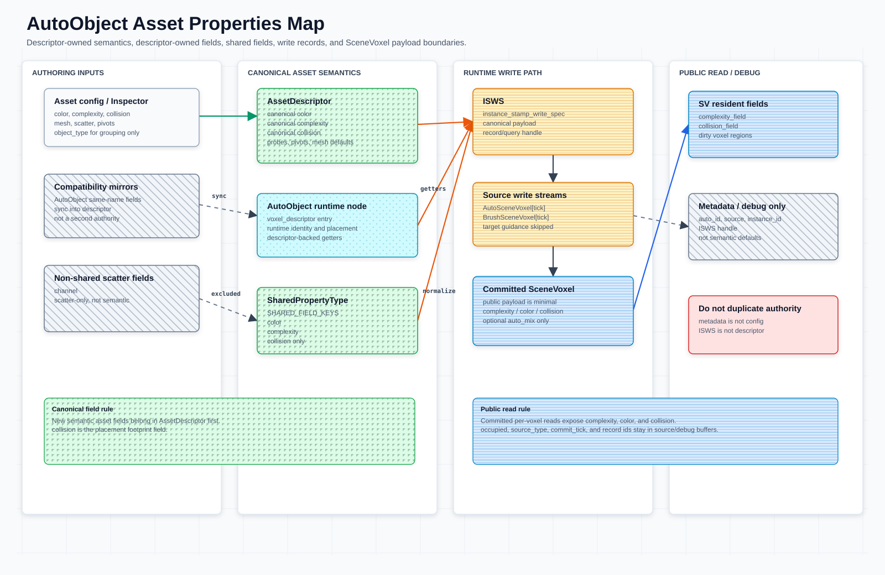
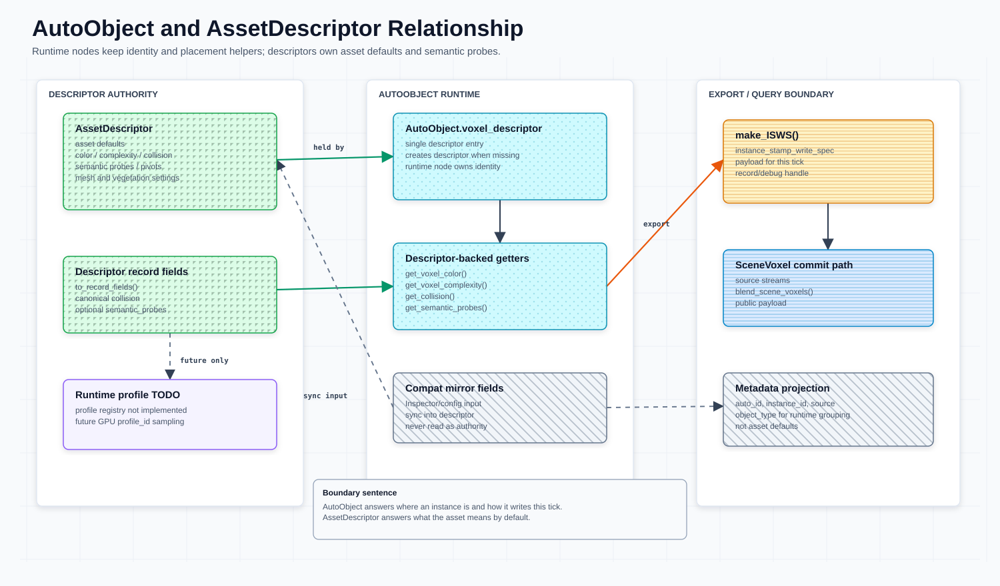
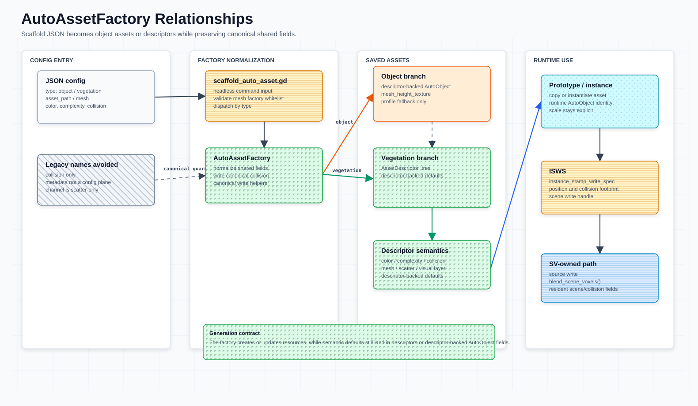

# Asset Properties







本文是资产字段、descriptor 入口、runtime write record 和 metadata 边界的速查。`AssetDescriptor` 的统一定义见 [`auto-voxel-descriptor.md`](auto-voxel-descriptor.md)；源码已在 export 字段旁维护逐项含义，本页只写跨层契约和归属边界。

## 核心规则

- [`AssetDescriptor`](auto-voxel-descriptor.md) 是所有资产种类默认体素语义的 canonical source；`AutoVoxelProfile` 只作为已有资产 / 导入 preset fallback 进入同一 shared-field 归一化路径。
- `AssetDescriptor.collision` 是权威字段；新 config、descriptor record 和 shared fields 只读写 `collision`。
- `SharedPropertyType.SHARED_FIELD_KEYS == ["color", "complexity", "collision"]`。
- `channel` 不进入共享语义。
- `AutoObject` 上的同名 mirror 和 metadata 只用于 Inspector、查询和调试；语义读取走 descriptor-backed getters。
- `instance_stamp_write_spec`（`ISWS`）是本轮实例 / stamp 写入 `SV` / `SceneVoxel` 的 payload 和查询 handle，不是资产默认语义容器；当前源码提供 canonical `instance_stamp_write_spec` metadata / wrapper，并保留 `voxel_write_spec` 变量、函数和 metadata key 作为 legacy-named accessors。
- committed `SceneVoxel` 只接受 `complexity` / `color` / `collision`，可选 `auto_mix`；`channel`、`occupied`、`type`、`source_type`、`commit_tick` 和 record id 留在 source/debug buffers、object-ref index 或 debug view。
- `AutoVoxelRuntimeProfileContainer` 是 GPU-first profile 注册 / staging / upload 入口；CPU 只负责 descriptor 归一化、staging 和 debug readback，不能把未上传或非 resident debug snapshot 写成 runtime resident success。

## 范围与生命周期

| 项 | 当前契约 |
| --- | --- |
| 职责 | 说明 asset defaults、descriptor-backed getter、shared fields、`ISWS` 和 metadata 的字段归属。 |
| 输入 | `.tres` / `.tscn` 资产、脚手架 JSON、Inspector config、`AutoVoxelProfile` fallback。 |
| 输出 | descriptor-backed shared fields、runtime `ISWS` record、metadata handle、committed `SceneVoxel` accepted fields。 |
| 生命周期 | author / scaffold -> descriptor 或 descriptor-backed asset 保存 -> `AutoObject` 读取 descriptor -> 构造 `ISWS` -> source write -> `blend_scene_voxels()` 发布 committed `SceneVoxel`。 |
| Source of truth | 资产默认值在 `AssetDescriptor`；shared schema 在 `SharedPropertyType`；committed runtime read model 在 `SceneVoxelCommitter`。 |
| Placement 边界 | placement 读取 descriptor-backed asset defs、collision footprint、candidate regions 和 `ISWS`，但不定义资产默认字段，也不把 candidate regions 当作 committed `SceneVoxel`。 |
| Core runtime 边界 | `SceneVoxel` source / commit / resident buffers 由 `scene-voxel-field-system.md` 维护；本文只维护资产字段到 runtime record 的交接。 |
| GPU runtime 边界 | GPU runtime 通过 descriptor-backed getters、profile staging、prefilter packing 和 VPG runtime/profile contract 消费资产语义；profile container 不能替代 descriptor/profile source assets。 |

## 类型边界

| 类型 | 职责 | 文件 |
| --- | --- | --- |
| `AssetDescriptor` | 所有资产种类的默认语义 descriptor；字段定义见 [`auto-voxel-descriptor.md`](auto-voxel-descriptor.md) | `scripts/auto_voxel_descriptor.gd` |
| `AutoObject` | 运行时节点、实例身份、descriptor 入口、placement helper、legacy-named `voxel_write_spec` / `ISWS` 构造 | `scripts/auto_object.gd` |
| `SharedPropertyType` | `color` / `complexity` / `collision` 的归一化、record 和 `SceneVoxel` 传播 | `scripts/shared_property_type.gd` |
| `AutoAssetFactory` | 脚手架和导入 helper；创建 descriptor / profile fallback / descriptor-backed asset；通过当前 helper 输出 `ISWS` record | `scripts/auto_asset_factory.gd` |

## Descriptor 字段

Descriptor 字段、归一化入口和 authoring 规则统一维护在 [`auto-voxel-descriptor.md`](auto-voxel-descriptor.md)。本页只保留跨层交接：descriptor 输出 shared fields / profile payload；`AutoObject`、metadata、`ISWS`、runtime profile 和 committed `SceneVoxel` 都不能反向成为资产默认语义来源。

## AutoObject 边界

`AutoObject` 可以接收已有 config 和 Inspector 字段，但运行时语义读取必须通过 descriptor-backed getter。

`AutoObject` export / runtime 字段的逐项含义已迁移到 `scripts/auto_object.gd` 顶部声明；getter 的 descriptor-backed 读取来源保留在对应函数体中。

当前边界：

- `configure_auto_object()` 接收 `color` / `complexity` / `collision`，归一化后同步到 descriptor。
- `get_voxel_color()`、`get_voxel_complexity()`、`get_collision()`、`get_semantic_probes()` 是运行时读取语义的稳定入口。
- `make_instance_stamp_write_spec()` / `set_instance_stamp_write_spec()` / `get_instance_stamp_write_spec()` 是 canonical wrapper；`make_voxel_write_spec()` / `set_voxel_write_spec()` / `get_voxel_write_spec()` 是 legacy API name。它们操作的是同一个 `ISWS` record。
- `source_voxel_type`、`source_kind`、`producer_stage`、`position`、`rotation_degrees`、`scale`、`base_pixel` 和 `channel` 属于 write record 上下文，不是 descriptor 默认语义。

不要在新逻辑中把 `voxel_color`、`voxel_complexity`、metadata 或 `ISWS` 当作 descriptor 的替代来源。

## 共享字段契约

当前共享字段只包含 `color`、`complexity` 和 `collision`；逐项注释维护在 `scripts/shared_property_type.gd` 的 `SHARED_FIELD_KEYS` 声明旁。

`SharedPropertyType.normalize_shared_fields()` 会同步 `color.a == complexity` 并归一化 `collision`。`apply_to_record()` 和 `apply_to_scene_voxel()` 只传播这些共享字段。

| 不共享字段 | 原因 |
| --- | --- |
| `channel` | single-voxel channel tag，不是资产默认语义。 |

## Probe 采样（Semantic Probe Sampling）

Probe 采样是 GPU prefilter 阶段对每个 anchor×asset 组合执行的核心评分逻辑。每个 probe 定义了一个相对 asset anchor 的采样期望，GPU 在实际场景体素场中对该位置进行多通道采样并评分。

### 采样目标缓冲区

每个 probe 在 `sample_pos = anchor_pos + round(probe.offset / voxel_size)`（越界时 clamp 到有效 grid 范围）处同时读取两个缓冲区：

| 缓冲区 | Shader 标识 | 类型 | 说明 |
| --- | --- | --- | --- |
| `TargetSV_B` | `target_field` | `readonly buffer<vec4>` | 目标场景引导场。**`.rgb`** = 目标颜色，**`.a`** = completely（`max(scene_complexity, collision)`），表示该体素被占用的完整度。 |
| `SV[t-1]` | `complexity_coll` | `readonly buffer<vec2>` | 上一帧的场景体素场。**`.x`** = scene complexity（场景复杂度/占用），**`.y`** = scene collision（场景碰撞/实体强度）。 |

### 评分通道与计算公式

Probe 根据其 `flags` 位掩码决定启用哪些评分项，`kind` 字段控制评分模式：

**Positive 评分（kind=positive，默认）**

```text
color_fit      = 1 - distance(target_field.rgb, expected_color.rgb) / √3
complexity_fit = 1 - abs(target_field.a - expected_complexity)
collision_fit  = 1 - abs(target_field.a - expected_collision)
```

最终得分 = 上述各项的加权平均（权重由 `flags` 决定），再乘以 probe 的 `weight`。

**Empty / Negative 评分（FLAG_EMPTY 或 kind=negative）**

```text
empty_fit = 1 - max(target_field.a, complexity_coll.x)
```

检测该位置是否为空（目标完全度和场景复杂度都低）。

**Support 评分（FLAG_SUPPORT 或 kind=support）**

```text
support_fit = max(complexity_coll_below.x, complexity_coll_below.y)
```

读取采样点正下方一个体素的 complexity 和 collision，评估支撑强度。

**地下场景特殊处理**

若 `complexity_coll.x >= 0.5`（已存在实体），则非 collision probe 直接跳过，collision probe 仅计算 `collision_fit`；empty 和 support probe 得分为 0。

### 通道对应关系

| Probe 期望字段 | 采样来源 | 缓冲区通道 |
| --- | --- | --- |
| `expected_color.rgb` | `target_field.rgb` | TargetSV_B 颜色通道 |
| `expected_complexity` | `target_field.a` | TargetSV_B completely 通道 |
| `expected_collision` | `target_field.a` | TargetSV_B completely 通道（同一值） |
| 场景复杂度 | `complexity_coll.x` | SV 上一个帧的 complexity |
| 场景碰撞 | `complexity_coll.y` | SV 上一个帧的 collision |
| 下方支撑 | `complexity_coll[below].xy` | SV 下方体素的 complexity/collision |

### Flags 位掩码

| Flag | 值 | 控制的评分项 |
| --- | --- | --- |
| `FLAG_COLOR` | 1 | 启用 `color_fit` |
| `FLAG_COMPLEXITY` | 2 | 启用 `complexity_fit` |
| `FLAG_COLLISION` | 4 | 启用 `collision_fit` |
| `FLAG_EMPTY` | 8 | 启用 `empty_fit` |
| `FLAG_SUPPORT` | 16 | 启用 `support_fit` |

convex 和 surface 类 probe 默认 `FLAG_COLOR | FLAG_COMPLEXITY`；voxel_interior 类 probe 默认 `FLAG_COLOR | FLAG_COMPLEXITY | FLAG_COLLISION`。

### 评分汇总流程

GPU 以 workgroup (16,16,1) 并行处理：`local_x` 为 asset lane（16 个资产并行），`local_y` 为 probe lane（每个资产 16 个 probe 跨步）。各 lane 独立计算出 `lane_score = Σ(probe_score × weight)`，然后通过 shared memory 归约得到该 anchor×asset 的最终得分，写入 `asset_scores` 输出缓冲区。后续 `select_anchor_topk.glsl` 对每个 anchor 选 top-K asset，再由 `reduce_anchor_topk_to_voxel_regions.glsl` 聚合为 per-asset candidate voxel regions。

---

`ISWS` 是实例本轮写入场景体素系统的 stamp payload / record，不是资产默认值表，也不是 profile cache。当前数据流保持为：

```text
AssetDescriptor / AutoVoxelProfile
  -> SharedPropertyType
  -> ISWS record
  -> source voxel write path
  -> committed SceneVoxel
```

`AutoObject.make_profile_voxel_write_spec()` 会先把 profile / descriptor-backed shared fields 写入 record，再追加实例上下文和 source 分类。`channel` 可作为 object 或 vegetation placement 的 write context 出现在 record 中，但不因此变成 shared field。prefilter 传入的 candidate regions 只限制 placement 搜索范围；只有 source write 和 `blend_scene_voxels()` 才会发布 committed `SceneVoxel`。

committed `SceneVoxel` 的 accepted fields 是 `complexity`、`color`、`collision`，可选 `auto_mix`。`channel` 只作为 write context 输入，不进入 committed read model；查询缓存、占用状态、source 类型、commit tick 和 record id 属于 SV resident state、source/debug buffers、object-ref index 或 debug view。

## Metadata 规则

Metadata 只保留索引、回查和调试入口。当前 `AutoObject._sync_auto_metadata()` 写入 `auto_id`、`auto_instance_id` / `instance_id` 和 `instance_mesh_id`；`set_voxel_write_spec()` / `set_instance_stamp_write_spec()` 同时通过 canonical metadata key `instance_stamp_write_spec` 和 legacy key `voxel_write_spec` 暴露同一个 `ISWS` handle。

`auto_source`、`object_type`、`object_subtype` 等来源 / 分组字段可以存在于 `ISWS` record 或 debug record 中，但不要新增一套 metadata 语义镜像。新增资产语义字段时优先进入 [`AssetDescriptor`](auto-voxel-descriptor.md)。

`object_type` 保留为 placement、same-type exclusion、GPU runtime record 和 debug record 的粗粒度类型字段。已有 `object_subtype` 只作为 compatibility / debug metadata；新 schema 不新增 `object_subtype`，更细的资产差异应进入 `AssetDescriptor` / runtime `profile_id`。

## Runtime Profile Contract

`AutoVoxelRuntimeProfileContainer` 负责把 descriptor/profile 数据归一化为 profile id、probe/collision/pivot ranges 和 staging/debug table。它属于 GPU-first runtime contract 的 profile 入口；GDScript 字典、数组和 debug snapshot 只用于上传准备或回查，不是 CPU 替代路径。

当前 GPU-first profile flow：

```text
AssetDescriptor
  -> build / normalize
AutoVoxelRuntimeProfile
  -> register / pack
AutoVoxelRuntimeProfileContainer
  -> GPU storage buffer upload / readback debug snapshot
shader / SV 通过 profile_id 采样资产 profile
```

热更新时，`AutoVoxelRuntimeProfileContainer.dirty_profile_ids` 交给 `GPUAutoObjectRuntime.mark_profile_objects_dirty()` 反查 GPU live object refs，并以 dirty delta 交给 `SceneVoxelCommitter.apply_gpu_autoobject_dirty_delta()` 映射为 `SceneVoxelTile` dirty。该路径仍只把 CPU 用作 control / debug plane，不恢复 CPU runtime fallback。

开放问题：

- 常驻策略是加载即注册、场景引用注册，还是按 asset library 预热。
- 无 RenderingDevice 时只能 SKIP GPU upload / placement 验证，不能改走 CPU 替代路径。

## 相关文档

- `auto-voxel-descriptor.md`：`AssetDescriptor` 的统一定义、字段分组和 authoring 规则。
- `meshfill-framework.md`：框架数据归属和主流程。
- `scene-voxel-field-system.md`：`instance_stamp_write_spec` / `ISWS`、source voxel、committed `SceneVoxel` 和 SV resident collision field。
- `asset-semantic-probes.md`：descriptor-backed semantic probes。
- `auto-asset-scripting.md`：`AutoAssetFactory` 和 `tools/scaffold_auto_asset.gd` 的 JSON 输入。


> **禁止 --headless**：本模块的所有 GPU 测试依赖 RenderingDevice，必须在 Vulkan 驱动下运行（--rendering-driver vulkan），使用 --headless 会导致测试无法访问 GPU，CPU fallback 不得作为通过条件。

## 测试场景

| 场景 | 说明 | Godot 场景 |
| --- | --- | --- |
| [Auto Asset Scaffolding](../../demos/modules/auto-asset-scaffolding/auto-asset-scaffolding.md) | 测试方法与验收标准 | [`../../demos/modules/auto-asset-scaffolding/auto-asset-scaffolding.tscn`](../../demos/modules/auto-asset-scaffolding/auto-asset-scaffolding.tscn) |
