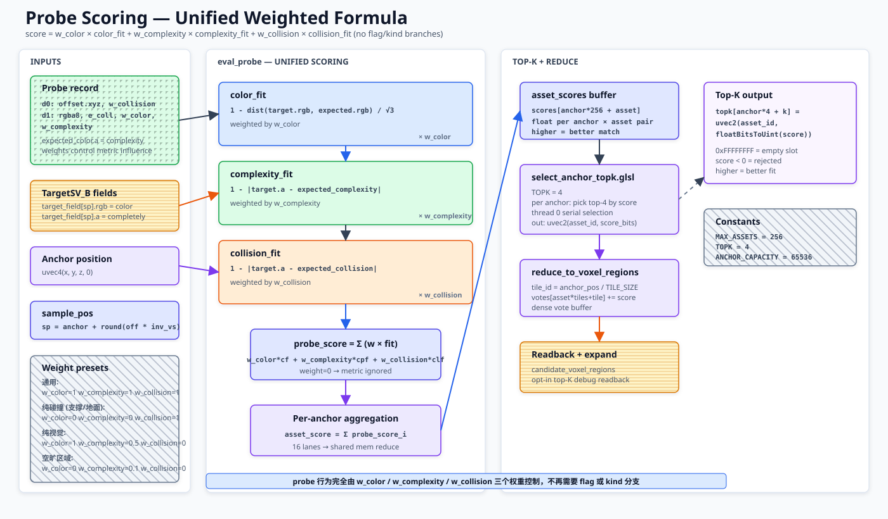

# Asset Semantic Probes: 资产语义采样点

本文记录 `AssetDescriptor.semantic_probe_profile` 的资产侧约定。`AssetDescriptor` 整体定义见 [`auto-voxel-descriptor.md`((auto-voxel-descriptor.md)。Probe 是 descriptor-backed asset default：当前 GPU prefilter 用它对 `anchor x asset` 评分并收窄候选 `AutoObject` / voxel regions；后续候选内部 rerank / validation 也只能在这些候选内使用。Probe 不负责从全资产库发现新候选，也不写 committed `SceneVoxel`。

Descriptor 通过 SPA（`ScenePlacementActor`）注册到 GPU profile container，使其 probes/collision/pivots 即刻 GPU 可读；SPA 生命周期和访问接口见 [`scene-placement-actor.md`((scene-placement-actor.md)。



## 当前边界

| 项 | 当前规则 |
| --- | --- |
| 职责 | 表达资产局部采样期望，供 prefilter 对 `anchor x asset` 打分。 |
| 语义来源 | [`AssetDescriptor.semantic_probe_profile`((auto-voxel-descriptor.md)。`AutoObject` 同名字段只是 Inspector / config mirror。 |
| 读取入口 | `AutoObject.get_semantic_probes()` / descriptor `get_semantic_probes()`。 |
| 输入 | descriptor `color` / `complexity` / `collision`、mesh、density、`context_sensing_radius`、当前 `SV[t - 1(` 和 `TargetSV_B` read buffers。 |
| 当前消费者 | `AutoObjectProbePrefilterGPU` 消费 probes 做候选收窄；VPG score contract 消费 `profile_table` / `probe_records` / `collision_records` / `pivot_records` 做物理评分绑定验收。两个 worker 均由 SPA 懒创建并注入共享 RD + profile_container。 |
| Probe 职责 | 对 position-only anchor 与当前可用 asset registry 打分，输出候选收窄信号。 |
| 输出边界 | readback 的 docs-facing route view 是 `candidate_voxel_regions_by_asset`；`autoobject_candidate_voxel_sparses` / `candidate_voxel_sparses_by_asset` 仅为 legacy/debug alias；`anchor_autoobject_topk` 当前是 GPU 内部中间结果。 |
| 生命周期 | SPA.register_asset(descriptor) → descriptor 编译为 profile → AutoVoxelRuntimeProfileContainer.upload_profiles() → GPU resident → prefilter/placer 通过 SPA 借用 borrowed GPU buffers → dispatch 内部评分/top-K → readback candidate voxel regions。descriptor 注册后即时 GPU 可读，无需等待 frame end。 |
| Source of truth | Probe 默认值在 descriptor / `SemanticProbeProfile`；candidate regions 在 prefilter readback；committed `SceneVoxel` 仍由 source write / blend 发布。 |
| 候选边界 | prefilter 只减少候选；candidate-only rerank 不能把未进入候选集的 asset 加回。 |
| 禁止事项 | 不遍历全资产库，不输出全局 `voxel_asset_topK`，不替代 `score_voxel_tile.glsl`。 |
| 物理判断 | footprint、support、collision、clearance 仍由 placement score 阶段负责。 |
| TargetSV_B 采样 | 越界 sample 先 clamp 到 grid 内最近有效 voxel，再读取 `TargetSV_B` read buffers。 |
| 提交边界 | prefilter 不写 committed `SceneVoxel`；提交仍走 `AutoSceneVoxel` / `BrushSceneVoxel` source write 与 blend。 |

`AutoObject.semantic_probe_profile`、`semantic_probe_density` 和 `context_sensing_radius` 只作为 Inspector / 配置字典入口；新逻辑应通过 descriptor-backed getter 读取 probes。

本文只维护资产 probe schema 与 prefilter 交接。placement route 扩张、空候选 skip、physical score 和 result feedback 分别见 `../placement/autoobject-probe-prefilter.md`、`../placement/voxel-semantic-routing.md` 和 `scene-voxel-field-system.md`。

## Probe 数据结构

每个 probe 表示相对统一 position-only asset anchor 的采样点。规范化字段以 `scripts/semantic_probe_profile.gd` 的 `normalize_probe()` / `make_probe()` 为准：

```gdscript
{
	"offset": Vector3.ZERO,                 # anchor-relative sample position
	"expected_color": Color.WHITE,          # expected visual color
	"expected_complexity": 1.0,             # expected complexity / alpha
	"expected_rgba8": 0xffffffff,           # semantic-side packed color + complexity
	"expected_collision": 0.0,              # expected solid strength
	"weight": 1.0,                          # additive score weight
	"flags": FLAG_COLOR | FLAG_COMPLEXITY,  # enabled score terms
	"kind": "positive",                     # positive / negative / support
	"source": "mesh",                       # mesh / context / manual / fallback
	"shape_source": "convex",               # optional generation priority/debug source
}
```

`expected_color` / `expected_complexity` 优先于 legacy `color` / `complexity` 输入；`expected_rgba8` 会在 GPU host packing 时转换为 shader 侧 RGBA8 顺序。

GPU prefilter 默认在 `run_probe_prefilter()` 内把 descriptor-backed probes 打包为 transient flat probe buffer + per-asset range；当调用方传入已 `runtime_ready` 且同一 `RenderingDevice` 上的 `AutoVoxelRuntimeProfileContainer` 时，prefilter 会直接借用 container 的 resident `probe_records` buffer，并只为当前 asset 顺序生成 transient `probe_range_buf`。`AutoVoxelRuntimeProfileContainer` 已负责把同一套 descriptor / profile 语义归一化为 `profile_table`、`probe_records`、`collision_records` 和 `pivot_records` GPU storage buffers；VPG runtime/profile contract 只能在这些 resident buffers ready、bound、consumed 后通过。`ISWS` 可以携带本轮实例 stamp 上下文，但 probe 默认值仍来自 descriptor / profile side 的资产数据，不从 `ISWS` 反推，也不能把 CPU staging / debug readback snapshot 当作 runtime success。

Prefilter 输出会附带 `profile_probe_pack` debug summary：transient descriptor probe packing、borrowed `probe_records`、profile id 映射和 no-RD / profile-container-not-ready blocked reason 都必须显式保持 `cpu_fallback=false`。该 summary 只说明 probe score pass 的输入来源；`collision_records` / `pivot_records` 的绑定和消费仍由 VPG physical score contract 验收。

```text
probe_data_buf[2 * i + 0( = vec4(offset.x, offset.y, offset.z, weight)
probe_data_buf[2 * i + 1( = vec4(rgba8_as_float, expected_collision, flags_as_float, kind_as_float)
probe_range_buf[asset_id( = uvec2(start, count)
```

## 生成来源

`SemanticProbeProfile.generate_from_mesh()` 按优先级生成候选点。`collision` 输入是通用 voxel 场的逐体素样本列表，每条目带 `local_pos` + 同级 `color` / `complexity` / `collision`。probe 的 collision 与 complexity 从同一个 voxel 读取，处于同一层级。不再支持手工 footprint 形状（cylinder / box）采样。

| 优先级 | `shape_source` | `source` | 来源 | 用途 |
| --- | --- | --- | --- | --- |
| 1 | `convex` | `mesh` | `Mesh.create_convex_shape()` 凸包点 | 覆盖资产简化轮廓。 |
| 2 | `voxel_interior` | `mesh` | `collision` 条目：通用 voxel 场逐体素样本 | 表达实体体积，并携带逐体素 color / complexity / collision。 |
| 3 | `surface` | `mesh` | mesh 三角面 Poisson 采样 | 在 convex / collision 不足时补齐表面。 |
| 4 | `context` | `context` | mesh AABB 外围环形采样 | 小型草、灌木用于感知周围残余 `TargetSV_B`。 |
| fallback | `fallback` | `fallback` | mesh 缺失或候选为空时的单点 probe | 保证 asset 至少有一个可评分 probe。 |

`context_sensing_radius = 0.0` 时禁用 context probe；`> 0.0` 时会在 mesh AABB 外围增加低权重 probes。

## 共享字段关系

Probe 期望值只依赖共享语义字段 `color`、`complexity` 和 `collision`；字段清单维护在 `scripts/shared_property_type.gd` 的 `SHARED_FIELD_KEYS` 声明旁。

`channel` 不参与 probe 语义。

## Probe 生成选择

选择阶段使用分层 Top-K + 最小距离约束：

```text
convex
  -> voxel_interior
  -> surface
  -> context
  -> final fallback
```

同一阶段会逐步放宽 `PROBE_WORLD_MIN_DISTANCE`，保证重要轮廓优先，同时避免 probes 过度聚集。

## Runtime 采样与评分

GPU score pass 对每个 anchor / asset 组合读取 probes：

```text
sample_pos = anchor_pos + round(probe.offset / voxel_size)
sample_pos = clamp(sample_pos, grid_min, grid_max)
target     = TargetSV_B[sample_pos(
scene      = SV[t - 1([sample_pos(
```

当前 shader 分量：

```text
color_fit      = 1 - distance(target.rgb, expected.rgb) / sqrt(3)
complexity_fit = 1 - abs(target.a - expected.a)
collision_fit  = 1 - abs(target_completely - expected_collision)
empty_fit      = 1 - max(target.a, target_completely, complexity_field)
support_fit    = max(complexity_field_below, collision_field_below)
```

`weight` 是加性权重；`flags` / `kind` 决定启用 positive、negative / empty、support 或 collision scoring。地下场景采样会跳过非 collision probe，避免把已有实体内部当成普通颜色匹配。

当前 GPU prefilter 使用 probe score 选择 per-anchor top-K，并把 anchor top-K 聚合为 per-asset voxel-region votes。后续如果增加候选内 route validation，可在候选集合内组合 route score：

```text
probe_score = weighted(color_fit, complexity_fit, collision_fit, empty_fit, support_fit)
route_score = combine(candidate_score, probe_score, support_hint)
```

`route_score` 尚不是当前 physical placement 输入；即使后续实现，也不能把未进入 prefilter candidate regions 的 asset 加回候选集。

## GPU Prefilter 输出

`AutoObjectProbePrefilterGPU.run_probe_prefilter()` 当前返回：

```gdscript
{
	"anchors": [(,                              # position-only anchor readback
	"anchor_autoobject_topk": {},               # GPU internal, not read back
	"candidate_voxel_regions_by_asset": {},     # docs-facing per-asset candidate regions
	"autoobject_candidate_voxel_sparses": {},   # legacy/debug per-asset candidate regions
	"candidate_voxel_sparses_by_asset": {},     # legacy alias for same candidate-region contract
	"candidate_route_profiles": [(,             # readback expansion debug
	"anchor_count": 0,                          # collected anchor count
	"profile_probe_pack": {},                   # probe pack source / borrowed buffer debug
	"prefilter_reason": "ok",                   # ok / no-RD / blocked reason
	"cpu_fallback": false,                      # no CPU success path
}
```

`reduce_anchor_topk_to_voxel_regions.glsl` 只聚合 anchor 所在 tile 的 vote。footprint、probe offset bounds、`context_sensing_radius` 与 `interpolation_guard_voxels >= 1` 的扩张在 readback 解码阶段完成，扩张结果仍只是 candidate voxel regions。它们不会写 source stream、不会改 `SV[t - 1(`，也不会发布 committed `SceneVoxel`。

## Anchor 语义

当前 anchor 统一为 position-only `anchor`。资产不再通过 `ground` / `target_top` 区分 anchor 类型；`allowed_anchor_kinds` 仅作为 config 入口保留，读取时会归一到单一 `anchor`。

Prefilter 从 supported candidate position 来源收集位置，写入统一的 `anchor_buffer`，probe offset 始终按统一 anchor 原点解释。

## 可执行 JSON 示例

该示例可直接交给 `tools/scaffold_auto_asset.gd`；probe 会由 descriptor-backed `collision`、mesh 和默认 probe 参数生成。

```json
{
  "type": "vegetation",
  "asset_id": "sample_autoobject",
  "channel": 1,
  "radius": 0.45,
  "color": [0.25, 0.55, 0.22, 0.6(,
  "complexity": 0.6,
  "collision": [(,
  "group": "placed_autoobjects",
  "mesh_create_method": "create_sample_autoobject_mesh"
}
```

## 验收标准

- 每个 asset 能导出稳定且数量可控的 `semantic_probes`。
- Probe scoring 只收窄当前可用 `AutoObject` / candidate voxel regions。
- `AutoVoxelRuntimeProfileContainer` 只有在 GPU upload 后 `runtime_ready == true` 且 required buffers 有效时，才能作为 runtime/profile contract 输入。
- TargetSV / TargetSV_B 不包含 asset 类型标签。
- TargetSV_B 越界采样使用 clamp，不把边界外直接当作空白。
- 最终物理可行性仍由 `score_voxel_tile.glsl` 和 placement pipeline 判定。
- Prefilter 不写 committed `SceneVoxel`，也不把空 candidate regions 回退成 full grid。

## 相关入口

- `scripts/semantic_probe_profile.gd`：probe 生成、规范化、字段默认值与 selection priority。
- `scripts/auto_voxel_descriptor.gd`：descriptor-backed `semantic_probe_profile`、density、context radius 与 `get_semantic_probes()`。
- `auto-voxel-descriptor.md`：descriptor 的统一定义、字段分组和 authoring 边界。
- `scripts/auto_voxel_runtime_profile_container.gd`：descriptor / profile 去重、`profile_id`、GPU resident profile/probe/collision/pivot buffers 与 debug readback。
- `scripts/autoobject_probe_prefilter_gpu.gd`：GPU buffer packing、dispatch、readback decode 与 route profile expansion。
- `shaders/score_anchor_asset_probes.glsl`：clamped sampling、score terms、`min_prefilter_score` 前的 probe evaluation。
- `shaders/select_anchor_topk.glsl` / `shaders/reduce_anchor_topk_to_voxel_regions.glsl`：per-anchor top-K 与 per-asset voxel-region votes。
- `../placement/autoobject-probe-prefilter.md`：placement 侧 prefilter / routing 边界。
- `../placement/voxel-semantic-routing.md`：`candidate_voxel_regions_by_asset` 消费、legacy sparse alias、空候选 skip 和候选内 rerank 边界。
- `scene-voxel-field-system.md`：`SV[t - 1(` / `TargetSV_B` 读取边界、source write 和 committed `SceneVoxel` 发布。

## 开放问题

- Prefilter 只借用 `AutoVoxelRuntimeProfileContainer.probe_records`，并通过 `profile_probe_pack` 公开 borrowed / blocked 状态；per-asset `probe_range_buf` 仍是本轮 transient buffer，因为 `score_anchor_asset_probes.glsl` 以当前 asset 顺序读取 `uvec2(start, count)`。
- 资产 profile 常驻后的 probe / collision / pivot buffer layout 已分开管理；VPG 已消费 `profile_table`、`probe_records`、`collision_records` 和 `pivot_records`，后续只允许调整 stride / range schema，不能恢复 CPU-side runtime 替代路径。
- 当前文档只引用 placement 相关文档作为边界说明，不在这里维护 placement 方案细节。

## 测试方法

### 运行方式

所有测试脚本位于 `tools/` 目录，命名规则为 `test_<主题>.gd`。每个测试是一个 `extends SceneTree` 的独立脚本，入口为 `_init()`。

按是否需要 RenderingDevice 分为两种驱动模式：

- **CPU-only 测试**（不涉及 RenderingDevice、compute shader、storage buffer 或 GPU readback）：

```powershell
godot --headless --path . --script tools/test_semantic_probe_generation.gd
```

- **GPU / Vulkan 测试**（需要 RenderingDevice，禁止 `--headless`）：

```powershell
godot --path . --rendering-driver vulkan --script tools/test_voxel_multi_asset.gd
```

驱动模式由 `tools/test_markdown_contracts.gd` 中的 `DEMO_CPU_ONLY_TEST_SCRIPTS` / `DEMO_GPU_TEST_SCRIPTS` 列表合约强制执行，使用错误驱动模式会被报错。所有测试通过时 `quit(0)`，失败时 `quit(1)`。

### 相关测试文件

| 测试文件 | 覆盖范围 | 驱动模式 |
| --- | --- | --- |
| [`test_semantic_probe_generation.gd`((../../tools/test_semantic_probe_generation.gd) | probe 生成（mesh convex/voxel_interior/surface/context/fallback）、density 缩放、convex 生成、collision 采样、`PROBE_WORLD_MIN_DISTANCE` 约束、asset instance probe 转移 | CPU-only |
| [`test_markdown_contracts.gd`((../../tools/test_markdown_contracts.gd) | descriptor-backed `get_semantic_probes()` 权威性、probe 不进入 `ISWS` shared fields、`cpu_fallback=false` 合约、`profile_probe_pack` blocked reason、候选 region alias 边界 | CPU-only |
| [`test_auto_voxel_runtime_profile_container.gd`((../../tools/test_auto_voxel_runtime_profile_container.gd) | probe 注册进 profile container、resident `probe_records` buffer、等效 descriptor 下 probe 去重、profile 常驻后的 probe buffer 借用 | GPU (vulkan) |
| [`test_voxel_multi_asset.gd`((../../tools/test_voxel_multi_asset.gd) | prefilter 端到端（anchor 收集 -> probe scoring -> top-K -> voxel-region readback）、`profile_probe_pack` 验证、GPU prefilter 输出 contract、candidate regions 边界 | GPU (vulkan) |
| [`test_core_demo_contracts.gd`((../../tools/test_core_demo_contracts.gd) | demo 场景执行其 `run_demo_contract_checks()`、probe 相关 demo 的 GPU/RD 策略验证 | GPU (vulkan) |

### 关键测试场景

以下场景覆盖本文档定义的核心契约，应在修改 probe 生成、prefilter 逻辑或 profile container 后验证：

**1. Probe 生成正确性**

- 为含 mesh 的 asset 调用 `get_semantic_probes(density)`，验证返回稳定且数量可控的 probes
- 验证 density 0.5 / 1.0 / 2.0 缩放时 probe 数量单调递增
- 验证 `shape_source` 优先级顺序：convex → voxel_interior → surface → context → fallback
- 验证 `context_sensing_radius = 0.0` 时不生成 context probes
- 验证 mesh 缺失或候选为空时至少有一个 fallback probe
- 验证每个 probe 的 `source`、`kind`、`flags` 字段符合其 `shape_source`

**2. Probe 数据规范**

- 验证 `normalize_probe()` 对每个 probe 的 `expected_color` / `expected_complexity` 优先于 legacy `color` / `complexity`
- 验证 `expected_rgba8` 正确打包颜色和复杂度
- 验证 probe offset 在 mesh AABB 合理范围内
- 验证 `PROBE_WORLD_MIN_DISTANCE` 约束生效，同阶段 probes 不过度聚集

**3. Descriptor-backed getter 权威性**

- 通过 descriptor 设置 `semantic_probe_profile`，验证 `AutoObject.get_semantic_probes()` 返回 descriptor 值而非 Inspector mirror
- 验证 `AssetDescriptor.get_semantic_probes()` 和 `AutoObject.get_semantic_probes()` 返回一致的 probes

**4. GPU prefilter 端到端**

- 注册 asset 到 SPA，验证 descriptor probes 进入 `AutoVoxelRuntimeProfileContainer` 的 resident `probe_records` buffer
- 调用 `run_probe_prefilter()`，验证 `profile_probe_pack` 记录正确使用 borrowed `probe_records` 或 transient packing
- 验证 prefilter 输出 `candidate_voxel_regions_by_asset` 只收窄候选，不输出全 grid
- 验证 `prefilter_reason` 在缺少 RD 时为 `"no-RD"` 且 `cpu_fallback = false`
- 验证 prefilter 不写 `SceneVoxel`，不修改 `SV[t - 1(`

**5. Prefilter 输出 contract**

- 验证 `anchor_autoobject_topk` 是 GPU 内部中间结果，不参与 readback 断言
- 验证 `autoobject_candidate_voxel_sparses` / `candidate_voxel_sparses_by_asset` 仅为 legacy alias
- 验证 footnote/probe offset bounds/`interpolation_guard_voxels >= 1` 扩张只在 readback 解码阶段发生，不写 source stream
- 验证 TargetSV_B 越界采样使用 clamp，不把边界外当作空白

**6. Profile container 整合**

- 验证等效 descriptor 注册后返回相同 `profile_id` 且共享 `probe_records`
- 验证 profile container 只有在 `runtime_ready == true` 且 required buffers 有效时才作为 prefilter 输入
- 验证 dirty profile 标记触发 probe buffer 重新上传
- 缺少 RenderingDevice 时必须跳过（`print("  SKIP: ...") + return true`），绝不 fallback 到 CPU

### 测试结构模式

新增 CPU-only 测试时遵循以下模板：

```gdscript
extends SceneTree

const SemanticProbeProfileScript := preload("res://scripts/semantic_probe_profile.gd")

func _init() -> void:
    var ok := true
    ok = ok and _test_probe_generation()
    ok = ok and _test_probe_normalization()
    # ...

    if ok:
        print("[SemanticProbeTest( ALL TESTS PASSED")
        quit(0)
    else:
        push_error("[SemanticProbeTest( SOME TESTS FAILED")
        quit(1)

func _test_probe_generation() -> bool:
    print("[SemanticProbeTest( test_probe_generation...")
    var profile := SemanticProbeProfileScript.new()
    # setup, act, assert
    if probes.size() < expected_min:
        push_error("  FAIL: expected at least %d probes, got %d" % [expected_min, probes.size()()
        return false
    print("  OK: %d probes with density %.1f" % [probes.size(), density()
    return true
```

GPU 测试额外包含 RenderingDevice 检查和跳过逻辑：

```gdscript
func _has_rendering_device() -> bool:
    if RenderingServer.get_rendering_device():
        return true
    var rd := RenderingServer.create_local_rendering_device()
    if rd:
        rd.free()
        return true
    return false

func _test_prefilter_or_skip() -> bool:
    if not _has_rendering_device():
        print("  SKIP: no RenderingDevice available for prefilter")
        return true
    # ... GPU prefilter logic ...
    var result := prefilter.run_probe_prefilter(...)
    if result.cpu_fallback:
        push_error("  FAIL: prefilter returned cpu_fallback=true")
        return false
    return true
```

### 合约测试

项目在两层运行合约验证：

1. **Demo 合约**（`test_core_demo_contracts.gd`）：解析 `docs/core/*.md` 中的测试场景表格，验证引用的 demo 文档、场景文件和元数据一致性。Probe 相关 demo 需通过其 `run_demo_contract_checks()` 方法
2. **Markdown/源码合约**（`test_markdown_contracts.gd`）：跨 `docs/`、源码和测试文件进行深度正则/文本合约验证，包括 `get_semantic_probes()` 权威性、`cpu_fallback=false` 合约、probe pack blocked reason、候选 region alias 边界

修改 probe 生成逻辑、prefilter 输出 schema 或 profile container probe buffer layout 后，必须同步更新 `test_markdown_contracts.gd` 中对应的合约断言。

## 测试场景

| 场景 | 说明 | Godot 场景 |
| --- | --- | --- |
| [资产 Probe 总览((../../demos/core-asset-semantic-probes/core-asset-semantic-probes.md) | 测试方法与验收标准 | [`../../demos/core-asset-semantic-probes/core-asset-semantic-probes.tscn`((../../demos/core-asset-semantic-probes/core-asset-semantic-probes.tscn) |
| [Semantic Probe Authoring((../../demos/modules/semantic-probe-authoring/semantic-probe-authoring.md) | 测试方法与验收标准 | [`../../demos/modules/semantic-probe-authoring/semantic-probe-authoring.tscn`((../../demos/modules/semantic-probe-authoring/semantic-probe-authoring.tscn) |
| [Probe Prefilter Routing((../../demos/modules/probe-prefilter-routing/probe-prefilter-routing.md) | 测试方法与验收标准 | [`../../demos/modules/probe-prefilter-routing/probe-prefilter-routing.tscn`((../../demos/modules/probe-prefilter-routing/probe-prefilter-routing.tscn) |
