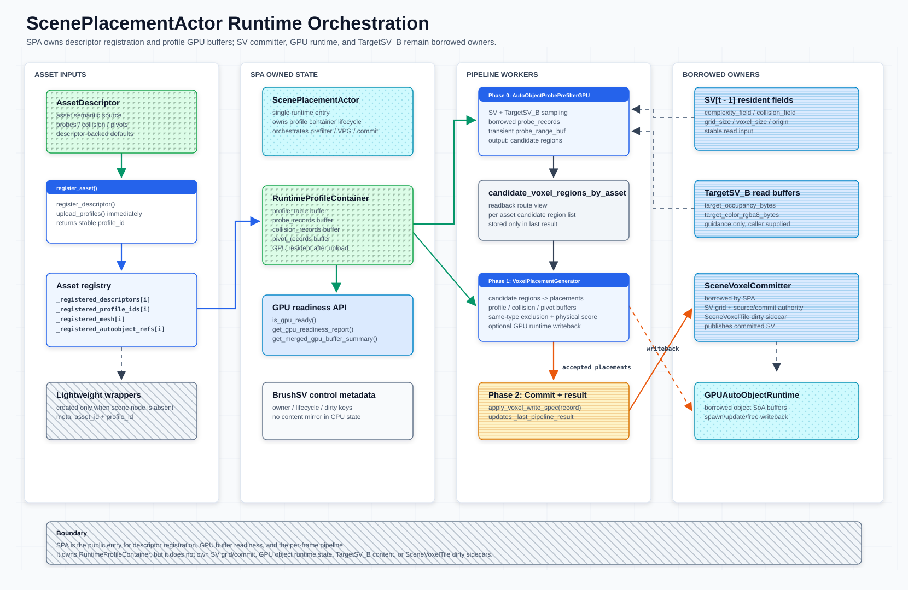

# ScenePlacementActor (SPA)

本文维护 `ScenePlacementActor`（简称 `SPA`）的运行时编排契约。SPA 拥有 descriptor → GPU profile buffer 与 AutoObject runtime object buffers 的完整生命周期，并把 asset registry、profile GPU buffers、AutoObject GPU state、prefilter、placement 和 commit 收敛到同一个入口；`SceneVoxelCommitter` 和 `TargetSV_B` 仍由外部 owner 提供。



SPA 使 [`AssetDescriptor`](../asset-descriptor-demo/asset-descriptor.md) 的 probes、collision 和 pivots 在注册后立即 GPU 可读；SV（`SceneVoxel`）和 `AutoObject` 数据流经单条编排流水线：

```text
register assets → prefilter（SV→candidates）→ placement（candidates→instances）→ commit
```

跨模块总览见 [`meshfill-framework.md`](../core-meshfill-framework/meshfill-framework.md)；`AssetDescriptor` 定义见 [`asset-descriptor.md`](../asset-descriptor-demo/asset-descriptor.md)；GPU runtime/profile 契约见 [`autoobject-gpu-runtime-architecture.md`](autoobject-gpu-runtime-architecture.md)；资产 probe schema 见 [`asset-semantic-probes.md`](../asset-descriptor-demo/asset-semantic-probes.md)；SV commit / resident state 见 [`scene-voxel-field-system.md`](../core-scene-voxel-field-system/scene-voxel-field-system.md)。

## 本文范围

- 本文回答「MeshFill 的全部数据挂在谁下面」和「运行时如何通过 SPA 随时读取」：ownership 划分、资产注册表、GPU buffer 就绪契约、流水线入口和生命周期。
- 其它模块（prefilter、placer、SV committer、gpu runtime）通过 SPA 访问资产数据和 GPU buffer，不直接操作 `AutoVoxelRuntimeProfileContainer`。
- 资产默认语义、probe 数据结构、physical score contract 和 SV 提交权威见各自的专题文档。
- `GPUAutoObjectRuntime` / `AutoVoxelRuntimeProfileContainer` 的内部实现见 [`autoobject-gpu-runtime-architecture.md`](autoobject-gpu-runtime-architecture.md)。本文只说明 SPA 如何拥有和暴露它们。

## 核心契约

- **SPA** 是 MeshFill 运行时数据的统一编排容器：所有 `AssetDescriptor` 注册后立刻上传到 GPU 并保持 resident；同一个 `RenderingDevice` 被 profile container、prefilter 和 placer 共享，确保 borrowed probe buffer 路径零拷贝。
- SPA **拥有** `AutoVoxelRuntimeProfileContainer` 与默认 `GPUAutoObjectRuntime`（创建、管理、释放）；**借用** `SceneVoxelCommitter`（外部注入，SPA 不控制其生命周期）。外部 `GPUAutoObjectRuntime` 仅作为 legacy/test 注入入口。
- `register_asset()` 立即调用 `register_descriptor()` + `upload_profiles()`：descriptor 的 probes/collision/pivots 注册后即时在 GPU 上，无需等待 frame end 或手动刷写。
- `run_placement_pipeline()` 是按帧流水线入口：prefilter → placement → commit 三阶段串行执行，profile container 的 resident GPU buffers 被 prefilter 和 placer 直接借用。
- Pipeline workers（`AutoObjectProbePrefilterGPU`、`VoxelPlacementGenerator`）懒创建并共享同一个 `RenderingDevice`，不重复获取设备。
- 轻量 `AutoObject` wrapper 仅在注册表无场景 `AutoObject` 引用时按需创建，缓存到 `asset_index → AutoObject` 字典中，注册表变化时自动失效并释放。
- SPA 不持有 `SceneVoxel` grid authority、不执行 blend、不维护 tile dirty sidecar。这些仍由 `SceneVoxelCommitter` / SV owner 管理。
- `cpu_fallback=false` 在所有 blocked 路径上保持显式：prefilter 失败、profile container 未就绪或 RD 缺失都不会回退到 CPU 路径。

## 术语

本文沿用 [`meshfill-framework.md`](../core-meshfill-framework/meshfill-framework.md) 和 [`scene-voxel-field-system.md`](../core-scene-voxel-field-system/scene-voxel-field-system.md) 的体素术语。

| Term | Meaning |
| --- | --- |
| `SPA` | `ScenePlacementActor`，MeshFill 运行时数据的一站式容器。后续文档统一使用此简称。 |
| `asset registry` | SPA 内部的并行数组：`_registered_descriptors`、`_registered_profile_ids`、`_registered_mesh`、`_registered_autoobject_refs`。`asset_id` 即数组索引。 |
| `profile_container` | `AutoVoxelRuntimeProfileContainer`，SPA 拥有其完整生命周期，持有 `profile_table`、`probe_records`、`pivot_records` GPU storage buffers。 |
| `borrowed probe buffer` | prefilter 借用的 `profile_container.probe_records` GPU buffer，零拷贝；仅 `probe_range_buf` 为每帧 transient。 |
| `lightweight wrapper` | 场景中不存在 `AutoObject` 引用时，按 descriptor 创建的临时 `AutoObject` 节点，仅暴露 `get_semantic_probes()` 和 `get_collision()`。 |

## Ownership

| 数据 | 权威来源 / 持有者 | SPA 的角色 | 说明 |
| --- | --- | --- | --- |
| 资产默认语义 | `AssetDescriptor` / `AutoVoxelProfile` | asset registry 保存 descriptor 引用 | descriptor 是资产语义主来源；字段定义见 [`asset-descriptor.md`](../asset-descriptor-demo/asset-descriptor.md)。SPA 不复制资产数据。 |
| Runtime profile GPU buffers | `AutoVoxelRuntimeProfileContainer`（SPA 拥有） | 创建、管理、暴露、释放 | `profile_table`、`probe_records`、`pivot_records` 全部 GPU resident；`register_asset()` 即时上传。 |
| SPA 状态 | `ScenePlacementActor` | 拥有 `_initialized`、`_last_pipeline_result`、wrapper 缓存 | 暴露 `is_gpu_ready()` / `get_gpu_readiness_report()` 查询当前就绪状态。 |
| BrushSV persistence | `ScenePlacementActor` | 保存 brush delta / override 的持久化和序列化入口 | `BrushSV` 内容常驻于 SPA 生命周期；debug 通过稳定 buffer / readback 观察，CPU 只保留控制面元数据。 |
| Pipeline workers | `ScenePlacementActor`（懒创建） | 创建并注入共享 `RenderingDevice` | `_prefilter` / `_placer` 不独立获取设备。 |
| SceneVoxel / SV resident | `SceneVoxelCommitter` / SV owner | 借用外部引用，不拥有 | SPA 不管理 grid、tile dirty 或 blend。 |
| GPU object runtime | `GPUAutoObjectRuntime`（SPA 默认拥有） | 创建、管理、释放；legacy/test 可外部注入 | 持有 `autoobject_*` SoA GPU buffers、allocator、dirty delta，并由 SPA 注入 placement common settings。 |
| Target read buffers | `TargetSV` / `TargetSV_B`（caller 提供） | 从 `placement_common` 解码后透传到 prefilter 和 placer | 每帧由调用方重新传入，不缓存在 SPA 内；缺失时生成 zero-filled read buffers。 |
| Candidate voxel regions | prefilter readback → SPA 编排 | 临时传递到 placer asset_defs | 不在 SPA 内持久化，仅存在于 `_last_pipeline_result`。 |

## 生命周期

SPA 的完整生命周期定义 MeshFill 运行时从初始化到释放的所有阶段。其他模块通过 SPA 访问这些阶段的产物：

```text
1. initialize(prefer_local_device, allow_global_fallback, sv_committer?, gpu_runtime?)
  ├── 获取 RenderingDevice
  ├── 创建 AutoVoxelRuntimeProfileContainer，共享 RD
  └── 注入外部引用（sv_committer、gpu_runtime）
       └── 此时可调用 is_gpu_ready() 查询就绪状态

2. register_asset(descriptor, mesh?, autoobject?) × N
  ├── descriptor → RuntimeProfileContainer.register_descriptor()
  ├── 即时 upload_profiles() → GPU resident
  │     └── probes/collision/pivots 即刻可被 prefilter/placer borrow
  └── 追加到 asset registry 并行数组
       └── 可通过 get_registered_descriptors() / get_profile_id_for_asset() 查询

3. run_placement_pipeline(sv, dirty_tile_ids, prefilter_topk, placement_common)  [每帧]
  ├── Phase 0: Prefilter     (SV to candidate voxel regions)
  │     _build_autoobject_array_for_pipeline()
  │     prepare_target_read_buffers_from_common_gpu(placement_common, sv)
  │     prefilter.run_probe_prefilter(borrowed probe_records + transient probe_range_buf)
  │     readback candidate_voxel_regions_by_asset
  ├── Phase 1: Placement     (candidates to accepted instances)
  │     _build_placement_asset_defs(candidate_regions)
  │     placer.run_multi_asset(complexity_field, collision_field, asset_defs, ...)
  │     可选: GPUAutoObjectRuntime writeback
  └── Phase 2: Commit        (accepted to SceneVoxel)
        _commit_accepted_placements() → 识别 gpu_state_chain_stamp（stamp 已原位提交）→ sv_committer.commit_scene_voxels()
        └── 通过 get_last_pipeline_result() 查询结果

4. dispose()
  ├── 释放 lightweight wrapper 缓存
  ├── RuntimeProfileContainer.dispose() → 释放 GPU buffers
  ├── _prefilter.dispose() / _placer.dispose() → 释放 worker 资源
  └── 清空 asset registry + 状态
```

### 通过 SPA 访问运行时内容

所有模块通过以下 SPA 接口读取运行时数据，不直接操作内部容器：

| 访问方 | 通过 SPA 读取的内容 | SPA 接口 |
| --- | --- | --- |
| Prefilter | 借用的 probe_records GPU buffer | `get_probe_records_buffer()` → 传给 prefilter 的 `run_probe_prefilter()` |
| Placer (VPG) | profile_table, pivot_records | SPA 在 `placement_settings` 中注入 `_runtime_profile_container` |
| Placer (VPG) | GPU 运行时对象状态 | SPA 在 `placement_settings` 中注入 `_gpu_runtime` |
| Any module | GPU 就绪状态 | `is_gpu_ready()` / `get_gpu_readiness_report()` |
| Any module | 资产注册表 | `get_registered_descriptors()` / `get_profile_id_for_asset()` |
| Any module | 上一帧流水线结果 | `get_last_pipeline_result()` |
| SV Committer | 被接受的 placement | VPG state-chain stamp 原位提交；SPA 调用 `sv_committer.commit_scene_voxels()` 定稿（tick + tile 摘要） |

## GPU Buffer 就绪契约

SPA 的「随时可读」合约通过以下接口暴露，其它模块不应绕过 SPA 直接访问 `AutoVoxelRuntimeProfileContainer`：

| 方法 | 返回 | 说明 |
| --- | --- | --- |
| `is_gpu_ready()` | `bool` | `is_initialized() && profile_container.is_runtime_ready()` |
| `get_gpu_readiness_report()` | `Dictionary` | `{ok, reason, asset_count, profile_ids, ...}` + `get_gpu_buffer_summary()` 的完整展开 |
| `get_probe_records_buffer()` | `RID` | 即 `profile_container.get_probe_buffer()`，就绪时返回有效 RID |
| `get_profile_table_buffer()` | `RID` | 即 `profile_container.get_profile_table_buffer()` |
| `get_pivot_records_buffer()` | `RID` | 即 `profile_container.get_pivot_buffer()` |
| `get_merged_gpu_buffer_summary()` | `Dictionary` | 合并 profile container + gpu_runtime + sv_committer 就绪报告 |

**就绪条件**：`is_gpu_ready() == true` 等价于：
1. `initialize()` 已调用且 `RenderingDevice` 有效
2. `AutoVoxelRuntimeProfileContainer` 已创建并共享同一 RD
3. 至少一条 `register_asset()` 调用已完成（有 descriptor 注册）
4. `upload_profiles()` 成功，无 dirty profile

不满足时，`get_probe_records_buffer()` 返回无效 `RID()`，prefilter 会进入 `profile_probe_pack.contract_blocked=true` 路径。

## 资产注册表

SPA 内部以并行数组维护 asset registry：

```text
_registered_descriptors[i]     → AssetDescriptor   (资产语义来源)
_registered_profile_ids[i]     → int                   (GPU profile_id)
_registered_mesh[i]            → Mesh                  (渲染/采样网格，可为 null)
_registered_autoobject_refs[i] → AutoObject            (场景节点引用，可为 null)
```

`asset_id` 即数组索引，与 prefilter 和 placer 的 asset 遍历顺序一致。`profile_id` 由 `AutoVoxelRuntimeProfileContainer.register_descriptor()` 返回，是 descriptor 的稳定哈希 ID（同 descriptor → 同 profile_id；去重保证）。

注册表变化（`register_asset()`、`replace_all_assets()`、`clear_assets()`）时自动释放 lightweight wrapper 缓存，下次 `_build_autoobject_array_for_pipeline()` 重新创建。

### 从注册表构建流水线输入

```text
register_asset() 写入
  ↓
_build_autoobject_array_for_pipeline()
  ├── _registered_autoobject_refs[i] != null → 使用场景节点
  └── _registered_autoobject_refs[i] == null → 创建 lightweight wrapper
        obj.asset_descriptor = descriptor
        obj.mesh = mesh_ref
        obj.set_meta("profile_id", profile_id)  ← 用于 prefilter
        obj.set_meta("asset_id", asset_index)
  ↓
传给 prefilter.run_probe_prefilter(autoobjects, ...)
  ↓ prefilter 内部
  autoobject.get_semantic_probes() → CPU 探针数据 (仅 transient 路径)
  autoobject.has_meta("profile_id") → 匹配 profile container 范围查询
  ↓ 结果
candidate_voxel_regions_by_asset
  ↓
_build_placement_asset_defs(candidate_regions)
  {descriptor, asset_index, profile_id, candidate_voxel_regions}
  ↓
传给 placer.run_multi_asset(asset_defs, ...)
```

## 流水线结果

`run_placement_pipeline()` 返回：

```gdscript
{
    "ok": true / false,
    "prefilter_result": {...},          # anchors, candidate regions, profile_probe_pack
    "placement_result": {...},          # accepted placements, writeback
    "commit_result": {...},             # committed count, commit_mode=gpu_state_chain_stamp_commit (if sv_committer attached)
    "profile_probe_pack": {...},        # borrowed/blocked probe source summary
    "candidate_regions": {...},         # per-asset voxel regions
    "asset_count": int,                 # 注册的资产数量
}
```

失败时（prefilter blocked 或 asset registry 为空）返回 `"ok": false, "phase": "prefilter"` 或 `"init"`。

结果通过 `get_last_pipeline_result()` 可重复访问（返回深拷贝）。

## 与其他模块的边界

| 模块 | 与 SPA 的关系 | 数据流方向 |
| --- | --- | --- |
| `AssetDescriptor` | SPA 的 asset registry 保存引用 | 注册时读 descriptor 语义；首帧生成 probes 上传到 GPU |
| `AutoVoxelRuntimeProfileContainer` | SPA 拥有并管理 | SPA → container: `register_descriptor()`, `upload_profiles()`；container → prefilter/placer: borrowed GPU buffers |
| `AutoObjectProbePrefilterGPU` | SPA 懒创建、注入 RD | SPA → prefilter: SV fields + autoobjects + profile_container；prefilter → SPA: candidate regions |
| `VoxelPlacementGenerator` | SPA 懒创建、注入 RD | SPA → placer: scene/collision fields + asset_defs + profile_container；placer → SPA: accepted placements |
| `SceneVoxelCommitter` | SPA 借用引用 | SPA → committer: `commit_scene_voxels()`（stamp-only 提交定稿；CPU 入口盖章走 `apply_instance_stamp_write_spec()`） |
| `GPUAutoObjectRuntime` | SPA 默认拥有；legacy/test 可外部注入 | SPA → runtime: placement settings 注入 `gpu_autoobject_runtime` |
| `SceneVoxel` / SV resident | SPA 不直接持有 | SV fields 由调用方传入 `run_placement_pipeline()`，SPA 不管理 |
| `TargetSV_B` | SPA 不持有 | 每帧由调用方传入，SPA 只透传 |

## 使用示例

```gdscript
# 初始化
var spa := ScenePlacementActor.new()
spa.initialize(
    true,              # prefer_local_device
    true,              # allow_global_fallback
    sv_committer,      # 可选：SceneVoxelCommitter 引用
    gpu_runtime        # 可选：legacy/test 外部 GPUAutoObjectRuntime 引用；默认由 SPA 创建
)

# 注册资产：即刻 GPU 可读
for descriptor in asset_descriptors:
    spa.register_asset(descriptor, descriptor.mesh)

# 验证 GPU 就绪
if not spa.is_gpu_ready():
    printerr("GPU not ready: ", spa.get_gpu_readiness_report())

# 每帧跑流水线
var result := spa.run_placement_pipeline(
    sv_data,              # SceneVoxel metadata (grid_size, voxel_size, fields, ...)
    dirty_tile_ids,       # Array[int]
    4,                    # prefilter_topk
    {                     # placement_common settings
        "global_quota": 500,
        "target_completeness_bytes": target_completeness_bytes,
        "target_visual_rgba8_bytes": target_visual_rgba8_bytes,
        "write_accepted_placements_to_gpu_runtime": true,
    }
)

# 检查结果
if result["ok"]:
    print("Placed: ", result["placement_result"].get("total_accepted", 0))
    print("Committed: ", result["commit_result"].get("committed", 0))

# 释放
spa.dispose()
```

## 当前实现入口

`scripts/scene_placement_actor.gd`（`class_name ScenePlacementActor`，extends `GodotComputeShaderBase`）。

轻量 AutoObject wrapper 创建逻辑在 `_make_lightweight_autoobject()` static 方法中；wrapper 不加入场景树，仅在 `queue_free()` 或 dispose 时释放。

当前 `ScenePlacementActor` 默认创建并拥有 `GPUAutoObjectRuntime`，在 `attach_sv_committer()` 后通过 `GPUAutoObjectRuntime.setup_for_scene_voxel_committer()` 让 AutoObject GPU buffers 绑定到 `SceneVoxelCommitter` 的 `RenderingDevice`。`attach_gpu_runtime()` 仅保留给 legacy/test 外部 runtime 注入；调用方仍需确保外部 runtime 与 SPA / committer 使用同一设备。

| 入口 | 作用 |
| --- | --- |
| `initialize(prefer_local_device, allow_global_fallback, sv_committer, gpu_runtime)` | 获取 `RenderingDevice`，创建 profile container，并可选绑定外部引用。 |
| `register_asset(descriptor, mesh_ref, autoobject_ref)` | 注册 descriptor，立即调用 `upload_profiles()`，并写入 asset registry。 |
| `run_placement_pipeline(sv, dirty_tile_ids, prefilter_topk, placement_common)` | 执行 prefilter → placement → commit。 |
| `prepare_target_read_buffers_from_common_gpu(settings, sv)` | 从 `placement_common` 读取预打包 `TargetSV_B` bytes 或从 GPU resident buffers 读取；缺失时 zero-fill。支持 resident handoff。 |
| `get_merged_gpu_buffer_summary()` | 合并 profile container、gpu runtime、sv committer 和 BrushSV 控制面状态。 |

## 相关文档

- [`meshfill-framework.md`](../core-meshfill-framework/meshfill-framework.md)：总框架 ownership、routing、placement、commit 和 feedback 流程。
- [`asset-descriptor.md`](../asset-descriptor-demo/asset-descriptor.md)：`AssetDescriptor` 统一定义和 authoring 边界。
- [`autoobject-gpu-runtime-architecture.md`](autoobject-gpu-runtime-architecture.md)：`GPUAutoObjectRuntime`、profile container 和 VPG runtime/profile contract。
- [`asset-semantic-probes.md`](../asset-descriptor-demo/asset-semantic-probes.md)：descriptor-backed semantic probes 与 borrowed probe buffer。
- [`scene-voxel-field-system.md`](../core-scene-voxel-field-system/scene-voxel-field-system.md)：`SceneVoxelCommitter`、source write、commit 和 SV resident state。
- [`scenevoxeltile.md`](scenevoxeltile.md)：SV owner 的 dirty tile / object-ref sidecar。
- [`../placement/target-scene-voxel-projection.md`](../target-sv-point-cloud-conversion-c/target-scene-voxel-projection.md)：`TargetSV_B` read buffer 生成和 guidance-only 边界。


> **禁止 --headless**：本模块的所有 GPU 测试依赖 RenderingDevice，必须在 Vulkan 驱动下运行（--rendering-driver vulkan），使用 --headless 会导致测试无法访问 GPU，且不得以非 GPU 路径作为通过条件。

## 运行方式

> **@tool 编辑器模式，禁止 F6。**
>
> 在 Godot 编辑器中打开 `core-scene-placement-actor.tscn`，`@tool` 脚本自动在编辑器视口中注册资产并执行 GPU SVTile AutoObject 批量放置，渲染点云热力图概览。

## 测试方法

1. 打开 `core-scene-placement-actor.tscn`，确认地形正确加载、HUD 显示 `GPU ready: YES`、SVTile 压力测试 `PASS` 且点云概览正常渲染。
2. 交互测试：LMB 点选 GPU AutoObject / 数据记录（SVTile/SV/Anchor/TargetSV），Shift+0~5 切换选择模式，G 打印 GPU 报告，Space 重新注册并重跑 SVTile 压力测试。
3. GPU 验收测试：

```bash
<godot> --path . --rendering-driver vulkan --script tools/test_auto_voxel_runtime_profile_container.gd
<godot> --path . --rendering-driver vulkan --script tools/test_core_demo_contracts.gd
<godot> --path . --rendering-driver vulkan --script tools/test_autoobject_probe_prefilter.gd
<godot> --path . --rendering-driver vulkan --script tools/test_markdown_contracts.gd
```

## Demo 验收标准

- SPA 初始化成功，`is_gpu_ready() == true`。
- `register_asset()` 后 profile_id 有效且 GPU buffers resident。
- GPU SVTile AutoObject 批量放置成功，HUD 报告 SVTile 压力测试 `PASS`，点云概览正确反映放置分布。
- GPU AutoObject 点选与数据记录（SVTile/SV/Anchor/TargetSV）选择在各模式下均正常工作。
- `AutoVoxelRuntimeProfileContainer` 由 SPA 创建、管理和释放。
- VPG contract validation 通过后必须使用已 bound/consumed 的 GPU buffers。
- 缺少 `RenderingDevice` 时报告 SKIP，不走 CPU 替代路径。

## 测试场景

| 场景 | 说明 | Godot 场景 |
| --- | --- | --- |
| [SPA + GPU Runtime 统一测试](../../demos/core-SPA-scene-placement-actor/core-scene-placement-actor.md) | 测试方法与验收标准 | [`core-scene-placement-actor.tscn`](../../demos/core-SPA-scene-placement-actor/core-scene-placement-actor.tscn) |
