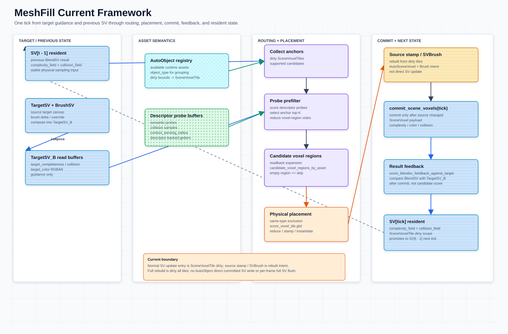

# MeshFill Framework

本文整理当前 MeshFill-Godot 框架的数据归属、生成主线、anchor 候选交接和运行时查询边界。本文只保留跨模块总览；`AssetDescriptor` 定义见 [`asset-descriptor.md`](../asset-descriptor-demo/asset-descriptor.md)，资产字段归属边界见 [`asset-properties.md`](../asset-descriptor-demo/asset-properties.md)；SceneVoxel/source 写入、collision 和 SV 常驻显存规则见 [`scene-voxel-field-system.md`](../core-scene-voxel-field-system/scene-voxel-field-system.md)；TargetSV 设计见 [`target-scene-voxel-projection.md`](../target-sv-point-cloud-conversion-c/target-scene-voxel-projection.md)；AutoObject probe 粗筛见 [`autoobject-probe-prefilter.md`](../placement-autoobject-probe-prefilter/autoobject-probe-prefilter.md)。**SPA**（`ScenePlacementActor`）是 MeshFill 的运行时统一编排器，管理 descriptor 注册、GPU buffer 生命周期和 prefilter→placement→commit 三阶段流水线；完整契约见 [`scene-placement-actor.md`](../core-SPA-scene-placement-actor/scene-placement-actor.md)。



## 文档边界

- 本文回答「MeshFill 的模块如何串起来」：目标画布、资产默认值、anchor 候选交接、placement、source write、commit、SV resident buffers 和查询的大体关系。SPA（`ScenePlacementActor`）是运行时统一编排器，拥有 descriptor 注册、GPU buffer 生命周期和 prefilter→placement→commit 三阶段流水线；详见 [`scene-placement-actor.md`](../core-SPA-scene-placement-actor/scene-placement-actor.md)。
- `SceneVoxel` 字段、`instance_stamp_write_spec` / `ISWS`、stamp-only 提交（`commit_scene_voxels()`）、`collision`、terrain base collision 和 SV 常驻显存细节统一放在 `scene-voxel-field-system.md`。
- `SceneVoxelTile` dirty sidecar、tile 尺寸和局部 object/source range 规则统一放在 [`scenevoxeltile.md`](scenevoxeltile.md)。
- `GPUAutoObjectRuntime` / `AutoVoxelRuntimeProfileContainer` 契约统一放在 [`autoobject-gpu-runtime-architecture.md`](autoobject-gpu-runtime-architecture.md)；本文只说明它们与当前框架的边界。
- 本文只保留这些系统的边界引用，避免和专题文档重复维护同一套规则。

## 核心约束

- `TargetSceneVoxel` / `TargetSV`、`BrushSV` 和合成后的 `TargetSV_B` 是目标效果画布：只提供 prefilter / routing / scoring / target fit / result feedback 的目标信号，不写入 asset 类型标签；源 `TargetSV` 与 `BrushSV` 需要存储，`TargetSV_B` 是默认读取输入。`TargetSceneVoxel` guidance record 只作为 guidance metadata，不进入 committed source 或 `SceneVoxel`。
- [`AssetDescriptor`](../asset-descriptor-demo/asset-descriptor.md) 是「资产是什么」的唯一语义主来源；`AutoObject` 只持有 descriptor 入口、运行时身份、mesh、放置约束和配置入口。
- 运行时 record / `instance_stamp_write_spec`（`ISWS`）只回答「本次实例放在哪里、写什么 payload」；提交后的 `SceneVoxel` 才是后续系统读取的结果，公开 per-voxel payload 统一写作 `complexity`、`color`、`collision` 和可选 `auto_mix`。`channel` 只属于 source/write context，不进入 committed read payload；`complexity` 是唯一强度字段。
- `collision` 是 descriptor、runtime record、source voxel 和 committed `SceneVoxel` 之间的 canonical shared field；placement 采样 record/API 也使用同名 `collision`。`occupied`、`type`、`source_type`、`source_voxel_type` 和 `commit_tick` 不作为 committed per-voxel payload。
- probe prefilter 只减少候选 `AutoObject`，不直接写最终 `SceneVoxel`；score / top-K 留在本轮 GPU dispatch 内部并以常驻 `anchor_candidate_handoff`（anchor / anchor_count / topk buffer）交接细筛，anchor readback 是 debug-only，不能作为运行时成功路径替代 GPU resident buffer contract。
- 粗筛交接不做区域扩张：每个 anchor 就是一个候选 origin（`one_origin_per_anchor`），细筛在 anchor 原点上直接评 top-K asset × pivot × yaw；旧的 candidate voxel-region 保守扩张（`candidate_voxel_regions_by_asset` 路由）已删除。
- 语义向量匹配只在每个 anchor 的粗筛候选资产内做 rerank / validate / prune，不遍历全资产库。
- committed `SceneVoxel` 是**纯 auto** 状态，唯一提交路径是 stamp：VPG 的 GPU state-chain stamp 原位写入常驻 field（stamp 即提交），CPU 入口（`apply_instance_stamp_write_spec`）的盖章记录在 `commit_scene_voxels()` 时一次稀疏散射进同一常驻 field。不存在 per-voxel source-candidate 裁决/blend 提交管线。
- `BrushSV`（场景笔刷层）常驻挂在 SPA 生命周期上，不进入 committed `SceneVoxel`。placement sampling / prefilter 的读取场是按需合成的 `BlendSV`（committed SV + `BrushSV`，brush 覆盖优先、collision 取 max）；brush 为空时读取场直通 committed SV 常驻对，零合成开销。`BlendSV` 是临时读取产物，pipeline 结束即释放。
- 最终 placement 由 `score_anchor_asset_residual.glsl` 以 anchor 为 origin 对 top-K asset × pivot × yaw 计算五维 residual gain（compose 与 stamp 共享 `@@GEN ad_voxel_compose` 规则），结合 collision / clearance 约束后由 `reduce_anchor_candidates.glsl` 在全资产公共候选池按 gain 裁决；读取场为 `BlendSV` 时，stamp 双写 `BlendSV` 工作场与 committed SV 常驻场（同批次避让读 blend，提交落 auto）。
- 结果级 feedback score 由 `ScenePlacementActor.score_blendsv_feedback_against_target()` 临时合成 `BlendSV` 与当前 target read buffer（通常是 `TargetSV_B`，没有 target brush 时等价于 `TargetSV`）对比 completeness / color 重合度，读回统计后立即删除临时体素，`BrushSV` 常驻保留。
- 同类型 `AutoObject` 的 `min_spacing` 互斥收敛到 GPU object runtime / profile buffer contract；当前最终 collision 采样占用仍由 GPU score 确认。
- `GPUAutoObjectRuntime` 只拥有 runtime object state、profile id、bounds / exclusion inputs 和 dirty object delta；per-voxel object refs、SV grid、`SceneVoxelTile` dirty、source range rebuild、commit 和 SV resident fields 仍由 `SceneVoxelCommitter` / SV owner 维护。
- runtime metadata 只能提供查询、索引、debug 和候选剪枝，不成为资产默认值或 committed SceneVoxel 的第二套权威状态。

体素与计算术语参见顶层 [`README.md`](../README.md#voxel-and-compute-terminology)。`SPA` 即 `ScenePlacementActor`，MeshFill 运行时数据的一站式编排容器，详见 [`scene-placement-actor.md`](../core-SPA-scene-placement-actor/scene-placement-actor.md)。

## Ownership

| Layer | Source of truth / owner | Responsibility / output |
| --- | --- | --- |
| SPA (MeshFill orchestrator) | `ScenePlacementActor` | 拥有 `AutoVoxelRuntimeProfileContainer` 完整生命周期；管理 asset registry、GPU buffer 就绪、prefilter→placement→commit 三阶段流水线编排；暴露 `is_gpu_ready()`、`run_placement_pipeline()` 等统一入口。 |
| SV runtime owner | `SceneVoxelCommitter` | 持有 committed `SceneVoxel`、SV resident buffers、`SceneVoxelTile` dirty sidecar 和 debug buffer/readback 边界；placement 时把 `TargetSV_B`、AutoObject registry 与 dirty tile ids 传给 prefilter。通过 SPA 注入引用。 |
| Target canvas | `TargetSceneVoxel` / `BrushSV` / `TargetSV_B` / `TargetSceneVoxelGenerator` | 源 `TargetSV` 保存中性原始目标；`BrushSV` 保存笔刷 delta / override；`TargetSV_B` 是二者合成后的实际采样目标；当前支持 GPU 生成、持久化和 dirty 更新。 |
| Asset defaults | `AssetDescriptor` / `AutoObject.asset_descriptor` / descriptor-backed assets | descriptor 保存所有资产种类的默认语义；字段定义见 [`asset-descriptor.md`](../asset-descriptor-demo/asset-descriptor.md)。`AutoObject` 同名字段只作为 Inspector / 配置字典入口，descriptor 通过 SPA.register_asset() 注册并立即上传 GPU。 |
| Probe prefilter | `AssetDescriptor.semantic_probe_generator` / `AutoObjectProbePrefilterGPU` | 从 BlendSV 读取场 / `TargetSV_B` 读取可放置 anchor，按 descriptor probes 在 GPU 内部打分和 top-K；score / top-K 全程 GPU 内部。SPA 创建 prefilter worker 并注入共享 RD。 |
| Anchor candidate handoff | `anchor_candidate_handoff`（anchor / anchor_count / topk buffer；旧 `candidate_voxel_regions_by_asset` 路由与 legacy `candidate_voxel_sparses_by_asset` alias 已删除） | prefilter 产出的 SCOPE_PERSISTENT 常驻 GPU 交接：`anchor_capacity = 65536`、`topk = 4`、`one_origin_per_anchor`；这是 VPG 的候选输入，生产路径无 CPU readback。 |
| Fine placement scoring | `VoxelPlacementGenerator` / placement shaders | 对 handoff 的每个 anchor × top-K asset 槽做 residual-gain 细筛（pivot × yaw 组合）、公共池 reduce、mixed-asset stamp，一条 GPU 链跑完全部 asset；`anchor_count == 0` 空帧自然穿过。SPA 创建 placer worker 并注入共享 RD + profile_container。 |
| Instance stamp write spec | `instance_stamp_write_spec` / `ISWS` builders | 统一创建或更新本次实例 / stamp 写入 record，保存位置、像素、channel、collision、source 和 debug handle。 |
| Auto stamp records | `SceneVoxelCommitter._instance_stamp_write_specs` | CPU 入口（demo/手动 auto 放置）的逐对象盖章记录，是脏区/全量重放（`_rebuild_scene_voxels_from_records`）的持久记录集；VPG 放置不产生 per-voxel source 记录，stamp 直接落常驻 field。 |
| BrushSV overlay | `ScenePlacementActor`（`write_brush_sv_records()` / `clear_brush_sv()`） | 场景笔刷常驻旁路层（复杂度 RGBA8 + 碰撞 R8 field 对），挂 SPA 生命周期，不进 committed `SceneVoxel`；手动操控/移动 autoobject 时该对象转为提供 `BrushSV`，其 auto 侧按 dirty 剔除重放。 |
| Commit / final state | `SceneVoxelCommitter.commit_scene_voxels()` | **Stamp-only commit**：散射 pending CPU 入口盖章记录进常驻 field、推进 commit tick 并重建 tile 摘要；VPG 的 state-chain stamp 在 placement 期间已原位提交。committed `SceneVoxel` = 常驻 field 对（纯 auto + terrain base collision 种子）。 |
| BlendSV read product | `ScenePlacementActor.compose_blend_sv_fields()` | 按需合成 committed SV + `BrushSV` 的临时读取对（brush 覆盖优先 / collision max）；供 3D score 物理采样与 TargetSV 对比使用，用完即删，不落地、不提交。 |
| Result feedback | `ScenePlacementActor.score_blendsv_feedback_against_target()` | 低频检测 GPU pass；临时合成 `BlendSV` 与 `TargetSV_B` / `TargetSV` 对比 complexity 和 completeness overlap（即 `max(complexity, collision)` 的重合度），统计读回后即释放临时体素。 |
| SV resident buffers | `SceneVoxelCommitter` | SV 自持一对持久 scene/collision GPU resident field buffers（stamp 的持久写入目标）、grid metadata 和 dirty regions；stamp 即提交，读取侧经 BlendSV 按需合成。 |
| Query projection | metadata / `GPUAutoObjectRuntime` / `AutoVoxelRuntimeProfileContainer` / `SceneVoxelTile` | 提供运行时 object id 查询、profile id、调试 lookup、dirty object ranges 和局部 rebuild 索引；`GPUAutoObjectRuntime` 不拥有 SV grid 或 commit，`AutoVoxelRuntimeProfileContainer` 不作为 CPU-side placement 替代路径。通过 SPA 暴露统一访问接口。 |

## Stage Contracts

| Stage | Inputs | Outputs | Boundary |
| --- | --- | --- | --- |
| Target read | `TargetSV`、`BrushSV`、target dirty bounds | `TargetSV_B` read buffers、target debug metadata | 只提供 guidance；不进入 source write 或 committed `SceneVoxel`。 |
| Prefilter | `SV[t - 1]` resident fields、`TargetSV_B`、descriptor-backed probes、dirty tile ids | GPU-internal `anchor_autoobject_topk`、常驻 `anchor_candidate_handoff`（anchors readback debug-only） | 只收窄候选；不做最终细粒度 placement score。SPA 通过 `_build_autoobject_array_for_pipeline()` 构建输入，注入 profile_container 的 borrowed GPU buffers。 |
| Anchor candidate handoff | resident anchor / anchor_count / topk buffers | `anchor_candidate_handoff`（`anchor_capacity = 65536`、`topk = 4`、`origin_contract = "one_origin_per_anchor"`） | SCOPE_PERSISTENT 常驻 GPU 交接；`anchor_count == 0` 空帧自然穿过，无 CPU 回读。 |
| Fine placement scoring | handoff anchors、`BlendSV` 读取场（brush 为空时即 committed SV 常驻对）、TargetSV 独立输入对（`target_field` + `target_collision`）、容器常驻 `asset_voxel_records` | accepted placements、`gpu_autoobject_runtime_writeback`、`instance_stamp_writeback`（mode = `gpu_state_chain_stamp`） | `score_anchor_asset_residual.glsl` 以 anchor 为 origin 对 top-K asset × pivot × yaw 计算五维 residual gain（`loss_before - loss_after`，compose 与 stamp 同规则）；`reduce_anchor_candidates.glsl` 公共池裁决后 `stamp_asset_voxels.glsl` mixed-asset 原位提交 committed SV（读取场为 BlendSV 时双写）。SPA 注入 profile_container 和 gpu_runtime 到 placement settings。 |
| Commit | VPG state-chain stamp（已落）、pending CPU 入口盖章记录 | committed `SceneVoxel[tick]` 常驻 fields、tile 摘要 | `commit_scene_voxels()` 是 stamp-only 提交发布点：散射 pending 记录 + tick + tile 摘要，无裁决/blend。CPU 入口经 `sv_committer.apply_instance_stamp_write_spec()`。 |
| Feedback | 临时合成 `BlendSV`、`TargetSV_B` / `TargetSV` | result-level target feedback score | 只评价提交结果；不替代候选评分；临时体素用完即删。 |

## Runtime Flow

```text
SPA (ScenePlacementActor) 编排层
  → initialize(RD, sv_committer, gpu_runtime)
  → register_asset(descriptor, mesh) × N  [即时 GPU 上传]
  → is_gpu_ready()?  [验证就绪状态]
  → run_placement_pipeline()  [每帧入口]

SceneVoxelCommitter / SV owner [tick]
  -> committed SceneVoxel[tick - 1]: 常驻 complexity/collision field 对（纯 auto + terrain base 种子）
  -> SPA: BrushSV 常驻旁路层（不进 committed SV）
  -> BlendSV 读取场 = compose(committed SV, BrushSV)（brush 为空时直通 SV RID）
     placement sampling / prefilter / target prep 读取 BlendSV
  -> TargetSV + BrushSV(target 画布笔刷) -> TargetSV_B brush-composited target input
  -> AutoObject registry + descriptor-backed probe buffers
     SPA 管理 asset registry → AutoObjectProbePrefilterGPU
  -> collect dirty anchors / affected target bounds
  -> AutoObject probe prefilter（读 BlendSV 常驻 RID，GPU 转换合并场）
     SPA 注入 profile_container borrowed probe_records GPU buffer
  -> GPU score/topK internal pass
  -> 常驻 anchor_candidate_handoff（anchor / anchor_count / topk buffer）
  -> VoxelPlacementGenerator.run_multi_asset()
     SPA 注入 shared RD + profile_container + gpu_runtime
     state chain: 读 BlendSV 工作场；stamp 双写 BlendSV + committed SV（stamp 即提交）
  -> GPU same-type exclusion / runtime-profile contract
  -> fine_score_dispatch_finalize -> score_anchor_asset_residual（间接派发，origin_count == anchor_count）
     residual gain 读 BlendSV + TargetSV（target_field + target_collision）
  -> reduce_anchor_candidates 公共池裁决 -> init_stamp_bounds -> stamp_asset_voxels
  -> accepted placements
     GPUAutoObjectRuntime resident writeback（spawn）+ runtime dirty delta → tile dirty
  -> commit_scene_voxels(tick): 散射 pending CPU 入口盖章记录 + tick + tile 摘要
  -> committed SceneVoxel[tick] 常驻 fields
  -> ScenePlacementActor.score_blendsv_feedback_against_target(TargetSV_B / TargetSV)
     低频检测：临时合成 BlendSV 对比，读回统计后即删临时体素
  -> BlendSV 临时对释放；BrushSV 常驻保留
  -> next tick: committed SV 常驻 fields 即下一轮读取基底
  -> dirty SceneVoxelTile / voxel-region invalidation
```

## TargetSV 与路由边界

`TargetSceneVoxel` 是目标效果画布。源 `TargetSV` 可以来自当前 GPU 路径，也可以后续接入外部 VDB 离线重采样；`BrushSV` 保存笔刷覆盖 / delta；`TargetSV_B` 是源 `TargetSV` 与 `BrushSV` 合成后的实际采样目标。无论来源如何，它们都不携带资产类别；只有 `TargetSV_B` 提供 routing 和 score 阶段默认读取的目标信号。`TargetSceneVoxel` guidance record 可保留为 target / guidance metadata 和 debug 回查，但不进入 stamp-only 提交的 committed `SceneVoxel`。

采样规范：

```text
sample_pos = anchor_pos + probe_or_context_offset
sample_pos = clamp(sample_pos, target_sv_min, target_sv_max)
sample_value = TargetSV_B[sample_pos]
```

- probe / context sample 越出 TargetSV_B 边界时，投射到最近的有效 TargetSV_B voxel。
- 越界采样不直接视为空白，也不直接判失败。
- clamp 只影响 TargetSV_B / target context 的读取位置，不改变 anchor、asset collision 采样或最终 placement 坐标。
- `clamped_sample_count` 可作为 debug / confidence hint；当前未进入 placement score。

## Anchor Candidate Handoff Contract

```text
upstream prefilter
  -> collect anchors
  -> score descriptor-backed semantic probes
  -> anchor_autoobject_topk

anchor candidate handoff
  -> resident anchor / anchor_count / topk buffers (SCOPE_PERSISTENT)
  -> one_origin_per_anchor: 每个 anchor 就是一个候选 origin

placement
  -> fine_score_dispatch_finalize turns anchor_count into indirect args
  -> score_anchor_asset_residual scores anchor x top-K asset slot x pivot x yaw
  -> reduce_anchor_candidates settles the common pool by residual gain
```

路由阶段的 hard gate 是每个 anchor 已筛选成功的候选资产（top-K 槽）。候选内语义 rerank / validate / prune 不能重新遍历全资产库或生成新的 asset candidate，只能在候选集内部调整排序、降低置信度或剔除候选。

`anchor_candidate_handoff` 作为当前 placement 主接口：

```gdscript
{
	"anchor_buffer_rid": RID,        # uvec4 anchors（position-only）
	"anchor_count_buffer_rid": RID,  # GPU 常驻计数（host 不回读）
	"topk_buffer_rid": RID,          # 每 anchor top-K (asset_id, score) 槽
	"anchor_capacity": 65536,
	"topk": 4,                       # 编译期契约
	"origin_contract": "one_origin_per_anchor",
}
```

该 payload 经 SPA 传入 `VoxelPlacementGenerator.run_multi_asset()`；细筛不做区域扩张，`anchor_count == 0` 空帧自然穿过。旧的 `candidate_voxel_regions_by_asset` 保守区域接口（及 legacy `candidate_voxel_sparses_by_asset` alias、`Vector3i` 区域字典、tile 内 512 origin 枚举）已随 candidate route 删除。

## Current Modules

| Module | Main files | Notes |
| --- | --- | --- |
| SPA (ScenePlacementActor) | `scripts/scene_placement_actor.gd` | 运行时编排器，拥有 `AutoVoxelRuntimeProfileContainer` 完整生命周期，管理 asset registry、GPU buffer 就绪和 prefilter→placement→commit 三阶段流水线。详见 [`scene-placement-actor.md`](../core-SPA-scene-placement-actor/scene-placement-actor.md)。 |
| TargetSV generation | `scripts/target_scene_voxel_generator.gd` / `shaders/target_scene_voxel.glsl` | 当前 GPU 生成 TargetSV visual / collision buffers、decode read buffers 和 debug preview。 |
| TargetSV persistence | `scripts/utils/target_sv_setup.gd` / `scripts/target_sv_loader.gd` / `scripts/target_scene_voxel_generator.gd` | 持久化数据落在 `assets/target_sv/`；`TargetSVLoader` 加载 metadata / visual / collision buffers 并上传或解码，`TargetSVSetup` 负责 editor demo 预加载和 overlay 显示，`TargetSceneVoxelGenerator` 负责 GPU 生成、dirty rect 重算和 debug preview。 |
| Asset model | `scripts/auto_object.gd` / `scripts/asset_descriptor.gd` | `AutoObject` 是共同运行时基类；`AssetDescriptor` 的统一定义见 [`asset-descriptor.md`](../asset-descriptor-demo/asset-descriptor.md)。profile 只作为共享数据和生成辅助，descriptor 通过 SPA.register_asset() 注册并即时上传 GPU。 |
| Probe prefilter | `scripts/autoobject_probe_prefilter_gpu.gd` / [`autoobject-probe-prefilter.md`](../placement-autoobject-probe-prefilter/autoobject-probe-prefilter.md) | GPU-only 粗筛路径；`anchor_autoobject_topk` 当前不回读，公开输出是常驻 `anchor_candidate_handoff`；旧 `candidate_voxel_regions_by_asset` 路由输出（及 legacy `candidate_voxel_sparses_by_asset` alias）已删除；不保留 CPU 替代路径。SPA 创建 prefilter worker 并注入共享 RD + profile_container。 |
| 3D voxel placement | `scripts/voxel_placement_generator.gd` / `shaders/fine_score_dispatch_finalize.glsl` / `shaders/score_anchor_asset_residual.glsl` / `shaders/reduce_anchor_candidates.glsl` / `shaders/stamp_asset_voxels.glsl` | residual-gain 细筛和 mixed-asset stamp 主路径；不负责全库语义查找。SPA 创建 placer worker 并注入共享 RD + profile_container。 |
| SV resident buffers | `scripts/scene_voxel_committer.gd` | `SceneVoxelCommitter` 持有 SV resident state；SV 自持持久 scene/collision GPU resident field buffers（stamp 直写目标）、grid metadata 和 dirty regions，服务 probe、placement、validation 和 debug query，不作为第二套权威数据模型。SPA 借用引用。 |
| Runtime object indexing | `GPUAutoObjectRuntime` / `AutoVoxelRuntimeProfileContainer` / `SceneVoxelTile` | GPU object pool 负责 object id、`object_type`、profile、transform、bounds 和 dirty delta；profile container 负责 resident profile/probe/pivot/asset_voxel buffers；`SceneVoxelTile` 只保存局部 object id ranges 和 dirty summary。SPA 拥有 profile_container，借用 gpu_runtime。 |
| Dirty `SceneVoxelTile` updates | `scripts/scene_voxel_committer.gd` / `scripts/autoobject_probe_prefilter_gpu.gd` / `scripts/voxel_placement_generator.gd` / `scripts/scene_placement_actor.gd` | AutoObject、brush、target、profile 和 placement 只发 dirty delta / bounds；SPA 编排 prefilter→placement→commit，VPG 将 accepted placement source buffers 交给 `SceneVoxelCommitter`。SV owner 通过 `mark_scene_voxel_tile_dirty()` / `mark_scene_voxel_tile_bounds_dirty()` 映射为 affected `SceneVoxelTile` dirty。`invalidate_sv_tile()` / `invalidate_sv_rect()` 只是 legacy compatibility storage，再局部重建 source/routing 和 BlendSV-backed resident fields。 |

## Dirty Update Rules

普通 complexity field 变化：

```text
AutoObject / brush / placement delta
  -> mark affected SceneVoxelTile dirty
     named entry: mark_scene_voxel_tile_dirty() / mark_scene_voxel_tile_bounds_dirty()
     legacy storage: invalidate_sv_tile() / invalidate_sv_rect()
  -> rebuild dirty tile source ranges and summaries
  -> rerun upstream prefilter for affected anchors
  -> refreshed anchor_candidate_handoff covers affected anchors
  -> commit_scene_voxels(tick) only when stamp records changed
```

Target color / complexity 变化：

```text
dirty target bounds
  -> mark affected SceneVoxelTile target/routing dirty
     target dirty rect bridges to SceneVoxelTile routing/scoring dirty
  -> rerun prefilter for affected anchors
  -> refreshed anchor_candidate_handoff covers affected anchors
```

更新完成后不需要对所有 asset 重新生成 voxel 级 top-K；只需要处理 dirty / affected anchors 和相关 asset 候选槽。

## Maintenance Rules

- 新增资产语义字段时默认加入 [`AssetDescriptor`](../asset-descriptor-demo/asset-descriptor.md)，不要在 `AutoObject` 上新增第二套同名语义状态。
- 新增资产字段时，先判断它属于资产默认值、运行时 record、source voxel write path、TargetSV 目标画布还是最终 `SceneVoxel` 状态。
- metadata 只能挂索引、调试字段和 `instance_stamp_write_spec` / `ISWS` handle，不能成为对象默认值的主来源；`voxel_write_spec` 只作为 legacy compatibility alias。
- 自动生成和画笔修改先进入 `SceneVoxelTile` dirty，再通过本 tick source voxel write path 更新 `SceneVoxel`；具体 source / commit 规则见 `scene-voxel-field-system.md`。
- `TargetSceneVoxel` 不写资产标签，也不进入 committed source / `SceneVoxel`；资产选择只能通过 prefilter / routing / placement 形成。
- SV resident buffers 和 dirty regions 由 `SceneVoxelCommitter` 自持（单对持久 field，stamp 直写），服务 probe、placement、validation 和 debug；不存在第二套运行时权威状态。
- `GPUAutoObjectRuntime` / `AutoVoxelRuntimeProfileContainer` / VPG 的 contract validation 必须确认 shared-RD buffers ready、bound、consumed；无 `RenderingDevice` 时只能 SKIP GPU upload / placement 或输出 `contract_blocked=true`、`cpu_fallback=false`。通过 SPA 的 `is_gpu_ready()` 统一检查就绪状态。
- `BrushSV` / source stamp 是 dirty `SceneVoxelTile` 重建出的写入意图，不是绕过 tile 的第二套 SV 更新入口。
- full rebuild 只作为维护路径，语义等价于 dirty all tiles；不要把 per-frame full SV flush 作为普通 runtime 路径。
- `collision`、`collision_field` 和 terrain base collision 的归属统一维护在 `scene-voxel-field-system.md`。
- `AutoObject` 不应使用运行时缩放；`_configure_auto_object()` 强制 `scale = Vector3.ONE`，semantic probes 按 unscaled asset/local space 生成和采样。
- Probe 粗筛只减少候选 `AutoObject` / voxel regions，不直接写最终 `SceneVoxel`。
- `score_anchor_asset_residual.glsl` 不新增 semantic dot / MLP / target neighborhood pooling。
- 文档读写统一使用 UTF-8，避免中文内容出现乱码。
- 流程变更时同步更新本文档、`scene-voxel-field-system.md`、`scene-placement-actor.md` 和相关 placement 文档；SVG 由图表负责范围单独更新。
- SPA 是 MeshFill 运行时数据的一站式入口：所有 descriptor 注册、GPU buffer 访问和 pipeline 编排应通过 SPA 而非直接操作 `AutoVoxelRuntimeProfileContainer` 或 worker 实例。


> **禁止 --headless**：本模块的所有 GPU 测试依赖 RenderingDevice，必须在 Vulkan 驱动下运行（--rendering-driver vulkan），使用 --headless 会导致测试无法访问 GPU，且不得以非 GPU 路径作为通过条件。

## 运行方式

> **@tool 编辑器模式，禁止 F6。**
>
> 在 Godot 编辑器中双击打开 `.tscn` 场景文件即可。脚本在编辑器视口中实时运行。
> F6（Run Current Scene）和 F5（Run Project）被 `core_demo_contract_fixture.gd` 守卫代码禁止。

## 测试方法

1. 打开 `core-meshfill-framework.tscn`，确认它覆盖 target guidance -> prefilter -> routing -> placement -> commit -> feedback 的总流程。
2. 运行框架主路径测试：

```bash
<godot> --path . --rendering-driver vulkan --script tools/test_markdown_contracts.gd
<godot> --path . --rendering-driver vulkan --script tools/test_autoobject_probe_prefilter.gd
<godot> --path . --rendering-driver vulkan --script tools/test_auto_voxel_runtime_profile_container.gd
<godot> --path . --rendering-driver vulkan --script tools/test_core_demo_contracts.gd
```

#### 禁止 `--headless`

所有 GPU 测试均依赖 RenderingDevice，使用 --headless 会导致测试无法访问 GPU。GPU 测试必须在 Vulkan 驱动下运行，且不得以非 GPU 路径作为通过条件。

3. 对照 `diagrams/meshfill_current_framework.svg`，检查文档中的模块边界和当前源码入口一致。

## Demo 验收标准

- `TargetSV_B` 只作为 guidance/read input，不进入 source write 或 committed `SceneVoxel`。
- prefilter 只收窄候选，最终 residual-gain 细筛与 placement 约束仍由 `score_anchor_asset_residual.glsl` / `reduce_anchor_candidates.glsl` 验收。
- placement 后必须通过 `commit_scene_voxels()` 完成 stamp-only 提交发布；`BlendSV` 只是临时读取产物（对比 TargetSV / 3D score），不落地；feedback 只评价提交结果。

## 测试场景

| 场景 | 说明 | Godot 场景 |
| --- | --- | --- |
| [MeshFill Framework Demo](res://demos/core-meshfill-framework/meshfill-framework.md) | 本文即该 demo 的测试文档 | [`core-meshfill-framework.tscn`](res://demos/core-meshfill-framework/core-meshfill-framework.tscn) |
