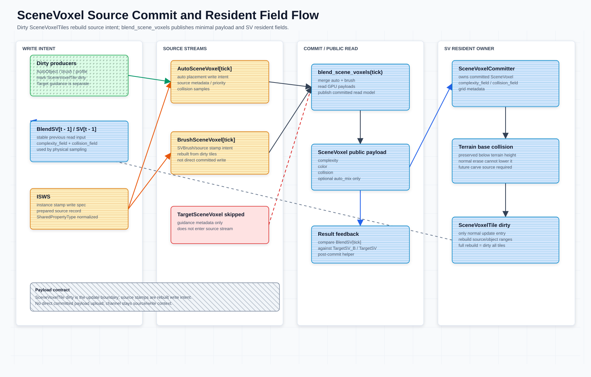

# Complexity Field System

本文维护 MeshFill 中 `SceneVoxel`、source write、`collision` 和 SV 常驻显存状态的契约。跨模块总览见 [`meshfill-framework.md`](../core-meshfill-framework/meshfill-framework.md)；`AssetDescriptor` 定义见 [`asset-descriptor.md`](../asset-descriptor-demo/asset-descriptor.md)，资产字段归属见 [`asset-properties.md`](../asset-descriptor-demo/asset-properties.md)；粗粒度 SV cell 管理见 [`scenevoxeltile.md`](../core-scenevoxeltile/scenevoxeltile.md)；AutoObject GPU-first 方向见 [`autoobject-gpu-runtime-architecture.md`](../core-SPA-scene-placement-actor/autoobject-gpu-runtime-architecture.md)；TargetSV 见 [`target-scene-voxel-projection.md`](../target-sv-point-cloud-conversion-c/target-scene-voxel-projection.md)。**SPA**（`ScenePlacementActor`）是 MeshFill 运行时编排器，借用 `SceneVoxelCommitter` 引用并在 commit 阶段调用 `apply_instance_stamp_write_spec()`；详见 [`scene-placement-actor.md`](../core-SPA-scene-placement-actor/scene-placement-actor.md)。

committed `SceneVoxel` 采用 **stamp-only commit**：常驻 complexity/collision field buffer 对是持久 stamp 写入目标，VPG 的 GPU state-chain stamp（`stamp_voxel_field.glsl`）在 placement 期间原位提交，CPU 入口（`apply_instance_stamp_write_spec()`）的盖章记录由 `commit_scene_voxels()` 一次稀疏散射（`scatter_sv_field_records.glsl`）落入同一常驻 field。不存在 per-voxel source-candidate 裁决/blend 提交管线。`BrushSV`（场景笔刷层）常驻挂在 SPA 上、不进提交；`BlendSV` 是 committed SV + `BrushSV` 的按需合成读取产物（`compose_blend_sv_fields.glsl`），供 3D score 物理采样与 TargetSV 对比使用，用完即删。



## 本文范围

- `instance_stamp_write_spec`（`ISWS`）如何经 `apply_instance_stamp_write_spec()` 盖章进入常驻 field 与公共投影。
- `commit_scene_voxels()` 如何完成 stamp-only 提交发布（散射 pending 记录 + tile 摘要）。
- committed per-voxel payload、source-only 字段和 debug buffer/readback 边界。
- canonical `collision` 字段、placement footprint `collision` record/API、terrain base collision 与 `collision_field` 的归属。
- SV resident buffers、dirty voxel regions / dirty tiles 的所有权。

## 核心契约

- `SceneVoxel` / `SV` 是 committed runtime read model，不是资产 authoring schema。
- [`AssetDescriptor`](../asset-descriptor-demo/asset-descriptor.md) / `AutoVoxelProfile` 是资产默认语义来源；`AutoObject` 负责把 descriptor/profile 语义构造成本轮 `instance_stamp_write_spec`（`ISWS`）。
- shared fields 只有 `color`、`complexity`、`collision`。`collision` 是权威 shared field。
- committed `SceneVoxel` 对外 read payload 最小化为 `complexity`、`color`、`collision`，可选 `auto_mix`。`channel` 只属于 source/write context，不进入 committed read payload；`complexity` 是唯一强度字段。
- `occupied`、`type`、`source_type`、`source_voxel_type`、`commit_tick` 不作为 committed per-voxel payload；占用由 completely（即 `max(complexity, collision)`）是否非 0 推导，source provenance 放在 source/debug buffer，commit tick 只作为当前 SV snapshot 的全局 epoch。
- `TargetSceneVoxel` record 只作为 target / guidance metadata；写入阶段会跳过它，不进入 `AutoSceneVoxel` / `BrushSceneVoxel` source stream，也不进入 committed `SceneVoxel`。
- `TargetSceneVoxelGenerator.decode_target_read_buffers()` 可把 `TargetSV_B` raw `rgba8/r8` cache 解码成 `target_completely`（即 `max(complexity, collision)`） / `target_color`；这是 routing / scoring read input，不是 source write。
- committed stamp 只接受归一化后的 auto record；`TargetSceneVoxel` / `TargetSV_B` 在 `apply_instance_stamp_write_spec()` 边界保持 guidance-only / skip。brush 内容写 SPA 的 `BrushSV` 常驻层（`stamp_brush_sv_records()`），不进 committed `SceneVoxel`。
- `SceneVoxelCommitter` 的 `_instance_stamp_write_specs` 是逐对象盖章记录集（脏区/全量重放的依据）；`_volume.scene_voxels` 是盖章时直写的调试/查询投影，不是运行时权威状态。
- SV 自持一对持久 complexity/collision 常驻 field buffer（stamp 直写目标；碰撞场以 terrain base 为种子）、grid metadata 和 dirty regions；读取侧经 `BlendSV` 按需合成（brush 为空时直通）。
- `_rebuild_sv()` 发布的 SV resident state 是 committed `SceneVoxel`、terrain base collision、grid metadata 和 dirty index 的读取快照；它不是 source write buffer，也不是第二套 committed payload。
- AutoObject、brush、profile 和 placement 变更影响 committed SV 时，正常入口是 `SceneVoxelTile` dirty；`SVBrush` / source stamp 是 dirty tile 重建出的 source write intent，不是 direct SV update path。
- `TargetSV_B` / target guidance 变化只触发 routing、prefilter、scoring 或 feedback 侧 dirty，不写入 source stream，也不直接更新 committed `SceneVoxel`。
- 文档和新调用优先使用 `mark_scene_voxel_tile_dirty()` / `mark_scene_voxel_tile_bounds_dirty()`；当前源码仍保留 `_sv_dirty_tiles` / `_sv_dirty_rects`、`invalidate_sv_tile()` / `invalidate_sv_rect()` 和 `SV_RESIDENT_TILE_SIZE = 8` 作为 dirty storage compatibility，不是新的核心概念，也不改变 `SceneVoxelTile` contract。

体素与计算术语参见顶层 [`README.md`](../README.md#voxel-and-compute-terminology)。`collision` 是 canonical shared collision field；`instance_stamp_write_spec` / `ISWS` 是 canonical per-instance runtime write spec；`voxel_write_spec` 是 legacy alias。`SPA` 参见 [`scene-placement-actor.md`](../core-SPA-scene-placement-actor/scene-placement-actor.md)。

## 责任、输入和输出

| 类型 / 阶段 | 责任 | 输入 | 输出 | Source of truth |
| --- | --- | --- | --- | --- |
| `AssetDescriptor` / `AutoVoxelProfile` | 资产默认语义。 | authoring config、imported profile。 | descriptor-backed shared fields、probe / pivot defaults。 | descriptor/profile 资源；定义见 [`asset-descriptor.md`](../asset-descriptor-demo/asset-descriptor.md)。 |
| `instance_stamp_write_spec` / `ISWS` | 描述本轮实例 stamp 的 source write context。 | `AutoObject` descriptor-backed getters、placement result、extra write fields。 | 归一化前的 per-instance write record；legacy 名称是 `voxel_write_spec`。 | 当前 tick 的 `AutoObject` / placement builder 输出。 |
| Auto stamp records | CPU 入口逐对象盖章记录，供脏区/全量重放。 | `prepare_source_record()` 归一化后的 `ISWS`。 | `_instance_stamp_write_specs` 记录 + pending field 散射记录。 | `SceneVoxelCommitter._instance_stamp_write_specs`；不是 committed per-voxel 字段。 |
| `BrushSV` overlay | 场景笔刷常驻旁路层，不进提交。 | 笔刷体素记录（`stamp_brush_sv_records()`）。 | SPA 常驻 brush field 对（RGBA8 + R8）。 | `ScenePlacementActor`；生命周期/持久化元数据见 brush control metadata。 |
| committed `SceneVoxel` | 发布 committed per-voxel read model（纯 auto）。 | VPG state-chain stamp + CPU 入口散射记录 + terrain base collision 种子。 | SV accepted fields：`complexity`、`color`、`collision`，可选 `auto_mix`。 | 常驻 field buffer 对；`commit_scene_voxels()` 是发布点。 |
| `BlendSV` read product | 按需合成的临时读取对（3D score / TargetSV 对比）。 | committed SV 常驻对 + `BrushSV` 常驻对。 | 临时 blend field 对（brush 覆盖优先 / collision max），用完即删。 | `ScenePlacementActor.compose_blend_sv_fields()`；不落地、不提交。 |
| SV resident state | 提供 placement、prefilter、validation 和 debug 的稳定读取输入。 | committed `SceneVoxel`、terrain collision、grid metadata、dirty tile state。 | `complexity_field`、`collision_field`、grid metadata、dirty snapshots、debug ranges。 | `SceneVoxelCommitter._rebuild_sv()` 发布的 `_sv` snapshot。 |
| `SceneVoxelTile` + per-voxel object refs | 记录两级（voxel + tile）object refs、粗粒度 dirty、bounds、source ranges 和 summary。 | affected voxel bounds、source write、GPU AutoObject dirty delta bridge。 | `dirty_scene_voxel_tiles`、per-voxel object refs、tile 级 object/source debug ranges、summary。 | `SceneVoxelCommitter._scene_voxel_tiles` staging table + per-voxel object-ref GPU buffer；详见 [`scenevoxeltile.md`](../core-scenevoxeltile/scenevoxeltile.md)。 |
| `TargetSceneVoxel` / `TargetSV_B` | target / guidance read input。 | target generator、BrushSV 合成、persisted target buffers。 | `target_completely`（即 `max(complexity, collision)`，值为 0 表示体素为空）、`target_color`、feedback target。 | TargetSV / BrushSV 持久化缓存；不进入 source write。 |

## 生命周期

```text
AssetDescriptor / AutoVoxelProfile
  -> AutoObject / placement result builds ISWS
  -> affected bounds mark SceneVoxelTile dirty
  -> prepare_source_record() normalizes shared fields
  -> apply_instance_stamp_write_spec(): 盖章 slices + 直写 scene_voxels 投影 + 排队 field 散射记录
  -> commit_scene_voxels(tick): 散射 pending 记录进常驻 field + tick + tile 摘要
  -> committed SceneVoxel[tick]（常驻 field 对，纯 auto）
  -> _rebuild_sv() publishes grid metadata / tile snapshots（field 即常驻 buffer 本体）
  -> next tick: BlendSV = compose(committed SV, BrushSV) 作为稳定读取输入
```

生命周期规则：

- placement 和 probe 本 tick 的稳定读取输入是 `BlendSV` 读取场（committed SV + `BrushSV` 按需合成；brush 为空时直通 committed SV RID）。
- `ISWS` 只属于当前 tick；`commit_scene_voxels()` 发布只含 SV accepted fields 的 committed `SceneVoxel` 投影。
- `SceneVoxelTile` dirty flags 在 SV snapshot 成功发布后清理；object/source debug ranges 可随下一次 `_rebuild_sv()` 重建。
- `TargetSV_B` 可以跨 tick 持久化为 guidance cache，但它的生命周期不等同于 committed `SceneVoxel`。

## CPU / GPU 边界

| 侧 | 当前职责 | 不拥有 |
| --- | --- | --- |
| CPU / GDScript | descriptor / `ISWS` 归一化、pending field 散射记录收集、`SceneVoxelTile` command staging、`commit_scene_voxels()` 编排、debug buffer readback 解码和 persisted target decode。 | GPU object pool hot state、field 数值写入（stamp/散射在 GPU 上完成）、shader 内临时 same-batch duplicate buffers。 |
| GPU compute | `stamp_voxel_field.glsl` state-chain stamp（读 BlendSV 工作场时双写 committed SV）、`scatter_sv_field_records.glsl` CPU 入口记录散射、`compose_blend_sv_fields.glsl` BlendSV 合成、`score_blendsv_feedback.glsl` 结果级对比、probe prefilter（`pack_prefilter_field_pair.glsl` 常驻场转换）、candidate voxel-region routing、`score_voxel_tile.glsl` physical scoring。 | `SceneVoxelTile` source of truth、TargetSV source write、GDScript staging/debug Dictionary 投影。 |
| Boundary buffer | `complexity_field` / `collision_field`、`target_completely` / `target_color`、candidate voxel-region ids、placement result buffers。 | `collision_field` 不是第二套 collision source of truth；它由 committed `SceneVoxel.collision` 与 terrain base collision 发布。 |

GPU pass 读取 `BlendSV` 读取场生成候选；被接受的 placement 由 stamp pass 原位提交进 committed SV 常驻 field（stamp 即提交）。

## Committed SceneVoxel

Committed `SceneVoxel` 只接受自己的 per-voxel 字段：

逐项字段集合维护在 `SceneVoxel.PUBLIC_FIELD_KEYS` / `SceneVoxel.INTERNAL_FIELD_KEYS`；GPU 数值状态即常驻 field buffer 对（stamp/散射直写）。

以下字段不属于 committed `SceneVoxel`：

| 字段 | 归属 |
| --- | --- |
| `occupied` | query 派生状态，由 `complexity` 非 0 推导。 |
| `type` | storage schema / container metadata。 |
| `source_type` / `source_voxel_type` | 盖章记录/公共投影上的 debug provenance 元数据（无提交语义）。 |
| `commit_tick` | 当前 committed SV snapshot 的全局 epoch；不表达 per-voxel provenance。 |
| `record_id`、`auto_id`、`object_type`、`mesh_instance_id`、per-voxel `object_ids` 等 | record、runtime debug metadata、asset metadata 或 debug handle。per-voxel object refs 是独立 object-ref index，不进入 committed `SceneVoxel`。 |

当前内部 Dictionary 仍可能带 `slice_index`、`voxel_xz`、`base_pixel` 等地址字段，用于 debug queries、dirty rebuild 和 debug。它们是 storage / addressing 信息，不是 SV 语义字段。

## Source Write

`instance_stamp_write_spec`（`ISWS`）由 AutoObject / placement builder 生成。当前代码用 canonical `AutoObject.make_instance_stamp_write_spec()`、`AutoObject.make_profile_instance_stamp_write_spec()` 构造，返回 `ISWS`。进入写入路径前，`SharedPropertyType` 会把 `color`、`complexity`、`collision` 归一化。

常用 source-only 字段的逐项含义维护在 `SceneVoxelSourceRecord.prepare_source_record()` 与 `SceneVoxelCommitter._make_stamped_scene_voxel_template()` 中。

硬边界：可提交 stamp record 只来自 auto 路径。`TargetSceneVoxel` record 会被标记为 `target_guidance_only` 并在 `apply_instance_stamp_write_spec()` 中提前返回；即使 `TargetSV_B` 已解码为 `target_completely` / `target_color`，这些 buffer 也只能作为 read input 或 target-side dirty trigger。brush 内容经 SPA `stamp_brush_sv_records()` 写常驻 `BrushSV` 层。

`SceneVoxelCommitter` 内部的 `_pending_sv_field_records` 收集 CPU 入口盖章产生的 field 散射记录（x, z, slice, complexity, rgb, collision；complexity < 0 表示仅写碰撞）。`commit_scene_voxels()` 把它们一次稀疏散射进常驻 field（`scatter_sv_field_records.glsl`：复杂度覆盖写、碰撞 atomic max）。GPU dispatch 失败在提交摘要中报告 `field_scatter_reason`，不静默回退 CPU。

Source write 的刷新来源应由 dirty `SceneVoxelTile` 决定；Target guidance 只触发 routing / scoring / feedback dirty，不进入 source stream：

```text
AutoObject / brush / profile / placement delta
  -> mark affected SceneVoxelTile dirty
  -> rebuild dirty tile source ranges / object ranges / summaries
  -> auto: apply_instance_stamp_write_spec() 盖章 / VPG state-chain stamp
  -> brush: SPA.stamp_brush_sv_records()（常驻 BrushSV 层）
  -> commit_scene_voxels(tick)
```

`SVBrush` / source stamp 可以和 AutoObject 的覆盖 tile 绑定，用来重建 source intent；但它不是绕过 `SceneVoxelTile` dirty 的第二入口，也不能直接修改 committed `SceneVoxel` 或 SV resident `complexity_field` / `collision_field`。

当前实现中，`apply_instance_stamp_write_spec()` 盖章时直接写 `_volume["scene_voxels"]` 公共投影、排队 `_pending_sv_field_records`，并标记 `_mark_sv_tile_dirty()` 同步 `_scene_voxel_tiles` command staging。`_rebuild_sv()` 把 object/source debug ranges、tile summary 发布到 SV snapshot；常驻 field buffer 由 `ensure_resident_field_buffers()` 保证存在（仅缺失/体素数变化时重建，上传路径不覆盖 stamp 内容）。外部 named 入口是 `mark_scene_voxel_tile_dirty()` / `mark_scene_voxel_tile_bounds_dirty()`；兼容入口是 `invalidate_sv_tile()` / `invalidate_sv_rect()`。文档层仍应写作 `SceneVoxelTile` dirty，只有说明源码兼容层时才写 legacy storage 字段。

剔除/擦除的自洽性由重放保证：`_rebuild_scene_voxels_from_records()` 清空常驻 field（复杂度清零、碰撞重播 terrain base 种子）后逐记录重放盖章。移动/删除 autoobject 时，其 auto 侧按 dirty 剔除重放，其手动内容转入 `BrushSV` 常驻层——两边各自干净，无幽灵体素。

## Debug Buffer Query

`get_scene_voxel(slice_index, voxel_xz)` 仍是 committed `SceneVoxel` 查询，只返回 `complexity`、`color`、`collision`，可选 `auto_mix`。

工具点选一个 voxel 时，用同一个 voxel 坐标分别读取当前层：

- committed result：`get_scene_voxel()`（盖章直写投影）或 `readback_sv_field_debug_snapshot()`（常驻 field 显式 debug 回读）。
- brush layer：SPA 常驻 `BrushSV` field 对（`get_brush_sv_field_summary()`）。
- auto layer：committed SV 常驻 field（纯 auto，即上一项）。
- tile debug：`SceneVoxelTile` 由 `floor(Vector3i(x, y, z) / scene_voxel_tile_size)` 推导；tile record、summary、dirty index、object/source refs 通过 `readback_scene_voxel_tile_debug_snapshot()` 读取。

查询规则：

- 不再提供 `get_scene_voxel_sidecar()` / `SceneVoxelLocal` 这类 CPU Dictionary 聚合查询。
- CPU 侧不再为了 debug 长期保留 `BrushSV` / `AutoSV` 的完整内容镜像；只保留资源句柄、生命周期、dirty、序列化入口和 readback 定位键等控制面元数据。
- 工具需要 debug 信息时读稳定 debug buffers / readback decoder（`readback_sv_field_debug_snapshot()` / `readback_scene_voxel_tile_debug_snapshot()`），不直接读取 `_scene_voxel_tiles` 或 `_volume["scene_voxels"]`。
- `commit_tick` 只作为 SV snapshot 全局 epoch 出现在 snapshot/header 级信息中，不作为 per-voxel source provenance。
- committed `SceneVoxel` 仍必须只接受 SV-owned fields；`source_voxel_type`、record id、object refs 和 tile debug 只存在于 source/debug buffers 或 tile readback 中。

## Commit Flow

```text
AssetDescriptor / brush edit
  -> BlendSV 读取场 = compose(committed SV, BrushSV)（brush 为空时直通 SV RID）
     stable physical sampling input
  -> auto: instance_stamp_write_spec (ISWS) -> apply_instance_stamp_write_spec() 盖章
     TargetSceneVoxel guidance record is skipped
  -> brush: SPA.stamp_brush_sv_records() -> 常驻 BrushSV 层（不进提交）
  -> VPG state-chain stamp：读 BlendSV 工作场，双写 committed SV（stamp 即提交）
  -> commit_scene_voxels(tick)：散射 pending CPU 入口记录 + tick + tile 摘要
  -> committed SceneVoxel[tick] accepted fields:
       complexity
       color
       collision
       optional auto_mix
  -> result feedback score（低频检测）:
       SPA.score_blendsv_feedback_against_target(TargetSV_B / TargetSV)
       临时合成 BlendSV 对比，读回统计后立即删除临时体素
  -> BlendSV 临时对释放；BrushSV 常驻保留
  -> next tick: committed SV 常驻 fields 即下一轮读取基底
```

提交规则：

- committed `SceneVoxel` 纯 auto；brush 内容永不进提交，`BrushSV` 与 committed SV 只在 `BlendSV` 读取合成时相遇（brush 覆盖优先 / collision max），无裁决优先级表。
- 手动操控/移动 autoobject 时该对象转为提供 `BrushSV`；其 auto 侧按 dirty 剔除重放（`_rebuild_scene_voxels_from_records()`），SV 剔除后自洽干净。
- `commit_scene_voxels()` 是对外 committed read model 发布点：散射 pending 记录、推进 tick、重建 tile 摘要；提交是幂等的（重放同一记录集输出恒等）。
- placement 物理采样读取 `BlendSV` 读取场；stamp 双写保证同批次避让看得到本批已放置对象，而提交只落 auto。
- 结果级 feedback 是低频检测：`SPA.score_blendsv_feedback_against_target()` 临时合成 `BlendSV`、与 `TargetSV_B` / `TargetSV` 对比 completely / color 重合度，读回统计后立即删除临时体素。

## 数据格式

SV 与 TargetSV 的 per-voxel 强度字段统一为 8bit unorm，归一化到 `[0, 1]`，256 级。`color` 早已是 `RGBA8`，本次把 `complexity` / `collision` 及 target 侧从 fp32 降到 8bit。

解包路径分两种，取决于该字段当前是 GPU **texture** 还是 **storage buffer**：

- texture（如 SV resident field 用 `R8_UNORM` / `R8G8B8A8_UNORM` image）：GPU 采样自动把 unorm 映射回 `[0, 1]` 的 `float`，shader 端无需手动解包。
- storage buffer（如 TargetSV 的 collision / completely raw byte 缓存、SV source record packing）：8bit 值以打包字节存放，shader 端必须显式 `float(byte) / 255.0` 解包，CPU 端必须按 `u8` 步长打包/读取，不能继续用 `PackedFloat32Array` 的 fp32 步长。

> 实现注意：当前 canonical SV / TargetSV 体素源数据已经统一到 8bit：color / complexity 使用 `RGBA8`，collision / completely 使用 `R8`，storage buffer 路径按字节打包并在 shader 中显式解包。`rgba32f` / `r32f` 只保留在旧资产兼容、调试视图或地形中间图像路径。

| 字段 | 含义 | 格式 | 取值 |
| --- | --- | --- | --- |
| `color` | 颜色 | `RGBA8` unorm | 每通道 `[0, 1]`。 |
| `complexity` | 视觉强度 / alpha；唯一强度分量 | `R8` unorm | `[0, 1]`。 |
| `collision` | 刚体占用分量 | `R8` unorm | `[0, 1]`。 |
| `target_color` | target 颜色 / complexity | `RGBA8` unorm | 每通道 `[0, 1]`。 |
| `target_completely` | target 合成占用 = `max(complexity, collision)` | 由 `RGBA8` + `R8` 解码 | `[0, 1]`，`0` 表示空。 |

术语统一：

- `completely` 指**合成占用量** `max(complexity, collision)`，是唯一的"占用强度"叫法；废弃 `occupancy` 作为字段/概念名。SV 侧派生量在 prose 中写作 `completely`，target 侧字段名为 `target_completely`。
- `complexity`（视觉强度分量）与 `collision`（刚体分量）是独立输入分量，语义不变，不被 `completely` 取代。
- `occupied` 仍是布尔派生态：`completely != 0`。它不是存储字段。

8bit unorm 约束：

- 强度字段值域必须落在 `[0, 1]`；source write 前由 `SharedPropertyType` 归一化，超界 clamp。
- 量化只影响 score 排序精度，不改变字段语义；排序对 256 级量化不敏感。
- 0 强度仍是合法写入（空占用 / erase），编码为 unorm `0`。

## Collision

`collision` 是 descriptor、config、shared fields 和 placement runtime footprint record/API 的规范字段。

```text
descriptor/profile
  collision

record/source voxel
  color / complexity
  collision
  collision footprint record if entering placement/commit internals

committed SceneVoxel
  complexity / color
  collision
```

Footprint authoring 仍可用局部 sample 列表描述形状：

局部 collision sample 字段含义维护在 [`VoxelGeneral.normalize_collision_samples()`](../asset-descriptor-demo/asset-descriptor.md)、`SharedPropertyType.collision_from_fields()` 和 `AssetDescriptor.bake_footprint()` 附近；`SceneVoxelCommitter` 只复用共享 field stamp 路径发布 resident field。

`collision_field` 是 SV resident GPU collision read channel，由 committed `SceneVoxel.collision` 与 terrain base collision 发布得到。它不改变 `collision` 的语义归属，也不是第二套权威数据。

## Terrain Base Collision

`SceneVoxel` 构建和 `collision_field` 发布必须保留 terrain base collision：对每个 `XZ` 位置，地形高度以下的 `Y` slices 始终视为刚体占用。

- 普通 auto / brush source 只能在 terrain base collision 之上追加或覆盖普通场景语义，不能 erase 或降低地形以下 collision。
- `TargetSV_B` 的目标 mask 或 target collision 意图只影响 routing / scoring，不能清除 terrain base collision。
- `set_terrain_base_collision_field()` 变更 terrain base collision 时走维护性 full dirty：等价于 dirty all `SceneVoxelTile`，再由 `_rebuild_sv()` 发布新的 `collision_field`。
- 如果后续需要洞穴、挖洞或地下空间，应增加显式 terrain cut / carve source 类型，而不是复用普通 erase。

## SV Resident State

SV 常驻显存状态由 `SceneVoxelCommitter` 持有；`SceneVoxel` 是其发布的 committed read model，供 probe prefilter、placement scoring、validation 和 debug query 读取。

SV resident state 字段含义维护在 `SceneVoxelCommitter._rebuild_sv()` 的 `_sv` 返回字典和 dirty tile 构造处。

`_scene_voxel_tiles` 是 CPU dirty staging table；`_rebuild_sv()` 只把 `scene_voxel_tiles`、`dirty_scene_voxel_tiles` 和 per-voxel object refs 作为快照发布给 debug、partial rebuild 和 resident GPU upload。runtime success 只能通过 `ensure_scene_voxel_tile_buffers_uploaded()`、GPU summary 和 readback 验证，不能由 CPU staging table 代替。tile summary、object/source ranges、per-voxel object refs 和 dirty flags 不写回 committed per-voxel payload。

当前不实现 UE-style `Global Distance Field`。只有需要距离查询、软碰撞、GPU 大范围近似查询或多分辨率常驻查询结构时，再考虑 signed distance / clipmap。

## 当前实现入口

| 规则 | 代码入口 |
| --- | --- |
| `instance_stamp_write_spec`（`ISWS`）归一化为 stamp record | `SceneVoxelSourceRecord.prepare_source_record()`、`SharedPropertyType.normalize_shared_fields()` |
| stamp 公共投影模板构造 | `_make_stamped_scene_voxel_template()` |
| target guidance 跳过 stamp | `apply_instance_stamp_write_spec()` 的 `target_guidance_only` 提前返回 |
| CPU 入口 field 散射记录 | `_pending_sv_field_records`、`_queue_sv_field_record()`、`scatter_sv_field_records.glsl` |
| VPG state-chain stamp（stamp 即提交） | `stamp_voxel_field.glsl`（双写 binding 9/10 + dual_commit flag） |
| BrushSV 常驻层 | `ScenePlacementActor.stamp_brush_sv_records()` / `clear_brush_sv()` / `has_brush_sv_content()` |
| BlendSV 按需合成 | `ScenePlacementActor.compose_blend_sv_fields()`、`compose_blend_sv_fields.glsl`、`release_blend_sv_fields()` |
| committed `SceneVoxel` accepted fields | `SceneVoxel.accepted()` / `accepted_map()`（盖章直写投影） |
| 常驻 field buffer 生命周期 | `ensure_resident_field_buffers()` / `reset_resident_field_buffers()`（tile store） |
| public commit | `commit_scene_voxels()` |
| 结果级 feedback | `ScenePlacementActor.score_blendsv_feedback_against_target()`、`score_blendsv_feedback.glsl` |
| terrain collision 保护 | `set_terrain_base_collision_field()` 标记全量 `SceneVoxelTile` dirty；`SceneVoxelCommitter` 发布 `SV.collision_field`，保留 terrain base collision |
| dirty region tracking | `SceneVoxelTile` CPU staging table；legacy `_sv_dirty_tiles` / `_sv_dirty_rects` snapshot 仍供 resident buffer 路径使用 |
| CPU tile debug ranges | `_rebuild_sv()` 发布 `scene_voxel_tile_object_ids_debug` 和 per-tile range start/count |
| debug buffer/readback 查询 | `get_scene_voxel()` 读取 committed payload；`readback_scene_voxel_tile_debug_snapshot()` 读取 tile debug buffers；点选 voxel 的 tile id 由坐标和 `scene_voxel_tile_size` 推导 |
| named tile API | `mark_scene_voxel_tile_dirty()` / `mark_scene_voxel_tile_bounds_dirty()`；语义等价于 dirty affected `SceneVoxelTile`，并桥接 legacy dirty storage |
| legacy dirty compatibility | `invalidate_sv_tile()` / `invalidate_sv_rect()`；兼容入口，内部进入 `_mark_sv_tile_dirty()` / `_mark_sv_rect_dirty()` 并同步 `SceneVoxelTile` dirty record |


> **禁止 --headless**：本模块的所有 GPU 测试依赖 RenderingDevice，必须在 Vulkan 驱动下运行（--rendering-driver vulkan），使用 --headless 会导致测试无法访问 GPU，且不得以非 GPU 路径作为通过条件。

## 运行方式

> **@tool 编辑器模式，禁止 F6。**
>
> 在 Godot 编辑器中双击打开 `.tscn` 场景文件即可。脚本在编辑器视口中实时运行。
> F6（Run Current Scene）和 F5（Run Project）被 `core_demo_contract_fixture.gd` 守卫代码禁止。

## 测试方法

1. 打开 `core-scene-voxel-field-system.tscn`，确认场景 focus 为 source write / commit / resident fields。
2. 运行 SceneVoxel 主契约测试：

```bash
<godot> --path . --rendering-driver vulkan --script tools/test_stamp_collect_voxel_disc.gd
<godot> --path . --rendering-driver vulkan --script tools/test_markdown_contracts.gd
```

#### 禁止 `--headless`

所有 GPU 测试均依赖 RenderingDevice，使用 --headless 会导致测试无法访问 GPU。GPU 测试必须在 Vulkan 驱动下运行，且不得以非 GPU 路径作为通过条件。

3. 对照 `scripts/scene_voxel_committer.gd`，检查 `apply_instance_stamp_write_spec()`、`commit_scene_voxels()`、`_rebuild_sv()` 的职责没有互相越界。

## Demo 验收标准

- 可提交 stamp record 只来自 auto 路径，`TargetSceneVoxel` guidance record 被跳过；brush 内容只进 SPA 常驻 `BrushSV` 层。
- committed `SceneVoxel` 公开 payload 只保留最小读取字段，不暴露 source-only sidecar。
- 常驻 `complexity_field` / `collision_field` buffer 是唯一 committed field 状态（stamp 直写 + terrain base 种子），`BlendSV` 只是临时读取产物。

## 测试场景

| 场景 | 说明 | Godot 场景 |
| --- | --- | --- |
| [SceneVoxel Field System Demo](res://demos/core-scene-voxel-field-system/scene-voxel-field-system.md) | 本文即该 demo 的测试文档 | [`core-scene-voxel-field-system.tscn`](res://demos/core-scene-voxel-field-system/core-scene-voxel-field-system.tscn) |
