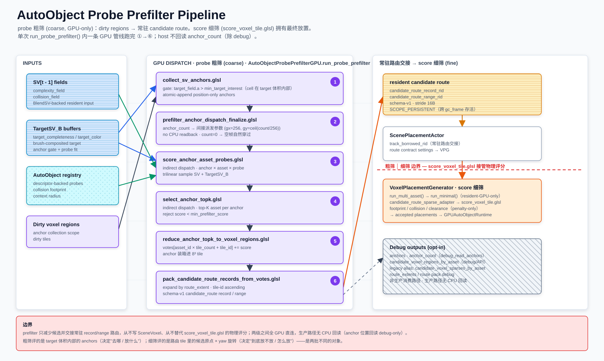

# AutoObject Probe Prefilter

本文记录 AutoObject probe 粗筛的当前实现契约。粗筛从 `TargetSV_B` 目标体积内部提取 position-only anchors（唯一门控 `target_field.a > min_target_interest`），用 descriptor-backed semantic probes 给可用 `AutoObject` 打分，归约成 per-asset 候选体素区域，并以 GPU 常驻 `candidate_route_records` / `candidate_route_ranges` 缓冲交接给放置阶段。最终物理可放置性仍由 `score_voxel_tile.glsl` 精筛（score 细筛）。




当前实现已稳定：GPU pipeline、Host、Anchor、Probe source、Candidate regions、Route profile debug 均已实现，CPU scoring path 已删除。以下输入/输出契约仅作为架构参考。

## 两级漏斗：probe 粗筛 → score 细筛

放置走两级漏斗，本 demo 只负责第一级（probe 粗筛）：

| 级别 | 子系统 | 对象 / 粒度 | 手段 | 产出 |
| --- | --- | --- | --- | --- |
| **probe 粗筛** | `AutoObjectProbePrefilterGPU.run_probe_prefilter` | 每 anchor × 每 asset | probe 三线性采样打分 + top-K + `min_prefilter_score` 阈值 | 候选体素区域 → 常驻 record/range 路由 |
| **score 细筛** | `VoxelPlacementGenerator.run_minimal` → `score_voxel_tile.glsl` | 路由 tile 内每候选原点 × 每 yaw 旋转 | collision 采样 / clearance（penalty-only） | 被接受的放置 |

边界：粗筛只减少候选、决定"去哪 / 放什么"，从不写 `SceneVoxel`、从不替代 `score_voxel_tile.glsl` 的物理评分；细筛决定"到底放不放 / 怎么放"。两级之间靠 GPU 常驻 `candidate_route_records` / `candidate_route_ranges` 缓冲交接，生产路径无 CPU 回读（anchor 位置回读 debug-only）。粗筛评的是 target 体积内部的 anchors，细筛评的是路由 tile 里的候选原点——是两批不同的对象。

## 运行方式

> **@tool 编辑器模式，禁止 F6。**
>
> 在 Godot 编辑器中双击打开 `.tscn` 场景文件即可。脚本在编辑器视口中实时运行。
> F6（Run Current Scene）和 F5（Run Project）被 `core_demo_contract_fixture.gd` 守卫代码禁止。

## 输入 / 输出

### 输入

| 数据 | 来源 | 用途 |
| --- | --- | --- |
| `SV[t - 1].complexity_field` | BlendSV-backed resident scene query channel | probe 场景复杂度采样（"已有内容"拟合）；不再参与 anchor 门控。 |
| `SV[t - 1].collision_field` | BlendSV-backed resident collision query channel | anchor / probe collision sampling。 |
| `target_completeness` | `TargetSV_B` complexity / collision read buffer | target demand 与 probe collision fit。 |
| `target_color` | `TargetSV_B` packed RGBA8 color / complexity | probe color / complexity fit。 |
| `autoobjects` | 当前可用 asset registry | 提供 semantic probes、collision samples、context radius。 |
| `voxel_sparse_ids` | dirty voxel regions / dirty tiles | 限定 anchor collection 的更新范围。 |

`TargetSV_B` 是 `TargetSV + BrushSV` 的 brush-composited read buffer，只作为 prefilter / routing / scoring / result feedback 的 target 输入。源 `TargetSV` 与 `BrushSV` 需要独立保存，便于重建 `TargetSV_B`。

### 输出

输出字段含义维护在 `scripts/autoobject_probe_prefilter_gpu.gd` 的 `_decode_results()` 和 `_empty_result()` 返回字典旁。

## GPU Pipeline

单次 `run_probe_prefilter()` 内一条 GPU 管线跑完，host 不回读 `anchor_count`（除 debug）：

```text
dirty voxel regions / dirty tiles
  -> collect_sv_anchors.glsl                       # 收集 target 体积内部 anchors（atomic append）
  -> prefilter_anchor_dispatch_finalize.glsl       # anchor_count -> 间接派发参数（无 CPU 回读）
  -> score_anchor_asset_probes.glsl                # 间接派发；每 anchor x asset probe 采样打分
  -> select_anchor_topk.glsl                       # 间接派发；每 anchor 选 top-K asset
  -> reduce_anchor_topk_to_voxel_regions.glsl      # top-K 聚合成 [asset x tile] 稀疏投票
  -> pack_candidate_route_records_from_votes.glsl  # 按 route radius 膨胀，产出 schema-v1 record/range
  -> 常驻 candidate_route_record_rid / candidate_route_range_rid（SCOPE_PERSISTENT，交接放置阶段）
```

`tile_summaries_rid` 有效时，pack 启用 summary 空 tile 过滤（`use_summary_filter`，跳过无 scene/collision 内容的 vote center；原独立 expand shader 已并入 pack）。anchor 位置数组 / count 回读是 debug-only（`debug_read_anchors`，用于 `result["anchors"]` 可视化），默认关闭，路由路径全 GPU-first。

Shader 职责：

| Shader | 职责 |
| --- | --- |
| `collect_sv_anchors.glsl` | 从 dirty tile / voxel 收集统一 position-only anchors；唯一门控 `target_field.a > min_target_interest`（cell 在 target 体积内部），atomic-append 进 anchor 缓冲。 |
| `prefilter_anchor_dispatch_finalize.glsl` | 单线程把 GPU 常驻 `anchor_count` 转成 score / top-K 的间接派发参数（`gx = 256`，`gy = ceil(count / 256)`）；`count == 0` -> 0 组 -> 空帧自然穿过，host 永不回读。 |
| `score_anchor_asset_probes.glsl` | 每个 anchor / asset 组合按 probes 采样 `SV` 与 `TargetSV_B` buffer，输出 asset score。 |
| `select_anchor_topk.glsl` | 为每个 anchor 选择 top-K assets（低于 `min_prefilter_score` 的 asset 被拒绝）。 |
| `reduce_anchor_topk_to_voxel_regions.glsl` | 把 anchor top-K 聚合成 `voxel_sparse_votes[asset_id * tile_count + tile_id]`。 |
| `pack_candidate_route_records_from_votes.glsl` | 把 dense votes 按 route radius 标记膨胀后输出 schema-v1 `candidate_route_records` / `candidate_route_ranges`，作为常驻 GPU 路由交接给放置阶段。 |

`reduce_anchor_topk_to_voxel_regions.glsl` 只聚合 anchor 所在 tile vote。collision 采样、probe offset、context radius 和 interpolation guard 的膨胀由 `pack_candidate_route_records_from_votes.glsl` 依据每 asset 的 `route_extent` 在 GPU 内完成。

GPU route pack 的 record 顺序是 per-asset tile-id ascending（`candidate_set_equivalent_not_score_sorted`，非按分排序）。产出的 `candidate_route_records` / `candidate_route_ranges` 是 SCOPE_PERSISTENT 常驻缓冲，跨 `gc_frame()` 存活并交接给放置阶段；旧的 CPU vote-entry pack 与 CPU 候选路由消费路径已删除（候选路由 = resident-GPU-only）。

## Anchor 规则

当前 anchor 是 position-only：

```text
anchor_buffer[i] = uvec4(voxel_x, voxel_y, voxel_z, 0)   # 位置本身承载放置含义，无 anchor_kind
```

唯一门控（Houdini `Pipeline.hip` 对齐，`i@anchor = volumesample(targetVol, 0, P) > 0` 的 GPU 孪生），不再写入或区分 `ground` / `target_top` kind：

- **cell 在 target 体积内部**：`target_field[idx].a > min_target_interest`（`.a` = completeness = `max(complexity, collision)`）。

旧的 scene-occupancy / collision / support-below 门控已删除：score 阶段已惩罚 collision/overlap 并强制物件间距，anchor 阶段再测一遍属冗余（还多一次 field 读 + 一次下方邻居探测）。最终物理约束仍由 placement collision-sample scoring 确认；`ground` / `target_top` 名称只作为配置输入同义词归一到 `anchor`。

## Probe 规则

Probe 通过 `AutoObject.get_semantic_probes(density)` 获取，通常来自 `AssetDescriptor.semantic_probe_profile`。当前 prefilter 不从 `object_type` 推导语义，也不使用 `object_subtype`。

Probe packed 字段含义维护在 `scripts/semantic_probe_profile.gd` 的 probe record 构造和 `scripts/autoobject_probe_prefilter_gpu.gd` 的 probe packing 代码旁。

采样越界时，`score_anchor_asset_probes.glsl` 会把 sample position clamp 到 grid 内，再读取 `complexity_field`、`collision_field`、`target_completeness` 与 `target_color`。这同样适用于 `TargetSV_B` 边界：边界外不会直接视为空白。

### Probe 评分公式 (`eval_probe`)

每个 probe 的 sample position 为 `sp = anchor_pos + round(offset * inverse_voxel_size)`，clamp 到 grid 内。

**没有分支判定**——所有 probe 使用统一的加权求和公式，行为通过三个 per-metric 权重 `w_color`、`w_complexity`、`w_collision` 控制。

#### 三个 Fit 分量

| Fit 分量 | 公式 | 含义 |
| --- | --- | --- |
| color_fit | `1 - dist(target.rgb, expected.rgb) / sqrt(3)` | 颜色越接近目标越高 |
| complexity_fit | `1 - \|target.a - expected_complexity\|` | 复杂度越接近目标越高 |
| collision_fit | `1 - \|target.a - expected_collision\|` | 碰撞强度越接近目标越高 |

#### 评分公式

```text
probe_score = w_color × color_fit + w_complexity × complexity_fit + w_collision × collision_fit
```

权重为 0 的分量不参与计算。

#### 典型权重配置

| 用途 | w_color | w_complexity | w_collision | 说明 |
| --- | --- | --- | --- | --- |
| 通用 | 1.0 | 1.0 | 1.0 | 三项等权 |
| 纯碰撞（地面/支撑） | 0.0 | 0.0 | 1.0 | 只关注实体占位 |
| 纯视觉 | 1.0 | 0.5 | 0.0 | 关注颜色和复杂度 |
| 空旷区域 | 0.0 | 0.1 | 0.0 | 期望低值 → 低复杂度位置得高分 |

#### GPU 数据布局（2 × vec4 = 32 字节 / probe）

```text
d0 = (offset.x, offset.y, offset.z, w_collision)
d1 = (rgba8_bits, expected_collision, w_color, w_complexity)
```

### Per-anchor 聚合

每个 anchor × asset 组合遍历该 asset 的所有 probe：

```text
asset_score = Σ probe_score_i    for all probes i
```

16 个 probe lane 通过 shared memory 并行归约。结果写入 `asset_scores[anchor_id * 256 + asset_id]`。

### Top-K 选择

`select_anchor_topk.glsl` 为每个 anchor 从 256 个 asset 评分中选出 top-4：

```text
anchor_topk[anchor_id * 4 + k] = uvec2(asset_id, floatBitsToUint(score))
```

- Thread 0 串行选择，每次挑最高分，标记已选（-2.0）再选下一个
- `0xFFFFFFFF` 表示空槽位，`score < 0` 表示被拒绝
- `min_prefilter_score` 可以全局过滤低分 asset

### Top-K Readback（可选）

调用 `run_probe_prefilter()` 时传入 `target_read_buffers = {"debug_readback_topk": true}` 可读回每个 anchor 的 top-K 数据，结果在 `result["anchor_autoobject_topk"]` 中，格式为 `{anchor_id: [{asset_id, score, rank}]}`。Anchor Collection 演示场景使用此选项实现点击 anchor 查看 top-K 信息。

## Context Sensing

小型资产可通过 descriptor 或 descriptor fields `context_sensing_radius` 扩大候选 route 的覆盖范围：

- probe 本身仍参与 prefilter score。
- `context_sensing_radius` 会进入 route profile，扩大 readback 后的 candidate voxel regions。
- 该扩张是召回保护，不是最终放置判定。

典型用途：小草、灌木等 mesh AABB 较小的资产，需要读取周围残余 `TargetSV_B` 信号，避免只在 anchor tile 内生成候选。

## Candidate Region Expansion

`autoobject_probe_prefilter_gpu.gd` 为每个 asset 构建 route profile：

```text
tile_radius = collision-sample bounds
            + semantic probe offset bounds
            + context_sensing_radius
            + interpolation_guard_voxels
```

当前保证：

- `interpolation_guard_voxels` 至少为 `1`。
- route extent 使用 `get_collision()` 直接求界的 collision-sample bounds（`collision_min` /
  `collision_max`，含容器烘焙会追加的 clearance 行余量 +1y；无中间烘焙层）。
- route extent 使用 semantic probe offset bounds。
- `candidate_route_extents` 暴露这些值用于 debug。
- 扩张后的 docs-facing 结果写入 `candidate_voxel_regions_by_asset`，作为 debug/API 输出；旧 `candidate_voxel_sparses_by_asset` 只作为 legacy/debug alias。
- 默认 `candidate_route_handoff_payload` 由 CPU vote-entry pack 生成，保持 score-sorted route order。
- 启用 `use_gpu_candidate_route_pack` 或同义 option 时，`candidate_route_handoff_payload` 可由 GPU route pack pass 生成，metadata 标记 `source_label = "gpu_vote_buffer_gpu_pack"`、`score_order_preserved = false`。

相关测试覆盖 `candidate_routes_expand_for_probe_collision_context_guard`。

## 与 Placement 的关系

```text
prefilter 常驻 candidate_route_record_rid / candidate_route_range_rid（schema-v1，SCOPE_PERSISTENT）
  -> ScenePlacementActor 常驻路由交接（track_borrowed_rid + 路由契约 settings）
  -> VoxelPlacementGenerator.run_multi_asset() -> run_minimal()   # 候选路由 = resident-GPU-only，无 CPU fallback
  -> optional same-type exclusion
  -> candidate_route_sparse_adapter.glsl 展开候选稀疏 tile
  -> score_voxel_tile.glsl                                        # score 细筛：collision 采样 / clearance
  -> accepted placements
  -> optional GPUAutoObjectRuntime writeback（GPU-direct 常驻）
  -> optional scene_voxel_committer（state-chain stamp 原位提交）
  -> instance_stamp_writeback
  -> dirty SceneVoxelTile / commit_scene_voxels()
```

`candidate_voxel_regions_by_asset`（及 legacy `candidate_voxel_sparses_by_asset` alias）现为 debug / API 输出，不是生产消费路径。

边界：

- prefilter 只减少候选，不直接写入 scene。
- `candidate_route_extents` 不参与 physical score。
- 空 candidate regions 表示该 asset 本轮 skip，不回退 full grid。
- `score_voxel_tile.glsl` 仍负责 collision 采样、clearance、target coverage 和 target color fit（资产形状读 profile 容器常驻 `collision_records`）。
- `score_voxel_tile.glsl` 不做 semantic dot、MLP、`semantic_score` 或 `route_score`。
- runtime writeback 和 `instance_stamp_writeback` 是 accepted placement 之后的显式 opt-in；prefilter 本身不拥有 runtime object state 或 committed SV source。

## TargetSV_B Source 边界

`TargetSV_B` 是 guidance / target 输入，不是 committed source voxel stream：

- `target_completeness` 和 `target_color` 从 `TargetSV_B` 映射而来。
- `TargetSceneVoxel` guidance record 会跳过 source buffers。
- committed `SceneVoxel` 由 stamp（VPG state-chain / CPU 入口盖章）和 `commit_scene_voxels()` 发布，纯 auto；brush 内容在 SPA 常驻 `BrushSV` 层。

更完整的目标画布说明见 [`target-scene-voxel-projection.md`](target-scene-voxel-projection.md)。

## Debug 输出

Debug 输出字段含义维护在 `scripts/autoobject_probe_prefilter_gpu.gd` 的 readback 返回字典旁。

`best_autoobject_id`、`best_probe_score`、`rejected_reason` 等 overlay 信息可以后续扩展，但不是当前 readback 主契约。

## TODO / Open Questions

- 把 CPU debug view 迁移为 actor 生命周期内的 GPU resident route buffer。
- 保持 `candidate_voxel_regions_by_asset` / `candidate_voxel_regions` 为文档和高层接口命名；旧 `sparse` key 只描述兼容 alias。
- Route validation / semantic rerank / MLP 只作为候选内二次验证计划，不能绕过 upstream prefilter。
- 是否增加 tile summary / mip / feedback priority。

## 测试场景

| 场景 | 说明 | Godot 场景 |
| --- | --- | --- |
| [Prefilter 总览](res://demos/placement-autoobject-probe-prefilter/autoobject-probe-prefilter.md) | 本文即该 demo 的测试文档 | [`placement-autoobject-probe-prefilter.tscn`](res://demos/placement-autoobject-probe-prefilter/placement-autoobject-probe-prefilter.tscn) |
