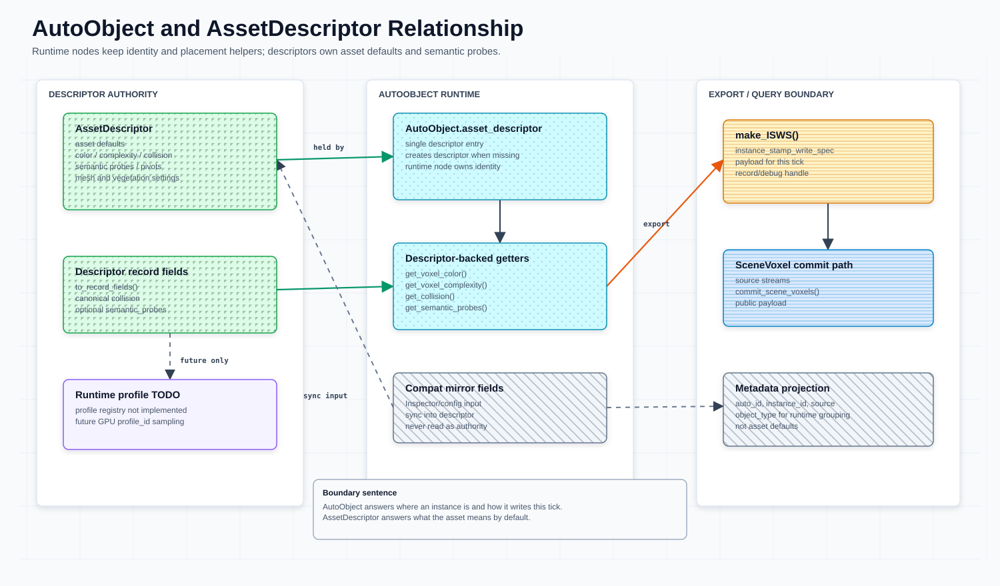

# Asset Properties





本文是资产字段、descriptor 入口、runtime write record 和 metadata 边界的速查。`AssetDescriptor` 的统一定义见 [`asset-descriptor.md`](asset-descriptor.md)；源码已在 export 字段旁维护逐项含义，本页只写跨层契约和归属边界。

## 核心规则

- [`AssetDescriptor`](asset-descriptor.md) 是所有资产种类默认体素语义的 canonical source；`AutoVoxelProfile` 只作为已有资产 / 导入 preset fallback 进入同一 shared-field 归一化路径。
- `AssetDescriptor.collision` 是权威字段；新 config、descriptor record 和 shared fields 只读写 `collision`。
- `SharedPropertyType.SHARED_FIELD_KEYS == ["color", "complexity", "collision"]`。
- `channel` 不进入共享语义。
- `AutoObject` 上的同名 mirror 和 metadata 只用于 Inspector、查询和调试；语义读取走 descriptor-backed getters。
- `instance_stamp_write_spec`（`ISWS`）是本轮实例 / stamp 写入 `SV` / `SceneVoxel` 的 payload 和查询 handle，不是资产默认语义容器；当前源码统一用 canonical `instance_stamp_write_spec` 变量、函数和 metadata key，仅保留 `voxel_write_spec` metadata key 作为 legacy read-compat alias。
- committed `SceneVoxel` 只接受 `complexity` / `color` / `collision`，可选 `auto_mix`；`channel`、`occupied`、`type`、`source_type`、`commit_tick` 和 record id 留在 source/debug buffers、object-ref index 或 debug view。
- `AutoVoxelRuntimeProfileContainer` 是 GPU-first profile 注册 / staging / upload 入口；CPU 只负责 descriptor 归一化、staging 和 debug readback，不能把未上传或非 resident debug snapshot 写成 runtime resident success。

## 范围与生命周期

| 项 | 当前契约 |
| --- | --- |
| 职责 | 说明 asset defaults、descriptor-backed getter、shared fields、`ISWS` 和 metadata 的字段归属。 |
| 输入 | `.tres` / `.tscn` 资产、脚手架 JSON、Inspector config、`AutoVoxelProfile` fallback。 |
| 输出 | descriptor-backed shared fields、runtime `ISWS` record、metadata handle、committed `SceneVoxel` accepted fields。 |
| 生命周期 | author / scaffold -> descriptor 或 descriptor-backed asset 保存 -> `AutoObject` 读取 descriptor -> VPG state-chain stamp 原位提交 -> `commit_scene_voxels()` 发布 committed `SceneVoxel`（stamp-only 提交；`ISWS` record 由运行时生成并附着实例，CPU 盖章链已删）。 |
| Source of truth | 资产默认值在 `AssetDescriptor`；shared schema 在 `SharedPropertyType`；committed runtime read model 在 `SceneVoxelCommitter`。 |
| Placement 边界 | placement 读取 descriptor-backed asset defs、collision 采样、candidate regions 和 `ISWS`，但不定义资产默认字段，也不把 candidate regions 当作 committed `SceneVoxel`。 |
| Core runtime 边界 | `SceneVoxel` source / commit / resident buffers 由 `scene-voxel-field-system.md` 维护；本文只维护资产字段到 runtime record 的交接。 |
| GPU runtime 边界 | GPU runtime 通过 descriptor-backed getters、profile staging、prefilter packing 和 VPG runtime/profile contract 消费资产语义；profile container 不能替代 descriptor/profile source assets。 |

## 类型边界

| 类型 | 职责 | 文件 |
| --- | --- | --- |
| `AssetDescriptor` | 所有资产种类的默认语义 descriptor；字段定义见 [`asset-descriptor.md`](asset-descriptor.md) | `scripts/asset_descriptor.gd` |
| `AutoObject` | 运行时节点、实例身份、descriptor 入口、placement helper、`instance_stamp_write_spec` / `ISWS` 构造 | `scripts/auto_object.gd` |
| `SharedPropertyType` | `color` / `complexity` / `collision` 的归一化、record 和 `SceneVoxel` 传播 | `scripts/shared_property_type.gd` |
| `AutoAssetFactory` | 脚手架和导入 helper；创建 descriptor / profile fallback / descriptor-backed asset；通过当前 helper 输出 `ISWS` record | `scripts/auto_asset_factory.gd` |

## Descriptor 字段

Descriptor 字段、归一化入口和 authoring 规则统一维护在 [`asset-descriptor.md`](asset-descriptor.md)。本页只保留跨层交接：descriptor 输出 shared fields / profile payload；`AutoObject`、metadata、`ISWS`、runtime profile 和 committed `SceneVoxel` 都不能反向成为资产默认语义来源。

## AutoObject 边界

`AutoObject` 可以接收已有 config 和 Inspector 字段，但运行时语义读取必须通过 descriptor-backed getter。

`AutoObject` export / runtime 字段的逐项含义已迁移到 `scripts/auto_object.gd` 顶部声明；getter 的 descriptor-backed 读取来源保留在对应函数体中。

当前边界：

- `configure_auto_object()` 接收 `color` / `complexity` / `collision`，归一化后同步到 descriptor。
- `get_voxel_color()`、`get_voxel_complexity()`、`get_collision()`、`get_semantic_probes()` 是运行时读取语义的稳定入口。
- `set_instance_stamp_write_spec()` / `get_instance_stamp_write_spec()` 是 canonical API，直接操作同一个 `ISWS` record（CPU 构造工厂 `make_*_instance_stamp_write_spec()` 与旧 `*_voxel_write_spec()` 方法名均已移除）。
- `source_voxel_type`、`source_kind`、`producer_stage`、`position`、`rotation_degrees`、`scale`、`base_pixel` 和 `channel` 属于 write record 上下文，不是 descriptor 默认语义。

不要在新逻辑中把 `voxel_color`、`voxel_complexity`、metadata 或 `ISWS` 当作 descriptor 的替代来源。

## 共享字段契约

当前共享字段只包含 `color`、`complexity` 和 `collision`；逐项注释维护在 `scripts/shared_property_type.gd` 的 `SHARED_FIELD_KEYS` 声明旁。

`SharedPropertyType.normalize_shared_fields()` 会同步 `color.a == complexity` 并归一化 `collision`。`apply_to_record()` 和 `apply_to_scene_voxel()` 只传播这些共享字段。

| 不共享字段 | 原因 |
| --- | --- |
| `channel` | single-voxel channel tag，不是资产默认语义。 |

## Probe 采样（Semantic Probe Sampling）

Probe 采样是 GPU prefilter 阶段（`shaders/score_anchor_asset_probes.glsl`）对每个 anchor×asset 组合执行的核心评分逻辑。每个 probe 是 Profile Arena 里的一条 coarse `ProfileSample`，定义相对 asset anchor 的采样期望；GPU 在场景/目标体素场的同一线性索引处采样并评分。

### 采样目标缓冲区

采样点由 `resolve_profile_sample_voxel(sample, anchor_pos, …)` 求出；`profile_sample_in_bounds()` 不通过时该 sample **直接 `continue` 跳过**（没有 clamp 到最近有效体素这一步）。通过后按同一个体素线性索引读以下 `set = 0` binding：

| binding | Shader 标识 | 类型 | 说明 |
| --- | --- | --- | --- |
| 2 | `profile_arena.words[]` | `readonly buffer<uint>` | 固定槽位 Profile Arena，Header/Samples/Pivots/MeshDescription 的**唯一** binding。probe 经 `decode_profile_sample(profile_arena_sample(slot_index, i))` 解出。 |
| 3 | `scene_complexity_rgba8` | `readonly buffer<uint>` | 当前场景场，packed RGBA8，每体素 1 个 u32；`.rgb` = 场景颜色，alpha 低字节 = scene complexity。 |
| 4 | `scene_collision_u32` | `readonly buffer<uint>` | 当前场景 collision，低字节量化 0..255。 |
| 5 | `target_field_rgba8` | `readonly buffer<uint>` | 目标引导场（TargetSV_B），与场景场同格式：`.rgb` = 目标颜色，alpha 低字节 = completeness。 |
| 6 | `target_collision_u32` | `readonly buffer<uint>` | 目标 collision，低字节量化 0..255。 |

反量化统一走共享的 `unpack_profile_sample_rgba8` / `* (1.0/255.0)`。

⚠ 早期版本把 complexity 与 collision 合并为一个 `complexity_coll` `vec2` buffer、目标场为 fp32 `vec4`（16 B/体素）；按那份契约写的绑定会读错 buffer 数量与尺寸。

### 评分通道与计算公式

probe 不再有 `flags` 位掩码或 `kind` 分支：shader 对每条 coarse sample 统一调用
`evaluate_profile_sample(sample, fields, PROFILE_SAMPLE_POLICY_COARSE_MATCH)`。三项 fit 定义在
`scripts/utils/placement_shared_glsl.gd`：

```text
color_fit      = 2 * (1 - distance(target.rgb, expected_color.rgb) / sqrt(3)) - 1
complexity_fit = 2 * (1 - abs(target.a - expected_complexity)) - 1
collision_fit  = 1 - abs(max(target_collision, current_collision) - expected_collision)
```

`color_fit` / `complexity_fit` 重映射到 `[-1, 1]`（完全不匹配时为负分，可拉低总分）；`collision_fit`
取目标与当前场景 collision 的 `max()`，而不是目标场的 alpha。

单条 sample 的贡献：

```text
contribution = sample_weight * dot(semantic_weights, vec3(color_fit, complexity_fit, collision_fit))
```

`semantic_weights = (w_color, w_complexity, w_collision)`，`sample_weight` 来自 record 的
`offset_weight.w`——两者都参与相乘，漏掉 `sample_weight` 会得到错误量级。旧的
`empty_fit` / `support_fit` 分支、`kind = positive/negative/support` 与「地下场景跳过非 collision
probe」的特判在当前 shader 中都不存在；support 探针已在 anchor 阶段判定后取消
（见 `scripts/asset_descriptor.gd` 顶部注释）。

### 度量权重

probe 的评分启用项由三个浮点权重表达，而不是位掩码：

| 权重 | 作用 |
| --- | --- |
| `w_color` | `color_fit` 的权重 |
| `w_complexity` | `complexity_fit` 的权重 |
| `w_collision` | `collision_fit` 的权重 |

权重为 0 即等价于关闭该项。默认值由 `SemanticProbeGenerator.make_probe()` 写入（缺省均 1.0，见
`scripts/semantic_probe_generator.gd`）。

⚠ 另有一套**同名不同义**的 sample flags（`SAMPLE_FLAG_COARSE` / `FINE` / `CLEARANCE` /
`STAMP_WRITE` / `SCORE_ONLY`，定义在 `scripts/utils/profile_record_schema.gd`）——它们标记
sample 参与哪个阶段，不是评分通道开关，勿与上表混淆。coarse pass 只消费带
`PROFILE_SAMPLE_FLAG_COARSE` 且 `sample_weight > 0` 的 sample。

### 评分汇总流程

GPU 以 workgroup `(16, 16, 1)` 并行处理：`local_x` 为 asset lane（`ASSET_LANES = 16`），`local_y` 为 probe lane（`PROBE_LANES = 16`，跨步遍历该 asset 的 coarse sample 段）。各 lane 累加 `lane_score`，经 shared memory 归约后写入：

```text
asset_scores[anchor_id * asset_stride + asset_id]
```

`asset_stride` 由 push constant `voxel_size_inv.w` 传入（不是硬编码的 256）；`asset_count = min(grid_size_asset_count.w, asset_stride)`。

`min_prefilter_score` **不在本 pass 生效**，它只在 Pass B（`shaders/select_anchor_topk.glsl`）里把低分候选压成 `-1.0`。该 pass 对每个 anchor 选 `TOPK = 4` 个 asset，按运行时 `asset_count` 遍历（`asset_stride` clamp 到 256 是容量上限，不是遍历量），结果经常驻 `anchor_candidate_handoff` 直接交接细筛（旧 `reduce_anchor_topk_to_voxel_regions.glsl` 区域聚合已随 candidate route 删除）。

---

`ISWS` 是实例本轮写入场景体素系统的 stamp payload / record，不是资产默认值表，也不是 profile cache。当前数据流保持为：

```text
AssetDescriptor / AutoVoxelProfile
  -> SharedPropertyType
  -> ISWS record
  -> source voxel write path
  -> committed SceneVoxel
```

`ISWS` record 由运行时 placement / writeback 生成（CPU 构造工厂已删）。`channel` 可作为 object 或 vegetation placement 的 write context 出现在 record 中，但不因此变成 shared field。prefilter 传入的 candidate regions 只限制 placement 搜索范围；只有 VPG state-chain stamp 和 `commit_scene_voxels()` 才会发布 committed `SceneVoxel`。

committed `SceneVoxel` 的 accepted fields 是 `complexity`、`color`、`collision`，可选 `auto_mix`。`channel` 只作为 write context 输入，不进入 committed read model；查询缓存、占用状态、source 类型、commit tick 和 record id 属于 SV resident state、source/debug buffers、object-ref index 或 debug view。

## Metadata 规则

Metadata 只保留索引、回查和调试入口。当前 `AutoObject._sync_auto_metadata()` 写入 `auto_id` 与 `instance_id`；`set_instance_stamp_write_spec()` 写 canonical metadata key `instance_stamp_write_spec` 暴露 `ISWS` handle（旧 key `voxel_write_spec` 仅作 read-compat alias 保留），spec 自身只携带 canonical `instance_id`。

`auto_source`、`object_type`、`object_subtype` 等来源 / 分组字段可以存在于 `ISWS` record 或 debug record 中，但不要新增一套 metadata 语义镜像。新增资产语义字段时优先进入 [`AssetDescriptor`](asset-descriptor.md)。

`object_type` 保留为 placement、same-type exclusion、GPU runtime record 和 debug record 的粗粒度类型字段。已有 `object_subtype` 只作为 compatibility / debug metadata；新 schema 不新增 `object_subtype`，更细的资产差异应进入 `AssetDescriptor` / runtime `profile_id`。

## Runtime Profile Contract

`AutoVoxelRuntimeProfileContainer` 负责把 descriptor/profile 数据归一化为 profile id、probe/collision/pivot ranges 和 staging/debug table。它属于 GPU-first runtime contract 的 profile 入口；GDScript 字典、数组和 debug snapshot 只用于上传准备或回查，不是 CPU 替代路径。

当前 GPU-first profile flow：

```text
AssetDescriptor
  -> AutoVoxelRuntimeProfileContainer.register_descriptor()   # 归一化 + 打包，无中间 profile 资源
AutoVoxelRuntimeProfileContainer
  -> GPU storage buffer upload / readback debug snapshot
shader / SV 通过 profile_id 采样资产 profile
```

热更新时，`AutoVoxelRuntimeProfileContainer.dirty_profile_ids` 标记受影响 profile；将其反查为 GPU live object refs 的 runtime 路径当前未提供，受影响对象以 dirty delta 走 runtime 侧 `GPUAutoObjectRuntime.flush_to_scene_voxel_committer(tile_store)`，由 tile store 侧的 `SceneVoxelTileStore.try_apply_gpu_autoobject_object_ref_update_pass()`（常驻 buffer 变体 `…_from_buffer()`）映射为 `SceneVoxelTile` dirty。`SceneVoxelCommitter` 上没有 `apply_gpu_autoobject_dirty_delta()` 这样的入口。该路径仍只把 CPU 用作 control / debug plane，不恢复 CPU runtime fallback。

开放问题：

- 常驻策略是加载即注册、场景引用注册，还是按 asset library 预热。
- 无 RenderingDevice 时只能 SKIP GPU upload / placement 验证，不能改走 CPU 替代路径。

## 相关文档

- `asset-descriptor.md`：`AssetDescriptor` 的统一定义、字段分组和 authoring 规则。
- [`scene-voxel-field-system.md`](scene-voxel-field-system.md)：`instance_stamp_write_spec` / `ISWS`、source voxel、committed `SceneVoxel` 和 SV resident collision field。
- `asset-semantic-probes.md`：descriptor-backed semantic probes。
- `auto-asset-scripting.md`：`AutoAssetFactory` 的 JSON 输入。
