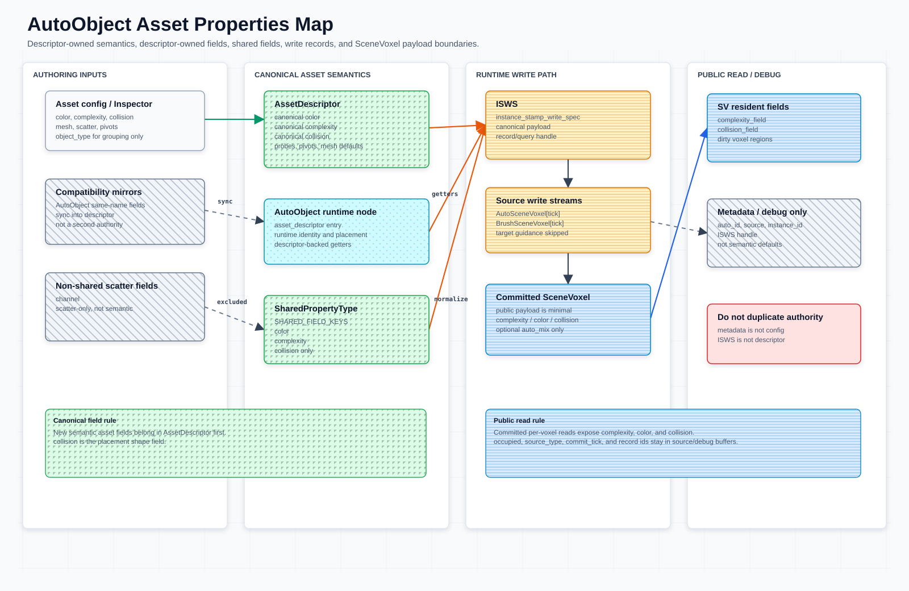
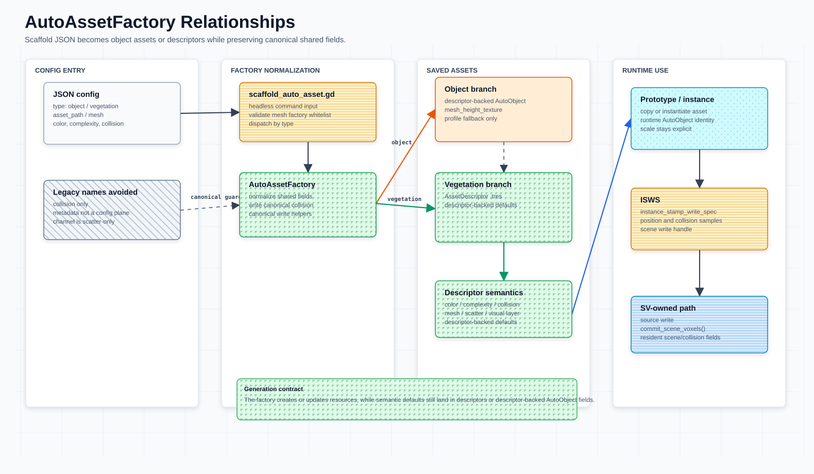

# Auto Asset Scripting

这份文档把新增通用物体 / 新增植被的手工步骤收拢到脚本入口，并同步当前字段契约。所有资产种类的默认语义定义见 [`asset-descriptor.md`](asset-descriptor.md)。





| File | Purpose |
| --- | --- |
| `scripts/auto_asset_factory.gd` | mesh 加载 helper（`load_mesh` / `load_source_mesh`：mesh 树查找、UE collision-helper 过滤、变换烘焙）。 |
| `scripts/auto_object.gd` | canonical descriptor 创建（`create_asset_descriptor`）与实例 ISWS 附着（`set/get_instance_stamp_write_spec`；CPU 构造工厂已于 2026-08-10 删除）。 |
| `scripts/asset_descriptor.gd` | 持久化 descriptor-backed `AutoObject` 资产默认语义，并保存 mesh / scatter / visual helper。 |

## 核心契约

- [`AssetDescriptor`](asset-descriptor.md) 是资产默认体素语义的 canonical source；脚本化资产不要把 profile 或 metadata 当成第二套权威。
- `AutoVoxelProfile` 只作为已有资产 / 导入 preset fallback；新脚手架不再输出单独的 profile 产物。
- 物体和植被都走 descriptor-backed `AutoObject` / `AssetDescriptor` 路径；旧 typed 子类不再作为资产定义入口。
- 运行时写入 payload 统一称为 `instance_stamp_write_spec` / `ISWS`；由运行时 placement / writeback 生成并经 `AutoObject.set_instance_stamp_write_spec()` 附着（脚本侧 CPU 构造工厂已删除）。

## 范围与生命周期

| 项 | 当前契约 |
| --- | --- |
| 职责 | 将手写 object / vegetation 资源步骤收拢到 `AutoAssetFactory` 静态 helper。 |
| 输入 | JSON config、已有 mesh / `mesh_height_texture`、descriptor shared fields。 |
| 输出 | `AutoObject` scene 或 `AssetDescriptor` resource。 |
| 生命周期 | JSON -> factory normalize -> resource write -> runtime load descriptor-backed asset -> GPU placement / source write 构造 `ISWS`。 |
| Source of truth | 脚手架只写入 source assets；运行时默认语义仍以 `AssetDescriptor` / descriptor-backed getter 为准。 |
| Placement 边界 | 脚手架产物可被 object placement、vegetation placement 和 voxel placement 使用；prefilter candidate regions、fine semantic score/constraints 和 commit 不在本文维护。 |
| Core runtime 边界 | `ISWS` 进入 source voxel / committed `SceneVoxel` 的规则见 [`scene-voxel-field-system.md`](scene-voxel-field-system.md)；metadata 只作为查询 handle。 |
| GPU runtime 边界 | `GPUAutoObjectRuntime` / profile container 只消费脚手架产物编译出的 profile；本文不新增 runtime object schema，也不提供 CPU runtime fallback。 |

## 脚本入口

`AutoAssetFactory`（`scripts/auto_asset_factory.gd`）现在只保留 mesh 加载 helper（`load_mesh` / `load_source_mesh`，含 UE collision-helper 过滤和变换烘焙）。descriptor 创建收敛到 canonical `AutoObject.create_asset_descriptor()`（ISWS 的 CPU 构造工厂已删除，记录由运行时生成）。资源落盘直接用 `ResourceSaver.save()`。从编辑器脚本或 `@tool` 节点直接调用即可。

物体 mesh 加载（`AutoObject` 原型）：`AutoAssetFactory` 现在只保留 mesh 加载 helper（`load_mesh` / `load_source_mesh`）。物体资产本身用 `AutoObject` 直接配置，descriptor 语义用 `AutoObject.create_asset_descriptor()` 创建。

```gdscript
# 已有 mesh 存在：geo/cliff_01.FBX、geo/cliff_02.FBX。
var mesh := AutoAssetFactory.load_mesh("res://geo/cliff_01.FBX")
var obj := AutoObject.new()
obj.configure_object({
    "mesh": mesh,
    "mesh_size": 4.2,
    "color": Color(0.55, 0.5, 0.45, 1.0),   # a 与 complexity 同步
    "complexity": 1.0,
    "collision": [],
})
```

植被 / descriptor 资产（`AssetDescriptor` `.tres`）：descriptor 由 canonical `AutoObject.create_asset_descriptor()` 创建，用 `ResourceSaver.save()` 落盘。

```gdscript
var descriptor := AutoObject.create_asset_descriptor(
    Color(0.9, 0.35, 0.5, 0.7),    # entry_color
    0.7,                           # entry_complexity
    0.25,                          # default_radius
    [],                            # collision
)
ResourceSaver.save(descriptor, "res://assets/vegetation/leaf_descriptor.tres")
```

> 上面两段为示意用法，路径也只是示意。**生产 descriptor 不走这条手写路**：它们由 Asset Overview 场景
> 的 bake 链产出到 `res://scenes/asset-overview/baked_descriptors/`（`BakedAssetLoader` 只扫这一个
> 目录，见 [`asset-descriptor.md`](asset-descriptor.md)），新增资产时优先复制那里的现成资源再调整字段。

## 输入规则

下表是 `AutoObject.configure_object()` 实际读取的键。落盘
路径由调用方自己传给 `ResourceSaver.save()`，**没有** `asset_path` / `descriptor_path` 这样的 config 键。
（`AssetDescriptor.make_instance_config()` 这个反向入口**已不存在**：descriptor 不再自己拼一份
config 字典，改由 `configure_object()` 收 `asset_descriptor` 键直接持有资源，见下面「Runtime Use」。）

| 输入 | 规则 |
| --- | --- |
| `asset_id` | 具体资产身份 / debug / profile 去重输入；不是 runtime subtype。 |
| `collision` | canonical 输入；写入 descriptor-backed asset，并作为生成 config 的唯一 collision 字段。 |
| `color` / `complexity` | 进入 descriptor-backed shared fields；`color.a` 与 `complexity` 同步。 |
| `channel` | 植被 scatter channel，不进入 `SharedPropertyType.SHARED_FIELD_KEYS`。 |
| `radius` | 植被 scatter radius；物体只用作 profile fallback 默认半径。 |
| `group` | 实例分组名；`configure_object()` 缺省填 `"placed_objects"`。 |
| `object_type` | 粗分组；`configure_object()` 无条件写成 `"object"`（config 里传别的值会被覆盖）。 |
| `mesh` | 资源 mesh 输入；物体必需，植被可选。 |
| `mesh_height_texture` | 物体高度场 fitting 输入（`Texture2D`）。 |
| `mesh_create_method` | 只用于植被 descriptor 内置 mesh 工厂，必须在白名单中。 |

`AutoAssetFactory` 对 rock 和 vegetation 都只读取 `collision`；旧 `collision_voxels` 不再作为 config fallback。

脚手架只负责生成或更新资产文件，不负责把实例直接写入 `SceneVoxel`。落地到 SV 的生命周期从 runtime 加载这些资源后开始：GPU placement 生成实例，prefilter 只收窄 candidate regions，`AutoObject` 或 placement helper 构造 `ISWS`，再交给 `SceneVoxelCommitter`。

## Object Config

以下 config 只描述 `configure_object()` 接受的字段形状（不是命令行工具的输入）；示意用途，`mesh` 指向已有 `geo/cliff_01.FBX`。

```json
{
  "type": "object",
  "asset_id": "cliff_01",
  "object_type": "object",
  "mesh": "res://geo/cliff_01.FBX",
  "mesh_size": 4.2,
  "color": [0.55, 0.5, 0.45, 1.0],
  "complexity": 1.0,
  "collision": [],
  "random_rotate": [0.0, 1.0],
  "random_scale": [0.8, 1.2],
  "random_height_offset": [-0.5, 0.5]
}
```

产物是一个配置好的 `AutoObject`（含 mesh、随机参数、`asset_id` 和 descriptor-backed shared fields），
存盘路径由调用方决定，不来自 config。

`AutoObject.configure_object()` 会从已有 descriptor 读取 shared fields fallback，再用显式 `color` / `complexity` / `collision` 覆盖并归一化。`color.a` 与 `complexity` 同步；不要把 `voxel_profile` 写成唯一语义权威。

## Vegetation Config

以下同为示意 config；实际在用的 descriptor 见 `scenes/asset-overview/baked_descriptors/Geo_SM_TestLeaf_Test2_descriptor.tres`。

```json
{
  "type": "vegetation",
  "asset_id": "sm_test_leaf",
  "channel": 0,
  "radius": 0.25,
  "color": [0.9, 0.35, 0.5, 0.7],
  "complexity": 0.7,
  "collision": [],
  "visual_layer": 14,
  "group": "placed_leaves",
  "mesh_create_method": "create_sample_autoobject_mesh"
}
```

产物是一个 `AssetDescriptor` 资源（字段分组见 [`asset-descriptor.md`](asset-descriptor.md)），
由调用方 `ResourceSaver.save()` 到任意路径。⚠ 只有落在
`res://scenes/asset-overview/baked_descriptors/` 下的才会被 `BakedAssetLoader` 发现并注册——
存到别处的 descriptor 不进生产链。

`object_subtype` 已**不是** `AssetDescriptor` 的导出字段——它只作为 placement record 的哈希输入残留在 `scripts/scene_placement_runtime.gd`。资产身份请使用 `asset_id`、descriptor 资源路径或运行时 `profile_id`；旧脚手架 JSON 里的 `subtype` 键已从示例中移除。

`mesh_create_method` 白名单保持很小：当前只保留 `create_sample_autoobject_mesh` 作为脚手架示例。如果有外部模型，改用 `"mesh": "res://geo/SM_TestLeaf_Test2.FBX"`。

草、树叶、细枝这类柔性部分保持 `collision: []`。只有粗树干或大块刚体才写带 `collision_strength` 的 collision sample。

## Runtime Use

```gdscript
var leaf_asset := load("res://scenes/asset-overview/baked_descriptors/Geo_SM_TestLeaf_Test2_descriptor.tres") as AssetDescriptor
var obj := AutoObject.new()
obj.configure_object({"asset_descriptor": leaf_asset})
```

（全仓没有 `register_brush_autoobject()` 这样的入口；实例化就是把 descriptor 经 `asset_descriptor`
键喂给 `AutoObject.configure_object()`——它随即 `_sync_exported_fields_from_descriptor()`，
用 `SharedPropertyType.from_descriptor()` 把 color / complexity / collision / pivot_variants /
probe 参数一次性拉到实例上。descriptor 侧**没有**反向的 `make_instance_config()`。）

高度场生成器直接使用 descriptor-backed `AutoObject` 原型。生成结果复制原型并落到场景，运行时从 descriptor-backed 字段派生 `instance_stamp_write_spec` / `ISWS` 并附着到实例（`set_instance_stamp_write_spec()`）。脚本侧的 CPU 构造入口（`make_instance_stamp_write_spec()` 及 `AutoAssetFactory` 上早先的同类 wrapper）已随 CPU 盖章链删除；record 由运行时 placement / writeback 生成。

高度场 / object placement 可以在 record extra fields 中补 `mesh_index`；descriptor-backed `AutoObject` 可以通过 instance config 提供 `channel` 和 `radius`。这些是 runtime record extra，不进入 `SharedPropertyType.SHARED_FIELD_KEYS`。

## Metadata Rule

脚手架和运行时代码不把 metadata 当作第二套配置面。新增资产语义写入 [`AssetDescriptor`](asset-descriptor.md) 或 descriptor-backed `AutoObject` 字段；实例落地后的颜色、collision、像素和 slice 写入 `instance_stamp_write_spec` / `ISWS`。metadata 只保留 id、来源、`object_type`、实例 id 和 `ISWS` 查询入口；`instance_stamp_write_spec` 是 preferred metadata key，旧 `voxel_write_spec` metadata key 只作为兼容别名。

## 相关文档

- `asset-descriptor.md`：所有资产种类的 descriptor 定义、字段分组和 authoring 规则。
- `asset-properties.md`：descriptor、shared fields、metadata 和 `ISWS` 边界。
- `asset-semantic-probes.md`：descriptor-backed probes 的生成来源和 prefilter 交接。
- [`scene-voxel-field-system.md`](scene-voxel-field-system.md)：`ISWS` 写入到 source voxel / committed `SceneVoxel` 的数据流。
