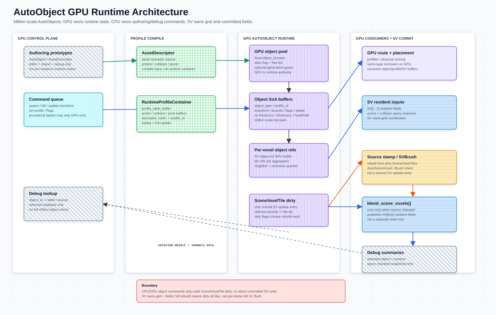

# AutoObject GPU Runtime Architecture

本文整理百万级 `AutoObject` 的 GPU-first 运行时契约。SPA 拥有 `GPUAutoObjectRuntime` 与 `AutoVoxelRuntimeProfileContainer` 的生命周期；`GPUAutoObjectRuntime` 内部持有 GPU object allocator、GPU-resident SoA object buffers 和 dirty delta；object refs 本身住在 `SceneVoxelTileStore` 的 **tile 级固定槽位** buffer 里（每 tile 8 槽），由 dirty delta handoff 更新。运行时对象以 GPU-resident SoA buffers 为权威。CPU 只负责 authoring、profile 注册、直接对象 API 调用、resident 批量 spawn 提交、debug readback 和 snapshot，不保留 CPU placement/runtime 替代实现。

**SPA**（`ScenePlacementActor`）是 MeshFill 运行时编排器，拥有 `AutoVoxelRuntimeProfileContainer` 和默认 `GPUAutoObjectRuntime` 的完整生命周期，借用 `SceneVoxelCommitter` 引用。所有模块通过 SPA 访问 profile container 与 AutoObject runtime GPU buffers，不直接操作容器实例；详见 [`scene-placement-actor.md`](scene-placement-actor.md)。

本文是 runtime contract / architecture 文档。当前 `scripts/gpu_autoobject_runtime.gd`、`scripts/auto_voxel_runtime_profile_container.gd`、`scripts/auto_object.gd`、`scripts/scene_voxel_committer.gd`、`scripts/autoobject_probe_prefilter_gpu.gd`、`scripts/voxel_placement_generator.gd` 和 `scripts/scene_placement_actor.gd` 提供 GPU-first 对象命令/批量写回/debug 入口；GDScript 字典、snapshot 和 debug range 只用于上传准备或回查，不是验收用的 CPU 替代路径。`AssetDescriptor` 定义见 [`asset-descriptor.md`](asset-descriptor.md)；SV commit / resident state 见 [`scene-voxel-field-system.md`](scene-voxel-field-system.md)；tile dirty 规则见 [`scene-voxel-tile.md`](scene-voxel-tile.md)。



## 核心契约

- 当前 GPU-first contract 中，SPA 拥有 `GPUAutoObjectRuntime` 生命周期；`GPUAutoObjectRuntime` 作为 SPA 内部 state component 持有 runtime object state：`object_id`、`object_type`、transform、`profile_id`、bounds、flags 和 previous/current bounds delta。空间索引由 `SceneVoxelTile` 的 tile 级固定槽位 object refs（`object_refs[tile_index * refs_per_tile + slot]`，`refs_per_tile = 8`）承担，不再由 `GPUAutoObjectRuntime` 维护独立的 spatial hash，也**不存在** per-voxel ref buffer。
- CPU 是 control plane：注册 descriptor/profile、准备批量 spawn 输入、保存 snapshot、读取 selected/debug summary；不得为了 debug 长期保留 `BrushSV` / `AutoSV` 的等价内容副本。
- 早期的 command-queue / ID-reservation 控制面（`stage_command` / `flush_command_queue` / `reserve_accepted_placement_object_ids` 等）已删除。当前 `GPUAutoObjectRuntime` 的 spawn 入口**只有两个批量方法**：`spawn_batch_from_accepted_placement_records()`（CPU 记录数组）与 resident 路径 `spawn_batch_from_accepted_placement_gpu_buffers()`（GPU buffer 直连）；对象 ID 由 free-list 直接分配，无预约表。**没有** `spawn()` / `update_*()` / `kill()` 这类单对象方法。
- [`AssetDescriptor`](asset-descriptor.md) 是资产默认语义来源；descriptor 编译为 `AutoVoxelRuntimeProfileContainer` 后，runtime object 只持有 `object_type`、`profile_id` 和实例上下文。descriptor 通过 SPA.register_asset() 注册并即时上传 GPU。
- `object_type` 只用于粗分组、dispatch/exclusion 和 debug；资产差异、probe、collision、pivot 和默认 source 语义由 `profile_id` 指向的 profile 表达。
- `AutoObject` 和 descriptor-backed prototype 只作为 authoring、prototype、import 或 debug 入口；百万级 runtime 不依赖每实例 Godot `Node`。
- `SV` / `SceneVoxelCommitter` 拥有 grid 参数、坐标转换、committed `SceneVoxel`、`SceneVoxelTile` dirty sidecar 和 SV resident `complexity_field` / `collision_field`；GPU AutoObject 只输出 dirty object delta，由 SV owner 映射为 `SceneVoxelTile` dirty 后进入 source range rebuild 和 commit 边界。
- CPU object manager、per-instance Node runtime state、AutoObject direct committed SV write、direct SV resident field upload 和 per-frame full SV flush 都是 deprecated path，不可作为无 RenderingDevice 时的替代通过条件。维护性全量重建必须表达为 mark all `SceneVoxelTile` dirty。

体素与计算术语参见 [`README.md`](README.md#voxel-and-compute-terminology)。`SPA` 即 `ScenePlacementActor`，详见 [`scene-placement-actor.md`](scene-placement-actor.md)。

## 权威边界

| 数据 | 权威来源 | 当前状态 / 说明 |
| --- | --- | --- |
| 资产默认语义 | `AssetDescriptor` | 编辑器和导入侧源数据；字段定义见 [`asset-descriptor.md`](asset-descriptor.md)。不直接进入每实例 GPU record；通过 SPA.register_asset() 注册到 runtime。 |
| Runtime profile | `AutoVoxelRuntimeProfileContainer`（SPA 拥有） | descriptor / profile 去重、`profile_id`、固定槽位 `profile_arena` GPU resident storage（Header/Samples/Pivots 同槽；Mesh 区保留占位不写）；`get_gpu_buffer_summary().runtime_ready` 和 valid buffer RID 是通过条件。SPA 创建并管理 container 生命周期，通过 `get_profile_arena_buffer()` 暴露唯一 buffer RID。旧的 `profile_table` / `profile_sample_records` / `pivot_records` 三 buffer 已在阶段 B 删除，只剩 Arena 一条生命周期路径。 |
| Runtime object state | `GPUAutoObjectRuntime`（SPA 默认拥有） | 运行时对象池、transform、profile id、bounds、flags 和 dirty object delta；`GPUAutoObjectRuntime.flush_to_scene_voxel_committer(tile_store)` → `SceneVoxelTileStore.try_apply_gpu_autoobject_object_ref_update_pass_from_buffer()` 是 SV owner 接收 dirty delta 的入口（`SceneVoxelCommitter` 上没有 `apply_gpu_autoobject_dirty_delta()`）。 |
| Grid / coordinate | `SV` / `SceneVoxelCommitter`（SPA 借用） | `grid_origin`、`voxel_size`、`grid_size`、SV resident fields、tick promotion；GPU runtime 不保存第二套 grid authority。 |
| Dirty tile / commit | `SceneVoxelCommitter` / SV owner | `SceneVoxelTile` dirty flags、source/object range rebuild、SV resident field 持有（stamp 直写目标）和 `commit_scene_voxels()` 发布。 |
| Source writes | placement / VPG stamp path | VPG state-chain stamp 原位双写 committed 常驻 field（CPU 入口盖章链已于 2026-08-10 删除）；`BrushSV` 常驻 SPA 旁路层，仅在 `BlendSV` 读取合成时参与，不进提交。 |
| 绘制载荷 / 点选 OBB | `AutoObjectInstanceRenderer`（`GPUAutoObjectRuntime` 惰性自持） | 从常驻对象 SoA 编译出的 `instance_render` / `instance_pick` / `batch_header` / `instance_dispatch` 四块；按 `revision` 惰性重跑，借用 runtime 的 RD。runtime **不**拥有绘制载荷，两者责任分离；详见 [`auto-object-instance-emit.md`](auto-object-instance-emit.md)。 |
| Debug / editor lookup | CPU control plane | id 映射、标签、selected readback、profile/source path；不镜像资产默认语义。 |

## Debug Ownership: BrushSV / AutoSV

> ⚠ `BrushSV` / `AutoSV` 是**内容面标签**，不是类名——全仓没有叫这两个名字的脚本或 `class_name`。
> `BrushSV` 的实现是 SPA 常驻的 brush field 对（域节点 `BrushSVVolume`），`AutoSV` 就是 committed
> `SceneVoxel` 常驻 field 本身。

`BrushSV` 常驻于 SPA 编排生命周期内（内容面即 SPA 常驻 brush field 对：`write_brush_sv_records()` 写入、`clear_brush_sv()` 清除），并作为 SPA 持久化 / 序列化内容的一部分保存；它不进 committed `SceneVoxel`，只在 `BlendSV` 读取合成时参与。`AutoSV` 即 committed SV 常驻 field（纯 auto），可经 debug readback 作为调试观察面。

因此，调试能力不再依赖 CPU 侧保留一份 `BrushSV` / `AutoSV` 的完整内容镜像。内容型 source of truth 以 SPA 常驻数据、source write / commit 输出和 GPU debug buffer 为准。

CPU 侧如需保留状态，只能保存控制面元数据：

- 资源句柄或引用。
- 生命周期状态。
- dirty 标记。
- 序列化入口信息。
- 必要的 readback 索引或调试定位键。

这些 CPU 元数据不是 `BrushSV` / `AutoSV` 内容本体的权威来源。

## Current GPU-First Contract Points

| Boundary | Current entry | Input | Output |
| --- | --- | --- | --- |
| Authoring entry | `AutoObject.set/get_instance_stamp_write_spec()`（CPU 构造工厂已删，record 由运行时生成） | 运行时 placement / writeback 结果 | 实例附着的 `ISWS` record；不是资产默认语义来源。 |
| Probe prefilter | `AutoObjectProbePrefilterGPU.run_probe_prefilter()` | `SV[t - 1]` fields、`TargetSV_B` read buffers、AutoObjects、dirty tile ids | 常驻 `anchor_candidate_handoff`（anchor / anchor_count / topk buffer；anchors readback debug-only）；旧 docs-facing `candidate_voxel_regions_by_asset` 输出（legacy `candidate_voxel_sparses_by_asset` 仅兼容/debug）已随 candidate route 删除。SPA 构建 autoobjects 数组并注入 profile container 的 borrowed `profile_arena`；per-asset probe range 携带 `(slot_index, coarse_count)`，coarse 段在每个 slot 内从局部下标 0 起算。 |
| Fine placement scoring | `VoxelPlacementGenerator.run_multi_asset()` | scene/collision fields、TargetSV 独立输入对（target_field + target_collision）、asset defs、grid、`anchor_candidate_handoff`、optional runtime/profile GPU buffers | residual-gain 细筛与 placement 约束验收后的 accepted placements、stamp deltas、updated temp scene/collision fields（一条 GPU 链跑完全部 asset）；`write_accepted_placements_to_gpu_runtime=true` 时，VPG 还会把 accepted placements 写入 `GPUAutoObjectRuntime` 并回报 `gpu_autoobject_runtime_writeback`；显式传入 `scene_voxel_committer`（GPU state chain）时，stamp pass 原位提交 committed SV 并回报 `instance_stamp_writeback`（mode = `gpu_state_chain_stamp`）。GPU runtime/profile contract enabled 时，VPG 必须完成 contract validation、borrow/bind 对象和 profile buffers，并在 placement pass 中 consumed。SPA 注入 profile_container 和 gpu_runtime 到 placement settings。 |
| Dirty delta handoff | `GPUAutoObjectRuntime.flush_to_scene_voxel_committer()` → `SceneVoxelTileStore.try_apply_gpu_autoobject_object_ref_update_pass[_from_buffer]()`（shader `scene_voxel_tile_object_ref_update.glsl`） | object id、old/new voxel bounds、dirty flags | affected `SceneVoxelTile` dirty set 与 tile 级固定槽位 object refs. |
| Commit | `SceneVoxelCommitter.commit_scene_voxels()` | VPG state-chain stamp（已原位落场）+ pending CPU 入口盖章记录 | committed `SceneVoxel` resident fields（纯 auto）+ tile 摘要. |

## Runtime Model

`object_id` 直接作为 GPU object buffers 的稳定 uint 索引（离线决策确认）。删除对象只清 `alive` 并把 id 放回 free list。`generation` 打包存入 `alive_and_generation_buffer` 的高 24 bit，低 1 bit 为 alive flag，单次 load 同时获取生命周期和 stale handle 检测所需数据。当前不新增 `object_subtype`，更细的资产差异由 `profile_id` / descriptor profile 表达。

```text
object_id              stable uint buffer index（直接索引，无间接层）
generation             packed in alive_and_generation high 24 bits
object_type            coarse routing / exclusion / debug type
profile_id             index into AutoVoxelRuntimeProfileContainer
object_flags           visible, selected, locked, dirty, source, collision flags
```

## Profile Container

`AssetDescriptor` 先归一化为 profile，再注册到 GPU resident profile container：

```text
AssetDescriptor
  -> AutoVoxelRuntimeProfileContainer.register_descriptor()   # 归一化与打包就在容器内，无中间 profile 资源
       profile_arena_buffer            # 固定槽位单一 Arena：一个 RID / 一个 Binding / 一个 Revision
       descriptor_hash_to_profile_id
```

每个 runtime object 只保存 `object_type + profile_id + transform + bounds/flags`。百万个对象不重复存储 probes、collision samples、pivot variants 或 descriptor semantic fields。

### 固定槽位 Profile Arena

全部 profile 数据住在**一个** GPU storage buffer 里，每个 profile 占一个定长、连续、完整的
slot；布局单一真值源是 [`ProfileArenaLayout`](../scripts/utils/profile_arena_layout.gd)，
Host 与 Shader 都不得自行复制这些数字。

```text
ProfileArenaBuffer
├─ Arena Header                        # magic / layout_version / slot_stride / loaded_count / capacities
├─ Profile Slot 0                      # slot 起点 = PROFILE_SLOTS_OFFSET_BYTES + slot_index × SLOT_STRIDE
│  ├─ Header                           # 64 B，复用 profile_table 记录布局；range 是槽内局部下标
│  ├─ Samples[MAX_SAMPLES_PER_PROFILE] # 32 B/条，coarse 段在前、fine 段紧随
│  ├─ Pivots[MAX_PIVOTS_PER_PROFILE]   # 32 B/条，从 0 起算
│  └─ MeshDescription（保留）           # 128 B，恒为零：mesh 是每资产的、slot 是每 profile 的
└─ Profile Slot N
```

寻址索引是稠密的 `profile_index`，**不是** hash 派生的 `profile_id`——后者值域是整个 u31，
不能当地址；`profile_id` 仍原样存在 slot header 首个 u32 里供校验与调试。

当前容量取的是**压力测试上限**，不是按现有资产量调优的生产值：

| 常量 | 值 | 说明 |
| --- | --- | --- |
| `PROFILE_CAPACITY` | 64 | 实测需 5，取 12.8× 压测冗余 |
| `MAX_SAMPLES_PER_PROFILE` | 16384 | 实测最大 12806（`geo_cliff_02`） |
| `MAX_PIVOTS_PER_PROFILE` | 8 | 实测最大 3（vertical pivot 至多 bottom/middle/upper） |
| `PROFILE_SLOT_STRIDE_BYTES` | 524736 | 由上表按 `align16` 推导 |
| Arena 总量 | 32.03 MiB | 5 个资产有效字节占 ~1.6%，空闲 98.4% |

刻意取到远高于实测需求的水位，是为了给固定槽位方案本身加压——验证 32 MiB 量级的单
Buffer 分配/上传、满容量寻址、编译期容量守卫与单槽局部更新在极限尺寸下都成立。因此
**98.4% 空闲是预期结果，不是待修的调优疏漏**。

代价始终可测量（`budget_report()` / Inspector 的 Arena 状态面板）。压测结论确认后要换
成生产水位只改这三个常量，布局偏移与 GLSL 常量全部自动重新推导，调用点与 shader 逻辑
一行不用动。

### 通过 SPA 访问 Profile / Runtime Buffers

**Profile container 与 AutoObject GPU runtime 由 SPA 拥有**，其他模块不直接创建或管理 `AutoVoxelRuntimeProfileContainer` 或 `GPUAutoObjectRuntime` 实例。访问路径：

```text
SPA (ScenePlacementActor)  ← 唯一 owner
  ├── load_baked_assets()                → 扫 bake 目录 → 校验 → 事务式替换 Arena → 两级广播
  ├── replace_all_assets(descriptors)    → 事务式：新 Arena 建成前旧 Arena 全程有效
  ├── register_asset(descriptor, mesh?)  → 注册到 asset registry + upload_profiles()
  ├── refresh_slot_mesh_description(i)   → 单槽整覆盖，不重传整份 Arena
  ├── get_profile_arena_buffer()         → 返回固定槽位 Arena 的唯一 RID
  ├── get_profile_arena_summary()        → 容量 / 有效量 / 浪费率 / revision / 校验错误
  ├── get_gpu_runtime()                  → 返回 SPA-owned AutoObject GPU state component
  └── is_gpu_ready()                     → runtime_ready 检查（含 Arena RID 有效性）


<消费者通过 SPA 间接访问>
Prefilter.run_probe_prefilter()  ← SPA 传入 profile_container 引用
Placer.run_multi_asset()         ← SPA 在 placement_settings 中注入 profile_container + gpu_runtime
```

Profile container 规则：

- `descriptor_hash_to_profile_id` 是 descriptor/profile 去重入口；`profile_id` 的持久化稳定性由 snapshot / load 流程维护，runtime 不把它当作资产默认语义。
- descriptor / profile 热更新先由 `AutoVoxelRuntimeProfileContainer.get_dirty_profile_ids()` / `dirty_profile_ids` 标记 dirty profile；将 dirty profile 反查为受影响 object ids 的 runtime 路径当前未提供，由上层按对象重新提交 update / dirty delta，最后由 SV owner 把 affected bounds 转成 `SceneVoxelTile` dirty。
- `object_type` 不反推资产默认语义，也不替代 descriptor/profile；当前不新增 `object_subtype`。
- 当前 `AutoVoxelRuntimeProfileContainer` 负责 descriptor/profile 归一化、去重、profile id、CPU staging 表维护（`staging_source = "descriptor_profile_staging"`，`staging_revision` 变更后须重新上传才算 ready）、GPU resident storage buffer upload、`get_gpu_buffer_summary()` 和 `readback_debug_snapshot()`；staging 表只用于上传准备，不能用未上传状态或非 resident debug snapshot 当作通过条件。

## Runtime Flow

```text
SPA (ScenePlacementActor) 场景编排层  [唯一生命周期入口]
  → SceneTree _ready() 创建 runtime、RD、committer、tile store 与 field builder
  → register_asset(descriptor, mesh) × N  [即时 GPU 上传]
  → is_gpu_ready()?  [统一就绪检查]
  → run_placement_pipeline()  [每帧 pipeline]

CPU authoring / import
  -> register descriptors into profile container  [通过 SPA.register_asset()]
  -> submit a batch spawn (records array, or resident GPU buffers)
  -> GPU allocator assigns or reuses object_id
  -> update object buffers
  -> SV owner updates per-tile fixed-slot object refs from bounds
  -> emit dirty object delta with old/new voxel bounds
  -> SV owner maps bounds to affected SceneVoxelTile ids
  -> rebuild dirty tile object/source ranges
  -> route / prefilter / placement / same-type exclusion
     prefilter 和 placer 通过 SPA 注入的 profile_container / gpu_runtime 访问 GPU buffers
  -> VPG state-chain stamp 双写常驻 committed field / CPU 入口盖章排队 field scatter records
  -> commit_scene_voxels() publishes committed SceneVoxel fields (stamp-only)
  -> selected-object readback / debug summary when requested
```

## 与 SceneVoxel / Placement 的边界

- GPU AutoObject 是 runtime object pool，不是 committed `SceneVoxel`。
- Placement / scoring 读取 object buffers、profile buffers、SV resident fields 和 TargetSV_B buffers。
- 被接受的对象由 VPG state-chain stamp 原位提交进常驻 SV field（stamp 即提交）；`commit_scene_voxels()` 负责发布 tile 摘要与 tick。
- `SV[t - 1].complexity_field` / `SV[t - 1].collision_field` 是本 tick 稳定采样输入；`SV[tick].complexity_field` / `SV[tick].collision_field` 由 commit 后发布并在下一 tick promoted。
- Same-batch temporary write buffers 留在 placement/VPG 内部，不放进 SV 作为正式 working field。

## Runtime IO Contract

| Producer | Input | Output | Consumer |
| --- | --- | --- | --- |
| CPU authoring / import | descriptor path、asset defaults、debug labels | profile registration、批量 spawn 输入 | `GPUAutoObjectRuntime` 的两个批量 spawn 入口（command queue 与单对象 API 均已删除） |
| `AutoVoxelRuntimeProfileContainer`（SPA 拥有） | normalized descriptor/profile data | `profile_id` 与单个常驻 `profile_arena` buffer（Header/Samples/Pivots 同槽） | object runtime、prefilter、placement shaders（通过 SPA 暴露的 buffer RID 访问） |
| `GPUAutoObjectRuntime`（SPA 默认拥有） | 两个批量 spawn 入口（`spawn_batch_from_accepted_placement_records` / `…_gpu_buffers`）的输入、profile ids、transform updates | object buffers、dirty object delta | SV owner、placement / exclusion shaders |
| `SceneVoxelCommitter` / SV owner（SPA 借用） | dirty object delta、SV grid params | `SceneVoxelTile` dirty set、source/object ranges、committed `SV[tick]` | prefilter、placement、debug query |
| Placement / VPG | routed candidate regions、object/profile buffers、`BlendSV` 读取场、`TargetSV_B` | accepted placements、`gpu_autoobject_runtime_writeback`、`instance_stamp_writeback`（`gpu_state_chain_stamp`） | stamp 双写 committed SV / `commit_scene_voxels()` |
| `AutoObjectInstanceRenderer` | 常驻对象 SoA（借用）、`mesh_description`（借用）、宿主注入的 `terrain_height` | `instance_render`（80 B/实例）、`instance_pick`（128 B/实例）、`batch_header`（64 B/批）、`instance_dispatch`（16 B） | `PlacedInstanceDisplay` → MultiMesh；`UnifiedPickGPU` 的 `BIT_AUTOOBJECT` 域（**尚未接线**） |

所有以上阶段均已落地实现，运行时严格遵守 GPU-first contract。GDScript sidecar 和 debug readback 只用于上传准备、状态查询或验证边界，不作为 CPU runtime 实现。

## 测试场景

| 场景 | 说明 | Godot 场景 |
| --- | --- | --- |
| [Placement Score 3D](placement-score-3d.md) | 仓库中唯一仍在的 placement demo 场景，覆盖本文的 GPU 常驻路径 | [`placement-score-3d.tscn`](../demos/placement-score-3d/placement-score-3d.tscn) |
