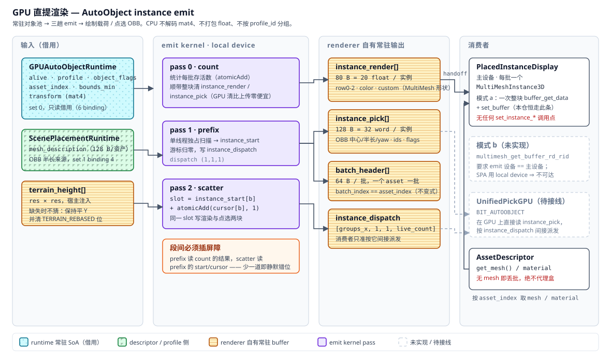

# AutoObject Instance Emit（GPU 直提渲染）

本文描述放置物体的**绘制载荷从 GPU 直接产出**的那条链：`GPUAutoObjectRuntime` 的常驻对象池
经一次三趟 compute 编译成紧凑实例表，`PlacedInstanceDisplay` 只做一次不透明的整块字节搬运
送进 `MultiMesh`。**GDScript 在这条路径上不解码 `mat4`、不打包 float、不按 `profile_id` 分组。**

它取代的是「整容量 `readback_object_states_bulk` 回读 → CPU 按 `profile_id` 分组 → 逐实例
打 12 float / 逐实例 `set_instance_transform()`」。运行时对象模型本身见
[`auto-object-gpu-runtime-architecture.md`](auto-object-gpu-runtime-architecture.md)，
SPA 编排见 [`scene-placement-actor.md`](scene-placement-actor.md)，
资产语义见 [`asset-descriptor.md`](asset-descriptor.md)。



## 组成

| 角色 | 规范名 | 位置 |
| --- | --- | --- |
| 实例 emit 宿主 | `AutoObjectInstanceRenderer` | `scripts/auto_object_instance_renderer.gd` |
| emit kernel | `autoobject_emit_instances` | `shaders/autoobject_emit_instances.glsl` |
| 场景侧显示器 | `PlacedInstanceDisplay` | `scripts/utils/placed_instance_display.gd` |
| 所有权 | `GPUAutoObjectRuntime.get_instance_renderer()` 惰性自持 | renderer 借用 runtime 的 `RenderingDevice`，`_owns_rendering_device` 保持 false |

**不要与 `VoxelMultiMeshWriterGPU` 混淆。** 那是服务体素调试叠加层的另一条链，
逐项对比见 [§ 与体素可视化的区别](#与体素可视化的区别)。

## 数据流

```text
GPUAutoObjectRuntime 常驻 SoA（set 0，只读借用）
  alive / profile / object_flags / asset_index / bounds_min / transform
        │
        ▼  AutoObjectInstanceRenderer.sync(options)
autoobject_emit_instances.glsl  —— 一条 compute list 三趟，段间自动插屏障
  pass 0 count    每批存活数（atomicAdd）+ 整块清 instance_render / instance_pick
  pass 1 prefix   单线程独占扫描 → instance_start；游标归零；写 instance_dispatch
  pass 2 scatter  slot = instance_start[b] + atomicAdd(cursor[b], 1)，同一 slot 写两块
        │
        ▼  get_instance_render_handoff() / get_instance_pick_handoff()
instance_render[] 80 B   → PlacedInstanceDisplay → MultiMesh.set_buffer()
instance_pick[]  128 B   → UnifiedPickGPU 的 BIT_AUTOOBJECT 域（**尚未接线**）
batch_header[]    64 B   → 每 asset 一批，batch_index == asset_index
instance_dispatch 16 B   → [groups_x, 1, 1, live_count]，消费者唯一允许的派发依据
```

三趟必须在**同一条 compute list** 里且段间有屏障：`prefix` 读 `count` 的 atomicAdd 结果，
`scatter` 读 `prefix` 写的 `instance_start` / `cursor`。少一道屏障的症状是批次起点用了上一轮的
值——不崩、不报错，只是静默错位。

`batch_header` 与 `instance_dispatch` 由宿主在 `begin_compute_list()` **之前** `buffer_zero`：
它们在 pass 0 里是 atomicAdd 的目标，同趟清零会与计数竞争。`instance_render` / `instance_pick`
则由 pass 0 自己清（在 GPU 上清 5 MB 比从 CPU 上传 5 MB 的零便宜得多）。

## 记录布局

字节布局的唯一真值源是 `AutoObjectInstanceRenderer.GLSL_CONSTANTS`，经 `layout_block()`
发射进 shader 的 `// @@GEN autoobject_instance_layout` 区块，`scripts/checks/glsl_gen_block_checks.gd`
守卫两侧不漂移。**任一侧单边改动的症状是「某字段读出隔壁字段的值」——不崩，只静默错。**

`instance_render[]`：20 float / 实例，就是 `MultiMesh` 的字节形状。

```gdscript
const RENDER_FLOATS := 20      # ⚠ MultiMesh 必须同时开 use_colors 与 use_custom_data，
                               #    关掉任一个 stride 就变 16 或 12，GPU 写的 80 B 记录整体错位
# word 0-3   row0    basis 行 0 + origin.x
# word 4-7   row1    basis 行 1 + origin.y
# word 8-11  row2    basis 行 2 + origin.z
# word 12-15 color   实例色
# word 16-19 custom  custom data
```

`instance_pick[]`：32 word / 实例。**渲染用的包围盒与点选用的包围盒是同一轮 scatter 写出的
两块**，同一条循环、同一个 `slot`——「画出来的」与「点中的」在构造上不可能分家。

| word | 字段 | 含义 |
| --- | --- | --- |
| 0 / 4 / 8 | `row0` / `row1` / `row2` | 与 `instance_render` 同源的世界变换 |
| 12 | `color` | 实例色 |
| 16 / 19 | `obb_center` / `obb_yaw` | OBB 中心与 yaw（yaw 从常驻 transform 反解，不额外上传）|
| 20 / 23 | `obb_half_extent` / `bounding_radius` | 半长取自 `mesh_description` 的 `mesh_aabb`，无需新上传 |
| 24 / 25 / 26 / 27 | `object_id` / `profile_id` / `batch_index` / `flags` | 身份与状态位 |
| 28 / 31 | `voxel_min` / `asset_index` | 体素足迹起点、批次键（与 `batch_index` 冗余互为自检）|

`flags` 位：`ALIVE=1` · `SELECTED=2` · `CULLED=4` · `TERRAIN_REBASED=8`。

`batch_header[]`：16 word / 批，`asset_index` 就是批下标。

| word | 字段 | 含义 |
| --- | --- | --- |
| 0 / 1 | `instance_start` / `instance_count` | 该批在实例表里的起点与长度 |
| 2 / 3 | `profile_id` / `asset_index` | 批身份；`asset_index == 批下标`是不变式 |
| 4 / 5 / 6 / 7 | `capacity` / `revision` / `cursor` / `flags` | 容量、内容代号、scatter 游标、状态位 |

## 驱动

宿主只调一个入口，"怎么驱动 emit" 的知识不复制两份（原先是
`spa_interaction_host.gd` / `volume_score_demo.gd` 两处，前者已于 2026-08-07 删除，
现存唯一消费方是 `volume_score_demo.gd`）：

```gdscript
var result: Dictionary = display.sync_from_spa(spa, {
	"terrain_heights": heights,          # PackedFloat32Array，给了就注入并要求 kernel 内做地形 rebase
	"terrain_key": "host:%d" % ...,      # 内容 key；同 key 空转不重传
	"camera_position": cam_pos,          # 距离剔除参照点
	"cull_distance": 300.0,              # <= 0 关闭剔除
	"camera_move_epsilon": 1.0,          # 相机位移小于它即视作没动
	"force": true,                       # 无视 revision / 相机守卫强制重跑
})
# → {ok, reason, emitted, revision, batches, instances}
```

`sync_from_spa()` 会自行补上 `mesh_description_buffer` / `batch_count` / `grid_origin` /
`voxel_size` 四项，再把 `renderer.sync()` 的结果转成上传决策。

**空转守卫只看 `_object_revision` 与相机位移。** 任何**不在这两者里**的 emit 输入
（剔除开关、剔除距离等）改变时，调用方**必须自带 `force`**——否则 kernel 不重跑，画面停在
上一轮的剔除结果上，看起来就像"这些实例丢了"。

上传是否强制取自 emit 的 `emitted` 而非 `revision`：相机移动触发的重 emit 不改
`_object_revision`（对象集合没变），只看 revision 会让显示器空转。

## 传输模式

| 模式 | 条件 | 做法 |
| --- | --- | --- |
| b | emit 设备 == 主设备 | 直接绑 `multimesh_get_buffer_rd_rid`，零拷贝。**本仓不可达，分支未实现** |
| a | 否则 | 一次整块 `buffer_get_data` + `MultiMesh.set_buffer()` |

本仓恒走 a：SPA 的 RD 由 `ensure_device(prefer_local_device = true)` 取得，是**本地设备**
而非主设备，而 Godot 的 buffer API 没有跨设备共享。这是设备分裂的既定前提，不是缺功能——
`RenderingDevice::submit()` / `sync()` 对非 local device 直接硬失败，而本仓每个 pass 都依赖它。
模式 b 的分支**没有写**，不是"写了没测"；TAA/运动矢量的 `motion_vectors_enabled` 守卫同理，
它只在模式 b 下才成为问题。

## 与体素可视化的区别

两条链都是「compute 写 `MultiMesh`」，除此之外几乎没有共同点。体素侧是
`VoxelMultiMeshWriterGPU` 及其三个子类，统一入口 `VoxelDisplay`：

| 子类 | kernel | 载荷 |
| --- | --- | --- |
| `VoxelFieldDisplayGPU` | `voxel_field_instances` | 一实例一格（全网格），空格塌零基向量 |
| `BrushVoxelDisplayGPU` | `brush_voxel_instances` | 稀疏，一实例一个画过的体素（四面体网格） |
| `VoxelInstanceDisplayGPU` | `voxel_instance_copy` | CPU 打包好的 transform/color 直拷 |

| 轴 | 体素可视化 | instance emit |
| --- | --- | --- |
| 用途 | 调试叠加层（场 / 笔刷 / 占据通道） | 放置物体的生产渲染 |
| 网格 | `BoxMesh` / 四面体，统一形状 | `AssetDescriptor.get_mesh()` 真实网格 |
| 取源端 | CPU `PackedFloat32Array`，每次写入前打包成 scratch buffer 上传 | GPU 常驻 SoA，**一次都不上传** |
| 写出端 | 零回读、零 `set_buffer`：直绑 MultiMesh 的 RD buffer | 一次整块 `buffer_get_data` + `set_buffer`（模式 a） |
| 设备 | 主 `RenderingDevice`，写入跑在渲染线程 | SPA 的 local device |
| 输出块数 | 1（渲染实例） | 4（渲染 + 点选 OBB + `batch_header` + `instance_dispatch`） |
| 分批 | 一个 display 一个 MultiMesh | 每 asset 一批，`batch_index == asset_index` |
| dispatch | 一趟，1D over 实例数 | 三趟 `count → prefix → scatter`，自产间接派发参数 |
| 空转守卫 | 无——每次显示整体重建 | `revision` + 相机位移 |
| 剔除 | 无 | kernel 内距离剔除（被剔实例写零基向量） |
| `use_custom_data` | false | **true**（全仓唯一，`placed_instance_display.gd:249`） |

### 零拷贝落在了"错"的那条上

这是设备分裂（[§传输模式](#传输模式)）最反直觉的后果：

- 体素可视化的**源数据在 CPU**，却因为跑在主设备上，**能**直绑
  `multimesh_get_buffer_rd_rid` 真零拷贝写 MultiMesh。
- instance emit 的**源数据全程在 GPU**，却因为 SPA 的 RD 是本地设备，**做不到**零拷贝。

所以 `VoxelMultiMeshWriterGPU` 的类注释才写「**这才是三个现有 GPU MultiMesh writer 全都
CPU 取源的原因，不是缺功能**」。两条链因此**无法合并成一条**——不是没人做，是设备约束不允许。

### 生命周期也相反

| | 体素可视化 | instance emit |
| --- | --- | --- |
| 宿主实例 | 每次显示 `new()` + `dispose()`，实例成员缓存不了任何东西 | runtime 惰性自持，会话级存活 |
| shader / pipeline | **static 进程级 `_kernel_cache`**（主设备随进程存活，挂 static 安全）；`dispose()` 不释放它们，且带 mtime 检查——改 `.glsl` 无需重启即时生效 | `SCOPE_PERSISTENT`，随 renderer dispose |
| 输出 buffer | 无常驻输出（直接写别人的 MultiMesh buffer） | 四块 `SCOPE_PERSISTENT`，容量按 `next_power_of_2` |

### 共同点只有两条

1. 都在 GPU 上**从紧凑索引算出实例变换**，而不是 CPU 逐实例打包——体素侧是
   `grid_origin + (voxel + 0.5) * voxel_size`，emit 侧是搬常驻 `mat4` 再加地形项。
2. 都受同一套 MultiMesh 陷阱约束（见下一节）：`custom_aabb` 强制、绝不碰 `set_instance_*`、
   `instance_count` 变更会重建底层 RD buffer。

体素侧的细节见 [`target-sv-brush-overlay.md`](target-sv-brush-overlay.md)。
全部 6 个 drawable 的横向盘点原先记在 `unified-picking-plan.md`「第六组：可视化合并后的旧入口」，
该文档已删除、不重建；其结论已落进代码：6 个 drawable 统一经
`PickableDomain.register_pick_drawable()` 进 ID pass，命中后各域用自己的 `resolve_pick()`
解载荷。（逐域现状盘点曾在 `volume-display-domain-audit.md`，该文档已删除，
现状以各域自己的 `resolve_pick()` 实现为准。）

## 三个静默失败陷阱

每一个都不报错，症状都是"什么都看不见"或"画出一堆乱七八糟的变换"：

1. **`custom_aabb` 是强制的。** `_multimesh_allocate_data` 会重置 `aabb = AABB()`，而
   `_multimesh_get_aabb` 只从 CPU `data_cache` 重建——GPU / `set_buffer` 写入的 MultiMesh
   从来没有那个缓存。没有 `custom_aabb` ⇒ 空 AABB ⇒ 全部被剔除，且无任何报错。
2. **一次误调 `set_instance_transform()` 会静默清零全部实例。** `_multimesh_make_local`
   仅在 `buffer_set` 为真时从 `buffer_get_data` 重建 CPU 缓存，走 `memset` 归零分支之后每帧
   把零覆盖到写入之上。`PlacedInstanceDisplay` 因此**没有任何** `set_instance_*` 调用点，
   也不提供包装；距离剔除由 kernel 的零基向量承担。
   同理，GPU 写的 MultiMesh **绝不能进 demo 的 `_cull_groups`**。
3. **`mm.instance_count = N` 会释放并重建底层 RD buffer**，使任何缓存的
   `multimesh_get_buffer_rd_rid` 与引用它的 uniform set 失效。故容量按 `next_power_of_2`
   增长、只增不减，容量变化时整批重建。

## 地形口径

kernel 内做地形 rebase，采样式与被它取代的 CPU 规则逐字相同：按实例列取
`heights[vz * res + vx]`，`vx/vz = clamp(floor((world - grid_origin) / voxel_size), 0, res - 1)`。

高度场缺失时 emit **不猜**：保持常驻 transform 的平 Y，并把每行的 `TERRAIN_REBASED` 位置 0,
让消费者能区分"这行的 Y 与画面可能不一致"和"已重基"。迁移期两条路（emit 与仍在用的 CPU
pick 数据）**必须注入同一份高度场**，否则画出来的和点得到的会差一整个高度场。

## 约束

- **消费者只被允许按 `instance_dispatch` 派发。** 按 `max_objects` 或按批容量派发，空场景
  每次点击也要发 1024 个工作组。
- **`revision` 守卫 + 内容 key 守卫，永不整块回读。** `GPUAutoObjectRuntime.get_live_count()`
  是 O(max_objects) 的阻塞往返，绝不能进渲染或点选路径。
- `readback_batch_headers()` / `readback_pick_record()` / `readback_live_count()`
  **只用于调试与检查套件**，不在渲染或点选路径上。
- 无 `mesh` 的资产由 `PlacedInstanceDisplay` 丢批 + `push_warning`，**绝不代理盒**
  （`CLAUDE.md` 规则）。

## 现状与未接线项

| 项 | 状态 |
| --- | --- |
| 渲染路径 | 已切换；`spa_interaction_host.gd` 删除后现存唯一消费方是 `volume_score_demo.gd` |
| 点选路径 | **未接线**：`UnifiedPickGPU.IMPLEMENTED_DOMAIN_MASK` 仍不含 `BIT_AUTOOBJECT`，宿主还在做屏幕空间最近邻 |
| 回读退场 | 未完成：`_readback_*_object_states` 仍在，因为点选数据还要它喂 |
| 模式 b | 不可达（设备分裂），分支未实现 |

## 验证

原来的 8 条断言套件（`scripts/checks/autoobject_instance_checks.gd`）**已移除**：它只暴露
`static func run_all(spa, …)`，而编辑器桥的 `call_method` 只按节点路径派发
（`_resolve_edited_scene_node(path)` → `node.has_method()`），静态函数没有任何入口——
这套断言从未被执行过。要恢复等价覆盖，必须把断言主体挂到场景常驻节点的实例方法上，
再经桥调用；放 `tools/test_*.gd` 无效（CLAUDE.md 禁止运行时 Godot 启动，那些脚本只被
parse gate 编译、从不执行）。

桥诊断入口（`SPA/Volumes/VolumeScore`）：

```bash
node tools/editor_bridge_probe.js call_method '{"path":"SPA/Volumes/VolumeScore","method":"debug_placed_instance_alignment","args":[6]}'
```

`debug_placed_instance_alignment` 对同一批对象同时取「常驻 transform」「旧 CPU 路径的地形
重基结果」「GPU emit 写出的原点」「最近 anchor」，判定偏移到底出在渲染路径还是放置链上游；
`debug_placement_pivot_report` 则对账 `mesh_aabb` / `pivot_variants` / 预测占位。

最近一次经桥实测（2151 个放置对象）：`max_gpu_vs_cpu = 0.000000`（GPU 直提与旧 CPU 路径逐位
相同）、3 个批、每批 `use_colors == use_custom_data == true` 且 `custom_aabb` 非零、
`visible_instance_count == -1`。
