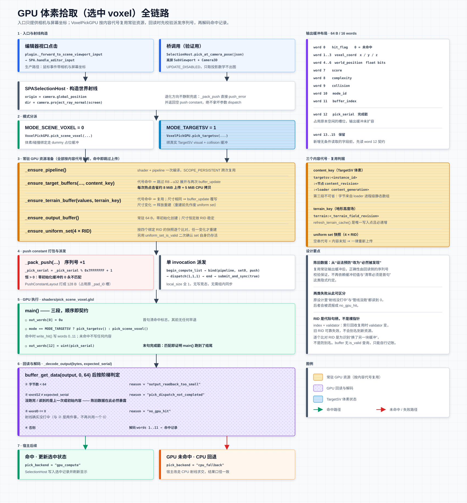

# SPA + AutoObject GPU Runtime — 整条放置流程测试场景

本场景是 **一整套放置流程的端到端交互测试**：在同一个编辑器场景里，从 `SPA`
节点的 Inspector 逐步走完
`TargetSV → Anchors → Score → Place`——查看目标场、收锚点、打分排名、把胜者提交为真实
GPU AutoObject 并改写 committed SV。

源文档：
- [`scene-placement-actor.md`](scene-placement-actor.md)（`res://doc/scene-placement-actor.md`）— SPA 编排契约
- [`auto-object-gpu-runtime-architecture.md`](auto-object-gpu-runtime-architecture.md)（`res://doc/auto-object-gpu-runtime-architecture.md`）— GPU Runtime 架构
- [`placement-score-3d.md`](placement-score-3d.md)（`res://doc/placement-score-3d.md`）— volume-score provider（Anchors/Score/Place 语义本体）

> **2026-08-07：这套检查已删除。** `spa_checks.gd`（API 合约）、`spa_pipeline_checks.gd`
> （E2E 真实链）与它们唯一的在仓入口 `tools/test_spa_scene_resident.gd` 一并移除 ——
> 三者都只能经 `--script` 启动，而本仓禁运行期 Godot 启动，所以它们从来没跑过，
> 重构把断言弄红也是静默的。同日 `tools/test_*.gd` 全部 22 个连同纯测试脚手架
> （`scene_tree_test.gd` / `spa_scene_fixture.gd` / `voxel_fixtures.gd`）一并清空，
> 理由相同。SPA 的验收现在只有 `-e` 门禁 + `tools/*.js` 过 6800 桥的实调。
> `scripts/checks/` 下只剩 `placement_stage_env.gd`，那是生产代码放错了目录
> （`class_name PlacementStageEnv`，被 `scene_placement_actor` 与 `volume_score_demo` preload）。

> ⚠ **它们当前没有场景侧桥入口。** 原先的 `run_all_tests()` /
> `run_resident_placement_writeback_check()` / `run_stamp_only_commit_check()` 住在
> `SPAInteractionHost` 上，由 `res://scenes/placement-score-3d/placement-score-3d.tscn`
> 的 `SPA/Interaction/DemoHost` 节点承载。该节点先被移除：它在 `_editor_init` 里**无条件**
> 造第二份 `PlacementStageEnv`，而两份 env 挂同一个 SPA 会互相释放对方的常驻 target 缓冲
> （`ensure_target_ready()` 重建时释放上一份），谁后跑谁把对方手里的 RID 变成野指针。
> 移除时这三个入口的调用方为 0。**宿主脚本本身（`scripts/spa_interaction_host.gd`）
> 已于 2026-08-07 一并删除**——彼时已无任何 `.tscn` 挂载它。
> 重新接入时**不要**再造 env，走 `spa_host.get_placement_stage_env()` 借用那一份。

## 场景组合

真实 SPA 在场景 ready 期间构造唯一 runtime、RD、committer 与 Volume 子树；`PlacementStageEnv`
只是在测试/demo 中借用该 SPA 的适配器：

| 节点 | 脚本 | 角色 |
|---|---|---|
| 场景根 | `core_demo_contract_fixture.gd` | 根 / F6·F5 守卫 |
| `SPA` | `scene_placement_actor.gd` | **唯一生产生命周期与交互入口**：`@tool Node3D`，ready 时完成 runtime/committer/Volumes 初始化，并直接持有 SVTile GPU 状态。 |
| `SPA/Volumes/VolumeScore` | `volume_score_demo.gd` | **volume-score provider**：注册到祖先 SPA，只借用资源，不创建或释放 SPA/env。也是观察层 host：HUD、SVTile 热力图 overlay、视口热键（Ctrl+H / G / Space）、SelectionHost 的 demo 侧接线（`_wire_selection_host`）。 |
| `SPA/Interaction/SelectionHost` | `spa_selection_host.gd` | 选中态 SSOT：域准入（唯一判据＝是否可视）、显示开关、点选路由。由 SPA 装配并拥有。 |
| `DemoSetup` | 场景内节点 | 共享地形（双面材质，`assets/terrain/utils_terrain_material.tres`）+ FlyCamera |

`Anchors` / `Score` / `Place` 是 `SPA` 自身的 `@export_tool_button`。只有场景里存在
volume-score provider 时才启用；`VolumeScore` 注册或注销后，SPA 会刷新 Inspector 属性状态。
`Score` 完成后在下一帧准备 Place pipeline，`Place` 入口只校验并消费常驻资源，不创建 SPA、注册
descriptor 或编译 pipeline。

## 整条流程（TargetSV → Anchors → Score → Place）

> **@tool 编辑器模式，禁止 F6 / F5 / `--script`。** 在 Godot 编辑器中打开 `.tscn`，脚本在视口
> 实时运行，全部经 `SPA` Inspector 按钮触发（`VolumeScore.auto_run_on_start = false`，逐步走）。
> F6（Run Current Scene）、F5（Run Project）和 `--script` 均被 `core_demo_contract_fixture.gd`
> 守卫禁止，触发 `assert(false)` 强制崩溃。GPU 依赖 RenderingDevice，`--headless` 同样不可用。

1. **TargetSV**（模式下拉，或 Shift+5）——查看放置目标场（`target_field` 复杂度/颜色 + `target_collision`），即"想要放成什么样"的输入。
2. **Anchors**（Inspector，S6）——`provider.generate_anchors` → `SPA.run_autoobject_prefilter`（4-pass GPU）在**地形高度**采样目标体积（`max(target_complexity, target_collision) > min_target_interest`，采到即发锚；`anchor_vertical_stride > 0` 时在地表之上按步长加层）收集候选锚点体素（3D，可悬空，预期行为）。视口显示蓝色锚点小球。
3. **Score**（Inspector，S7）——`provider.calculate_voxel_scores` → `VolumeScoreFineSelection.run` 吃真实 S6 锚点交接 + BlendSV 副本（committed SV 副本，评分幂等），对每 `(anchor × top-K asset)` 求五维 residual gain 排名；每锚点胜出资产实例化其 `AssetDescriptor.get_mesh()`（**绝不代理盒**，见 `CLAUDE.md`）。点选锚点查看 top-K 明细。
4. **Place**（Inspector，S5→S9）——`SPA.run_place()` 用 `PlacementStageEnv` 的三段会话
   （`begin_place_session()` / `run_place_session_batch()` / `end_place_session()`，批循环住在 SPA）跑
   真实 prefilter + score + stamp + **GPU 常驻直连 writeback（spawn 真实 AutoObject）** + **commit（改写 committed SV）**。随后回读活对象态、按各 descriptor 真实 mesh 实例化渲染**实际放置结果**。

**Place 与 Score 一致性**：`Place` 用与 `Anchors`/`Score` 同一套门限（`rotation_slots` /
`min_target_interest` / `min_prefilter_score` 导出 + **collision/clearance 物理门**——demo 把
`PLACE_PIPELINE_COMMON` 的两限同时传给细筛 runner，预览排名与提交裁决同门）、评分 shader 同源，
故提交的胜者与所见评分口径一致。`run_placement_pipeline` 现尊重 `placement_common` 里给出的
两个 prefilter 门限（键缺省即 no-op，生产 SPA demo/检查行为不变）。

**地下一律不打分**：细筛对 `p.y < 0`（height-relative 地下 = 地形体内）的资产体素与
"出网格 / 超出网格顶"一样纯跳过——既不计分，也不计入 `solid_collision` / `clearance_overlap`
（`score_anchor_asset_residual`）。此前的"埋地保护"（把地下体素按实心地面计入物理门、借
collision/clearance 门把"高 pivot 把资产埋进地下、只露顶端贴薄目标"的埋地候选判 invalid，曾把
y=-13.7 埋地样本挡回 y∈[0.9,5.2]）已按"地下一律不打分"策略移除，故放置**可能重新落到地表以下**。
批间互斥仍由地上已放置盖章（`cur_col` 路径）维持，不受影响；XZ 出图与超出网格顶的体素同样纯跳过。

**Place 数量受单轮 Reduce、间距、占用与容量共同限制**：一次 `Place` 最多运行
`place_max_batches`（默认 24）批整链，每批最多输出 `place_result_capacity`（默认 1024）个放置；
某批 `spawned <` 每批容量时提前停止。批内由 `place_min_distance_voxels` 和成对资产半径判断冲突，
跨批由上一批盖章后的 collision/clearance 使后续 Fine 候选失效。

Reduce 固定为三阶段：每个 Anchor 先选 gain 最高的有效 Fine 候选并建立 XZ 直接索引；所有 Anchor
经迭代式贪心得分 NMS 仲裁同轮冲突（得分降序、同分 anchor id 升序，结果与串行贪心一致；GPU 自检
收敛并自清零间接派发参数，宿主盲目入队 `reduce_nms_iter_budget` 轮）；然后按 Anchor ID 紧凑写出（只剩
结果缓冲容量这一道界；per-asset quota 已于 2026-08-18 整条退役，reduce 不再有资产维度，
每个候选就是「一个范围 + 一个得分」）。它不排序、不建立关系表、不做多轮补空，同轮内
保证"高分优先存活"。⚠ 但**结果并不逐次可复现**：优先级的第二关键字是 anchor id，
而它来自 `collect_sv_anchors.glsl` 的无序 `atomicAdd`，同分之间选谁是任意的（同输入
重跑实测总数差 ~0.7%）。但 `spawned < capacity` 仍不表示空间已被理论上放满。单批耗时仍打印
`[VolumeScore] Place batch k/N: spawned=… (… ms)`。
放置累积上限 = SPA 的 `@export var autoobject_capacity`（默认 `65536`，`scripts/scene_placement_actor.gd`）；仓库中**没有** `PLACEMENT_AUTOOBJECT_CAPACITY` / `PLACE_AUTOOBJECT_CAPACITY` 这样的常量；
大批量对象态回读走 `GPUAutoObjectRuntime.readback_object_states_bulk`（每缓冲整读一次，
数千对象几十 ms）。它现在是该类唯一的对象态回读口：原先的逐 id 调试口
（`get_object_summary` / `get_selected_debug_summary` / `get_debug_summary`）
在该规模是几万次同步回读，调用方归零后已于 2026-08-07 删除。

`Place` 走**单遍全图 prefilter**（会话每批恒 `dirty_tile_ids=[]`，与生产 SPA demo 同口径；
不走 `Anchors`/`Score` 的四象限扫掠）。本场景 target 内锚点数随 `anchor_vertical_stride` 变化
（步长 `0` 约 45.6k、`1` 约 113.6k），均在 `ANCHOR_CAPACITY` 131072 之下、集合确定；
若某场景锚点超帽，单遍会被 atomicAdd 截断成非确定子集（此时调大步长，或改用 `Anchors`/`Score` 的扫掠口径观察）。

**Place 改写 committed SV**：会话每批内部 commit 推进了常驻场并使 env 的
target/prefilter 缓存失效——放置后再点 `Score`，会在**新场**上重评（coherent）。

**多次 Place 累积**：SV 与 GPU runtime 都是累积的——再点一次 `Place` 在改写后的场上重跑，
再提交一批（每批 `result_capacity` 个）；渲染面 = **全部已放置活对象**（旧批不丢，
`rendered` 随批次增长），直到 env 重建（AD bake / 场景重开）才清零。

**如何在视口里看到放置结果**（放置 mesh 按**原生 FBX 尺度**渲染——用户约定，与 Score 预览
同口径；草类资产原生仅 ~2u，在 1024u 地形的默认机位下只有数像素，"看不见"≠"没放置"）：

1. **点选**：AutoObject 模式（Shift+1）下 LMB 朝地面点——最近的放置物出现黄色统一 marker +
   信息标签（对象 id / 资产名 / voxel 范围），pick 数据由 provider 每轮 Place 后注入 SPA 宿主。
2. **FlyCamera 预览**：Place 后 provider 自动把 `DemoSetup/FlyCamera` 框到放置簇
   （`_frame_camera_on_placed`，与 SPA demo `_frame_camera` 同模式）——选中 FlyCamera
   并勾选视口左上角 **Preview** 即可看到该取景。
3. **SV 点验**：SV 模式（Shift+4）点放置处体素——标签显示 `complexity` / `collision`
   （盖章值 `collision=1.0` vs 地形种子 ~0.05；collision-only 盖章内容经
   `SceneVoxelCommitter.sample_committed_voxel` 常驻场直读，复杂度 0 也可点验）。

## 显示分组与点选准入

放置结果与评分预览注册到**不同显示组**，各自有独立显示开关：

| 显示组 | 域名（`SELECTION_DOMAIN_*`） | 内容 |
|---|---|---|
| `Anchor`（A） | `anchor` | 锚点小球 + Score 胜者预览 mesh |
| `GPU Objects`（GO） | `autoobject` | Place 提交后的**真实放置 AutoObject** mesh |
| `TargetSV`（TSV） | `targetsv` | 目标场体素显示 |

- **准入只看可见性**：显示开关关掉的域点不中，这就是"可视化即拾取几何"。想只看/只选某一个域，
  关掉其余域的显示开关；用 `SPA.set_voxel_display_visible(display_key, visible)` 切，
  `get_voxel_display_state()` 读回。
- 默认所有组同时可见（预览与真实放置位置基本重合，属正常）。
- 选择 marker / 高亮 box / top-K 标签 / 红色 sample-bounds 框由 **SPA 统一拥有**（canonical selection visual）；provider 只出锚点数据，点选与反馈走 `SPA`。

> **选择模式已整体退役**：状态机（`set_selection_mode()` / `get_selection_mode()` / Shift+0..5 热键）
> 于 2026-08-07 删除，模式号（`MODE_*` / `SelectionMode` 枚举）于 2026-08-10 删除，域标识只用
> `SELECTION_DOMAIN_*` 字符串。`.tscn` 里没有 `selection_mode` 属性可设。
> 图 [`diagrams/spa_selection_mode_transition.svg`](diagrams/spa_selection_mode_transition.svg)
> 画的是那套已删除的状态机，**正文不再内嵌它**（只在 [`README.md`](README.md) 的 Diagrams
> 表里带 ⚠ 标注登记），保留仅作历史记录。删除注记见 `scripts/scene_placement_actor.gd`
> 与 `scripts/spa_selection_host.gd`。

### 点选一个 voxel 的完整链路

> ⚠ **上图是历史产物**：它画的是已于 2026-08-10 删除的 GPU 射线求交路径
> （`VoxelPickGPU` + `shaders/pick_scene_voxel.glsl`，按 `content_key` / `terrain_key`
> 复用常驻缓冲、靠 `pick_serial` 完成戳判回读有效性）。现行链路见下。

- 现行路径是**「可视化即拾取几何」的 ID 拾取**，没有射线求交：各域在自己的显示节点建好后调
  `PickableDomain.register_pick_drawable(node, key)` 登记那个 `MultiMeshInstance3D`，
  `PickIdPass`（`scripts/utils/pick_id_pass.gd`，由 `SPASelectionHost` 独占持有）把它们**镜像**
  进一个 `own_world_3d = true` 的 SubViewport，用 `shaders/pick_id.gdshader` 再画一遍，
  片元写 24 位 `pick_id`；点击时只回读该 SubViewport 上点击处的**一个像素**。
- 镜像节点与真节点**共享同一个 `MultiMesh` 资源**（因而共享同一块 RD 实例缓冲），所以「再画一遍」
  画的确实是同一份实例变换，原节点全程不动；`own_world_3d` 是物理隔离，不依赖任一方 cull_mask
  设置正确。
- ID **不跨趟存活**：`begin_pass()` 每趟把 `_next_pick_id` 归 1、清空解码表，按每个 drawable 的
  `mm.instance_count`（**容量**，不是存活数）整段分配区间。命中后按区间反查 `{domain, key,
  local_index}`，再交给该域的 `resolve_pick()` 解出载荷。
- **可见性即点选准入**——这是 ID pass 的物理保证而非一条要各处遵守的约定：域的显示节点没画出来
  就没有 `pick_id`，点不中。`0` 保留为「无命中」（ID 目标清成黑色即空，分配从 1 起）。

## GPU 验证策略

所有 GPU 路径都依赖 `RenderingDevice`，必须使用**非 headless Vulkan**：传入
`--rendering-driver vulkan` 且不带 `--headless`；CPU 替代路径不得作为通过条件。
统一样本 Buffer 的独立 ABI / upload / readback 验收脚本是
`tools/test_auto_voxel_runtime_profile_container.gd`（已于 2026-08-07 删除：只能经 --script 启动，本仓禁跑 = 从来没跑过，此约束现无守卫）。

`SpaChecks.run_suite(host)` 从 host 向上解析真实 `ScenePlacementActor`，13 项 API 契约均为
只读检查，不创建、初始化、清空或销毁被测 SPA（原先的桥入口 `SPAInteractionHost.run_all_tests()`
已随宿主脚本删除，当前没有可执行入口）：

- SceneTree lifecycle 与 owner identity；
- 固定 Volumes/Interaction/Displays 子树；
- TargetSV 与 `256 x 16 x 256` 网格一致；
- committer/tile store/field builder 的显式所有权；
- `8 x 8 x 8` SVTile 固定拓扑的 2,048 个 resident tile；
- descriptor/profile 注册、`GPUAutoObjectRuntime`、常驻 `profile_arena` 与
  mesh-description buffers；
- merged GPU ownership/readiness summary。

第 14 项 `SpaPipelineChecks.check_resident_placement_writeback(host)`（原桥入口
`SPAInteractionHost.run_resident_placement_writeback_check()` 已随宿主脚本删除）用
`PlacementStageEnv.make(existing_spa, options)` 借用同一 SPA，验证
`run_multi_asset` → `spawn_batch_from_accepted_placement_gpu_buffers`，并断言
没有 CPU 字典回读、交接 RID 已释放、resident shader stats `applied == spawned`。
（旧名 `test_resident_placement_writeback` 已不存在。）

## 验收标准

- 场景嵌入 `VolumeScore` provider → `SPA` Inspector 的 **Anchors / Score / Place** 三个按钮均启用；场景缺 provider 时按钮只读禁用。
- **Anchors**：`run_autoobject_prefilter` 返回锚点 > 0，视口显示锚点小球。
- **Score**：`VolumeScoreFineSelection.run` 返回 `ok=true`，每锚点胜者按 descriptor 真实 mesh 实例化（绝不代理盒）。
- **Place**：`SPA.run_place()` 返回 `ok=true`，spawn 真实 GPU AutoObject（`spawned_count > 0`）、commit 改写 committed SV；真实放置结果按 descriptor mesh 渲染（`GPU Objects` 显示组，AutoObject 模式可见）；HUD `Placed:` 行反映提交/渲染数。
- Place 与 Score 门限一致；提交结果必须来自 Score 所示的 per-Anchor Fine 胜者集合，再经过 Anchor 间冲突、quota 与容量裁决。Place 后再 Score 在新场上重评。
- 地形双面渲染正常（使用 `assets/terrain/utils_terrain_material.tres`）。
- `AutoVoxelRuntimeProfileContainer` 与 `GPUAutoObjectRuntime` 由场景中的 SPA
  创建、管理和释放；provider 只借用。Runtime 持有 object state / profile
  id / bounds / dirty delta；tile 级固定槽位 object refs 与 `SceneVoxelTile` dirty
  归 SPA-owned SceneSV 组件。
- VPG contract validation 通过后必须使用已 bound/consumed 的 GPU runtime / profile buffers；只验证不绑定不算通过。缺少必要 Buffer 时返回 `contract_blocked=true`、`cpu_fallback=false`。
- 无 RenderingDevice 时只能 SKIP GPU upload / placement，不能改走 CPU 替代路径。
- implementation status 与当前源码入口一致，不出现第二套 SceneVoxel source of truth。
