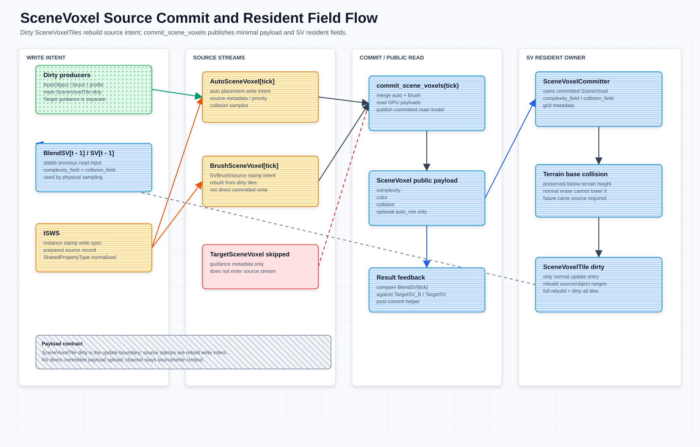

# Complexity Field System

本文维护 MeshFill 中 `SceneVoxel`、source write、`collision` 和 SV 常驻显存状态的契约。`AssetDescriptor` 定义见 [`asset-descriptor.md`](asset-descriptor.md)，资产字段归属见 [`asset-properties.md`](asset-properties.md)；粗粒度 SV cell 管理见 [`scene-voxel-tile.md`](scene-voxel-tile.md)；AutoObject GPU-first 方向见 [`auto-object-gpu-runtime-architecture.md`](auto-object-gpu-runtime-architecture.md)；TargetSV 见 [`target-scene-voxel-projection.md`](target-scene-voxel-projection.md)。**SPA**（`ScenePlacementActor`）是 MeshFill 运行时编排器，借用 `SceneVoxelCommitter` 引用并在 commit 阶段调用 `commit_scene_voxels()` 发布；详见 [`scene-placement-actor.md`](scene-placement-actor.md)。

committed `SceneVoxel` 采用 **stamp-only commit**：常驻 complexity/collision field buffer 对是持久 stamp 写入目标，VPG 的 GPU state-chain stamp（`stamp_asset_voxels.glsl`，mixed-asset）在 placement 期间原位提交。CPU 入口盖章链（`apply_instance_stamp_write_spec()` 及其 pending 散射半边）已于 2026-08-10 整链删除（全仓零调用核实）；`scatter_sv_field_records.glsl` 的现役消费者是 SPA 笔刷层的 `write_brush_sv_records()` 散射。不存在 per-voxel source-candidate 裁决/blend 提交管线。`BrushSV`（场景笔刷层）常驻挂在 SPA 上、不进提交；`BlendSV` 是 committed SV + `BrushSV` 的按需合成读取产物（`compose_blend_sv_fields.glsl`），供 3D score 物理采样与 TargetSV 对比使用，用完即删。



## 本文范围

- `instance_stamp_write_spec`（`ISWS`）如何经实例 meta 附着（`set/get_instance_stamp_write_spec()`）并被 prefilter 读取；CPU 盖章消费链已删。
- `commit_scene_voxels()` 如何完成 stamp-only 提交发布（推进 tick + tile 摘要）。
- committed per-voxel payload、source-only 字段和 debug buffer/readback 边界。
- canonical `collision` 字段、placement `collision` 采样 record/API、terrain base collision 与 `collision_field` 的归属。
- SV resident buffers、dirty voxel regions / dirty tiles 的所有权。

## 核心契约

- `SceneVoxel` / `SV` 是 committed runtime read model，不是资产 authoring schema。
- [`AssetDescriptor`](asset-descriptor.md) / `AutoVoxelProfile` 是资产默认语义来源；`AutoObject` 持有实例的 `instance_stamp_write_spec`（`ISWS`）记录（`set/get_instance_stamp_write_spec()`；CPU 构造工厂已删）。
- shared fields 只有 `color`、`complexity`、`collision`。`collision` 是权威 shared field。
- committed `SceneVoxel` 对外 read payload 最小化为 `complexity`、`color`、`collision`，可选 `auto_mix`。`channel` 只属于 source/write context，不进入 committed read payload；`complexity` 是唯一强度字段。
- `occupied`、`type`、`source_type`、`source_voxel_type`、`commit_tick` 不作为 committed per-voxel payload；占用由 completeness（即 `max(complexity, collision)`）是否非 0 推导，source provenance 放在 source/debug buffer，commit tick 只作为当前 SV snapshot 的全局 epoch。
- `TargetSceneVoxel` record 只作为 target / guidance metadata；写入阶段会跳过它，不进入 `AutoSceneVoxel` / `BrushSceneVoxel` source stream，也不进入 committed `SceneVoxel`。
- `TargetSceneVoxelGenerator.decode_target_read_buffers()` 可把 `TargetSV_B` raw `rgba8/r8` cache 解码成 `target_completeness`（即 `max(complexity, collision)`） / `target_color`；这是 routing / scoring read input，不是 source write。
- committed stamp 只来自 VPG state-chain（纯 auto）；`TargetSceneVoxel` / `TargetSV_B` 保持 guidance-only，不进任何写路径。brush 内容写 SPA 的 `BrushSV` 常驻层（`write_brush_sv_records()`），不进 committed `SceneVoxel`。
- `SceneVoxelCommitter` 的逐对象盖章记录集（`_instance_stamp_write_specs`）已随 CPU 盖章链删除；调试/查询读取走常驻 field 回读（`query_voxel()` / `get_scene_voxels()` / `readback_sv_field_debug_snapshot()`），2D `scene_voxels` 公共投影已退役（V1）。
- SV 自持一对持久 complexity/collision 常驻 field buffer（stamp 直写目标；碰撞场以 terrain base 为种子）、grid metadata 和 dirty regions；读取侧经 `BlendSV` 按需合成（brush 为空时直通）。
- `_rebuild_sv()` 发布的 SV resident state 是 committed `SceneVoxel`、terrain base collision、grid metadata 和 dirty index 的读取快照；它不是 source write buffer，也不是第二套 committed payload。
- AutoObject、brush、profile 和 placement 变更影响 committed SV 时，正常入口是 `SceneVoxelTile` dirty；`SVBrush` / source stamp 是 dirty tile 重建出的 source write intent，不是 direct SV update path。
- `TargetSV_B` / target guidance 变化只触发 routing、prefilter、scoring 或 feedback 侧 dirty，不写入 source stream，也不直接更新 committed `SceneVoxel`。
- dirty 入口统一为 `SceneVoxelTileStore.mark_scene_voxel_tile_bounds_dirty()`（及 batch 版；单 tile 便捷版与 SPA 的 `finalize_svtile_dirty()` 门面已删，SPA 对外入口是 `mark_svtile_bounds_dirty()`，GPU finalize 由 runtime 直调 `finalize_consumed_dirty_tiles()`）；legacy 2D dirty storage（`_sv_dirty_tiles` / `_sv_dirty_rects` 及 `invalidate_sv_tile()` / `invalidate_sv_rect()` 兼容入口）已退役（V1），`SceneVoxelTile` 3D dirty 是唯一 dirty 机制。

体素与计算术语参见 [`README.md`](README.md#voxel-and-compute-terminology)。`collision` 是 canonical shared collision field；`instance_stamp_write_spec` / `ISWS` 是 canonical per-instance runtime write spec（legacy alias `voxel_write_spec` 已删除）。`SPA` 参见 [`scene-placement-actor.md`](scene-placement-actor.md)。

## 责任、输入和输出

| 类型 / 阶段 | 责任 | 输入 | 输出 | Source of truth |
| --- | --- | --- | --- | --- |
| `AssetDescriptor` / `AutoVoxelProfile` | 资产默认语义。 | authoring config、imported profile。 | descriptor-backed shared fields、probe / pivot defaults。 | descriptor/profile 资源；定义见 [`asset-descriptor.md`](asset-descriptor.md)。 |
| `instance_stamp_write_spec` / `ISWS` | 描述实例 stamp 的 source write context（附着于实例 meta，供 prefilter 等读取）。 | 运行时 placement / writeback 结果。 | per-instance write record（legacy 名 `voxel_write_spec` 已删）。 | 实例 meta（`set/get_instance_stamp_write_spec()`）；CPU 盖章消费链已删。 |
| `BrushSV` overlay | 场景笔刷常驻旁路层，不进提交。 | 笔刷体素记录（`write_brush_sv_records()`）。 | SPA 常驻 brush field 对（RGBA8 + R8）。 | `ScenePlacementActor`；生命周期/持久化元数据见 brush control metadata。 |
| committed `SceneVoxel` | 发布 committed per-voxel read model（纯 auto）。 | VPG state-chain stamp + terrain base collision 种子。 | SV accepted fields：`complexity`、`color`、`collision`，可选 `auto_mix`。 | 常驻 field buffer 对；`commit_scene_voxels()` 是发布点。 |
| `BlendSV` read product | 按需合成的临时读取对（3D score / TargetSV 对比）。 | committed SV 常驻对 + `BrushSV` 常驻对。 | 临时 blend field 对（brush 覆盖优先 / collision max），用完即删。 | `ScenePlacementActor.compose_blend_sv_fields()`；不落地、不提交。 |
| SV resident state | 提供 placement、prefilter、validation 和 debug 的稳定读取输入。 | committed `SceneVoxel`、terrain collision、grid metadata、dirty tile state。 | `_rebuild_sv()` 发布的 `_sv` 字典**只携带 topology**：`type` / `grid_size` / `voxel_size` / `grid_origin` / `commit_tick` / `generation_tick` / `tile_grid_size` / `total_tiles`。complexity/collision 常驻 field 的 RID 由 `SceneVoxelTileStore.ensure_resident_field_buffers()` 提供，dirty snapshot / debug range 只在 GPU buffers 与显式 readback 里。 | `SceneVoxelCommitter._rebuild_sv()`。 |
| `SceneVoxelTile` + object refs | GPU 空间索引、粗粒度 dirty、bounds、object refs 和 summary。 | affected voxel bounds、stamp/brush command、GPU AutoObject dirty delta。 | 常驻 record/summary/object-ref/dirty worklist buffers。 | SPA-owned `SceneVoxelTileStore` GPU buffers；详见 [`scene-voxel-tile.md`](scene-voxel-tile.md)。 |
| `TargetSceneVoxel` / `TargetSV_B` | target / guidance read input。 | target generator、BrushSV 合成、persisted target buffers。 | `target_completeness`（即 `max(complexity, collision)`，值为 0 表示体素为空）、`target_color`、feedback target。 | TargetSV / BrushSV 持久化缓存；不进入 source write。 |

## 生命周期

```text
AssetDescriptor / AutoVoxelProfile
  -> VPG placement（state-chain stamp 原位写常驻 field）
  -> affected bounds mark SceneVoxelTile dirty
  -> commit_scene_voxels(tick): 推进 tick + tile 摘要（CPU 入口散射链已删）
  -> committed SceneVoxel[tick]（常驻 field 对，纯 auto）
  -> _rebuild_sv() publishes grid metadata / tile snapshots（field 即常驻 buffer 本体）
  -> next tick: BlendSV = compose(committed SV, BrushSV) 作为稳定读取输入
```

生命周期规则：

- placement 和 probe 本 tick 的稳定读取输入是 `BlendSV` 读取场（committed SV + `BrushSV` 按需合成；brush 为空时直通 committed SV RID）。
- `commit_scene_voxels()` 发布 committed `SceneVoxel` 常驻 field 状态（推进 tick + 摘要），查询组装只暴露 SV accepted fields。
- `SceneVoxelTile` dirty flags 在 SV snapshot 成功发布后清理；object/source debug ranges 可随下一次 `_rebuild_sv()` 重建。
- `TargetSV_B` 可以跨 tick 持久化为 guidance cache，但它的生命周期不等同于 committed `SceneVoxel`。

## CPU / GPU 边界

| 侧 | 当前职责 | 不拥有 |
| --- | --- | --- |
| CPU / GDScript | descriptor / `ISWS` 归一化、pending field 散射记录收集、`SceneVoxelTile` command staging、`commit_scene_voxels()` 编排、debug buffer readback 解码和 persisted target decode。 | GPU object pool hot state、field 数值写入（stamp/散射在 GPU 上完成）、shader 内临时 same-batch duplicate buffers。 |
| GPU compute | `stamp_asset_voxels.glsl` mixed-asset state-chain stamp（读 BlendSV 工作场时双写 committed SV）、`scatter_sv_field_records.glsl` CPU 入口记录散射、`compose_blend_sv_fields.glsl` BlendSV 合成、`score_blendsv_feedback.glsl` 结果级对比、`score_anchor_asset_residual.glsl` residual-gain 细筛（probe prefilter 直读常驻 rgba8 场，原 `pack_prefilter_field_pair.glsl` 恒等往返转换已删），以及 init → arbitrate（迭代贪心得分 NMS，×预算轮）→ compact 三阶段 Reduce。 | `SceneVoxelTile` source of truth、TargetSV source write、GDScript staging/debug Dictionary 投影。 |
| Boundary buffer | `complexity_field` / `collision_field`、`target_completeness` / `target_color`、resident anchor candidate handoff buffers、placement result buffers。 | `collision_field` 不是第二套 collision source of truth；它由 committed `SceneVoxel.collision` 与 terrain base collision 发布。 |

GPU pass 读取 `BlendSV` 读取场生成候选；被接受的 placement 由 stamp pass 原位提交进 committed SV 常驻 field（stamp 即提交）。

## Committed SceneVoxel

Committed `SceneVoxel` 只接受自己的 per-voxel 字段：

逐项字段集合维护在 `SceneVoxel.PUBLIC_FIELD_KEYS` / `SceneVoxel.INTERNAL_FIELD_KEYS`；GPU 数值状态即常驻 field buffer 对（stamp/散射直写）。

以下字段不属于 committed `SceneVoxel`：

| 字段 | 归属 |
| --- | --- |
| `occupied` | query 派生状态，由 `completeness = max(complexity, collision)` 非 0 推导（与「核心契约」「术语统一」两处同口径）。 |
| `type` | storage schema / container metadata。 |
| `source_type` / `source_voxel_type` | 盖章记录（`ISWS`）上的 debug provenance 元数据（无提交语义）。 |
| `commit_tick` | 当前 committed SV snapshot 的全局 epoch；不表达 per-voxel provenance。 |
| `record_id`、`auto_id`、`object_type`、`mesh_instance_id`、`object_ids` 等 | record、runtime debug metadata、asset metadata 或 debug handle。object refs 是独立 channel，且只有 **tile 一级固定槽位**（见 [`scene-voxel-tile.md`](scene-voxel-tile.md)），不进入 committed `SceneVoxel`。 |

当前内部 Dictionary 仍可能带 `slice_index`、`voxel_xz`、`base_pixel` 等地址字段，用于 debug queries、dirty rebuild 和 debug。它们是 storage / addressing 信息，不是 SV 语义字段。

## Source Write

`instance_stamp_write_spec`（`ISWS`）现由运行时 placement / writeback 结果生成并经
`AutoObject.set_instance_stamp_write_spec()` 附着在实例 meta 上（prefilter 的 same-type
exclusion 等读取 `get_instance_stamp_write_spec()`）。**CPU 入口盖章链已于 2026-08-10 整链
删除**（`make_instance_stamp_write_spec` / `make_profile_instance_stamp_write_spec` 工厂、
`apply_instance_stamp_write_spec()`、`_pending_sv_field_records` 散射半边、
`_rebuild_scene_voxels_from_records()` 重放，全仓零调用核实）。

硬边界：可提交 stamp 只来自 VPG state-chain（纯 auto）。`TargetSceneVoxel` / `TargetSV_B`
只能作为 read input 或 target-side dirty trigger。brush 内容经 SPA
`write_brush_sv_records()` 写常驻 `BrushSV` 层（`scatter_sv_field_records.glsl` 的现役
消费者），不进 committed `SceneVoxel`。

Source write 的刷新来源应由 dirty `SceneVoxelTile` 决定；Target guidance 只触发 routing / scoring / feedback dirty，不进入 source stream：

```text
AutoObject / brush / profile / placement delta
  -> mark affected SceneVoxelTile dirty
  -> rebuild dirty tile source ranges / object ranges / summaries
  -> auto: VPG state-chain stamp（原位写常驻 field）
  -> brush: SPA.write_brush_sv_records()（常驻 BrushSV 层）
  -> commit_scene_voxels(tick)
```

`SVBrush` / source stamp 可以和 AutoObject 的覆盖 tile 绑定，用来重建 source intent；但它不是绕过 `SceneVoxelTile` dirty 的第二入口，也不能直接修改 committed `SceneVoxel` 或 SV resident `complexity_field` / `collision_field`。

常驻 field buffer 由 `ensure_resident_field_buffers()` 保证存在，summary 直接归约到常驻 GPU buffer；CPU 不展开 tile id。Anchor collect 直接消费 dirty worklist/count RID，成功后 GPU finalize 清理本 epoch。

## Debug Buffer Query

`get_scene_voxel(slice_index, voxel_xz)` 仍是 committed `SceneVoxel` 查询（签名不变；实现为常驻 field 单体素回读），返回的 accepted 记录只带 `complexity` 与 `color`——**不含 `collision`**。`complexity <= 0` 时直接返回 `{}`，因此 collision-only 的盖章内容（例如只有 AABB 兜底碰撞剖面的资产）在这里是隐身的；要读它必须走 `sample_committed_voxel(voxel)`，它返回 `{complexity, color, collision_strength}`。

工具点选一个 voxel 时，用同一个 voxel 坐标分别读取当前层：

- committed result：`get_scene_voxel()`（常驻 field 单体素回读）或 `readback_sv_field_debug_snapshot()`（常驻 field 全量 debug 回读）。
- brush layer：SPA 常驻 `BrushSV` field 对（`get_brush_sv_field_summary()`）。
- auto layer：committed SV 常驻 field（纯 auto，即上一项）。
- tile debug：`SceneVoxelTile` 由 `floor(Vector3i(x, y, z) / scene_voxel_tile_size)` 推导；tile record、summary、dirty index、object/source refs 通过 `readback_scene_voxel_tile_debug_snapshot()` 读取。

查询规则：

- 不再提供 `get_scene_voxel_sidecar()` / `SceneVoxelLocal` 这类 CPU Dictionary 聚合查询。
- CPU 侧不再为了 debug 长期保留 `BrushSV` / `AutoSV` 的完整内容镜像；只保留资源句柄、生命周期、dirty、序列化入口和 readback 定位键等控制面元数据。
- 工具需要 debug 信息时通过 SPA 读稳定 debug buffers / readback decoder；不存在可写 CPU tile staging table，快照不得回流生产状态。
- `commit_tick` 只作为 SV snapshot 全局 epoch 出现在 snapshot/header 级信息中，不作为 per-voxel source provenance。
- committed `SceneVoxel` 仍必须只接受 SV-owned fields；`source_voxel_type`、record id、object refs 和 tile debug 只存在于 source/debug buffers 或 tile readback 中。

## Commit Flow

```text
AssetDescriptor / brush edit
  -> BlendSV 读取场 = compose(committed SV, BrushSV)（brush 为空时直通 SV RID）
     stable physical sampling input
  -> brush: SPA.write_brush_sv_records() -> 常驻 BrushSV 层（不进提交）
  -> VPG state-chain stamp：读 BlendSV 工作场，双写 committed SV（stamp 即提交）
     TargetSceneVoxel guidance record 不进任何写路径
  -> commit_scene_voxels(tick)：推进 tick + tile 摘要（CPU 入口散射链已删）
  -> committed SceneVoxel[tick] accepted fields:
       complexity
       color
       collision
       optional auto_mix
  -> result feedback score（低频检测）:
       SPA.score_blendsv_feedback_against_target(TargetSV_B / TargetSV)
       临时合成 BlendSV 对比，读回统计后立即删除临时体素
  -> BlendSV 临时对释放；BrushSV 常驻保留
  -> next tick: committed SV 常驻 fields 即下一轮读取基底
```

提交规则：

- committed `SceneVoxel` 纯 auto；brush 内容永不进提交，`BrushSV` 与 committed SV 只在 `BlendSV` 读取合成时相遇（brush 覆盖优先 / collision max），无裁决优先级表。
- 手动操控/移动 autoobject 时该对象转为提供 `BrushSV`；其 auto 侧按 dirty 剔除重放（`_rebuild_scene_voxels_from_records()`），SV 剔除后自洽干净。
- `commit_scene_voxels()` 是对外 committed read model 发布点：散射 pending 记录、推进 tick、重建 tile 摘要；提交是幂等的（重放同一记录集输出恒等）。
- placement 物理采样读取 `BlendSV` 读取场；stamp 双写保证同批次避让看得到本批已放置对象，而提交只落 auto。
- 结果级 feedback 是低频检测：`SPA.score_blendsv_feedback_against_target()` 临时合成 `BlendSV`、与 `TargetSV_B` / `TargetSV` 对比 completeness / color 重合度，读回统计后立即删除临时体素。

## 数据格式

SV 与 TargetSV 的 per-voxel 强度字段统一为 8bit unorm，归一化到 `[0, 1]`，256 级。`color` 早已是 `RGBA8`，本次把 `complexity` / `collision` 及 target 侧从 fp32 降到 8bit。

解包路径分两种，取决于该字段当前是 GPU **texture** 还是 **storage buffer**：

- texture（如 terrain 中间图像等 `R8_UNORM` / `R8G8B8A8_UNORM` image 路径）：GPU 采样自动把 unorm 映射回 `[0, 1]` 的 `float`，shader 端无需手动解包。
- storage buffer（如 SV 常驻 field 对——complexity 为 RGBA8 packed u32、collision 为 unorm8-in-u32 低字节——以及 TargetSV 的 collision / completeness raw byte 缓存、SV source record packing）：8bit 值以打包字节存放，shader 端必须显式 `float(byte) / 255.0` 解包，CPU 端必须按 `u8` 步长打包/读取，不能继续用 `PackedFloat32Array` 的 fp32 步长。

> 实现注意：当前 canonical SV / TargetSV 体素源数据已经统一到 8bit：color / complexity 使用 `RGBA8`，collision / completeness 使用 `R8`，storage buffer 路径按字节打包并在 shader 中显式解包。`rgba32f` / `r32f` 只保留在旧资产兼容、调试视图或地形中间图像路径。

| 字段 | 含义 | 格式 | 取值 |
| --- | --- | --- | --- |
| `color` | 颜色 | `RGBA8` unorm | 每通道 `[0, 1]`。 |
| `complexity` | 视觉强度 / alpha；唯一强度分量 | `R8` unorm | `[0, 1]`。 |
| `collision` | 刚体占用分量 | `R8` unorm | `[0, 1]`。 |
| `target_color` | target 颜色 / complexity | `RGBA8` unorm | 每通道 `[0, 1]`。 |
| `target_completeness` | target 合成占用 = `max(complexity, collision)` | 由 `RGBA8` + `R8` 解码 | `[0, 1]`，`0` 表示空。 |

术语统一：

- `completeness` 指**合成占用量** `max(complexity, collision)`，是唯一的"占用强度"叫法；废弃 `occupancy` 作为字段/概念名。SV 侧派生量在 prose 中写作 `completeness`，target 侧字段名为 `target_completeness`。
- `complexity`（视觉强度分量）与 `collision`（刚体分量）是独立输入分量，语义不变，不被 `completeness` 取代。
- `occupied` 仍是布尔派生态：`completeness != 0`。它不是存储字段。

8bit unorm 约束：

- 强度字段值域必须落在 `[0, 1]`；source write 前由 `SharedPropertyType` 归一化，超界 clamp。
- 量化只影响 score 排序精度，不改变字段语义；排序对 256 级量化不敏感。
- 0 强度仍是合法写入（空占用 / erase），编码为 unorm `0`。

## Collision

`collision` 是 descriptor、config、shared fields 和 placement runtime 采样 record/API 的规范字段。

```text
descriptor/profile
  collision

record/source voxel
  color / complexity
  collision
  collision sample record if entering placement/commit internals

committed SceneVoxel
  complexity / color
  collision
```

形状授权仍用局部 collision sample 列表描述：

局部 collision sample 字段在 descriptor 导入边界由 `ProfileRecordSchema.profile_samples_from_legacy_voxels()` 归一化为 `ProfileSample`；`SceneVoxelCommitter` 只复用共享 field stamp 路径发布 resident field。

`collision_field` 是 SV resident GPU collision read channel，由 committed `SceneVoxel.collision` 与 terrain base collision 发布得到。它不改变 `collision` 的语义归属，也不是第二套权威数据。

## Terrain Base Collision

`SceneVoxel` 构建和 `collision_field` 发布必须保留 terrain base collision：对每个 `XZ` 位置，地形高度以下的 `Y` slices 始终视为刚体占用。

- 普通 auto / brush source 只能在 terrain base collision 之上追加或覆盖普通场景语义，不能 erase 或降低地形以下 collision。
- `TargetSV_B` 的目标 mask 或 target collision 意图只影响 routing / scoring，不能清除 terrain base collision。
- SPA 在 scene-ready 阶段调用
  `SceneVoxelFieldBuilder.set_terrain_base_collision_field()`；变更 terrain
  base collision 时走维护性 GPU full-dirty，再由 committer 发布新的
  `collision_field`。
- 如果后续需要洞穴、挖洞或地下空间，应增加显式 terrain cut / carve source 类型，而不是复用普通 erase。

## SV Resident State

SV 常驻显存状态由 SPA 直接持有的 `SceneVoxelTileStore` / field pair 管理；committer 负责 stamp/commit 协调，`SceneVoxel` 是其发布的 committed read model。

SV resident state 字段含义维护在 `SceneVoxelCommitter._rebuild_sv()` 的 `_sv` 返回字典和 dirty tile 构造处。

生产路径没有 `_scene_voxel_tiles` CPU 镜像。`_rebuild_sv()` 发布的 SV 字典只携带 topology，不再有恒空的 `dirty_scene_voxel_tiles` 兼容键；真实 dirty、summary 和 object refs 只在 GPU buffers 中。显式 debug readback 可构造不可写快照，但不能参与 runtime success 或后续上传。

当前不实现 UE-style `Global Distance Field`。只有需要距离查询、软碰撞、GPU 大范围近似查询或多分辨率常驻查询结构时，再考虑 signed distance / clipmap。

## 当前实现入口

| 规则 | 代码入口 |
| --- | --- |
| `instance_stamp_write_spec`（`ISWS`）附着与读取 | `AutoObject.set/get_instance_stamp_write_spec()`（CPU 归一化入口 `prepare_source_record()` 已随盖章链删除） |
| committed 查询组装（常驻 field 回读 → accepted 记录） | `SceneVoxel.accepted()` / `SceneVoxel.accepted_at()`（`query_voxel()` / `get_scene_voxels()` 调用） |
| target guidance 不进写路径 | guidance-only 硬边界（CPU 入口盖章链已删，target 只作 read input / dirty trigger） |
| VPG state-chain stamp（stamp 即提交） | `stamp_asset_voxels.glsl`（mixed-asset；transient 对 binding 0/1 + committed 对 binding 10/11，dual-commit flag） |
| BrushSV 常驻层 | `ScenePlacementActor.write_brush_sv_records()` / `clear_brush_sv()` / `has_brush_sv_content()` |
| BlendSV 按需合成 | `ScenePlacementActor.compose_blend_sv_fields()`、`compose_blend_sv_fields.glsl`、`release_blend_sv_fields()` |
| committed `SceneVoxel` accepted fields | `SceneVoxel.PUBLIC_FIELD_KEYS`、`SceneVoxel.accepted()` / `accepted_map()` |
| 常驻 field buffer 生命周期 | `ensure_resident_field_buffers()` / `reset_resident_field_buffers()`（tile store） |
| public commit | `commit_scene_voxels()` |
| 结果级 feedback | `ScenePlacementActor.score_blendsv_feedback_against_target()`、`score_blendsv_feedback.glsl` |
| terrain collision 保护 | SPA 调用 field builder 设置 terrain base；GPU full-dirty 后由 committer 发布 `SV.collision_field` |
| dirty region tracking | `SceneVoxelTile` GPU dirty flag/worklist/count（legacy CPU/2D 脏表已退役） |
| tile debug | 显式 readback 从 GPU record/summary/object-ref buffers 解码只读快照 |
| debug buffer/readback 查询 | `get_scene_voxel()` 读取 committed payload（常驻 field 单体素回读）；`readback_scene_voxel_tile_debug_snapshot()` 读取 tile debug buffers；点选 voxel 的 tile id 由坐标和 `scene_voxel_tile_size` 推导 |
| named tile API | `mark_scene_voxel_tile_bounds_dirty()`（及 batch 版；单 tile 便捷版已删）；语义等价于 dirty affected `SceneVoxelTile`，是唯一 dirty 入口 |


## Demo 验收标准

- 可提交 stamp record 只来自 auto 路径，`TargetSceneVoxel` guidance record 被跳过；brush 内容只进 SPA 常驻 `BrushSV` 层。
- committed `SceneVoxel` 公开 payload 只保留最小读取字段，不暴露 source-only sidecar。
- 常驻 `complexity_field` / `collision_field` buffer 是唯一 committed field 状态（stamp 直写 + terrain base 种子），`BlendSV` 只是临时读取产物。

## 测试场景

| 场景 | 说明 | Godot 场景 |
| --- | --- | --- |
| [Placement Score 3D](placement-score-3d.md) | 仓库中唯一仍在的 placement demo 场景，覆盖本文的 GPU 常驻路径 | [`placement-score-3d.tscn`](../scenes/placement-score-3d/placement-score-3d.tscn) |
