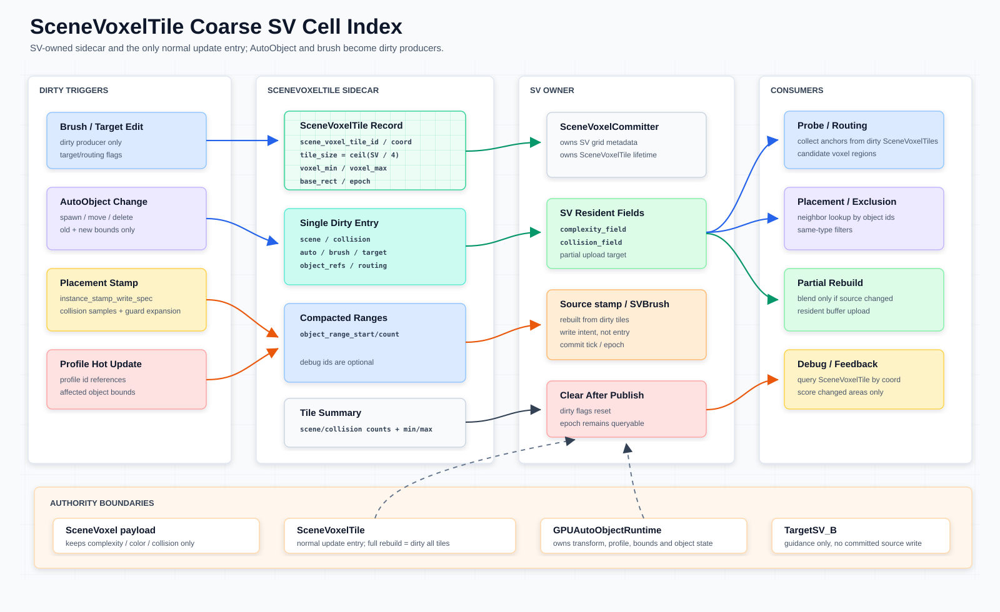

# SceneVoxelTile 粗粒度 SV Cell 管理系统

本文定义 `SceneVoxelTile`：由 `SceneVoxelCommitter` / SV owner 持有的粗粒度 cell index / dirty record，用来统一管理 dirty、局部 voxel 范围、AutoObject 引用和增量更新边界。点选 voxel 时，所属 `SceneVoxelTile` 由 voxel 坐标和 `scene_voxel_tile_size` 直接推导，不从 provenance 或公开 sidecar 查询。`SceneVoxel` / SV committed payload 见 [`scene-voxel-field-system.md`](scene-voxel-field-system.md)；资产默认语义见 [`asset-descriptor.md`](asset-descriptor.md)，字段归属边界见 [`asset-properties.md`](asset-properties.md)；GPU-first AutoObject 方向见 [`auto-object-gpu-runtime-architecture.md`](auto-object-gpu-runtime-architecture.md)。SPA（`ScenePlacementActor`）借用 `SceneVoxelCommitter` 引用编排 commit，不直接管理 tile dirty sidecar；详见 [`scene-placement-actor.md`](scene-placement-actor.md)。



## 目标

- 用粗粒度 cell 管理 dirty，而不是每次扫描完整 `SceneVoxel` volume。
- 让一个 `SceneVoxelTile` 能描述一段固定 voxel 范围，以及该范围内受影响的 `AutoObject` 引用。
- 为 placement、probe prefilter、resident buffer partial update 和 debug query 提供稳定的局部索引。
- 让默认 tile 尺寸与 placement/Anchor GPU region 对齐；默认 `8x8x8` voxels，并允许通过 `ProjectSettings` 调整。
- 保持现有权威边界：`SceneVoxelTile` 是 SV owner 的 coarse index / dirty record，不是 committed `SceneVoxel` payload，也不是 AutoObject runtime。

## 术语

| 术语 | 含义 |
| --- | --- |
| `volume` | 整个 SV voxel data domain / buffer，例如 committed `complexity_field` / `collision_field`。 |
| `voxel` | `volume` 中的一个 `(x, y, z)` cell。 |
| `tile` | 固定大小 voxel block；在本文中优先指 `SceneVoxelTile` 的 coarse cell index。 |
| `voxel region` | SV 维护 / dirty 限定用的粗粒度区域；prefilter anchor collection（`collect_sv_anchors.glsl`）默认与 `SceneVoxelTile` 同为 `TILE_SIZE = 8`。旧 tile 细筛已删除，Fine 按 Anchor handoff 派发。 |

## 核心契约

- `SceneVoxelTile` 归 `SceneVoxelCommitter` / SV owner 管理，跟随 `SV[tick]` 的 grid 参数、dirty 状态和 resident buffers 生命周期。
- `SceneVoxelTile` 默认粒度是 `8x8x8` voxels；项目可通过 `ProjectSettings` 的 `meshfill/scene_voxel_tile/size_voxels` 调整。
- object refs 只有 **tile 一级**，且是**固定槽位**而非 compacted range：`object_refs[tile_index * refs_per_tile + slot]`，`refs_per_tile = SCENE_VOXEL_TILE_OBJECT_REFS_PER_TILE_DEFAULT = 8`（`scripts/scene_voxel_tile_codec.gd`），`0` = 空槽，数值 ref_key = `object_id + 1`。**不存在** per-voxel object-ref buffer。完整对象池、transform、profile、bounds 归 `GPUAutoObjectRuntime` / AutoObject authoring 侧，不复制到 tile。
- tile 级 refs 用于粗过滤（该 tile 是否包含某对象）与 dirty 管理（tile 变脏时知道哪些对象受影响）。
- `SceneVoxelTile` 通过 `SceneVoxelTileStore.try_apply_gpu_autoobject_object_ref_update_pass()`（或常驻 buffer 变体 `…_from_buffer()`，由 `GPUAutoObjectRuntime.flush_to_scene_voxel_committer()` 驱动）接收 GPU AutoObject dirty delta handoff 并更新 tile 槽位；它不拥有完整 runtime object state。`SceneVoxelCommitter` 上**没有** `apply_gpu_autoobject_dirty_delta()` 这样的入口。
- `SceneVoxelTile` 不进入 committed `SceneVoxel` per-voxel accepted fields。公开 `SceneVoxel` 查询仍只返回 `complexity`、`color`、`collision`，可选 `auto_mix`。`channel` 不进入 committed read model；`object_refs` 是独立 object-ref channel（tile 级固定槽位），通过 GPU resident buffers / readback 访问。
- legacy 2D dirty storage（`_sv_dirty_tiles` / `_sv_dirty_rects`）已退役（V1）；`SceneVoxelTile` 3D dirty 是唯一 dirty 机制，contract 和 API 都写 `SceneVoxelTile`。
- `SceneVoxelTile` runtime metadata 和 committed scene/collision resident fields
  是 GPU-first：`ensure_scene_voxel_tile_buffers_uploaded()` 成功后，tile
  record、summary、dirty flag/worklist/count、object ref、
  `complexity_field` 和 `collision_field` 都以 GPU storage buffers 为事实源。
  `get_scene_voxel_tile_gpu_buffer_status()` 的 valid RID、record count、
  format/stride、`runtime_read_source` 与 `resident_field_read_source` 才能说明
  runtime resident success；CPU 只编码 dirty command 或执行显式 debug
  readback，没有 tile staging revision/stale 镜像。
- `SceneVoxelTile` 的 voxel bounds 必须覆盖真实 collision 采样范围和 guard expansion，不能只用 object center 或 search radius 近似。
- 正常 committed SV 增量更新入口只接受 `SceneVoxelTile` dirty；AutoObject、brush、profile 和 placement 都只是 dirty producer。
- Target guidance 变化只标记 routing / scoring / feedback 相关 dirty；`TargetSceneVoxel` / `TargetSV_B` 不进入 source write，不直接写 committed source，也不修改 `SceneVoxelTile` 的 source range。
- `SVBrush` / source stamp 是 dirty tile 重建出的 source write intent，不是绕过 tile 的第二套 SV 写入入口。

## 默认粒度

`SceneVoxelTile` 默认固定为 `8x8x8` voxels，与 placement/VPG 的 tile 粒度一致。边界 tile 的 `voxel_max` 仍会裁剪到 SPA 的 `grid_size`。

```text
tile_size      = ProjectSettings["meshfill/scene_voxel_tile/size_voxels"]
default        = Vector3i(8, 8, 8)
tile_coord     = floor(voxel_coord / tile_size)
voxel_min      = tile_coord * tile_size
voxel_max      = min(voxel_min + tile_size, SPA.grid_size)
```

SPA 直接持有 `SceneVoxelTileStore`；record、summary、object-ref、dirty flag/worklist/count 和 resident field 都以 GPU buffer 为唯一生产事实源。不存在 `_scene_voxel_tiles` GDScript staging table，committer 只保留 stamp/commit 协调职责。

Placement / VPG 的 `TILE_SIZE = 8` 与默认 SceneVoxelTile 尺寸一致；项目设置仍可覆盖 SceneVoxelTile 尺寸，bounds-to-tile 始终由 GPU dirty pass 根据 handoff 元数据换算。

## 责任、输入和输出

| 数据 / 阶段 | Owner | 输入 | `SceneVoxelTile` 输出 | Source of truth |
| --- | --- | --- | --- | --- |
| Grid 参数、voxel size、origin | SPA | `grid_size`、`voxel_size`、`grid_origin`。 | `tile_coord`、`tile_size`、`voxel_min`、`voxel_max`。 | SPA。 |
| Dirty state | SPA / `SceneVoxelTileStore` | affected voxel bounds、dirty flags、dirty epoch。 | 常驻 dirty flag/worklist/count RID。 | GPU storage buffers。 |
| Committed scene/collision summary | SPA / `SceneVoxelTileStore` | resident complexity/collision field。 | 固定索引 summary buffer。 | GPU storage buffers。 |
| Object refs / dirty delta | `GPUAutoObjectRuntime` handoff | `object_id`、previous/current voxel bounds、dirty flags。 | 每 tile 8 个固定 object-ref 槽位。 | GPU runtime + tile object-ref buffer。 |
| Target guidance | `TargetSV_B` / target owner | target / brush-composited guidance dirty。 | routing / scoring dirty trigger only。 | TargetSV / BrushSV cache；不写 committed source。 |

## 生命周期

```text
Grid initialized / resized
  -> SPA initializes fixed tile topology and full-dirty state on GPU
  -> stamp / brush / object delta submits bounds commands
  -> GPU expands bounds, atomicOr flags and appends unique worklist entries
  -> Anchor collect consumes worklist/count directly
  -> GPU finalize clears consumed flags and counter
```

生命周期规则：

- `SceneVoxelTile` 随 SV grid 生命周期存在；grid 参数变化、load、repair 或 migration 等维护路径等价于 mark all tiles dirty。
- dirty producer 只提交 affected voxel bounds；GPU dirty pass 负责映射、去重与合并 flags。
- object/source debug ranges 是显式 readback 快照，不能作为 runtime 或 source stream 的权威存储。
- summary 可由 committed fields 重建；不要把 `complexity_minmax` / `collision_minmax` 当作 committed payload。
- `dirty_epoch` 与 GPU buffer revision 由 TileStore 发布；常态路径不回读 worklist、record、summary 或 object refs。

## CPU / GPU 边界

| 侧 | 当前职责 | 不拥有 |
| --- | --- | --- |
| CPU / GDScript | 只提交常数大小的 bounds/full-dirty 命令，并在显式 debug 模式请求不可写快照。 | tile Dictionary 镜像、dirty 决策、record/summary/object-ref 常态 pack/upload。 |
| GPU storage buffers | records、summaries、object refs、dirty flags/worklist/count、complexity/collision fields；是唯一生产事实源。 | AutoObject descriptor defaults、source authoring history。 |
| GPU compute | topology init、bounds-to-tile、dirty 去重、object refs、summary reduce、Anchor collect 和 finalize/clear。 | 任何 CPU 替代路径或隐式空 worklist→全图路径。 |

## 数据模型

`SceneVoxelTile` 生产状态只存在于 GPU storage buffers，不存在可写 CPU tile staging。下列表格描述 debug decoder 投影出的只读字段；快照可丢弃，不能重新上传或参与生产决策。

| Field | Type | Meaning |
| --- | --- | --- |
| `scene_voxel_tile_id` | `int` / `String` | 稳定 tile key；建议由 `tile_coord` 和 `tile_size` 编码得到 |
| `tile_coord` | `Vector3i` | `SceneVoxelTile` 在 coarse grid 中的位置 |
| `tile_size` | `Vector3i` | 默认 `Vector3i(8, 8, 8)`；可由 `meshfill/scene_voxel_tile/size_voxels` 覆盖 |
| `voxel_min` | `Vector3i` | 覆盖范围的 inclusive voxel 起点 |
| `voxel_max` | `Vector3i` | 覆盖范围的 exclusive voxel 终点 |
| `base_rect` | `Rect2i` | XZ 投影范围，用于 dirty rect、brush 和 target update |
| `dirty_flags` | `int` / `Dictionary` | `scene`、`collision`、`auto`、`brush`、`target`、`object_refs` 等 dirty 位 |
| `epoch` | `int` | GPU dirty command/finalize 推进的诊断 epoch |
| `last_commit_tick` | `int` | debug record 中复制的 committed SV 全局 epoch；不表达 per-voxel 或 per-tile provenance |
| `complexity_minmax` | `Vector2` | committed `complexity` 的粗略 min/max summary |
| `collision_minmax` | `Vector2` | committed `collision` 的粗略 min/max summary |
| 内容判定 | — | 该 tile 内是否存在非空 scene/collision 信息，通过 `scene_voxel_count > 0` 或 `collision_voxel_count > 0` 判断（`decode_records` / `decode_summaries` 的键名） |
| `object_range_start` | `int` | **仅 debug 解码字段**：该 tile 固定槽位段的起点。真实寻址是 `tile_index * refs_per_tile + slot`，不是运行期使用的 range handle |
| `object_range_count` | `int` | **仅 debug 解码字段**：从该 tile 的 8 个固定槽位里解出的非空引用数 |

GPU upload / readback API：

```gdscript
spa.ensure_svtile_gpu_ready(true)                    # initialize/reuse fixed GPU topology
spa.get_svtile_gpu_status()                          # RID/count/stride/source summary
spa.get_svtile_gpu_buffer("scene_voxel_tile_records")
spa.get_svtile_debug_tiles()                         # explicit GPU readback for debug only
# voxel (8, 0, 8) -> SceneVoxelTile coord floor(voxel / scene_voxel_tile_size)
```

验收规则：

- `get_scene_voxel_tile_gpu_buffer_status().runtime_ready == true` 且每个 required buffer 的 RID 有效时，才算 metadata / resident fields GPU-ready。
- summary 必须暴露 `gpu_revision`、`dirty_epoch`、`runtime_read_source`、
  `resident_field_read_source`、`last_reused_buffers`、
  `resident_field_buffers_reused`、`last_upload_mode` 和真实 buffer metadata。
  未就绪时 runtime read source 只能是 `none`。
- `scene_voxel_tile_complexity_field` / `scene_voxel_tile_collision_field` 的 `record_count` 必须等于 committed resident voxel count，readback 的值必须来自 GPU storage buffer。两者**都不是 float 场**：complexity field 每体素 4 B 的 **packed RGBA8**（`COMPLEXITY_FIELD_STRIDE_BYTES = 4`，complexity 在 alpha 低字节）；collision field 每体素 1 个 **u32**（`COLLISION_FIELD_U32_STRIDE_BYTES = 4`），有效值是低字节的 unorm8（0..255）。
- 空 dirty index 仍会分配最小 GPU padding bytes，但 `logical_byte_size` / `record_count` 必须为 `0`，readback 不能把 padding 解码成有效 dirty tile。
- `readback_scene_voxel_tile_debug_snapshot()` 只是 GPU buffer readback debug view；只有 GPU buffers ready 时 `readback_snapshot` 才能为 true，它不能让 CPU staging table 或 snapshot 成为运行时权威。
- 无 `RenderingDevice` 时测试只能 SKIP GPU upload/readback 子项，不能把 staging table 作为通过条件。

示例：

```gdscript
var scene_voxel_tile := {
	"scene_voxel_tile_id": 1742,            # encoded tile_coord + tile_size
	"tile_coord": Vector3i(1, 0, 2),        # coarse SV cell coord
	"tile_size": Vector3i(8, 8, 8),         # default fixed voxel block
	"voxel_min": Vector3i(8, 0, 16),        # inclusive
	"voxel_max": Vector3i(16, 8, 24),       # exclusive, clipped by SV.grid_size
	"dirty_flags": {
		"scene": true,
		"collision": true,
		"object_refs": true,
	},
	"epoch": 37,                            # incremented when marked dirty
	"object_range_start": 2048,             # debug 解码字段（= tile_index * refs_per_tile）
	"object_range_count": 5,                # debug 解码字段：8 个固定槽位中非空的个数
}
```

## Dirty Flow

```text
AutoObject / brush / profile / placement dirty producer
  -> compute affected voxel bounds
  -> submit GPU dirty delta / bounds command
  -> bounds-to-tile + atomicOr + unique worklist
  -> update object refs / summaries
  -> Anchor collect emits candidate handoff
  -> finalize/clear after successful consumption
```

入口规则：

- `SceneVoxelTileStore.mark_scene_voxel_tile_bounds_dirty()`（及 batch 版；单 tile 便捷版已删）只编码 bounds command，不展开 CPU tile 列表。SPA 对外暴露的是 `mark_svtile_bounds_dirty()`（`scripts/scene_placement_actor.gd`；`finalize_svtile_dirty()` 门面已删，GPU finalize 由 runtime 直调 `finalize_consumed_dirty_tiles()`）——store 侧方法不是 SPA 的公开 API。
- GPU AutoObject dirty delta buffer 直接交给 TileStore pass；它消费 `object_id`、old/new bounds、removed/alive 和 dirty flags。
- legacy 兼容入口 `invalidate_sv_tile()` / `invalidate_sv_rect()` 已随 2D dirty storage 退役（V1）；不存在绕过 named API 的第二 dirty 入口。
- `AutoObject` 更新在同一个 GPU pass 中删除旧范围 ref、添加新范围 ref，并标记两个范围。
- `SVBrush` / source stamp、object refs、summary、routing 和 resident upload 都是 dirty tile 后续处理阶段。
- full rebuild 只能作为维护路径，语义上等价于 `mark all SceneVoxelTiles dirty`。
- 禁止新增 AutoObject direct committed SV write、direct SV resident field upload 或 per-frame full SV flush 作为普通路径。

脏标记规则：

- Brush edit 标记 `brush`、`scene`，如果影响碰撞则同时标记 `collision`。
- Auto placement stamp 标记 `auto`、`scene`、`collision` 和 `object_refs`。
- AutoObject 移动或删除需要同时标记 previous bounds 和 new bounds 覆盖的 `SceneVoxelTile`。
- Profile / descriptor 热更新先找引用该 profile 的 object range，再反推 affected `SceneVoxelTile`。
- Target guidance 变化只标记 routing / scoring / feedback 相关 dirty，不直接进入 committed source。

其它更新方式评估：

| 更新方式 | 结论 | 说明 |
| --- | --- | --- |
| `SceneVoxelTile` dirty | 正常入口 | 所有局部更新统一进入 tile dirty 和 dirty flags。 |
| Brush / manual edit | dirty producer | 笔刷内容写 SPA 常驻 `BrushSV` 旁路层（`write_brush_sv_records()`），不进 committed `SceneVoxel`；仅触发 tile 的 brush/scoring dirty。 |
| TargetSV / guidance | guidance dirty producer | 只更新 routing / scoring / prefilter，不标记 committed SV source dirty。 |
| Profile hot update | dirty producer | 从 profile 引用反查 objects，再映射到 affected tiles。 |
| Full invalidate | 维护入口 | load、grid 参数变化、repair、migration 时使用；等价于 dirty all tiles。 |
| Per-frame full SV flush | 禁止作为普通路径 | 会绕过增量 dirty 和 commit 边界。 |

## 与 AutoObject Runtime 的关系

`SceneVoxelTile` 管理 AutoObject 在 SV **tile 一级**生命周期中的参与关系：object id 落在哪些 tile、对象变化 dirty 哪些 tile、以及 tile 的 8 个固定 ref 槽位如何更新。它不能回答“对象的完整运行时状态是什么”；完整 runtime object state 由 `GPUAutoObjectRuntime` 的 GPU object buffers 承担，资产默认语义由 [`AssetDescriptor`](asset-descriptor.md) 承担。

```text
SceneVoxelTile object-ref buffer（唯一一级，固定槽位）
  object_refs[tile_index * refs_per_tile + slot]   # refs_per_tile = 8
    0     = 空槽
    非 0  = ref_key = object_id + 1
      -> GPUAutoObjectRuntime object SoA buffers
         transform / profile_id / bounds / flags
```

设计要点：

- 只有 tile 一级 refs，寻址是定长槽位算术，没有 per-voxel ref buffer，也没有 compacted range 与前缀和。槽位满即溢出（pass 记录 overflow 计数），不会动态扩容。
- tile 级 object refs 用于粗过滤（确认某个 tile 是否包含特定对象）和 dirty 管理（tile 变脏时知道哪些对象受影响）。
- 不存在独立的 GPU spatial hash（`count_objects_per_cell → prefix_sum → scatter` 三阶段 pipeline）。
- dirty delta 由 `shaders/scene_voxel_tile_object_ref_update.glsl` 消费：`set 0` 的 binding 0 = `dirty_delta_words[]`（每条 20 个 u32 / 80 B）、binding 1 = `object_refs[]`、binding 2 = stats、binding 3/4/5 = dirty flag / worklist / count。
- debug 查询可以从 `SceneVoxelTile` 追到 object id，但不会复制对象状态。

资产默认语义见 [`asset-descriptor.md`](asset-descriptor.md)，字段和 `ISWS` 归属见 [`asset-properties.md`](asset-properties.md)；GPU-first object pool 边界见 [`auto-object-gpu-runtime-architecture.md`](auto-object-gpu-runtime-architecture.md)。

## 与 SceneVoxel 的关系

`SceneVoxel` 是 committed per-voxel read model；`SceneVoxelTile` 是 coarse index / dirty record。

| 项 | `SceneVoxel` | `SceneVoxelTile` |
| --- | --- | --- |
| 粒度 | 单个 voxel | 固定大小 voxel block |
| 主要用途 | 读取最终 `complexity/color/collision` | dirty、索引、summary、局部 rebuild |
| 对外 payload | 最小化公开字段 | 内部 runtime metadata |
| object 信息 | 不进入 committed `SceneVoxel` accepted fields | 保存 tile 级 object ref：每 tile 8 个固定槽位 |
| 生命周期 | commit 后的 read model | 跟随 SV resident state 和 dirty epoch |

## 与 Placement 的关系

Prefilter anchor collection（`collect_sv_anchors.glsl`）用 `TILE_SIZE = 8` 的 dirty region 限定收集范围，不是 `SceneVoxelTile` 默认尺寸；细筛已按 anchor 派发（`score_anchor_asset_residual.glsl`，一个 workgroup 一个 anchor × top-K asset 槽），不再按 tile 枚举候选原点。

`SceneVoxelTile` 尺寸固定/配置后服务 SV dirty、summary 和 source/object range；prefilter dirty region 只限定 anchor 收集。不要把 `SV_RESIDENT_TILE_SIZE = 8` 或 shader `TILE_SIZE = 8` 写成 `SceneVoxelTile` 的默认尺寸。

placement/exclusion 的邻域查询走 tile 级 object refs 的粗过滤，不走独立的 spatial hash pipeline，也没有 per-voxel ref 可查。`voxel region` 和 `SceneVoxelTile` 之间的映射仍由 dirty producer 或 SV owner 用 voxel bounds 做转换。

| 项 | `SceneVoxelTile` | Placement voxel region |
| --- | --- | --- |
| 默认尺寸 | `8x8x8` voxels，可由 `meshfill/scene_voxel_tile/size_voxels` 覆盖 | `8x8x8` region / workgroup |
| Owner | `SceneVoxelCommitter` / SV owner | prefilter / VPG route pipeline |
| 主要用途 | dirty、object/source ranges、summary、partial rebuild 边界 | candidate route、physical scoring、sparse dispatch |
| 对象查询 | 读取 tile 级固定槽位 object refs 做粗过滤 | 不持有 object refs，由 caller 自行查询 |
| 数据流 | dirty producer -> SV commit boundary | `TargetSV_B` + `SV[t - 1]` -> candidate regions -> VPG |

被接受的 placement 结果由 VPG state-chain stamp 原位提交进常驻 SV field（stamp 即提交），并通过 `SceneVoxelTile` dirty 与 `commit_scene_voxels()` 发布 tile 摘要；CPU 入口结果生成 `ISWS` 盖章记录后同样经 `commit_scene_voxels()` 散射落场。


## 验收标准

- `SceneVoxelTile` 默认语义是 `8x8x8` voxel block，项目设置可覆盖。
- dirty flags、object/source debug range、summary 都属于 SV owner staging / debug sidecar。
- 有 `RenderingDevice` 时，tile record、summary、dirty index、object ref 和 source ref 必须上传到 GPU storage buffers，并通过 readback 验收。
- runtime resident success 以 GPU buffer summary / valid RIDs / upload revision 为准；CPU staging、debug label 或 snapshot 不能替代 resident metadata。
- `complexity_minmax`、`collision_minmax` 不写回 committed per-voxel payload。判断是否有内容使用 `scene_voxel_count > 0` 或 `collision_voxel_count > 0`。

## 测试场景

| 场景 | 说明 | Godot 场景 |
| --- | --- | --- |
| [Placement Score 3D](placement-score-3d.md) | 仓库中唯一仍在的 placement demo 场景，覆盖本文的 GPU 常驻路径 | [`placement-score-3d.tscn`](../scenes/placement-score-3d/placement-score-3d.tscn) |
