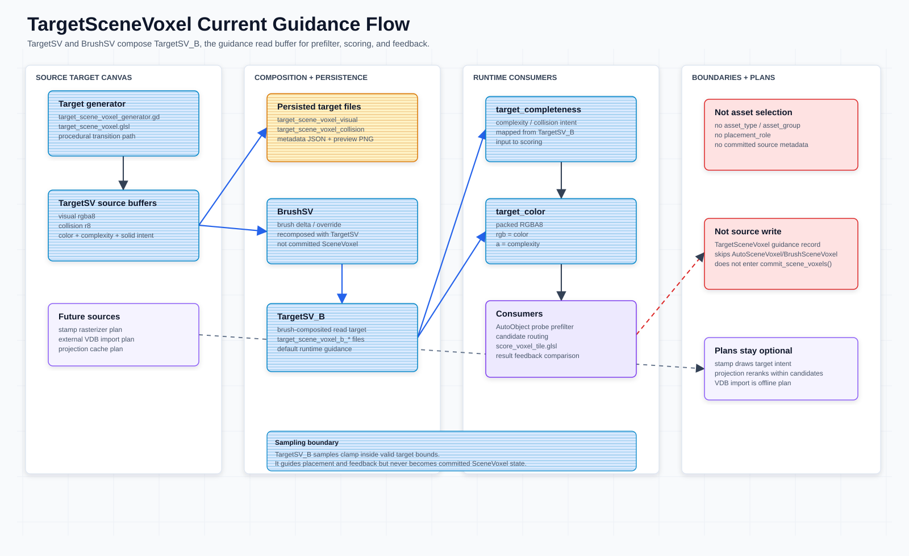

# TargetSceneVoxel Projection — Target Guidance 边界

本文定义 `TargetSceneVoxel`（简称 `TargetSV`）、`BrushSV` 和 `TargetSV_B` 的职责边界。`TargetSV_B` 是 prefilter / routing / scoring / result feedback 的 target guidance 输入，不是 committed `SceneVoxel`，也不是资产选择结果。



## 语义边界

`TargetSV` 表达目标视觉效果：“希望最终场景看起来是什么样”。它不表达“已经放置了哪个 asset”。

允许写入目标画布：

当前已落地的目标画布字段含义维护在 `scripts/target_scene_voxel_generator.gd` 的 buffer 返回字典和 `shaders/target_scene_voxel.glsl` 写入逻辑旁；目标强度统一映射到 `complexity` / `collision`。

不应写入目标画布：

| 禁止字段 | 原因 |
| --- | --- |
| `asset_type` / `asset_group` | 资产类型属于 routing / placement 结果。 |
| `placement_role` | role 应由 probe、projection 或 matcher 推断。 |
| committed source metadata | `TargetSV_B` 不进入 stamp-only 提交。 |

当前实现通过 `target_scene_voxel.glsl` 生成 `TargetSV` / `TargetSV_B` raw buffers，支持持久化和 `target_completeness` / `target_color` 解码。

| 项 | 状态 |
| --- | --- |
| Stamp rasterizer / 外部 VDB 导入 / projection cache | 未实现 |

## Source / Guidance 契约

| 数据 | 归属 | 消费者 |
| --- | --- | --- |
| `TargetSV` | 源目标画布 | 重建、持久化、debug / import 回查。 |
| `BrushSV` | 目标画布笔刷 delta / override | 与源 `TargetSV` 重新合成 `TargetSV_B`。 |
| `TargetSV_B` | brush-composited target read buffer | prefilter、routing、fine semantic target fit、result feedback、debug。 |
| `target_completeness` | 从 `TargetSV_B` 读取的 target complexity / collision intent | `score_anchor_asset_probes.glsl`、`score_anchor_asset_residual.glsl`（shader 侧为 `target_field` + `target_collision` 独立输入对）。 |
| `target_color` | 从 `TargetSV_B` 读取的 packed RGBA8 color / complexity | `score_anchor_asset_probes.glsl`、`score_anchor_asset_residual.glsl`。 |

当前源码提供 `TargetSceneVoxelGenerator.decode_target_read_buffers()`（GPU 变体 `decode_target_read_buffers_gpu()`），用于把磁盘上的 raw buffer 解码为 `target_completeness` 和 `target_color`。落盘文件名由 `scripts/target_sv_loader.gd` 的常量给定，位于 `res://assets/target_sv/`：`target_sv_point_cloud_visual.rgba8` 与 `target_sv_point_cloud_collision.r8`（metadata `target_sv_point_cloud.json`）——不存在 `target_scene_voxel_b_visual.rgba8` / `target_scene_voxel_b_collision.r8` 这两个文件。`target_completeness` 默认取 `max(visual.a, collision)`，使 prefilter、细筛 semantic target fit 和 result feedback 能同时看到 complexity 与 collision intent；`target_color.a` 保留 visual complexity。

硬边界：

- `TargetSV` / `BrushSV` / `TargetSV_B` 都不参与 committed `SceneVoxel` source write。
- `TargetSV_B` 不进入 stamp-only 提交的 committed `SceneVoxel`。
- `TargetSceneVoxel` guidance record 可作为 queryable metadata 保留，但会跳过 source buffers。
- 当前 record builder 会为 `TargetSceneVoxel` 设置 `target_guidance_only = true`、`height_buffer_applied = false`、`collision_buffer_applied = false`。
- 最终 `collision_field` 由 committed `SceneVoxel.collision` 与 terrain base collision 发布到 SV resident collision channel。

这个 guidance-only 边界由 `tools/test_markdown_contracts.gd`（已于 2026-08-07 删除：只能经 --script 启动，本仓禁跑 = 从来没跑过，此约束现无守卫） 的 TargetSV point-cloud 合约校验覆盖。

## Prefilter / Routing 关系

```text
TargetSV + BrushSV
  -> TargetSV_B
  -> target_completeness + target_color
  -> AutoObject probe prefilter
  -> anchor_candidate_handoff（常驻 anchor / anchor_count / topk buffer）
  -> score_anchor_asset_residual.glsl（residual-gain 细筛）
  -> BlendSV[tick] result feedback comparison
```

当前 prefilter 从 `TargetSV_B` 读取 `target_completeness` 与 `target_color` 做低粒度语义路由；`score_anchor_asset_residual.glsl` 以 anchor 为 origin 读取 TargetSV 独立输入对（`target_field` + `target_collision`），对 CurrentSV 与 TargetSV 计算五维 residual gain。它不读取 projection cache，也不执行 MLP。结果级 feedback 是 placement / commit 之后的独立阶段：`ScenePlacementActor.score_blendsv_feedback_against_target()` 临时合成 `BlendSV` 并与 `TargetSV_B` / `TargetSV` 对比，不能写成细筛评分器的现行能力。

## Anchor 语义

GPU prefilter 从多个位置来源提取 anchors，但写入同一个 position-only `anchor_buffer`。`anchor_kind` 不再作为字段存储，也不再区分 `ground` / `target_top`：

| 位置来源 | 当前定义 |
| --- | --- |
| Target-inside candidate position | 两门合取：voxel 在 target 体积内部（`max(target_complexity, target_collision) > min_target_interest`）**且**它落在地形切片或其之上的采样层（相位锁 `terrain_slice`、层距 `anchor_vertical_stride`，`shaders/collect_sv_anchors.glsl`）；旧 scene/collision/support 门控已删除。 |

`ground` / `target_top` 配置名会归一到单一 `anchor`。

## Anchor 候选交接边界

粗筛与细筛之间的交接是常驻 `anchor_candidate_handoff`；旧 docs-facing route key `candidate_voxel_regions_by_asset`（及代码中的 `candidate_voxel_sparses*` / `voxel_sparse` legacy/debug 名称）已随 candidate route 删除。

```text
AutoObject probe prefilter
  -> GPU score / top-K internal pass
  -> anchor_candidate_handoff（anchor / anchor_count / topk buffer，SCOPE_PERSISTENT）
  -> VoxelPlacementGenerator.run_multi_asset()
```

交接不做区域扩张：每个 anchor 就是一个候选 origin（`one_origin_per_anchor`）。collision 采样、clearance 和 target fit 仍由 `score_anchor_asset_residual.glsl` 精筛；三阶段 Reduce 在每个 anchor 内选唯一 Fine 候选，再经迭代贪心得分 NMS 仲裁 Anchor 间冲突（高分优先存活）。

## Stamp 计划

Stamp 系统仍是目标架构计划，负责把中性的目标视觉效果绘制到 `TargetSV`，不直接生成真实 asset。

```text
landscape slope / masks / procedural rules
  -> target stamp scheduler
  -> stamp rasterizer
  -> TargetSV color + complexity + collision intent
```

计划中的 stamp record：

| Field | Meaning |
| --- | --- |
| `origin_voxel` | stamp 锚点，通常来自 landscape surface 或支撑点。 |
| `basis` | stamp 局部坐标。 |
| `bounds` | stamp 影响的 voxel AABB。 |
| `source_voxels` | 计划中的 stamp-local voxel samples；不是 committed source stream，也不是 canonical `instance_stamp_write_spec` / `ISWS` 名称。 |
| `opacity` | visual 混合权重。 |
| `collision_opacity` | collision intent 混合权重。 |
| `scale` | stamp 缩放。 |
| `priority` | 多 stamp 冲突时的优先级。 |

混合规则计划：

```text
target.rgb        = weighted_average(target.rgb, source.rgb, opacity)
target.complexity = weighted_average(target.complexity, source.complexity, opacity)
target.collision  = max(target.collision, source.collision * collision_opacity)
```

## Projection Cache 计划

Projection cache 是面向 candidate anchors 的压缩特征，不是原始 `TargetSV` 数据，也不是资产标签。

计划缓存：

```text
target_anchor_projection_rgba8[anchor]
```

计划用途：

- 只用于候选 route 内部验证、rerank 或 pruning。
- 不绕过 upstream prefilter。
- 不从全资产库生成新候选。
- 未启用 projection 时，routing 保持当前 `target_completeness` / `target_color` 路径。

## 外部 VDB 导入计划

外部 VDB 导入仍是计划。当前仓库没有 VDB 转换脚本或 Godot 侧外部 TargetSV 加载接口。

目标流程：

```text
Houdini / DCC
  -> export VDB grids
  -> offline converter
  -> target_scene_voxel_visual.rgba8
  -> target_scene_voxel_collision.r8
  -> target_scene_voxel.json
  -> Godot runtime loads TargetSV buffers
```

## TODO / Open Questions

- Stamp rasterizer、外部 VDB importer、projection cache 都仍是计划项。
- Projection score 如实现，只能进入候选 route 内部 rerank / validation。
- 需要继续验证统一 position-only anchors 的 supported 候选来源对不同 asset probe offset 的覆盖。
- `TargetSV_B` cache 可以持久化，并可解码为当前 placement/readback 使用的 `target_completeness` / `target_color`；权威来源仍是 `TargetSV` 与 `BrushSV`。
