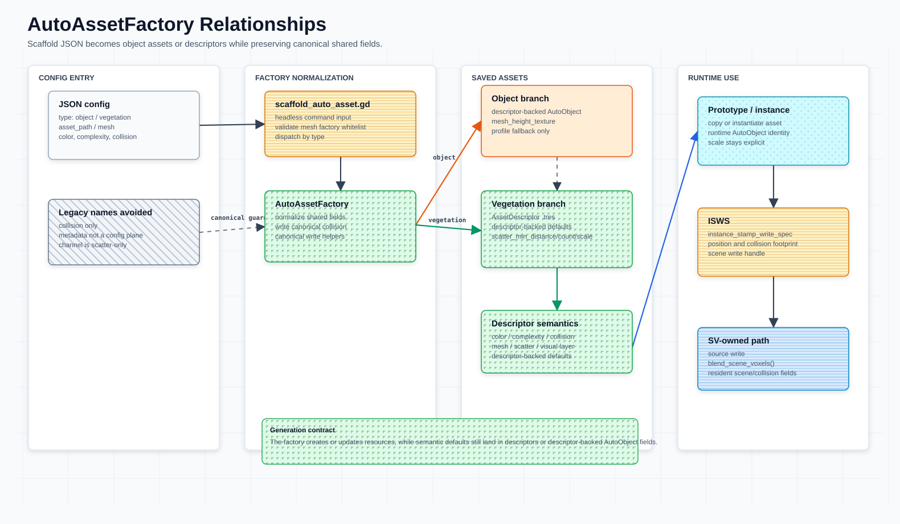

# Asset Properties




本文是当前资产字段、descriptor 兼容入口和 metadata 规则的可靠速查。旧版同名文档曾因编码问题变成 mojibake，已不再作为来源；本版以当前 GDScript 为准。

资产语义唯一主来源规则：

- `AutoVoxelDescriptor` 是资产体素语义的唯一权威来源。
- `AutoObject.voxel_descriptor` 是运行时节点持有 descriptor 的入口。
- `AutoObject` 上与 descriptor 重复的语义字段只保留为 Inspector / 配置字典兼容入口。
- 新代码读取资产语义时必须走 descriptor 或 `AutoObject` 的 descriptor-backed getter。
- 新代码写入资产语义时应优先写 descriptor，再按兼容需要同步旧字段；不要把旧字段当成第二套状态。
- 新增语义字段时默认加到 `AutoVoxelDescriptor`；除非明确是运行时身份、放置约束或调试索引，否则不要再加到 `AutoObject`。
- 若字段在 `AutoObject`、`voxel_write_spec` 和 `SceneVoxel` 中语义一致，应加入 `SharedPropertyType.SHARED_FIELD_KEYS`，并通过共享字段契约统一归一化和传播。
- visual / ecological layer 写入概念已标记为丢弃；`channel_entries` / `channel` 仅作为旧运行时兼容字段保留。

相关边界：

- `meshfill-framework.md` 说明数据归属和主流程。
- `scene-voxel-field-system.md` 说明 `voxel_write_spec`、source voxel write path、`SceneVoxel`、同级 `collision_voxels` 字段和派生 collision cache。
- `asset-semantic-probes.md` 说明资产侧 semantic probes。
- `autoobject_descriptor_relationship.svg` 展示 `AutoObject` 运行时节点、descriptor 权威语义、compatibility mirror 和 `voxel_write_spec` 导出的关系。
- `autoassetfactory_relationships.svg` 展示 `AutoAssetFactory` 与脚手架、资产类、`AutoObject` helper 和 SV runtime path 的职责边界。

## 资产层级

| 类型 | 角色 | 主要文件 |
| --- | --- | --- |
| `AutoObject` | 所有自动放置对象的运行时基类；持有 descriptor 入口、运行时状态和 `voxel_write_spec` 构造入口 | `scripts/auto_object.gd` |
| `AutoRock` / `AutoCliffRock` | 岩石对象类型 | `scripts/auto_rock.gd` / `scripts/auto_cliff_rock.gd` |
| `AutoVegetation` 及子类 | 植被对象类型 | `scripts/auto_vegetation.gd` 等 |
| `AutoVoxelDescriptor` | 资产默认体素语义、pivot、semantic probe 配置，以及植被资源保存入口 | `scripts/auto_voxel_descriptor.gd` |
| `SharedPropertyType` | `AutoObject`、`voxel_write_spec`、`SceneVoxel` 的同语义字段契约 | `scripts/shared_property_type.gd` |
| `AutoVoxelProfile` | 旧资源 / 导入 fallback 的轻量 profile；新资产默认语义应迁入 `AutoVoxelDescriptor` | `scripts/auto_voxel_profile.gd` |
| `AutoAssetFactory` | 脚手架 / 导入 helper；创建、加载和保存资产，并保留到 `AutoObject` helper 的兼容转调 | `scripts/auto_asset_factory.gd` |

当前植被资产直接保存为 `AutoVoxelDescriptor` `.tres`：同一个资源持有 color、complexity、collision、pivot、probe、mesh、scatter、visual layer、group 和可选 `vegetation_script`。不再使用单独的植被包装资源。

## `AutoObject` 运行时字段 / descriptor 兼容入口

`AutoObject` 是场景里的运行时节点，负责对象身份、来源、mesh、放置约束和运行时 `voxel_write_spec`。资产侧体素语义的唯一权威来源是 `voxel_descriptor`；表中标为“兼容入口”的字段会同步到 descriptor，用来支持旧资产、Inspector 编辑和配置字典，不能作为新的语义状态来源。

| 字段 | 类型 | 含义 |
| --- | --- | --- |
| `auto_id` | `String` | 稳定对象 id；为空时可回退到节点名。 |
| `instance_id` | `int` | Godot 运行时实例 id。 |
| `auto_source` | `String` | 来源标记，如 `generated`、`scatter`、`brush`。 |
| `object_type` | `String` | 运行时 grouping / debug metadata；可用于 same-type exclusion，但不是资产默认语义来源。 |
| `object_subtype` | `String` | 运行时 grouping / debug metadata；用于细分同类互斥和记录回查，不作为 descriptor 替代来源。 |
| `visual_layer` | `int` | 调试或可视分层。 |
| `min_spacing` | `float` | XZ 中心间距约束；`0` 表示自动计算。 |
| `bound_min_length` | `float` | mesh bounds 最小轴长度，用于默认间距。 |
| `source_mesh` / `source_mesh_path` | `Mesh` / `String` | 原始 mesh 或资源路径。 |
| `voxel_descriptor` | `AutoVoxelDescriptor` / `Resource` | 资产体素语义唯一权威来源；集中持有 color、complexity、collision、pivots 和 probes。 |
| `voxel_color` | `Color` | descriptor 兼容入口；同步到 `voxel_descriptor.color`，`a` 与 complexity 同步。 |
| `voxel_complexity` | `float` | descriptor 兼容入口；同步到 `voxel_descriptor.complexity`，范围 `0.0-1.0`。 |
| `collision_voxels` | `Array[Dictionary]` | descriptor 兼容入口；同步到 `voxel_descriptor.collision_voxels`；当前表示浮点 collision voxel 样本。 |
| `pivot_variants` | `Array[Dictionary]` | descriptor 兼容入口；同步到 `voxel_descriptor.pivot_variants`。 |
| `semantic_probe_profile` | `Resource` | descriptor 兼容入口；同步到 `voxel_descriptor.semantic_probe_profile`。 |
| `semantic_probe_density` | `float` | descriptor 兼容入口；同步到 `voxel_descriptor.semantic_probe_density`。 |
| `context_sensing_radius` | `float` | descriptor 兼容入口；同步到 `voxel_descriptor.context_sensing_radius`。 |
| `allowed_anchor_kinds` | `PackedStringArray` | 限制资产可参与的 anchor 类型，如 `ground`、`target_top`。 |
| `voxel_write_spec` | `Dictionary` | SV write payload / query handle；字段结构见 `scene-voxel-field-system.md`。 |

读取资产语义时必须走 `voxel_descriptor` 或 `get_voxel_color()`、`get_collision_voxels()`、`get_pivot_variants()` 等 getter；这些 getter 会通过 `_ensure_voxel_descriptor()` 使用 descriptor，并返回归一化后的结果。不要在新逻辑中直接读取 `voxel_color`、`voxel_complexity`、`collision_voxels`、`pivot_variants`、`semantic_probe_profile`、`semantic_probe_density` 或 `context_sensing_radius` 作为权威语义。

兼容入口降级计划：

| 阶段 | 规则 |
| --- | --- |
| 当前 | 保留 `AutoObject` 同名字段的 export 和同步，保证 Inspector 和配置字典仍可工作；植被资产资源本身使用 `AutoVoxelDescriptor`。 |
| 新代码 | 只把同名字段当作输入兼容层；读取和运行时决策都使用 descriptor-backed getter。 |
| 迁移后 | 运行时节点可逐步隐藏或移除同名 export 字段，只保留必要的导入转换。 |
| 禁止 | 不再新增 `AutoObject` 同名语义字段，不把 metadata、`voxel_write_spec` 或旧字段当作 descriptor 的替代来源。 |

`AutoObject.configure_auto_object()` 会强制 `scale = Vector3.ONE`。资产运行时缩放不作为 semantic probe 或 voxel 语义来源。

`object_type` / `object_subtype` 当前仍由 placement、same-type exclusion 和 debug record 使用。它们的边界是“运行时分组 metadata”，不是资产默认体素语义；需要表达资产视觉、collision、probe 或 routing 偏好时，仍应优先使用具体资产类、`voxel_descriptor`、`semantic_probes`、`allowed_anchor_kinds`、footprint 和 collision 语义。后续如果引入 `exclusion_group` 或 `placement_group`，应先从这些字段迁移。

## `AutoVoxelDescriptor`

`AutoVoxelDescriptor` 是资产侧体素描述资源，也是资产语义唯一权威来源。它保存会影响 routing、probe、footprint、source voxel 写入和 target fit 的默认语义；植被资产还在同一资源上保存 mesh、scatter、visual layer、group 和实例化脚本。

资产侧 collision 必须进入 `AutoVoxelDescriptor.collision_voxels`。`AutoObject.collision_voxels` 和 `AutoVoxelProfile.collision_voxels` 只作为配置输入 / authoring fallback；当前植被 `.tres` 资源自身就是 descriptor，不再通过 wrapper 引用外部 descriptor。

| 字段 | 含义 |
| --- | --- |
| `color` / `complexity` | 默认颜色与复杂度；`get_color()` 会把 alpha 设为 complexity。 |
| `collision_voxels` | 浮点 collision voxel 样本；与 `color` / `complexity` 同级，归一化后供 footprint、source voxel 写入和 probe 使用。 |
| `pivot_variants` | 显式 pivot 列表；为空时可从 collision 高度自动生成。 |
| `auto_generate_vertical_pivots` | 根据 collision 高度生成 bottom / middle / upper pivot。 |
| `semantic_probe_profile` | 保存或生成 `semantic_probes`。 |
| `semantic_probe_density` | 自动 probe 生成密度。 |
| `context_sensing_radius` | 为小型资产增加 AABB 外围 context probes。 |
| `asset_id` / `object_type` / `object_subtype` | 植被资产 id 与分组 metadata。 |
| `mesh` / `source_mesh` / `source_mesh_path` | 植被资产显示 mesh 与 source mesh。 |
| `vegetation_script` | 可选 `AutoVegetation` 子类脚本；缺失时实例化基础 `AutoVegetation`。 |
| `vegetation_channel` / `vegetation_radius` | 植被散布 profile 参数。 |
| `scatter_min_distance` / `scatter_max_count` / `scatter_max_scale` | 植被散布数量、间距和缩放参数。 |
| `visual_layer` / `group` / `material` | 实例化时传给 `AutoVegetation` 的可视层、分组和材质。 |

`to_record_fields()` 会导出 `color`、`complexity`、`collision_voxels`、`pivot_variants`、`semantic_probe_density` 和可选 `semantic_probes`。

## TODO: Runtime profile 容器

需要新增一个大的 runtime profile 容器，用来收集并常驻每一个资产的运行时 profile。该容器不是 `AutoVoxelDescriptor` 本身，而是由 descriptor 编译出的运行时数据集；descriptor 仍然只作为资产语义源数据和构建输入。

目标数据流：

```text
AutoVoxelDescriptor
  ↓ build / normalize
AutoVoxelRuntimeProfile
  ↓ register / pack
AutoVoxelRuntimeProfileContainer
  ↓ GPU upload / resident buffers
shader / SV runtime 通过 profile_id 采样资产 profile
```

职责边界：

| 类型 | 职责 |
| --- | --- |
| `AutoVoxelDescriptor` | 资产默认语义权威来源；保存 color、complexity、collision、pivot、semantic probe 配置；植被资产还保存 mesh / scatter / script。 |
| `AutoVoxelRuntimeProfile` | descriptor 编译后的单资产运行时 profile；保存 `profile_id`、descriptor hash、probe / collision / pivot 的 offset 和 count。 |
| `AutoVoxelRuntimeProfileContainer` | 全局运行时容器；收集所有资产 profile，负责去重、分配 `profile_id`、pack buffer、上传 GPU，并让 profile 常驻显存。 |
| `voxel_write_spec` | 当前实例写入 `SV` / `SceneVoxel` 的 payload；后续应优先携带 `profile_id` 和实例上下文，而不是复制完整 descriptor 语义。 |

容器应至少管理：

- `profile_table_buffer`：每个资产 profile 的索引表，记录 color、complexity、probe offset/count、collision offset/count、pivot offset/count。
- `probe_buffer`：所有资产的 semantic probes 打包结果。
- `collision_voxel_buffer`：所有资产的局部 collision voxel / footprint 样本。
- `pivot_buffer`：所有资产的 pivot variants。
- `descriptor_hash -> profile_id`：用于去重、热更新和 dirty rebuild。

运行时写入规则：

- `AutoObject` 通过 `voxel_descriptor` 获取资产语义，并向 runtime profile 容器注册或查询 `profile_id`。
- `AutoSceneVoxel` 写入时应优先使用 `profile_id` 采样常驻 profile，再叠加本次实例的 transform、base voxel、source kind 和 channel 写入上下文。
- `voxel_write_spec` 不再作为资产默认语义的长期容器；它只保存本次写入上下文、`profile_id` 和必要的调试回查字段。
- descriptor 变更后，由 runtime profile 容器根据 descriptor hash 标记 dirty，并重建对应 profile / buffer range。

开放问题：

- 容器命名最终使用 `AutoVoxelRuntimeProfileContainer`、`AutoVoxelProfileRegistry` 还是 `AutoVoxelProfileAtlas`。
- GPU buffer 是否按 profile table / probe / collision / pivot 分离，还是合并为一个结构化 atlas。
- 常驻显存策略是加载即注册、场景引用注册，还是按 asset library 显式预热。
- 多个资产共享相同 descriptor hash 时，是否复用同一个 `profile_id`。

## 共享字段契约

`SharedPropertyType` 只收敛跨层语义一致的字段。当前共享字段为 `color`、`complexity` 和 `collision_voxels`；这些字段从 descriptor / profile 进入 `voxel_write_spec`，再进入 source voxel write path 和 committed `SceneVoxel`。新增同语义字段时，先加入 `SHARED_FIELD_KEYS`，再使用共享函数，不要在多个 builder 或 commit 路径里手写复制。

| 契约入口 | 作用 |
| --- | --- |
| `SHARED_FIELD_KEYS` | 定义需要在 `AutoObject`、`voxel_write_spec`、`SceneVoxel` 间保持同语义的字段集合。 |
| `from_descriptor()` / `from_profile()` | 从 `AutoVoxelDescriptor` 或 `AutoVoxelProfile` 生成规范化共享字段。 |
| `normalize_shared_fields()` | 统一 `color.a == complexity`，并深拷贝 `collision_voxels`。 |
| `apply_to_record()` | 把共享字段写入 `voxel_write_spec` 或 source record。 |
| `apply_to_scene_voxel()` | 把共享字段写入 source voxel 或 committed `SceneVoxel`。 |

数据关系：

```text
AutoVoxelDescriptor / AutoVoxelProfile
  ↓ SharedPropertyType
AutoObject compatibility mirrors + voxel_write_spec
  ↓ source voxel write path
SceneVoxel(color, complexity, collision_voxels)
```

非共享字段边界：

| 字段 / 输入 | 归属 | 规则 |
| --- | --- | --- |
| `channel_entries` | discarded legacy runtime payload | 旧 visual/ecological channel 写入条目；仅为兼容现有 runtime 路径保留，不再作为新设计入口。 |
| `channel` | discarded legacy output | 旧单 voxel 通道标记；不是资产默认语义，也不再作为新的 source/committed voxel 概念扩展。 |
| `vegetation_channel` / `vegetation_radius` | `AutoVoxelDescriptor` scatter 参数 | 用于 `get_scatter_profile()` 生成散布 profile；不写入 descriptor shared fields。 |

## Visual layer 记录（丢弃）

丢弃：不再把 visual / ecological channel 作为独立记录概念推进。`channel_entries` / `channel` 只保留现有 runtime 兼容；新增资产、descriptor、profile、source voxel 或 committed voxel 设计不应再围绕该概念建模。

旧兼容来源：

| 来源 | 生成方式 |
| --- | --- |
| rock / cliff | `AutoObject.DEFAULT_ROCK_CHANNELS` 或 `main.gd` 中的显式 rock channel entries。 |
| vegetation asset | `AutoVoxelDescriptor.vegetation_channel` / `vegetation_radius` → `get_scatter_profile()`。 |
| brush / custom record | 调用方显式传入 `channel_entries`。 |

| 旧字段 | 类型 | 兼容来源 |
| --- | --- | --- |
| `channel` | `int` | 显式 RGBA channel/profile id，由调用方提供。 |
| `radius` | `float` | 写入半径；缺失或 `<= 0` 时使用调用方默认半径。 |
| `color` | `Color` | 缺失时使用资产颜色。 |
| `complexity` | `float` | 缺失时使用资产复杂度。 |

## Collision 记录

`collision_voxels` 会通过 `AutoVoxelProfile.normalize_collision_voxels()` 归一化。当前主表示是局部体素坐标上的浮点 collision 强度，不引入复杂距离场、扩散场或软排斥缓存。旧的 `shape` / `radius` 字段仍可作为资产编写辅助输入，但进入 placement 前会被烘焙为浮点 voxel footprint。

| 字段 | 类型 | 默认 / 说明 |
| --- | --- | --- |
| `voxel` / `local_pos` / `voxel_offset` | `Vector3i` / `Vector3` / `Array` / `Dictionary` | 局部 voxel 坐标；归一化后写入 `voxel` 和 `local_pos`。 |
| `value` | `float` | 默认 `1.0`；collision 强度，范围 `0.0-1.0`。 |
| `collision_degree` | `int` | 可选；`0-255` 的内部碰撞强度，缺少 `value` 时会转换为 `value`。 |
| `weight` | `float` | 默认 `1.0`；placement footprint 权重。 |
| `enabled` | `bool` | 默认 `true`；为 `false` 时消费端跳过该 voxel。 |
| `shape` / `radius` / `y_min` / `y_max` | authoring helper | 兼容旧资产；`cylinder` 会烘焙为多个浮点 voxel footprint 样本。 |
| `half_extents` / `size` | authoring helper | 兼容旧资产；`box` / `cube` 会烘焙为多个浮点 voxel footprint 样本。 |

Collision 的最终归属见 `scene-voxel-field-system.md`：`collision_voxels` 与 `color` / `complexity` 同级，从资产默认值进入 record / source voxel，并可作为 committed `SceneVoxel` 的同级字段保留；提交后的 `collision_field` 是由它重建的派生查询缓存视图。

## SV write payload 边界

`voxel_write_spec` 属于 `SV` / `SceneVoxel` write payload 和 source voxel write path 数据，不是资产默认值主结构。`AutoObject.make_asset_voxel_record()` 是资产实例侧标准构造入口，`AutoObject.make_profile_asset_voxel_record()` 是 profile-based 共享 helper；字段解释、source 类型归一化和提交规则见 `scene-voxel-field-system.md`。

## Metadata 规则

运行时 metadata 只用于索引、回查和调试，不是资产默认值的主来源。

| Metadata | 来源 |
| --- | --- |
| `auto_id` | `AutoObject.auto_id` |
| `auto_instance_id` / `instance_id` | `AutoObject.instance_id` |
| `instance_mesh_id` | 实际 `MeshInstance3D.get_instance_id()` |
| `auto_source` | `AutoObject.auto_source` |
| `auto_object_type` | 旧兼容索引；新逻辑优先使用 `object_type` / `object_subtype` 或后续显式 grouping key |
| `voxel_write_spec` | 当前实例写入场景体素系统的 record handle；字段结构见 `scene-voxel-field-system.md` |

维护规则：新增字段时先判断它属于资产默认值、运行时 record、source voxel write path、TargetSV 目标画布还是最终 `SceneVoxel` 状态，不要把 metadata 当成第二套状态系统。不要新增另一套 `subtype` 字段；如果现有 `object_type` / `object_subtype` 不够表达互斥或 routing 分组，应新增明确命名的 `exclusion_group` / `placement_group` 并提供迁移路径。
