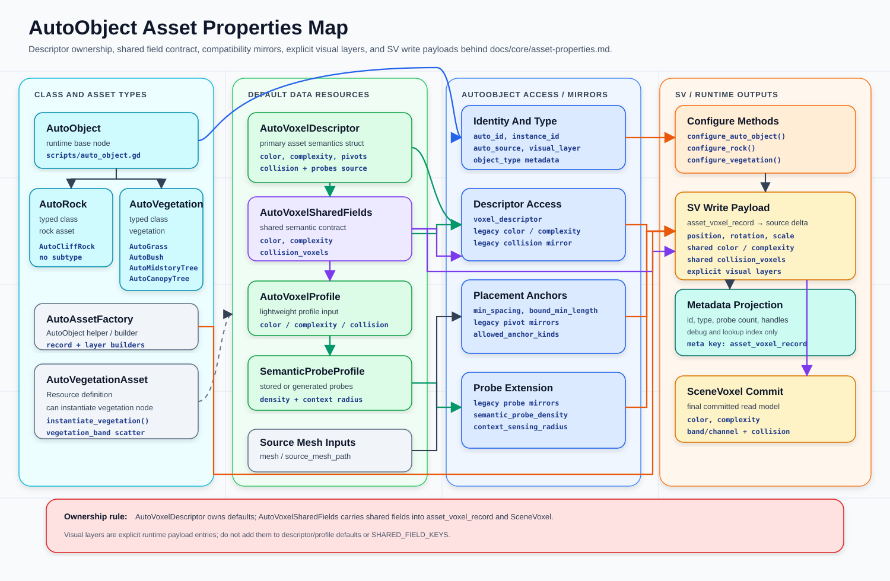

# Auto Asset Scripting

这份文档把“新增岩石 / 新增植被”的手工步骤收拢到脚本入口。核心文件：



| File | Purpose |
| --- | --- |
| `scripts/auto_asset_factory.gd` | 创建 `AutoRock` / `AutoVegetation` 子类资产，同步对象体素字段，并可生成共享 profile 预设 |
| `scripts/auto_vegetation_asset.gd` | 持久化植被资产：对象体素字段、可选 profile、mesh、scatter 参数、visual layer、group |
| `tools/scaffold_auto_asset.gd` | Godot 命令行脚手架，按 JSON 生成资源和子类脚本 |

## Command

```bash
godot --headless --path . --script tools/scaffold_auto_asset.gd -- --config res://tools/my_asset.json
```

如果本机 Godot 命令不是 `godot`，替换成实际 Godot 4.6 可执行文件。

## Rock Config

```json
{
  "type": "rock",
  "asset_path": "res://assets/rocks/cliff_03_asset.tscn",
  "profile_path": "res://assets/rocks/cliff_03_profile.tres",
  "mesh": "res://geo/cliff_03.FBX",
  "height_texture": "res://geo/cliff_03_height.raw",
  "mesh_size": 4.2,
  "color": [0.55, 0.5, 0.45, 1.0],
  "complexity": 1.0,
  "affected_bands": ["ground", "understory", "midstory", "canopy"],
  "collision_voxels": [
    {"shape": "cylinder", "radius": 1.2, "y_min": 0.0, "y_max": 2.0}
  ],
  "random_rotate": [0.0, 1.0],
  "random_scale": [0.8, 1.2],
  "random_height_offset": [-0.5, 0.5],
  "sync_legacy_fields": true
}
```

结果：

| Output | Meaning |
| --- | --- |
| `asset_path` | `AutoRock` / `AutoCliffRock` 场景资产，包含 `mesh`、`mesh_height_texture`、`mesh_size`、随机参数和对象体素字段 |
| `profile_path` | 可选 `AutoVoxelProfile` 预设，方便多个资产复用同一组 `color`、`complexity`、band 和 collision voxels |
| Object voxel fields | `voxel_descriptor` / `voxel_profile` 是资产体素语义主数据；`voxel_color`、`voxel_complexity`、`affected_bands`、`collision_voxels` 仍作为旧入口和配置字典兼容 |

`Main.rock_asset_dir` 默认扫描 `res://assets/rocks` 下的 `.tscn` / `.scn` / `.tres` / `.res`。推荐新岩石资产保存为 `AutoRock` 场景资产；旧 `MeshDataAsset` 仍会在加载时转换为 `AutoCliffRock` 兼容原型。

## Vegetation Config

```json
{
  "type": "vegetation",
  "class_name": "AutoFlower",
  "script_path": "res://scripts/auto_flower.gd",
  "asset_path": "res://assets/vegetation/flower_asset.tres",
  "profile_path": "res://assets/vegetation/flower_profile.tres",
  "band": "ground",
  "radius": 0.25,
  "color": [0.9, 0.35, 0.5, 0.7],
  "complexity": 0.7,
  "collision_voxels": [],
  "scatter_min_distance": 0.35,
  "scatter_max_count": 800,
  "scatter_max_scale": 0.7,
  "visual_layer": 14,
  "group": "placed_flowers",
  "mesh_create_method": "create_flower_mesh"
}
```

当前不使用 `subtype`。资产差异通过 `class_name`、具体资产文件、`voxel_descriptor`、probe、band 和 collision 语义表达。

结果：

| Output | Meaning |
| --- | --- |
| `script_path` | 具体 `AutoVegetation` 子类，例如 `AutoFlower` |
| `profile_path` | 可选单 band `AutoVoxelProfile` 预设 |
| `asset_path` | `AutoVegetationAsset`，保存对象体素字段、可选 profile、mesh、scatter、layer、group |

`mesh_create_method` 目前支持 `create_tree_mesh`、`create_midstory_mesh`、`create_bush_mesh`、`create_flower_mesh`。如果有外部模型，也可以改用 `"mesh": "res://geo/flower.glb"`。

草、树叶、细枝这类柔性部分保持 `collision_voxels: []`。只有粗树干或大块刚体才写 collision voxel。

`Main.vegetation_asset_dir` 默认扫描 `res://assets/vegetation` 下的 `AutoVegetationAsset`。生成植被时，这些资产会按自己的 `affected_bands` / `collision_voxels` 和 scatter 参数参与散布，并实例化具体子类。

## Runtime Use

```gdscript
var flower_asset := load("res://assets/vegetation/flower_asset.tres") as AutoVegetationAsset
var flower := flower_asset.instantiate_vegetation({
	"name": "Flower_001",
	"position": Vector3(0.0, 0.0, 0.0),
	"scale": Vector3.ONE * 0.6,
})
add_child(flower)
register_brush_vegetation(flower, flower_asset.make_instance_config())
```

岩石生成器现在直接使用 `AutoRock` / `AutoCliffRock` 子类原型。生成结果会复制对应原型并落到场景，`AutoAssetFactory.make_rock_scene_voxel_record()` 按 `AutoRock` 上的对象体素字段派生场景 `voxel_record`；`voxel_profile` 只作为字段为空时的共享预设回退。

## Metadata Rule

脚手架和运行时代码不把 metadata 当作第二套配置面。新增资产时写 `AutoObject` / `AutoVegetationAsset` 字段或引用资源；实例落地后的颜色、band、collision、像素和 slice 数据写进 `voxel_record`。metadata 只保留 id、来源、类型、实例 id 和 `voxel_record` 这类查询入口。
