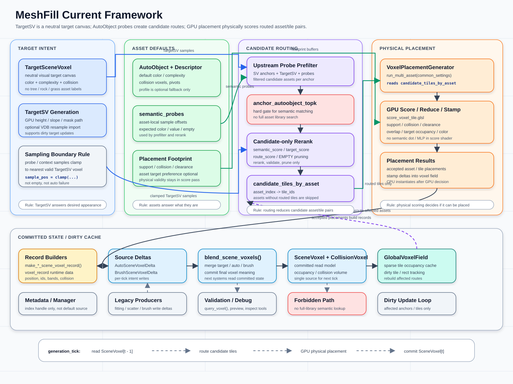

# MeshFill Framework

本文整理当前 MeshFill-Godot 框架的数据归属、生成主线、候选路由和运行时查询边界。字段细节见 `asset-properties.md`；体素提交与缓存规则见 `scene-voxel-field-system.md`；TargetSV 设计见 `target-scene-voxel-projection.md`；候选资产路由见 `voxel-semantic-routing.md`；AutoObject probe 粗筛见 `autoobject-probe-prefilter.md`。



## 核心约束

- `TargetSceneVoxel` 只表达目标视觉 / 复杂度 / 碰撞意图，不写入 `tree`、`rock`、`grass` 等 asset 标签。
- `AutoVoxelDescriptor` 是“资产是什么”的唯一语义主来源，包括默认体素颜色、复杂度、band、collision footprint、pivot 和 `semantic_probes`；`AutoObject` 只持有 descriptor 入口、运行时身份、mesh、放置约束和兼容字段。
- 运行时 record 回答“本次实例放在哪里”，包括世界位置、像素坐标、band、collision、source 和回查 id。
- source voxel delta 回答“本 tick 想写什么”，最终 `SceneVoxel` 回答“已经提交给后续系统读取的结果是什么”。
- probe prefilter 只减少候选 `AutoObject` / voxel 区域，不直接写最终 `SceneVoxel`。
- 候选 voxel 区域必须保守扩张，覆盖 asset footprint、probe 插值采样半径、context 半径和插值 guard，宁可让更多 voxel 进入候选，也不要漏掉可能得分高的位置。
- 语义向量匹配只在每个 anchor 的粗筛候选资产内做 rerank / validate / prune，不遍历全资产库。
- 物理可放置性仍由 `score_voxel_tile.glsl` 的 footprint、support、collision、clearance、overlap 和 target fit 决定。
- 同类型 `AutoObject` 的 `min_spacing` 互斥可在 physical placement 前通过 `AutoObjectManager` 做低成本候选 voxel 区域剪枝；最终 footprint / collision 仍由 GPU score 确认。
- 当前 collision 以浮点 voxel 样本烘焙 footprint 和 `collision_occupancy`；不要在主流程中重新引入复杂距离场、扩散场或软排斥缓存。

## Ownership

| Layer | Owner | Responsibility |
| --- | --- | --- |
| Target canvas | `TargetSceneVoxel` / `TargetSceneVoxelGenerator` | 保存中性的目标颜色、复杂度、占用和碰撞意图；支持 GPU 生成、dirty 更新和可选 VDB 重采样导入。 |
| Asset defaults | `AutoVoxelDescriptor` / `AutoObject.voxel_descriptor` / typed assets | descriptor 保存资产默认语义、体素颜色、复杂度、碰撞 footprint、pivot variants、semantic probes 和可选 profile fallback；`AutoObject` 同名字段只作为 legacy / Inspector / 配置字典兼容入口。 |
| Probe prefilter | `AutoVoxelDescriptor.semantic_probe_profile` / `AutoObjectProbePrefilterGPU` | 从 `SceneVoxel` / `TargetSV` 读取可放置 anchor，按 descriptor 提供的资产 probes 采样，输出 `anchor_autoobject_topk` 和候选 voxel 区域。 |
| Candidate routing | `anchor_autoobject_topk` / `candidate_voxel_regions_by_asset` | 把上游候选归一化、去重、可选 rerank，并聚合为每个 asset 的候选 voxel 区域列表。 |
| Physical placement | `VoxelPlacementGenerator` / placement shaders | 只对 routed asset / 候选 voxel 区域做 GPU score、reduce、stamp；可在 GPU scoring 前执行同类型 AutoObject 候选区域剪枝；如果 asset 没有候选区域，本轮可跳过。 |
| Runtime record | record builders / `voxel_record` | 统一创建或更新实例 record，保存位置、像素、band、collision、source 和 debug handle。 |
| Source voxel | `SourceSceneVoxelDelta` / `AutoSceneVoxel` / `BrushSceneVoxel` / `TargetSceneVoxel` | 表达当前 tick 的写入意图；`color`、`complexity`、`collision_voxels` 是同级 source 语义字段。 |
| Final state | `blend_scene_voxels()` / `SceneVoxel` | 统一混合并提交给下一 tick、验证、查询和预览；`collision_voxels` 可作为同级提交字段保留。 |
| Global cache | `GlobalVoxelField` | 读取已提交 `SceneVoxel` 的 scene occupancy 和派生 collision occupancy 视图，重建 sparse tile occupancy cache，并记录 dirty tile / rect。 |
| Query projection | metadata / `AutoObjectManager` | 提供运行时索引、调试查询、record handle、低分辨率 cell 查询和同类型互斥预检，不作为资产默认值来源。 |

## Runtime Flow

```text
SceneVoxel[tick - 1] (scene / collision occupancy views)
  -> GlobalVoxelField sparse tile cache
  -> collect dirty anchors / affected target bounds
  -> AutoObject probe prefilter
  -> anchor_autoobject_topk
  -> optional candidate-only semantic rerank / route validation
  -> candidate_voxel_regions_by_asset
  -> VoxelPlacementGenerator.run_multi_asset()
  -> optional same-type AutoObject exclusion gate
  -> score_voxel_tile.glsl physical score / reduce / stamp
  -> record builders
  -> SourceSceneVoxelDelta[tick]
     SceneVoxel base fields + source fields
  -> blend_scene_voxels(tick)
  -> SceneVoxel[tick] (includes collision occupancy cache/view)
  -> dirty tile / rect invalidation
```

## TargetSV 与路由边界

`TargetSceneVoxel` 是目标效果画布。它可以来自当前 GPU 路径，也可以后续接入外部 VDB 离线重采样。无论来源如何，它都不携带资产类别，只提供 routing 和 score 阶段可读取的目标信号。

采样规范：

```text
sample_pos = anchor_pos + probe_or_context_offset
sample_pos = clamp(sample_pos, target_sv_min, target_sv_max)
sample_value = TargetSV[sample_pos]
```

- probe / context sample 越出 TargetSV 边界时，投射到最近的有效 TargetSV voxel。
- 越界采样不直接视为空白，也不直接判失败。
- clamp 只影响 TargetSV / target context 的读取位置，不改变 anchor、asset footprint 或最终 placement 坐标。
- `clamped_sample_count` 可作为 debug / confidence hint，第一版不要求参与 `route_score`。

## Candidate Routing Contract

```text
upstream prefilter
  -> collect anchors
  -> score descriptor-backed semantic probes
  -> anchor_autoobject_topk

candidate routing
  -> read candidates from anchor_autoobject_topk only
  -> optional semantic_score / target_score
  -> route_score rerank
  -> EMPTY pruning
  -> candidate_voxel_regions_by_asset

placement
  -> each asset reads only its routed voxel regions
  -> optional same-type AutoObject exclusion gate prunes blocked voxel regions
  -> score_voxel_tile.glsl remains physical scoring
```

路由阶段的 hard gate 是每个 anchor 已筛选成功的候选资产。后续语义向量匹配不能重新遍历全资产库，也不能生成新的 asset candidate。它只能在候选集内部调整排序、降低置信度或剔除 route。

`candidate_voxel_regions_by_asset` 是保守候选集合，不是精确采样点集合。构建时应从 anchor voxel 出发，按 asset footprint AABB、semantic probe offset 范围、`context_sensing_radius` 和至少 1 voxel 的插值 guard 扩张到候选 voxel 区域；最终是否放置仍由 `score_voxel_tile.glsl` 精筛决定。

`candidate_voxel_regions_by_asset` 作为当前 placement 主接口：

```gdscript
{
    asset_index: Array[Vector3i]  # voxel_region_coords
}
```

该字典传入 `VoxelPlacementGenerator.run_multi_asset()` 的 `common_settings["candidate_voxel_regions_by_asset"]`。对外语义是“每个 asset 本轮要检查哪些 voxel 区域”；当前实现用 `Vector3i` 表示离散 voxel 块坐标，生成器内部会再归一化成紧凑 id。它应偏向召回而非精确裁剪；若某个 asset 没有候选 voxel 区域，则该 asset 本轮 placement 跳过并可标记为 prefilter skip。

## Current Modules

| Module | Main files | Notes |
| --- | --- | --- |
| TargetSV generation | `scripts/target_scene_voxel_generator.gd` / `shaders/target_scene_voxel.glsl` | 当前 GPU 生成 TargetSV visual / collision buffers 和 debug preview。 |
| TargetSV persistence | `scripts/main.gd` | 保存、加载、重算和显示 TargetSV overlay。 |
| Asset model | `scripts/auto_object.gd` / `scripts/auto_voxel_descriptor.gd` / typed asset scripts | `AutoObject` 是共同运行时基类；`AutoVoxelDescriptor` 是资产默认语义唯一权威来源，profile 只作为共享数据和生成辅助。 |
| Probe prefilter | `scripts/autoobject_probe_prefilter_gpu.gd` / `docs/placement/autoobject-probe-prefilter.md` | GPU-only 粗筛路径，输出 `anchor_autoobject_topk` 和 `autoobject_candidate_voxel_regions`；不保留 CPU fallback。 |
| Semantic routing | `docs/placement/voxel-semantic-routing.md` | 定义候选内 rerank、route validation、EMPTY pruning、TargetSV clamp 采样和 `candidate_voxel_regions_by_asset` 的候选 voxel 区域合约。 |
| 3D voxel placement | `scripts/voxel_placement_generator.gd` / `shaders/score_voxel_tile.glsl` / `shaders/reduce_voxel_tiles.glsl` / `shaders/stamp_voxel_field.glsl` | 物理精筛和 stamp 主路径；不负责全库语义查找。 |
| Global voxel cache | `scripts/global_voxel_field.gd` | dirty tile tracking、prefiltered placement、stamp delta apply 和 sparse tile cache。 |
| Placement fitting | `scripts/cliff_generator.gd` / fitting shaders | 通用同类资产 fitting producer；当前类名保留历史命名。 |
| Runtime indexing | `scripts/auto_object_manager.gd` / metadata | 根据 `auto_id` / `instance_id` 查找运行时 record；维护低分辨率 XZ cell 索引，用于邻近查询和同类型互斥预检。 |
| Incremental editing | `scripts/pcg_pipeline.gd` / `scripts/pcg_layer.gd` / `scripts/nutrition_layer.gd` / `scripts/main.gd` | dirty rect、override、brush commit 和局部刷新。 |

## Dirty Update Rules

普通 scene occupancy 变化：

```text
dirty tile
  -> rerun upstream prefilter for affected anchors
  -> rebuild candidate_voxel_regions_by_asset entries touched by dirty voxel region
  -> skip assets whose routed voxel region list becomes empty
```

Target color / complexity 变化：

```text
dirty target bounds
  -> expand by local / wide context radius
  -> expand by probe interpolation guard
  -> update affected context voxel regions
  -> rerun route validation for affected anchors
  -> rebuild affected candidate_voxel_regions_by_asset
```

更新完成后不需要对所有 asset 重新生成 voxel 级 top-K；只需要处理 dirty / affected voxel 区域和相关 asset routes。

## Maintenance Rules

- 新增资产语义字段时默认加入 `AutoVoxelDescriptor`，不要在 `AutoObject` 上新增第二套同名语义状态。
- 新增资产字段时，先判断它属于资产默认值、运行时 record、source voxel delta、TargetSV 目标画布还是最终 `SceneVoxel` 状态。
- metadata 只能挂索引、调试字段和 `voxel_record` handle，不能成为对象默认值的主来源。
- 自动生成和画笔修改只写本 tick source voxel delta，后续系统只读 commit 后的 `SceneVoxel`。
- `TargetSceneVoxel` 不写资产标签；资产选择只能通过 prefilter / routing / placement 形成。
- `GlobalVoxelField` 只做 sparse occupancy tile 缓存和 dirty 更新足迹，不直接承担最终编辑语义。
- `collision_voxels` 与 `color` / `complexity` 同级，属于资产、record、source voxel 和 committed `SceneVoxel` 的语义字段；提交后的 `collision_occupancy` 是由它重建的查询缓存视图。
- `AutoObject` 不应使用运行时缩放；`_configure_auto_object()` 强制 `scale = Vector3.ONE`，semantic probes 按 unscaled asset/local space 生成和采样。
- Probe 粗筛只减少候选 `AutoObject` / voxel 区域，不直接写最终 `SceneVoxel`。
- `score_voxel_tile.glsl` 不新增 semantic dot / MLP / target neighborhood pooling。
- 文档读写统一使用 UTF-8，避免中文内容出现乱码。
- 流程变更时同步更新本文档、`docs/placement/voxel-semantic-routing.md` 和 `docs/graphs/meshfill_current_framework.svg`。
