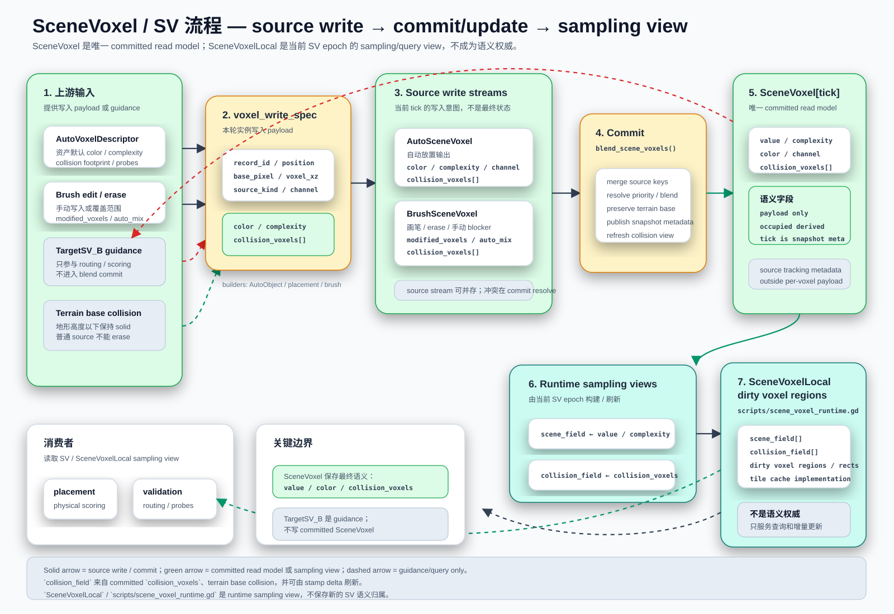

# Complexity Field System

本文维护 MeshFill 中 `SceneVoxel`、source write、`collision` 和 SV 常驻显存状态的契约。跨模块总览见 [`meshfill-framework.md`](meshfill-framework.md)；`AutoVoxelDescriptor` 定义见 [`auto-voxel-descriptor.md`](auto-voxel-descriptor.md)，资产字段归属见 [`asset-properties.md`](asset-properties.md)；粗粒度 SV cell 管理见 [`scenevoxeltile.md`](scenevoxeltile.md)；AutoObject GPU-first 方向见 [`autoobject-gpu-runtime-architecture.md`](autoobject-gpu-runtime-architecture.md)；TargetSV、候选路由和 heightfield placement 分别见 [`target-scene-voxel-projection.md`](../placement/target-scene-voxel-projection.md)、[`voxel-semantic-routing.md`](../placement/voxel-semantic-routing.md)、[`meshfill-rock-placement-flow.md`](../placement/meshfill-rock-placement-flow.md)。**SPA**（`ScenePlacementActor`）是 MeshFill 运行时编排器，借用 `SceneVoxelCommitter` 引用并在 commit 阶段调用 `apply_voxel_write_spec()`；详见 [`scene-placement-actor.md`](scene-placement-actor.md)。

**SceneVoxel Source Fusion**（**SVSF**）是 `AutoSV` + `BrushSV` + `LandscapeSV`（terrain base collision / target guidance）合成为 `BlendSV` / committed `SceneVoxel` 的正式命名。SVSF 包含 `resolve_scene_voxel_sources.glsl`（同 stream source candidate 仲裁 + 多源合并）和 `blend_scene_voxel_fields.glsl`（compact source records → dense field）两个 GPU pass，由 `blend_scene_voxels()` 统一编排。



## 本文范围

- `instance_stamp_write_spec`（`ISWS`）如何进入 `AutoSceneVoxel` / `BrushSceneVoxel` source write path。
- `blend_scene_voxels()` 如何发布 committed `SceneVoxel` public read model。
- committed per-voxel payload、source-only 字段和 debug buffer/readback 边界。
- canonical `collision` 字段、placement footprint `collision` record/API、terrain base collision 与 `collision_field` 的归属。
- SV resident buffers、dirty voxel regions / dirty tiles 的所有权。

## 核心契约

- `SceneVoxel` / `SV` 是 committed runtime read model，不是资产 authoring schema。
- [`AutoVoxelDescriptor`](auto-voxel-descriptor.md) / `AutoVoxelProfile` 是资产默认语义来源；`AutoObject` 负责把 descriptor/profile 语义构造成本轮 `instance_stamp_write_spec`（`ISWS`）。
- shared fields 只有 `color`、`complexity`、`collision`。`collision` 是权威 shared field。
- committed `SceneVoxel` 对外 read payload 最小化为 `complexity`、`color`、`collision`，可选 `auto_mix`。`channel` 只属于 source/write context 或 scatter profile，不进入 committed read payload；`complexity` 是唯一强度字段。
- `occupied`、`type`、`source_type`、`source_voxel_type`、`commit_tick` 不作为 committed per-voxel payload；占用由 `complexity` 是否非 0 推导，source provenance 放在 source/debug buffer，commit tick 只作为当前 SV snapshot 的全局 epoch。
- `TargetSceneVoxel` record 只作为 target / guidance metadata；写入阶段会跳过它，不进入 `AutoSceneVoxel` / `BrushSceneVoxel` source stream，也不进入 committed `SceneVoxel`。
- `TargetSceneVoxelGenerator.decode_target_read_buffers()` 可把 `TargetSV_B` raw `rgba32f/r32f` cache 解码成 `target_occupancy` / `target_color`；这是 routing / scoring read input，不是 source write。
- source write 只接受归一化后的 `AutoSceneVoxel` / `BrushSceneVoxel` record；`TargetSceneVoxel` / `TargetSV_B` 在 `apply_voxel_write_spec()` 和 `_enqueue_scene_voxel_source_record()` 边界保持 guidance-only / skip，不参与 source priority 或 committed key。
- `SceneVoxelCommitter` 内部可以保留 source staging / debug label 供同 tick 合成、debug buffer 打包和 dirty update 使用；这些 staging Dictionary 不是公开查询路径。
- SV 自持 `complexity_field`、`collision_field`、grid metadata 和 dirty regions；`SV[t - 1]` 是本轮稳定读取输入，`SV[tick]` 是本轮提交结果。
- `_rebuild_sv()` 发布的 SV resident state 是 committed `SceneVoxel`、terrain base collision、grid metadata 和 dirty index 的读取快照；它不是 source write buffer，也不是第二套 committed payload。
- AutoObject、brush、profile 和 placement 变更影响 committed SV 时，正常入口是 `SceneVoxelTile` dirty；`SVBrush` / source stamp 是 dirty tile 重建出的 source write intent，不是 direct SV update path。
- `TargetSV_B` / target guidance 变化只触发 routing、prefilter、scoring 或 feedback 侧 dirty，不写入 source stream，也不直接更新 committed `SceneVoxel`。
- 文档和新调用优先使用 `mark_scene_voxel_tile_dirty()` / `mark_scene_voxel_tile_bounds_dirty()`；当前源码仍保留 `_sv_dirty_tiles` / `_sv_dirty_rects`、`invalidate_sv_tile()` / `invalidate_sv_rect()` 和 `SV_RESIDENT_TILE_SIZE = 8` 作为 dirty storage compatibility，不是新的核心概念，也不改变 `SceneVoxelTile` contract。

体素与计算术语参见顶层 [`README.md`](../README.md#voxel-and-compute-terminology)。`collision` 是 canonical shared collision field；`instance_stamp_write_spec` / `ISWS` 是 canonical per-instance runtime write spec；`voxel_write_spec` 是 legacy alias。`SPA` 参见 [`scene-placement-actor.md`](scene-placement-actor.md)。

## 责任、输入和输出

| 类型 / 阶段 | 责任 | 输入 | 输出 | Source of truth |
| --- | --- | --- | --- | --- |
| `AutoVoxelDescriptor` / `AutoVoxelProfile` | 资产默认语义。 | authoring config、imported profile。 | descriptor-backed shared fields、probe / pivot defaults。 | descriptor/profile 资源；定义见 [`auto-voxel-descriptor.md`](auto-voxel-descriptor.md)。 |
| `instance_stamp_write_spec` / `ISWS` | 描述本轮实例 stamp 的 source write context。 | `AutoObject` descriptor-backed getters、placement result、extra write fields。 | 归一化前的 per-instance write record；legacy 名称是 `voxel_write_spec`。 | 当前 tick 的 `AutoObject` / placement builder 输出。 |
| `AutoSceneVoxel` / `BrushSceneVoxel` source stream | 保存当前 tick 的 auto / brush 写入意图。 | `_prepare_source_record()` 归一化后的 `ISWS` / brush stamp。 | source records、priority、brush scope、collision samples、debug labels。 | `SceneVoxelCommitter` 的 source stream；不是 committed `SceneVoxel` 字段。 |
| `SceneVoxel` / `BlendSV` | 发布 committed per-voxel read model。 | 同 tick `AutoSceneVoxel` / `BrushSceneVoxel`，以及 terrain base collision。 | SV accepted fields：`complexity`、`color`、`collision`，可选 `auto_mix`。 | `SceneVoxelCommitter.blend_scene_voxels()` 的 committed result。 |
| SV resident state | 提供 placement、prefilter、validation 和 debug 的稳定读取输入。 | committed `SceneVoxel`、terrain collision、grid metadata、dirty tile state。 | `complexity_field`、`collision_field`、grid metadata、dirty snapshots、debug ranges。 | `SceneVoxelCommitter._rebuild_sv()` 发布的 `_sv` snapshot。 |
| `SceneVoxelTile` + per-voxel object refs | 记录两级（voxel + tile）object refs、粗粒度 dirty、bounds、source ranges 和 summary。 | affected voxel bounds、source write、GPU AutoObject dirty delta bridge。 | `dirty_scene_voxel_tiles`、per-voxel object refs、tile 级 object/source debug ranges、summary。 | `SceneVoxelCommitter._scene_voxel_tiles` staging table + per-voxel object-ref GPU buffer；详见 [`scenevoxeltile.md`](scenevoxeltile.md)。 |
| `TargetSceneVoxel` / `TargetSV_B` | target / guidance read input。 | target generator、BrushSV 合成、persisted target buffers。 | `target_occupancy`、`target_color`、feedback target。 | TargetSV / BrushSV 持久化缓存；不进入 source write。 |

## 生命周期

```text
AutoVoxelDescriptor / AutoVoxelProfile
  -> AutoObject / placement result builds ISWS
  -> affected bounds mark SceneVoxelTile dirty
  -> _prepare_source_record() normalizes shared fields
  -> AutoSceneVoxel[tick] / BrushSceneVoxel[tick] source stream
  -> blend_scene_voxels(tick)
  -> committed SceneVoxel / BlendSV[tick]
  -> _rebuild_sv() publishes complexity_field / collision_field and tile snapshots
  -> next tick reads SV[t - 1] as stable input
```

生命周期规则：

- `SV[t - 1]` / `BlendSV[t - 1]` 是 placement 和 probe 本 tick 的稳定读取输入。
- `ISWS` 和 source streams 只属于当前 tick；提交后由 `blend_scene_voxels()` 发布只含 SV accepted fields 的 committed `SceneVoxel`。
- `SceneVoxelTile` dirty flags 在 SV snapshot 成功发布后清理；object/source debug ranges 可随下一次 `_rebuild_sv()` 重建。
- `TargetSV_B` 可以跨 tick 持久化为 guidance cache，但它的生命周期不等同于 committed `SceneVoxel`。

## CPU / GPU 边界

| 侧 | 当前职责 | 不拥有 |
| --- | --- | --- |
| CPU / GDScript | descriptor / `ISWS` 归一化、source candidate staging、`SceneVoxelTile` command staging、`blend_scene_voxels()` 编排、debug buffer readback 解码和 persisted target decode。 | GPU object pool hot state、同 stream source candidate winner 仲裁、Auto / Brush committed payload 数值合成、shader 内临时 same-batch duplicate buffers。 |
| GPU compute | `resolve_scene_voxel_sources.glsl` 同 stream source candidate winner 仲裁 + Auto / Brush committed payload 合并合成、`blend_scene_voxel_fields.glsl` 从 compact Auto / Brush source records 直接写 resident complexity field、probe prefilter、candidate voxel-region routing、`score_voxel_tile.glsl` physical scoring、VPG temporary `complexity_field_out` / `collision_field_out`。 | `SceneVoxelTile` source of truth、TargetSV source write、GDScript staging/debug Dictionary 投影。 |
| Boundary buffer | `complexity_field` / `collision_field`、`target_occupancy` / `target_color`、candidate voxel-region ids、placement result buffers。 | `collision_field` 不是第二套 collision source of truth；它由 committed `SceneVoxel.collision` 与 terrain base collision 发布。 |

GPU pass 可以读取 `SV[t - 1]` resident buffers 并生成候选或临时输出；被接受的 placement 必须回到 source write / commit 边界，才能成为 `SceneVoxel[tick]`。

## Committed SceneVoxel

Committed `SceneVoxel` 只接受自己的 per-voxel 字段：

逐项字段集合维护在 `SceneVoxel.PUBLIC_FIELD_KEYS` / `SceneVoxel.INTERNAL_FIELD_KEYS`，GPU 数值输出由 `resolve_scene_voxel_sources.glsl` 合并生成。

以下字段不属于 committed `SceneVoxel`：

| 字段 | 归属 |
| --- | --- |
| `occupied` | query 派生状态，由 `complexity` 非 0 推导。 |
| `type` | storage schema / container metadata。 |
| `source_type` / `source_voxel_type` | source stream、resolve/debug buffer 或 debug provenance。 |
| `commit_tick` | 当前 committed SV snapshot 的全局 epoch；不表达 per-voxel provenance。 |
| `record_id`、`auto_id`、`object_type`、`mesh_instance_id`、per-voxel `object_ids` 等 | record、runtime debug metadata、asset metadata 或 debug handle。per-voxel object refs 是独立 object-ref index，不进入 committed `SceneVoxel`。 |

当前内部 Dictionary 仍可能带 `slice_index`、`voxel_xz`、`base_pixel` 等地址字段，用于 debug queries、dirty rebuild 和 debug。它们是 storage / addressing 信息，不是 SV 语义字段。

## Source Write

`instance_stamp_write_spec`（`ISWS`）由 AutoObject / placement builder 生成。当前代码中的 `AutoObject.make_voxel_write_spec()`、`AutoObject.make_profile_voxel_write_spec()` 是 legacy API name，语义上返回 `ISWS`。进入写入路径前，`SharedPropertyType` 会把 `color`、`complexity`、`collision` 归一化。

常用 source-only 字段的逐项含义维护在 `SceneVoxelCommitter._prepare_source_record()`、`_make_scene_voxel_source_record_template()` 和 `_source_priority()` 中。

硬边界：可提交 source record 只来自 `AutoSceneVoxel` / `BrushSceneVoxel`。`TargetSceneVoxel` record 会被标记为 `target_guidance_only` 或在 `_enqueue_scene_voxel_source_record()` 中直接跳过；即使 `TargetSV_B` 已解码为 `target_occupancy` / `target_color`，这些 buffer 也只能作为 read input 或 target-side dirty trigger。

`SceneVoxelCommitter` 内部的 `_pending_auto_scene_voxel_source_candidates` / `_pending_brush_scene_voxel_source_candidates` 收集同 tick source candidate。`resolve_scene_voxel_sources.glsl` 按 `priority`、`complexity`、后写入顺序返回每组 winner index，合并自动完成 Auto / Brush committed payload 合成并物化到 `_auto_scene_voxel_sources` / `_brush_scene_voxel_sources`。`_scene_source_metadata` 只用于 dirty update、debug range 打包和 readback 标注，不是公开 per-voxel read payload。GPU dispatch 失败报告 `compute_dispatch_failed`，不静默回退 CPU。

Source write 的刷新来源应由 dirty `SceneVoxelTile` 决定；Target guidance 只触发 routing / scoring / feedback dirty，不进入 source stream：

```text
AutoObject / brush / profile / placement delta
  -> mark affected SceneVoxelTile dirty
  -> rebuild dirty tile source ranges / object ranges / summaries
  -> AutoSceneVoxel[tick] / BrushSceneVoxel[tick] source write
  -> blend_scene_voxels(tick)
```

`SVBrush` / source stamp 可以和 AutoObject 的覆盖 tile 绑定，用来重建 source intent；但它不是绕过 `SceneVoxelTile` dirty 的第二入口，也不能直接修改 committed `SceneVoxel` 或 SV resident `complexity_field` / `collision_field`。

当前实现中，source write 会通过 `_enqueue_scene_voxel_source_record()` 写入 Auto / Brush pending candidate、标记 `_mark_sv_tile_dirty()`，并同步 `_scene_voxel_tiles` command staging；source candidate 由 `resolve_scene_voxel_sources.glsl` 批量仲裁并合并完成 Auto / Brush committed payload 合成。`_volume["scene_voxels"]` 只由 `blend_scene_voxels()` 写入 committed result。`_rebuild_sv()` 会把 object/source debug ranges、tile summary 和 resident fields 发布到 SV snapshot，并由 `ensure_scene_voxel_tile_buffers_uploaded()` 压入 GPU storage buffers。外部 named 入口是 `mark_scene_voxel_tile_dirty()` / `mark_scene_voxel_tile_bounds_dirty()`；兼容入口是 `invalidate_sv_tile()` / `invalidate_sv_rect()`。文档层仍应写作 `SceneVoxelTile` dirty，只有说明源码兼容层时才写 legacy storage 字段。

`blend_scene_voxels()` 在存在 dirty `SceneVoxelTile` scope 时，会从上一版 committed `SceneVoxel` map 复制未触碰 tile，只把 dirty tile 覆盖到的 Auto / Brush source keys 交给 `resolve_scene_voxel_sources.glsl` 合并合成；无 dirty scope 或首次提交时才走 full source stream scan。`_rebuild_sv()` 生成 resident `complexity_field` 时上传 compact Auto / Brush source record buffers，由 `blend_scene_voxel_fields.glsl` 直接按 key 写最终 dense field，不再在 CPU 侧先铺 auto / brush 临时 dense field。

## Debug Buffer Query

`get_scene_voxel(slice_index, voxel_xz)` 仍是 committed `SceneVoxel` 查询，只返回 `complexity`、`color`、`collision`，可选 `auto_mix`。

工具点选一个 voxel 时，用同一个 voxel 坐标分别读取当前层：

- committed result：`get_scene_voxel()` 或 SV `complexity_field`。
- brush layer：本轮持续存在的 `BrushSV` / brush source debug buffer。
- auto layer：`AutoSV` source/debug readback buffer。
- tile debug：`SceneVoxelTile` 由 `floor(Vector3i(x, y, z) / scene_voxel_tile_size)` 推导；tile record、summary、dirty index、object/source refs 通过 `readback_scene_voxel_tile_debug_snapshot()` 读取。

查询规则：

- 不再提供 `get_scene_voxel_sidecar()` / `SceneVoxelLocal` 这类 CPU Dictionary 聚合查询。
- CPU 侧不再为了 debug 长期保留 `BrushSV` / `AutoSV` 的完整内容镜像；只保留资源句柄、生命周期、dirty、序列化入口和 readback 定位键等控制面元数据。
- 工具需要 debug 信息时读稳定 debug buffers / readback decoder，不直接读取 `_scene_source_metadata`、`_scene_voxel_tiles` 或 `_volume["scene_voxels"]`。
- `commit_tick` 只作为 SV snapshot 全局 epoch 出现在 snapshot/header 级信息中，不作为 per-voxel source provenance。
- committed `SceneVoxel` 仍必须只接受 SV-owned fields；`source_voxel_type`、record id、object refs 和 tile debug 只存在于 source/debug buffers 或 tile readback 中。

## Commit Flow

```text
AutoVoxelDescriptor / brush edit
  -> read existing BlendSV[t - 1] / SV[t - 1] complexity_field / collision_field
     stable physical sampling input
  -> instance_stamp_write_spec (ISWS)
  -> AutoSceneVoxel[tick] / BrushSceneVoxel[tick] source write
     TargetSceneVoxel guidance record is skipped
  -> VPG temporary duplicated buffers for same-batch avoidance
  -> blend_scene_voxels(tick): AutoSceneVoxel[tick] + BrushSceneVoxel[tick]
  -> BlendSV[tick] / SceneVoxel[tick] accepted fields:
       complexity
       color
       collision
       optional auto_mix
  -> result feedback score:
       score_blendsv_feedback_against_target(BlendSV[tick], TargetSV_B / TargetSV)
  -> SV[tick] complexity_field / collision_field / dirty regions
  -> next tick: BlendSV[tick] / SV[tick] becomes BlendSV[t - 1] / SV[t - 1]
```

提交规则：

- `AutoSceneVoxel` 和 `BrushSceneVoxel` 都是本 tick source stream；二者只有投影到同一 committed key 时才进入 merge / resolve。
- brush 可以用 `modified_voxels` 限定接管范围；为空时表示本次 stamp footprint 全接管。
- 0 强度 brush / erase 仍要写 source，用 `complexity = 0.0` 发布未占用结果；`complexity = 0.0` 是空写入强度。
- `blend_scene_voxels()` 是对外 committed read model 发布点；它读取 Auto / Brush source streams 和 GPU commit payload，不发布 CPU sidecar 查询对象。
- placement 物理采样读取的是已发布的 `BlendSV[t - 1]` / `SV[t - 1]`，不是同 tick 尚未合成的 `AutoSceneVoxel` / `BrushSceneVoxel`。
- placement stamp 之后必须再次执行 `blend_scene_voxels(tick)`，把本 tick `AutoSceneVoxel` 与 `BrushSceneVoxel` 合成为新的 `BlendSV[tick]`，再通过 `score_blendsv_feedback_against_target()` 与 `TargetSV_B` / `TargetSV` 计算结果级 target feedback score，并作为下一 tick resident read input。

## Collision

`collision` 是 descriptor、config、shared fields 和 placement runtime footprint record/API 的规范字段。

```text
descriptor/profile
  collision

record/source voxel
  color / complexity
  collision
  collision footprint record if entering placement/commit internals

committed SceneVoxel
  complexity / color
  collision
```

Footprint authoring 仍可用局部 sample 列表描述形状：

局部 collision sample 字段含义维护在 [`AutoVoxelDescriptor.normalize_collision()`](auto-voxel-descriptor.md)、`SharedPropertyType.collision_from_fields()` 和 `VoxelPlacementGenerator.bake_footprint_from_collision()` 附近；`SceneVoxelCommitter` 只复用共享 field stamp 路径发布 resident field。

`collision_field` 是 SV resident GPU collision read channel，由 committed `SceneVoxel.collision` 与 terrain base collision 发布得到。它不改变 `collision` 的语义归属，也不是第二套权威数据。

## Terrain Base Collision

`SceneVoxel` 构建和 `collision_field` 发布必须保留 terrain base collision：对每个 `XZ` 位置，地形高度以下的 `Y` slices 始终视为刚体占用。

- 普通 auto / brush source 只能在 terrain base collision 之上追加或覆盖普通场景语义，不能 erase 或降低地形以下 collision。
- `TargetSV_B` 的目标 mask 或 target collision 意图只影响 routing / scoring，不能清除 terrain base collision。
- `set_terrain_base_collision_field()` 变更 terrain base collision 时走维护性 full dirty：等价于 dirty all `SceneVoxelTile`，再由 `_rebuild_sv()` 发布新的 `collision_field`。
- 如果后续需要洞穴、挖洞或地下空间，应增加显式 terrain cut / carve source 类型，而不是复用普通 erase。

## SV Resident State

SV 常驻显存状态由 `SceneVoxelCommitter` 持有；`SceneVoxel` 是其发布的 committed read model，供 probe prefilter、placement scoring、validation 和 debug query 读取。

SV resident state 字段含义维护在 `SceneVoxelCommitter._rebuild_sv()` 的 `_sv` 返回字典和 dirty tile 构造处。

`_scene_voxel_tiles` 是 CPU dirty staging table；`_rebuild_sv()` 只把 `scene_voxel_tiles`、`dirty_scene_voxel_tiles` 和 per-voxel object refs 作为快照发布给 debug、partial rebuild 和 resident GPU upload。runtime success 只能通过 `ensure_scene_voxel_tile_buffers_uploaded()`、GPU summary 和 readback 验证，不能由 CPU staging table 代替。tile summary、object/source ranges、per-voxel object refs 和 dirty flags 不写回 committed per-voxel payload。

当前不实现 UE-style `Global Distance Field`。只有需要距离查询、软碰撞、GPU 大范围近似查询或多分辨率常驻查询结构时，再考虑 signed distance / clipmap。

## 当前实现入口

| 规则 | 代码入口 |
| --- | --- |
| `instance_stamp_write_spec`（`ISWS`）归一化为 source record | `_prepare_source_record()`、`SharedPropertyType.normalize_shared_fields()` |
| source record template 构造 | `_make_scene_voxel_source_record_template()` |
| target guidance 跳过 source write | `_source_type_from_record()`、`_enqueue_scene_voxel_source_record()` |
| Auto / Brush source candidate staging | `_pending_auto_scene_voxel_source_candidates`、`_pending_brush_scene_voxel_source_candidates`、`_enqueue_scene_voxel_source_record()` |
| 同 stream source candidate CS 仲裁 | `resolve_scene_voxel_sources.glsl`、`_flush_pending_scene_voxel_source_candidates()` |
| Auto / Brush current source stream | `_auto_scene_voxel_sources`、`_brush_scene_voxel_sources` |
| committed `SceneVoxel` accepted fields | `SceneVoxel.accepted()` / `accepted_map()`、`resolve_scene_voxel_sources.glsl` |
| auto / brush merge | `resolve_scene_voxel_sources.glsl`、`_try_blend_scene_voxel_commit_payloads_gpu()` |
| resident `complexity_field` GPU direct write | `blend_scene_voxel_fields.glsl`、`_try_make_sv_complexity_field_from_source_streams_gpu()` |
| public commit | `blend_scene_voxels()` |
| terrain collision 保护 | `set_terrain_base_collision_field()` 标记全量 `SceneVoxelTile` dirty；`SceneVoxelCommitter` 发布 `SV.collision_field`，保留 terrain base collision |
| dirty region tracking | `SceneVoxelTile` CPU staging table；legacy `_sv_dirty_tiles` / `_sv_dirty_rects` snapshot 仍供 resident buffer 路径使用 |
| CPU tile debug ranges | `_rebuild_sv()` 发布 `scene_voxel_tile_object_ids_debug` 和 per-tile range start/count |
| debug buffer/readback 查询 | `get_scene_voxel()` 读取 committed payload；`readback_scene_voxel_tile_debug_snapshot()` 读取 tile debug buffers；点选 voxel 的 tile id 由坐标和 `scene_voxel_tile_size` 推导 |
| named tile API | `mark_scene_voxel_tile_dirty()` / `mark_scene_voxel_tile_bounds_dirty()`；语义等价于 dirty affected `SceneVoxelTile`，并桥接 legacy dirty storage |
| legacy dirty compatibility | `invalidate_sv_tile()` / `invalidate_sv_rect()`；兼容入口，内部进入 `_mark_sv_tile_dirty()` / `_mark_sv_rect_dirty()` 并同步 `SceneVoxelTile` dirty record |


## 测试场景

| 场景 | 说明 | Godot 场景 |
| --- | --- | --- |
| [SceneVoxel 总览](../../demos/core-scene-voxel-field-system/core-scene-voxel-field-system.md) | 测试方法与验收标准 | [`../../demos/core-scene-voxel-field-system/core-scene-voxel-field-system.tscn`](../../demos/core-scene-voxel-field-system/core-scene-voxel-field-system.tscn) |
| [SceneVoxel Commit](../../demos/modules/scene-voxel-commit/scene-voxel-commit.md) | 测试方法与验收标准 | [`../../demos/modules/scene-voxel-commit/scene-voxel-commit.tscn`](../../demos/modules/scene-voxel-commit/scene-voxel-commit.tscn) |
| [Target Canvas Guidance](../../demos/modules/target-canvas-guidance/target-canvas-guidance.md) | 测试方法与验收标准 | [`../../demos/modules/target-canvas-guidance/target-canvas-guidance.tscn`](../../demos/modules/target-canvas-guidance/target-canvas-guidance.tscn) |
| [SceneVoxelTile Dirty](../../demos/modules/scenevoxel-tile-dirty/scenevoxel-tile-dirty.md) | 测试方法与验收标准 | [`../../demos/modules/scenevoxel-tile-dirty/scenevoxel-tile-dirty.tscn`](../../demos/modules/scenevoxel-tile-dirty/scenevoxel-tile-dirty.tscn) |
