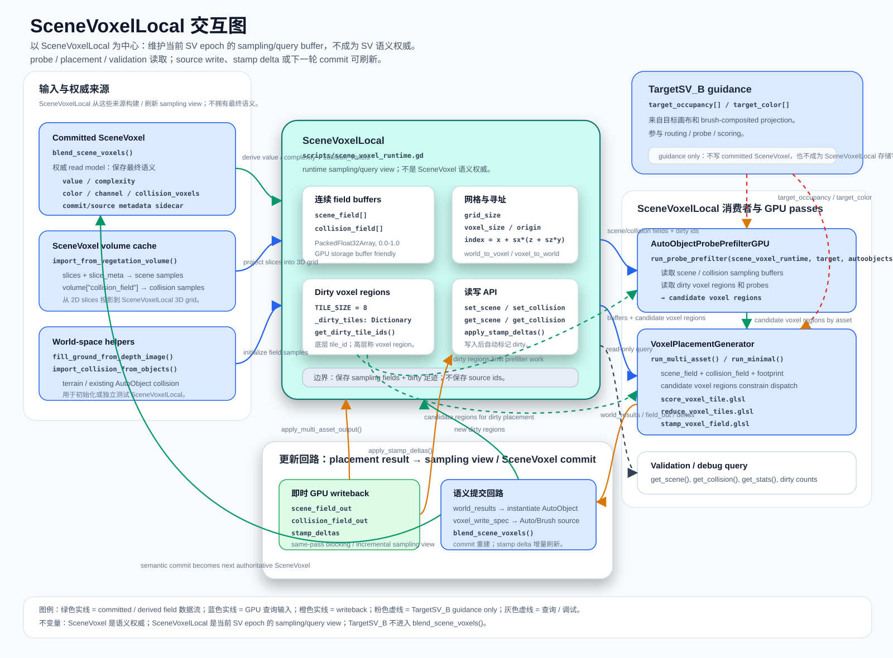

# Scene Voxel Field System

本文是 MeshFill 框架中 `SceneVoxel` / source write / collision layer / `SceneVoxelLocal` 的专题说明。跨模块总览见 `meshfill-framework.md`；资产默认字段见 `asset-properties.md`；TargetSV 和候选路由分别见 `target-scene-voxel-projection.md`、`voxel-semantic-routing.md`。




## 本文范围

本文只维护下列细节：

- `voxel_write_spec` 如何进入 `AutoSceneVoxel` / `BrushSceneVoxel` source write path。
- `blend_scene_voxels()` 如何发布 committed `SceneVoxel` read model。
- `SceneVoxel` 的逐体素 payload、非逐体素 metadata、source-only 字段边界。
- `collision_voxels`、`collision_field`、terrain base collision 和 `SceneVoxelLocal` 的职责边界。
- 当前运行时代码入口与后续收敛方向。

## 术语约定

| 术语 | 含义 | 使用边界 |
| --- | --- | --- |
| `volume` | 整个体素数据域及其承载存储，例如 flat buffer、3D texture 或当前兼容 `_volume` 容器 | 不指单个元素；`volume_xz_resolution` 是 volume/grid metadata。 |
| `voxel` | `volume` 中的单个 `(x, y, z)` cell / element | 每体素 payload、source voxel、collision voxel 都按单个元素理解。 |
| `tile` | 固定大小的 voxel block，用于 sparse cache、dirty rebuild、storage key 或 workgroup 映射 | 底层实现术语；`tile_id` / `dirty_tiles` 不应提升为高层语义字段。 |
| `voxel region` | placement / routing / dirty update 使用的高层候选或脏区域 | 当前可映射到底层 `tile_id`，但 prose 中优先使用 `voxel region`。 |

## 核心契约

- `SceneVoxel` / `SV` 是 committed read model 的语义契约；它是 runtime 数据，不是资产 authoring schema。
- 资产侧默认语义仍以 `AutoVoxelDescriptor` / `AutoVoxelProfile` 为准；`AutoObject` 只负责把 descriptor/profile 语义构造成本轮 write payload。
- committed `SceneVoxel` 每体素只保留查询所需的最小 payload：`value` / `complexity`、`color`、`channel`、`collision_voxels`、可选 `auto_mix`。
- `value` / `complexity` 是同语义别名，当前应保持 `value == complexity == color.a`。
- `occupied` 不作为独立逐体素字段；占用直接由 `complexity` / `value` 是否非 0 推导。
- `type`、`source_type`、`commit_tick` 不作为 committed SV 逐体素 payload：分别归属 storage schema / source-resolve metadata / commit snapshot metadata。
- `SceneVoxelLocal` 是当前 SV epoch 的 local/runtime sampling/query view：通常由 committed `SceneVoxel` 构建，也可随 source write、stamp delta 或 dirty update 增量刷新；它服务 probe 采样、placement 采样、validation/debug query，不是新的 SV 权威语义层。

## 分层

本专题从 source write 开始展开；资产默认值、TargetSV 目标画布和 routing 只作为上游输入引用，不在本文重复定义。

| 层 | MeshFill 角色 | 本文关注点 |
| --- | --- | --- |
| 上游输入 | `AutoVoxelDescriptor` / brush edit / `TargetSV_B` guidance | 提供 write payload 或引导信号；字段归属见对应专题文档。 |
| Source write | `AutoSceneVoxel` / `BrushSceneVoxel` | 保存当前 tick 的 auto / brush 写入意图；`color`、`complexity`（与 SV `value` 同语义别名）、`collision_voxels` 都是 source 语义字段。 |
| Commit | `blend_scene_voxels()` / `SceneVoxel` | 发布唯一 committed read model；逐体素只保留查询所需的最小 payload 和同级 `collision_voxels` 字段；`type` / `source_type` / `commit_tick` 放到容器、source/resolve 或 snapshot metadata。 |
| Local runtime sampling view | `SceneVoxelLocal` / `scripts/scene_voxel_runtime.gd` / `_scene_voxel_runtime` snapshot | 持有当前 SV epoch 的 `scene_field` / `collision_field` 与 dirty voxel regions / 底层 dirty tiles；由 committed `SceneVoxel` 构建并可被 source write / stamp delta 增量更新，服务 probe 采样、placement footprint 采样、validation 和 debug query；当前是 sparse occupancy，不是 signed distance。 |

## `SceneVoxel` 字段契约

当前实现仍以 `Dictionary` 表达 `SceneVoxel`，但字段契约按下列几类理解：逐体素 payload、非逐体素 metadata / 派生状态、当前 Dictionary 地址字段、source-only 字段。

### committed 每体素 payload

下表只列每个 committed voxel 需要携带的 payload。

| 字段 | 类型 / 形态 | 来源 | 说明 |
| --- | --- | --- | --- |
| `value` / `complexity`（同语义别名） | `float`，`0.0-1.0` | `SharedPropertyType.normalize_shared_fields()` / `apply_to_scene_voxel()` / blend result | 二者都表示 SV 的视觉 / 占用基础强度，不是两个独立概念。`complexity` 是 descriptor、record、source write 侧沿用的共享字段名；`value` 是 committed SV / runtime cache 侧的规范读取名和 `scene_field` 主要输入。占用状态直接由 `complexity` / `value` 是否非 0 推导，不需要单独的 `occupied` 逐体素字段。当前应保持 `value == complexity == color.a`；若后续确实要拆分“语义复杂度”和“占用强度”，需要另起字段并做迁移说明。 |
| `color` | `Color` | `SharedPropertyType.apply_to_scene_voxel()` | 视觉语义字段；`color.a` 与 `value` / `complexity` 同步。 |
| `channel` | `int` | discarded legacy `channel_entries` 展开 | 旧 visual / ecological channel 标记；仅兼容现有 runtime，不再作为新 committed payload 概念推进。 |
| `collision_voxels` | `Array[Dictionary]` | source record / descriptor / profile | SV 同级 collision 语义层；commit 后由它重建 `collision_field` 查询视图。 |
| `auto_mix` | `float`，`0.0-1.0` | `BrushSceneVoxel` mix | 只有 brush / auto 混合结果需要保留时才出现。 |

### 非逐体素 metadata / 派生状态

这些字段可以出现在 source record、commit summary、snapshot key、debug sidecar 或兼容 Dictionary 中，但不属于每个 committed voxel 的必要 payload。

| 字段 | 建议归属 | 说明 |
| --- | --- | --- |
| `occupied` | derived query state | 由 `value` / `complexity` 是否非 0 直接推导；不需要单独储存。 |
| `type` | storage schema / container metadata | `SceneVoxel` map 或 buffer 本身已经声明元素类型；不需要每个 voxel 重复保存 `"SceneVoxel"`。 |
| `source_type` | source stream / resolve metadata / debug sidecar | 来源类型用于仲裁或调试，不是最终几何 / 视觉查询必须读取的字段；如需追踪 provenance，应放在 source buffer、commit summary 或可选 debug sidecar。 |
| `commit_tick` | commit batch / snapshot metadata | tick 应由 `SceneVoxel[tick]`、`_scene_state_by_tick`、dirty tile metadata 或 runtime snapshot 表达，不需要复制到每个 voxel。 |

### 当前 Dictionary 地址 / 兼容字段

当前 Dictionary 版本的 SV record 里还会携带一些地址 / 兼容定位字段，主要用于兼容旧查询、dirty rebuild 和 debug。它们不应视为 SV 本体语义；如果后续收敛为 uniform voxel grid，这些信息应由外层 storage key、grid index、`grid_size` 和 `voxel_size` 推算。

| 字段 | 类型 / 形态 | 当前来源 | 说明 |
| --- | --- | --- | --- |
| `slice_index` | `int` | volume slice / voxel write path | 当前实现中的高度 slice；uniform grid 下可由 `index` 或 key 解码。 |
| `voxel_xz` | `Vector2i` | volume pixel / voxel write path | 当前实现中的 XZ 体素坐标；理论上可由外层 key 或 grid index 推算。 |
| `base_pixel` | `Vector2i` | source record / channel entry | 当前用于从每体素 `collision_voxels` 重建 collision cache 时去重同一 footprint；后续若拆出 source buffer，应由 record / storage key 提供。 |

### Source-only 字段

这些字段属于 `AutoSceneVoxel` / `BrushSceneVoxel` / 内部 source write 上下文，可能在提交前存在；发布为 committed `SceneVoxel` 时不应被当作最终语义状态。

| 字段 | 适用层 | 说明 |
| --- | --- | --- |
| `source_voxel_type` | source voxel | source 类型标记，常见值为 `AutoSceneVoxel`、`BrushSceneVoxel`；finalize 后会从 committed `SceneVoxel` 中移除。 |
| `source_kind` | source voxel / record | 来源类别，例如 rock placement、scatter、brush、erase、guidance。 |
| `producer_stage` | source voxel / record | 产生该 source write 的阶段，例如 `rock_placement`、`vegetation_scatter`、`brush_edit`。 |
| `generation_tick` | source voxel / record | source write 所属 generation tick。 |
| `read_tick` | source voxel / record | source write 读取上一状态时使用的 tick。 |
| `write_tick` | source voxel / record | source write 写入 tick。 |
| `priority` | source voxel / record，可选 | source 冲突时的优先级；缺省时 brush 高于 auto。 |
| `brush_stroke_id` | `BrushSceneVoxel` | 画笔 stroke id。 |
| `modified_voxels` | `BrushSceneVoxel` | 显式声明本次 brush 接管的 voxel keys / coords；为空表示 stamp footprint 全接管。 |
| `target_mix` | `TargetSceneVoxel` guidance | Target source 兼容字段；只作为 guidance / target 逻辑输入，不进入 committed source。 |
| `target_pipeline` | `TargetSceneVoxel` guidance | Target pipeline 标记；不属于 committed `SceneVoxel`。 |

### 不再进入 committed `SceneVoxel` 的字段

下列字段仍可存在于 `voxel_write_spec`、`AutoObject` metadata、source record 或调试回查中，但不再复制到每个 committed SV：

| 字段 | 保留位置 / 替代方式 |
| --- | --- |
| `record_id` | record 自身的 `id`；每体素不再保存。 |
| `mesh_name` / `node_path` | 节点 metadata / record 回查。 |
| `auto_source` | record 的 `source_kind` / `producer_stage`。 |
| `auto_id` / `auto_object_id` | AutoObject / AutoObjectManager record。 |
| `auto_instance_id` / `instance_id` | AutoObject / record 级实例索引。 |
| `instance_mesh_id` / `mesh_instance_id` | record / mesh instance 管理层。 |
| `object_type` / `object_subtype` | 资产定义、AutoObject 和 record。 |
| `source_voxel_types` / `dominant_source_type` / `blend_mode` | 若需要来源追踪，收敛到 source / resolve metadata 或 debug sidecar；不作为 committed SV 每体素字段。 |
| `volume_xz_resolution` | volume/grid metadata。 |

## `CollisionVoxel` 归属

`CollisionVoxel` 不作为独立来源场存在；它在 `SceneVoxel` / `SV` 中对应 `collision_voxels` collision layer/field。该层与 `color`、`complexity`（= `value`，同语义别名）等视觉语义同级，用来描述刚性或互斥占用。

```text
AutoSceneVoxel
  color / complexity (= value，同语义别名)
  channel_entries legacy compatibility payload
  collision_voxels: Array[CollisionVoxel]

BrushSceneVoxel
  color / complexity (= value，同语义别名)
  channel_entries legacy compatibility payload
  collision_voxels: Array[CollisionVoxel]
  modified_voxels
  auto_mix

SceneVoxel
  color / value (= complexity，同语义别名)
  collision_voxels: Array[CollisionVoxel]
  commit metadata lives outside per-voxel payload
```

`collision_voxels` 的元素是局部 collision footprint 样本，当前主表示是局部 voxel 坐标 + 浮点强度：

| 字段 | 类型 / 形态 | 说明 |
| --- | --- | --- |
| `voxel` / `local_pos` / `voxel_offset` | `Vector3i` / `Vector3` / `Array` / `Dictionary` | 局部 voxel 坐标；归一化后主要使用 `voxel` 和 `local_pos`。 |
| `value` | `float`，`0.0-1.0` | collision 强度；缺省为 `1.0`。 |
| `collision_degree` | `int`，`0-255` | 可选兼容输入；缺少 `value` 时可转换为浮点强度。 |
| `weight` | `float` | placement footprint 权重。 |
| `enabled` | `bool` | 为 `false` 时消费端跳过该 collision voxel。 |
| `shape` / `radius` / `y_min` / `y_max` | authoring helper | 兼容旧资产输入；进入 placement 前会烘焙成局部 voxel 样本。 |
| `half_extents` / `size` | authoring helper | 兼容 box / cube authoring 输入；进入 placement 前会烘焙成局部 voxel 样本。 |

含义：

- 自动放置的岩石、树干等刚性部分写入 `AutoSceneVoxel.collision_voxels`。
- 画笔、擦除、手动 blocker 等写入 `BrushSceneVoxel.collision_voxels`。
- 当前 collision 逻辑以浮点 voxel 样本为主：每个 `CollisionVoxel` 记录局部 voxel 坐标和 `0.0-1.0` collision 强度；旧 `shape` / `radius` 字段只作为兼容输入。
- `collision_voxels` 在 source record、source voxel 和 committed `SceneVoxel` 中都应按 SV collision layer/field 理解；它是 SV 的同级语义层，不是提交后缓存。
- commit 后可以生成 `_collision_field`、`_volume["collision_field"]` 或 `SceneVoxelLocal.collision_field`，但这些是由 committed `SceneVoxel.collision_voxels` 派生的查询缓存，不是新的 source layer，也不是新的语义归属。

## `SceneVoxelLocal`

`SceneVoxelLocal` 是当前 SV epoch 的 local/runtime sampling view。它负责把 SV payload 转成 probe prefilter、probe scoring、placement footprint scoring、validation 和 debug query 更容易读取的 `scene_field` / `collision_field` 缓存结构。

它通常由 committed `SceneVoxel` 初始化，但不是“只在 commit 时使用”的结构。运行中 source write、stamp delta、dirty voxel regions 或 rects 可以让它局部刷新；刷新后的 buffer 会继续被后续 probe 采样与 placement 采样读取。

| 字段 / 结构 | 来源 | 说明 |
| --- | --- | --- |
| `scene_field` | `SceneVoxel.value` / `complexity` + 当前 epoch 增量更新 | 视觉 / 占用基础强度的 flat buffer；是否占用由强度非 0 推导；供 anchor 提取、probe 采样、placement 采样和 debug 读取。 |
| `collision_field` | `SceneVoxel.collision_voxels` + terrain base collision + 当前 epoch 增量更新 | collision sampling cache；供 support / clearance / footprint scoring / probe 约束读取，不改变 collision 语义归属。 |
| `dirty_tiles` / dirty rects | source write / commit / cache rebuild / stamp delta | 当前实现名；语义上表示需要重建或重采样的 dirty voxel regions / rects，只细化 runtime rebuild、probe sampling 和 placement sampling 范围，不是 SV 语义字段。 |
| `tile_id` / `bounds` | grid / tile layout | 底层固定 block 的 runtime 查询索引信息，可作为 `voxel region` 到 storage/workgroup key 的映射。 |

当前实现类名是 `SceneVoxelLocal`，文件仍位于 `scripts/scene_voxel_runtime.gd`；部分内部变量和函数名（如 `_scene_voxel_runtime`、`_rebuild_scene_voxel_runtime()`）仍可视为实现名 / 兼容名。

### 关于 `Global Distance Field`

UE 的 `Global Distance Field` 通常是把多个 mesh distance fields 合并成全局 signed distance clipmap，用于 GPU 查询、遮挡、粒子碰撞或全局近似距离采样。

MeshFill 当前不直接实现这个概念。当前需要的是：

```text
current SV epoch
  -> read value / complexity as scene field input
  -> read collision_voxels as collision input
  -> build derived SceneVoxelLocal field buffers / sparse voxel-region cache
  -> rebuild dirty voxel regions / tiles
  -> SceneVoxelLocal.scene_field
  -> SceneVoxelLocal.collision_field
  -> probe sampling / placement sampling / validation / debug query
```

因此文档里说“物理缓存”时，当前含义是 `SceneVoxelLocal` 的稀疏 runtime field cache / sampling view；其中 `tile` 只是固定大小 block 的底层索引。只有当后续需要距离查询、软碰撞、GPU 大范围近似查询或多分辨率常驻缓存时，才考虑升级成 signed distance / clipmap。

## 数据流

```text
AutoVoxelDescriptor / brush edit
  -> AutoObject.make_asset_voxel_record() / placement builders
  -> voxel_write_spec
  -> AutoSceneVoxel write stream / BrushSceneVoxel write stream
      source fields:
        color / complexity
        legacy channel entries
        collision_voxels
        source metadata
  -> blend_scene_voxels(tick)
  -> SceneVoxel[tick]
      per-voxel payload:
        value / complexity
        color
        legacy channel
        collision_voxels
        auto_mix?
      commit metadata outside per-voxel payload
  -> derive / update runtime sampling views
      scene_field from SceneVoxel.value / complexity（非 0 即占用）
      collision_field from SceneVoxel.collision_voxels + terrain base collision
  -> SceneVoxelLocal / scripts/scene_voxel_runtime.gd
      scene_field
      collision_field
      dirty_tiles
      probe sampling / placement sampling / validation / debug query
```

`TargetSV` / `TargetSV_B` 是上游引导输入，不是 source voxel stream；它们不进入 `blend_scene_voxels()`。Target 采样、brush-composited 画布和 routing 规则见 `meshfill-framework.md`、`target-scene-voxel-projection.md` 与 `voxel-semantic-routing.md`。

`TargetSV` / `TargetSV_B` 的 `target_mix` / `target_pipeline` 属于目标画布和引导管线元数据，不属于 committed `SceneVoxel` source write；当前写入阶段会跳过兼容 record 中 `source_voxel_type = "TargetSceneVoxel"` 的提交。

## `voxel_write_spec`

`voxel_write_spec` 是本轮写入 `SV` / `SceneVoxel` 的 write payload，由 `AutoObject.make_asset_voxel_record()`、`AutoObject.make_profile_asset_voxel_record()` 或 placement builder 生成；`AutoAssetFactory` 只保留 tooling / 兼容 wrapper。它不是上一轮 `SceneVoxel`；上一轮 committed read model 明确写作 `SceneVoxel[t - 1]`。

`AutoObject` 负责资产实例侧 payload 构造和保存 handle，source write / committed `SceneVoxel` 负责字段解释、source 归一化和提交结果。

| 字段 | 含义 |
| --- | --- |
| `id` | record id。 |
| `type` | 对象大类，如 `rock`、`vegetation`；record metadata，不是 committed SV 的逐体素 `type`。 |
| `position` / `rotation_degrees` / `scale` | 本次实例的世界变换；`rotation_mode` 当前写为 `XYZ`。 |
| `voxel_xz` | XZ 体素写入坐标；当前 record 兼容字段，后续 uniform grid 下可由 storage key / index 推算。 |
| `volume_xz_resolution` | 目标体素体积 XZ 分辨率；属于 volume/grid metadata。 |
| `color` / `complexity`（= SV `value`） | 本次 source visual 默认值；`complexity` 与 committed SV 的 `value` 是同语义别名。 |
| `collision_voxels` | 与 `color` / `complexity`（= `value`）同级的 collision 语义字段；由 descriptor / profile 或画笔输入派生。 |
| `channel_entries` | discarded legacy visual / ecological channel 写入条目；record 级 list；仅兼容旧 runtime 展开，不属于 descriptor/profile/shared fields，也不作为新 source schema 入口。 |
| `source_voxel_type` | `SceneVoxel` source write 使用 `AutoSceneVoxel` 或 `BrushSceneVoxel`；`TargetSceneVoxel` 只作为兼容 target record 类型，不进入 blend commit。 |
| `source_kind` | 来源种类，如 `rock_placement`、`scatter`、`brush`；`target` 只表示目标画布 / guidance 上下文，不是 blend source。 |
| `producer_stage` | 生产阶段；默认等于 `source_kind`。 |

兼容的 target record 只作为目标画布 / debug 回查，不提交 committed `SceneVoxel` 或最终 `collision_voxels` 字段。`AutoObject` 和 metadata 可以保存 `voxel_write_spec` handle 方便查询，但 record 字段应按 `SV` / `SceneVoxel` schema 理解，不能把它当作资产默认值来源。

## 地形保底碰撞

`SceneVoxel` 构建必须先写入 terrain base collision：对每个 `XZ` 位置，地形高度图高度以下的所有 `Y` slice 都视为刚体占用。

这部分 collision 是场景基础约束，不属于 `AutoSceneVoxel` 或 `BrushSceneVoxel` 的普通覆盖范围：

- 自动放置只能在地形保底 collision 之上追加 visual / collision 语义字段，不允许把地形以下 collision 写成空。
- 画笔编辑可以覆盖普通 source voxel，但不能 erase 或降低地形高度以下的保底 collision。
- `TargetSV_B` 的目标 mask 或目标 collision 意图只影响 routing / scoring，不能清除 terrain base collision。
- `blend_scene_voxels()` 合成后重建 collision field 时，必须保留 terrain base collision，再叠加 committed `SceneVoxel.collision_voxels` 同级字段。
- 如果后续需要挖洞、洞穴、地道或地下空间，应显式增加 terrain cut / carve source 类型；不能复用普通 erase 语义绕过该不变量。

## 职责速览

| 层 | 关键字段 / 状态 | 说明 |
| --- | --- | --- |
| `AutoVoxelDescriptor` / `AutoObject.voxel_descriptor` | 资产默认语义和兼容入口 | 本文只关心这些字段如何进入 write payload；字段列表和资产侧归属见 `asset-properties.md`。 |
| `SourceSceneVoxel` | `source_voxel_type`、`source_kind`、`producer_stage`、`generation_tick`、`read_tick`、`write_tick` | `AutoSceneVoxel` / `BrushSceneVoxel` 的共同 source context。 |
| `AutoSceneVoxel` | `color`、`complexity`（= SV `value`）、`collision_voxels`、`source_kind`、legacy `channel` | 自动系统输出的当前 tick source voxel write；`collision_voxels` 与 `color` / `complexity` 同级，`channel` 只来自旧 `channel_entries` 兼容展开。 |
| `BrushSceneVoxel` | `color`、`complexity`（= SV `value`）、`collision_voxels`、`modified_voxels`、`auto_mix`、legacy `channel` | 画笔或手动编辑输出的当前 tick source voxel write；`collision_voxels` 与 `color` / `complexity` 同级，`channel` 只保留旧兼容。 |
| `SceneVoxel` | `value` / `complexity`、`color`、`collision_voxels`、`auto_mix`、legacy `channel` | committed 每体素 payload；`occupied` 由强度非 0 推导；`channel` 是 discarded legacy 字段；`type`、`source_type`、`commit_tick` 不作为逐体素字段。 |
| Terrain base collision | terrain height map、`XZ`、`Y` slice | `SceneVoxel` 构建与缓存重建阶段的不可覆盖基础碰撞；地形高度以下会进入派生 `collision_field`，但不是 `SceneVoxel` 自有 field view。 |
| `SceneVoxelLocal` | `scene_field`、`collision_field`、`dirty_tiles`、`tile_id`、`bounds` | 当前 SV epoch 的 sparse runtime sampling cache；`dirty_tiles` / `tile_id` 是底层 block 索引，服务 probe sampling、placement sampling、validation 和 debug query。 |

## 体素写入规则

当前运行时代码把全局写入规则收敛到 `scripts/vegetation_exclusion.gd`：

| 规则 | 代码入口 | 结果 |
| --- | --- | --- |
| source 只写当前 tick | `apply_mesh_asset_voxel_record()`、`_prepare_source_record()` | 重复提交旧 `voxel_write_spec` 时会把 `generation_tick` 和 `write_tick` 重新绑定到本次 tick。 |
| source voxel 写入 | `_stamp_volume_slices()`、`_write_source_scene_voxel()` | auto 写入 `AutoSceneVoxel` stream，brush 写入 `BrushSceneVoxel` stream；二者作为 source stream 本身不冲突，`TargetSV_B` 只作为 target / guidance 逻辑输入。 |
| committed key 合成 | `_write_source_scene_voxel()`、`_merge_voxel_sources()`、`blend_scene_voxels()` | 只有当多个 source stream 投影到同一个 committed `SceneVoxel` key 时才进入 blend / resolve；同 tick auto / brush 可按 `auto_mix` 合成，不应把 source write 本身描述为互相覆盖。 |
| brush 只接管声明范围 | `_source_modifies_key()`、`modified_voxels` | `modified_voxels` 为空表示本次 stamp footprint 全接管；非空时只影响列出的 voxel key。 |
| collision 与 color / complexity（= value）同级 | `_make_source_scene_voxel()`、`_finalize_scene_voxel_from_source()` | 从 record 的 `collision_voxels` 传递到 source voxel 和 committed `SceneVoxel`，作为同级语义字段参与提交；`complexity` / `value` 在这里按同一强度语义理解。 |
| 派生 collision field | `_stamp_collision_voxels()`、`_stamp_collision_volume()`、`_rebuild_collision_cache_from_scene_voxels()` | 从 committed `SceneVoxel.collision_voxels` 重建查询缓存；缓存不改变 collision 语义归属。 |
| 地形以下 collision 不可覆盖 | `SceneVoxel` 构建 / collision field rebuild | terrain height 以下的 `Y` slices 始终保持 collision；普通 auto / brush 写入不能 erase 或降低该值，`TargetSV_B` 也只能作为查询输入。 |
| 0 值主动编辑也要写 source | `_stamp_volume_slices()` | `erase` / `BrushSceneVoxel` 可以写入 `value = 0.0`，用未占用结果覆盖上一轮结果。 |
| 最终状态只在 blend 发布 | `blend_scene_voxels()` | 只有 `SceneVoxel[tick]` / committed snapshot 暴露给查询、验证和 `SceneVoxelLocal`；tick 是 snapshot metadata，不是每体素字段。 |
| `SceneVoxelLocal` 运行时采样视图 | `_rebuild_scene_voxel_runtime()` / `SceneVoxelLocal` | 从当前 SV epoch 构建或增量刷新 `scene_field` / `collision_field`，并按 dirty voxel regions / rects 缩小重建与重采样范围；供 probe / placement / validation / debug 读取，不生成新的 SV 语义状态。 |

## 当前实现边界

- `AutoObject` 只作为运行时节点通过 descriptor-backed getter 提供局部对象语义和默认 collision 声明，不直接改最终场景体素。
- `main.gd` 中的 record builder 会先构建 source 语义，再交给 `blend_scene_voxels()`。
- `blend_scene_voxels()` 是 committed `SceneVoxel` 的对外发布点：它重建 `collision_field` cache，并更新 `_scene_state_by_tick` 与 `_scene_voxel_runtime`。当前兼容 Dictionary 仍可能临时写入 `type` / `source_type` / `commit_tick`，也可能保留 `occupied` 派生镜像；但字段契约上它们应收敛到容器、source/resolve、snapshot 元数据或由 `value` / `complexity` 现场推导，不作为逐体素 payload。
- 当前 `_write_source_scene_voxel()` 内部仍会提前调用 `_finalize_scene_voxel_from_source()` 并暂写 `_volume["scene_voxels"]`；若后续要更严格区分 source stream 和 committed read model，应拆出 pending source buffer，只在 `blend_scene_voxels()` 中 finalize。
- `vegetation_exclusion.gd` 当前同时承载 source voxel write、`SceneVoxel` commit、dirty voxel region / rect API 和 sparse tile cache。这里的 `tile` 是固定大小 block 的底层实现名。
- `SceneVoxelLocal` 独立类位于 `scripts/scene_voxel_runtime.gd`，保存 probe / placement / validation / debug sampling 用 `scene_field` / `collision_field` flat buffer 和 dirty voxel regions / 底层 dirty tiles；这些 buffer 与 dirty bookkeeping 是当前 SV epoch 的派生 runtime view，不是新的 SV 语义字段。
- `CollisionVoxel` 的设计归属是和 `color` / `complexity` 同级的 voxel 语义字段；提交后的 `collision_field` 是从该字段重建的派生查询视图。

## 当前落地状态与后续收敛

| 约束 | 当前状态 | 说明 |
| --- | --- | --- |
| `AutoVoxelDescriptor` 作为资产默认语义唯一主归属 | 主路径已落地；仍保留 compatibility mirror | `AutoObject.get_voxel_color()`、`get_voxel_complexity()`、`get_collision_voxels()` 等读取 descriptor；`AutoObject` / typed asset / profile 上的同名字段仍作为 Inspector、旧配置和 profile 兼容入口，并会同步进 descriptor。 |
| `AutoSceneVoxel` / `BrushSceneVoxel` 作为 source voxel write 归属 | 已落地 | `voxel_write_spec` 经 `_prepare_source_record()`、`_make_source_scene_voxel()`、`_write_source_scene_voxel()` 进入 auto / brush source write；`TargetSceneVoxel` 兼容 record 在写入阶段跳过，不进入 committed source。 |
| `value` / `complexity` 同语义，`occupied` 派生 | 已落地；契约需保持 | `SharedPropertyType` 会同步 `value`、`complexity` 与 `color.a`；查询侧应以 `value` / `complexity` 非 0 判断占用，不依赖独立 `occupied` 字段。 |
| `collision_voxels` 与 `color` / `complexity` 同级 | 已落地 | `SharedPropertyType.SHARED_FIELD_KEYS` 同时包含 `color`、`complexity`、`collision_voxels`；三者通过 `from_descriptor()` / `from_profile()`、`apply_to_record()`、`apply_to_scene_voxel()` 进入 record、source voxel 和 committed `SceneVoxel`。 |
| `type` / `source_type` / `commit_tick` metadata 化 | 文档契约已明确；实现兼容待收敛 | 三者分别属于 storage schema、source/resolve metadata 和 commit snapshot metadata；当前兼容 Dictionary 可临时保留，后续不应作为每体素 payload 依赖。 |
| `SceneVoxelLocal` 作为 runtime sampling/query view | 已落地 | `scripts/scene_voxel_runtime.gd` 的 class_name 为 `SceneVoxelLocal`；部分 `_scene_voxel_runtime*` 命名仍可视为实现名 / 兼容名。 |
| `blend_scene_voxels()` 为唯一提交点 | 对外发布已落地；内部仍待收敛 | 对外提交、commit batch / snapshot tick、collision cache rebuild、`_scene_state_by_tick` 和 `_scene_voxel_runtime` 更新都在 `blend_scene_voxels()`；但 `_write_source_scene_voxel()` 当前会提前 finalize 并暂写 `_volume["scene_voxels"]`，兼容 Dictionary 中的 `type` / `source_type` / `commit_tick` / `occupied` 后续应移出逐体素 payload。 |

后续收敛优先级：

1. 将 compatibility mirror 字段继续压缩为 descriptor 的兼容入口，避免新增第二套资产默认语义状态。
2. 如果需要更严格的 source / commit 分层，将 `_write_source_scene_voxel()` 改为只写 pending source buffer，并把 `_finalize_scene_voxel_from_source()` 收敛到 `blend_scene_voxels()`。
3. 将当前兼容 Dictionary 中的 `type` / `source_type` / `commit_tick` / `occupied` 逐步移到容器、source/resolve metadata、snapshot metadata 或现场推导。
4. 只有需要距离查询、软碰撞、GPU 大范围近似查询或多分辨率常驻缓存时，再考虑 signed distance / clipmap 版本。
