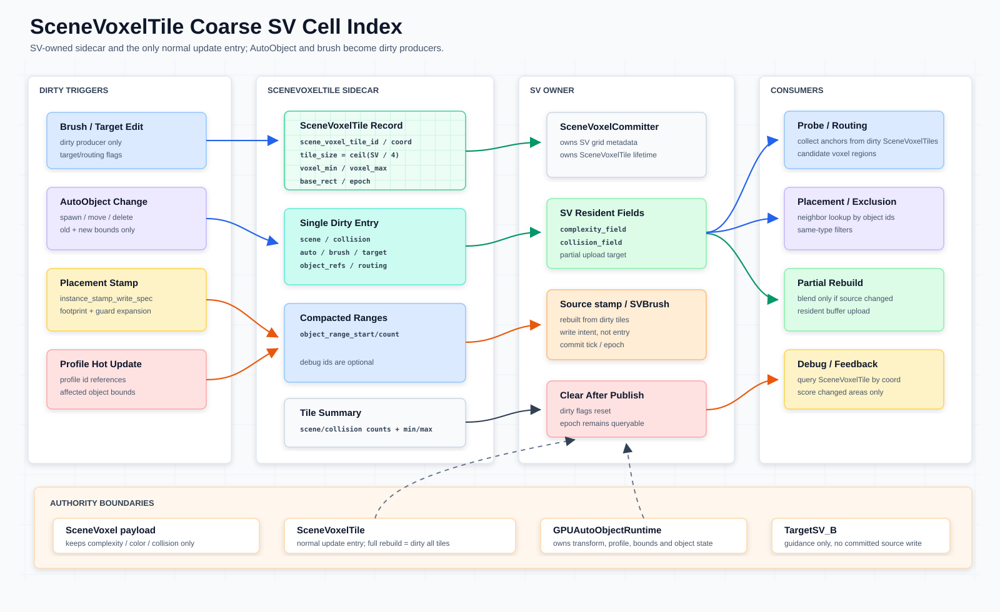

# SceneVoxelTile 粗粒度 SV Cell 管理系统

本文定义 `SceneVoxelTile`：由 `SceneVoxelCommitter` / SV owner 持有的粗粒度 cell index / dirty record，用来统一管理 dirty、局部 voxel 范围、AutoObject 引用和增量更新边界。点选 voxel 时，所属 `SceneVoxelTile` 由 voxel 坐标和 `scene_voxel_tile_size` 直接推导，不从 provenance 或公开 sidecar 查询。`SceneVoxel` / SV committed payload 见 [`scene-voxel-field-system.md`](scene-voxel-field-system.md)；资产默认语义见 [`auto-voxel-descriptor.md`](auto-voxel-descriptor.md)，字段归属边界见 [`asset-properties.md`](asset-properties.md)；GPU-first AutoObject 方向见 [`autoobject-gpu-runtime-architecture.md`](autoobject-gpu-runtime-architecture.md)；placement route 术语见 [`voxel-semantic-routing.md`](../placement/voxel-semantic-routing.md)。SPA（`ScenePlacementActor`）借用 `SceneVoxelCommitter` 引用编排 commit，不直接管理 tile dirty sidecar；详见 [`scene-placement-actor.md`](scene-placement-actor.md)。



## 目标

- 用粗粒度 cell 管理 dirty，而不是每次扫描完整 `SceneVoxel` volume。
- 让一个 `SceneVoxelTile` 能描述一段固定 voxel 范围，以及该范围内受影响的 `AutoObject` 引用。
- 为 placement、probe prefilter、resident buffer partial update 和 debug query 提供稳定的局部索引。
- 让默认 tile 尺寸适合 compute shader shared memory staging；默认固定 `4x4x4` voxels，并允许通过 `ProjectSettings` 调整。
- 保持现有权威边界：`SceneVoxelTile` 是 SV owner 的 coarse index / dirty record，不是 committed `SceneVoxel` payload，也不是 AutoObject runtime。

## 术语

| 术语 | 含义 |
| --- | --- |
| `volume` | 整个 SV voxel data domain / buffer，例如 committed `scene_field` / `collision_field`。 |
| `voxel` | `volume` 中的一个 `(x, y, z)` cell。 |
| `tile` | 固定大小 voxel block；在本文中优先指 `SceneVoxelTile` 的 coarse cell index。 |
| `voxel region` | placement / routing 的候选区域；当前 `score_voxel_tile.glsl` 和 VPG 使用 `TILE_SIZE = 8` 的 region / workgroup，不能等同于默认 `4x4x4` 的 `SceneVoxelTile`。 |

## 核心契约

- `SceneVoxelTile` 归 `SceneVoxelCommitter` / SV owner 管理，跟随 `SV[tick]` 的 grid 参数、dirty 状态和 resident buffers 生命周期。
- `SceneVoxelTile` 默认粒度是固定 `4x4x4` voxels；项目可通过 `ProjectSettings` 的 `meshfill/scene_voxel_tile/size_voxels` 调整。
- `SceneVoxelTile` 保存 tile 级 object 引用（compacted range handle）；per-voxel object 引用保存在 SV object-ref index / GPU resident buffer 中，不进入 public committed payload。完整对象池、transform、profile、bounds 归 `GPUAutoObjectRuntime` / AutoObject authoring 侧，不复制到 tile 或 voxel。
- voxel 和 tile 两级都承载 object refs：voxel 直接索引到占据该 voxel 的对象列表；tile 是 tile 内所有 voxel object refs 的 compacted 聚合。空间查询优先走 voxel 级，tile 级用于粗过滤和 dirty 管理。
- `SceneVoxelTile` 当前通过 `apply_gpu_autoobject_dirty_delta()` 接收 GPU AutoObject dirty delta handoff，同时更新 voxel 级和 tile 级 object refs；它不拥有完整 runtime object state。
- `SceneVoxelTile` 不进入 `SceneVoxel` public per-voxel payload。公开 `SceneVoxel` 仍只暴露 `complexity`、`color`、`collision`，可选 `auto_mix`。`channel` 不进入 committed read payload；`object_refs` 是独立 object-ref channel，通过 GPU resident buffers / readback 访问。
- `SceneVoxelTile` 可以包装当前 `_sv_dirty_tiles` / `_sv_dirty_rects` 的语义；这些字段只是 implementation/storage compatibility，新 contract 和新 API 优先写 `SceneVoxelTile`。
- `SceneVoxelTile` runtime metadata 和 committed scene/collision resident fields 是 GPU-first：`ensure_scene_voxel_tile_buffers_uploaded()` 成功后，tile record、summary、dirty index、object ref、source ref、`scene_field` 和 `collision_field` 都以 GPU storage buffers / readback 为验收路径。`get_scene_voxel_tile_gpu_buffer_summary()` 的 valid RID、record count、resident field source 和 upload revision 才能说明 runtime resident success；CPU dictionary / PackedFloat32Array 只做 command staging、debug label 和无 RD 时的 SKIP 判定。staging revision 前进后，旧 GPU buffers 会标记 stale，不能继续作为 runtime read source。
- `SceneVoxelTile` 的 voxel bounds 必须覆盖真实 footprint 和 guard expansion，不能只用 object center 或 search radius 近似。
- 正常 committed SV 增量更新入口只接受 `SceneVoxelTile` dirty；AutoObject、brush、profile 和 placement 都只是 dirty producer。
- Target guidance 变化只标记 routing / scoring / feedback 相关 dirty；`TargetSceneVoxel` / `TargetSV_B` 不进入 source write，不直接写 committed source，也不修改 `SceneVoxelTile` 的 source range。
- `SVBrush` / source stamp 是 dirty tile 重建出的 source write intent，不是绕过 tile 的第二套 SV 写入入口。

## 默认粒度

`SceneVoxelTile` 默认固定为 `4x4x4` voxels。这个尺寸优先服务 compute shader shared memory staging：单个 tile 的 scene/collision/object-ref 小块可以作为 workgroup 局部数据处理。边界 tile 的 `voxel_max` 仍会裁剪到 `SV.grid_size`。

```text
tile_size      = ProjectSettings["meshfill/scene_voxel_tile/size_voxels"]
default        = Vector3i(4, 4, 4)
tile_coord     = floor(voxel_coord / tile_size)
voxel_min      = tile_coord * tile_size
voxel_max      = min(voxel_min + tile_size, SV.grid_size)
```

当前源码仍保留 `SV_RESIDENT_TILE_SIZE = 8`、`_sv_dirty_tiles` 和 `_sv_dirty_rects`，并以 XZ `Rect2i` 加 `slice_index` / `layer` 表示 legacy dirty storage。`SceneVoxelCommitter` 已新增 `_scene_voxel_tiles` GDScript staging table、named dirty API、debug compact ranges、resident scene/collision GPU field buffers 和 GPU AutoObject dirty delta handoff；legacy dirty storage 继续用于兼容 dirty indexing，`SceneVoxelTile` 默认语义按固定 `4x4x4` voxel block 描述。

Placement / VPG 的 `TILE_SIZE = 8` 是 candidate voxel region / shader workgroup 的采样尺寸；它不读取 `meshfill/scene_voxel_tile/size_voxels`，也不改变 `SceneVoxelTile` 的默认 `4x4x4` 或项目覆盖尺寸。两者需要映射时，由 dirty producer 或 SV owner 用 voxel bounds 做转换。

## 责任、输入和输出

| 数据 / 阶段 | Owner | 输入 | `SceneVoxelTile` 输出 | Source of truth |
| --- | --- | --- | --- | --- |
| Grid 参数、voxel size、origin | `SceneVoxelCommitter` / SV owner | `grid_size`、`voxel_size`、`grid_origin`。 | `tile_coord`、`tile_size`、`voxel_min`、`voxel_max`、`base_rect`。 | SV owner。 |
| Dirty state | `SceneVoxelCommitter` / SV owner | affected voxel bounds、dirty flags、commit epoch。 | `dirty_flags`、`epoch`、`updated_this_commit`、`dirty_scene_voxel_tiles` snapshot。 | SV owner staging table。 |
| Committed scene/collision summary | `SceneVoxelCommitter` / SV owner | committed `SceneVoxel`、`collision_field` / terrain base collision。 | `scene_minmax`、`collision_minmax`、`non_empty`、scene/collision counts。 | committed SV，可重建 summary。 |
| Object refs / dirty delta | `GPUAutoObjectRuntime` / current handoff | `object_id`、previous/current voxel bounds、dirty flags。 | `_scene_voxel_tile_gpu_autoobject_refs`、`object_range_start` / `object_range_count`、debug id range。 | runtime object pool / AutoObject authoring side；tile 只保存 refs。 |
| Source intent range | source write path / debug labels | `_scene_source_metadata`、source records。 | `source_range_start` / `source_range_count`、debug source id range。 | source stream/debug label；tile range 可重建。 |
| Target guidance | `TargetSV_B` / target owner | target / brush-composited guidance dirty。 | routing / scoring dirty trigger only；不生成 source range。 | TargetSV / BrushSV cache；不写 committed source。 |

## 生命周期

```text
Grid initialized / resized
  -> SceneVoxelCommitter registers tile size setting
  -> affected bounds mark SceneVoxelTile dirty
  -> tile stores dirty flags, epoch, voxel bounds and optional refs
  -> source/object ranges and summaries rebuild during SV commit
  -> _rebuild_sv() publishes scene_voxel_tiles and dirty_scene_voxel_tiles
  -> dirty flags clear after successful SV snapshot
  -> optional auto-upload writes the post-publish clean tile metadata and resident scene/collision fields to GPU buffers
```

生命周期规则：

- `SceneVoxelTile` 随 SV grid 生命周期存在；grid 参数变化、load、repair 或 migration 等维护路径等价于 mark all tiles dirty。
- dirty producer 只提交 affected voxel bounds；`SceneVoxelCommitter` 负责把 bounds 映射到 tile ids。
- object/source debug ranges 是发布快照，不能作为 AutoObject runtime 或 source stream 的权威存储。
- summary 可由 committed fields 重建；不要把 `scene_minmax` / `collision_minmax` 当作 committed payload。
- `staging_revision` 是 SV owner control plane 的变更序号；`uploaded_revision` 只有在 GPU storage buffers 成功上传后才追上。两者不一致时，summary 必须报告 stale，`readback_scene_voxel_tile_debug_snapshot()` 不返回 runtime snapshot。

## CPU / GPU 边界

| 侧 | 当前职责 | 不拥有 |
| --- | --- | --- |
| CPU / GDScript | `_scene_voxel_tiles` command staging、named dirty API、legacy dirty sync、debug label map、upload preparation 和 readback display；只作为 SV owner control/debug plane。 | CPU runtime fallback、GPU object SoA buffers、placement shader 的 temporary output。 |
| GPU storage buffers | `scene_voxel_tile_records`、`scene_voxel_tile_summaries`、`scene_voxel_tile_dirty_indices`、`scene_voxel_tile_object_refs`、`scene_voxel_tile_source_refs`、`scene_voxel_tile_scene_field`、`scene_voxel_tile_collision_field`；有 RD 时作为 tile metadata 和 resident scene/collision runtime read source。 | AutoObject descriptor defaults、完整对象状态、source authoring history。 |
| GPU compute | probe prefilter、candidate voxel-region scoring、dirty-tile-limited resident upload；dirty-tile-limited source finalize 由 `SceneVoxelCommitter.blend_scene_voxels()` 的 dirty `SceneVoxelTile` scope 驱动，不是 GPU source-of-truth。 | `SceneVoxelTile` 的 runtime 替代路径、committed `SceneVoxel` payload、AutoObject descriptor defaults。 |
| 兼容 storage | `_sv_dirty_tiles` / `_sv_dirty_rects`、`SV_RESIDENT_TILE_SIZE = 8`。 | 新 semantic concept；它们只是 resident buffer / shader path 的 legacy storage。 |

## 数据模型

`SceneVoxelTile` 当前由 CPU Dictionary 作为 command staging/debug label map，并在 `ensure_scene_voxel_tile_buffers_uploaded()` 中压成 GPU storage buffers。字段名优先稳定；runtime 验收读取 GPU buffer / readback，不能把 CPU staging、debug label 或 snapshot 当成 runtime resident success。

| Field | Type | Meaning |
| --- | --- | --- |
| `scene_voxel_tile_id` | `int` / `String` | 稳定 tile key；建议由 `tile_coord` 和 `tile_size` 编码得到 |
| `tile_coord` | `Vector3i` | `SceneVoxelTile` 在 coarse grid 中的位置 |
| `tile_size` | `Vector3i` | 默认固定 `Vector3i(4, 4, 4)`；可由 `meshfill/scene_voxel_tile/size_voxels` 覆盖 |
| `voxel_min` | `Vector3i` | 覆盖范围的 inclusive voxel 起点 |
| `voxel_max` | `Vector3i` | 覆盖范围的 exclusive voxel 终点 |
| `base_rect` | `Rect2i` | XZ 投影范围，用于 dirty rect、brush 和 target update |
| `dirty_flags` | `int` / `Dictionary` | `scene`、`collision`、`auto`、`brush`、`target`、`object_refs` 等 dirty 位 |
| `epoch` | `int` | 每次变脏递增，用于 GPU/CPU buffer 同步和 stale query 检查 |
| `last_commit_tick` | `int` | debug record 中复制的 committed SV 全局 epoch；不表达 per-voxel 或 per-tile provenance |
| `non_empty` | `bool` | summary：该 tile 内是否存在非空 scene/collision 信息 |
| `scene_minmax` | `Vector2` | committed `complexity` 的粗略 min/max summary |
| `collision_minmax` | `Vector2` | committed `collision` 的粗略 min/max summary |
| `object_range_start` | `int` | 指向 compacted object id buffer 的起点；当前实现指向 `scene_voxel_tile_object_ids_debug` |
| `object_range_count` | `int` | 该 tile 关联的 object id 数量 |
| `source_range_start` | `int` | 指向本 tile compacted source intent range 的起点；当前实现指向 `scene_voxel_tile_source_ids_debug` |
| `source_range_count` | `int` | 本 tile 待重建 / 待合成的 source intent 数量 |
| `auto_object_ids_debug` | `Array` | CPU/debug 查询可选字段；不能成为 runtime 权威 |
| `source_ids_debug` | `Array` | GDScript/debug 查询可选字段；由当前 source metadata 重建 |

GPU upload / readback API：

```gdscript
committer.ensure_scene_voxel_tile_buffers_uploaded(true)       # create tile metadata + scene/collision SSBOs when RD exists
committer.get_scene_voxel_tile_gpu_buffer_summary()            # buffer RID/count/stride summary
committer.readback_scene_voxel_tile_debug_snapshot()           # GPU buffer readback for tests/debug
committer.set_scene_voxel_tile_gpu_auto_upload(true)           # optional: upload clean metadata after get_sv()/clear publish
# voxel (8, 0, 8) -> SceneVoxelTile coord floor(voxel / scene_voxel_tile_size)
```

验收规则：

- `get_scene_voxel_tile_gpu_buffer_summary().runtime_ready == true` 且每个 required buffer 的 RID 有效时，才算 metadata / resident fields GPU-ready。
- summary 必须暴露 `staging_revision`、`uploaded_revision`、`uploaded_revision_matches_staging`、`buffers_stale`、`runtime_read_source`、`resident_field_read_source`、`last_reused_buffers`、`resident_field_buffers_reused`、`last_upload_mode`、`last_upload_tile_ids` 和 `last_upload_range_count`；stale 时这些 runtime read source 只能是 `none`。
- `scene_voxel_tile_scene_field` / `scene_voxel_tile_collision_field` 的 `record_count` 必须等于 committed resident voxel count，readback 的 float values 必须来自 GPU storage buffer。
- 空 dirty index 仍会分配最小 GPU padding bytes，但 `logical_byte_size` / `record_count` 必须为 `0`，readback 不能把 padding 解码成有效 dirty tile。
- `readback_scene_voxel_tile_debug_snapshot()` 只是 GPU buffer readback debug view；只有 GPU buffers ready 时 `readback_snapshot` 才能为 true，它不能让 CPU staging table 或 snapshot 成为运行时权威。
- 无 `RenderingDevice` 时测试只能 SKIP GPU upload/readback 子项，不能把 staging table 作为通过条件。

示例：

```gdscript
var scene_voxel_tile := {
	"scene_voxel_tile_id": 1742,            # encoded tile_coord + tile_size
	"tile_coord": Vector3i(1, 0, 2),        # coarse SV cell coord
	"tile_size": Vector3i(4, 4, 4),         # default fixed voxel block
	"voxel_min": Vector3i(4, 0, 8),         # inclusive
	"voxel_max": Vector3i(8, 4, 12),        # exclusive, clipped by SV.grid_size
	"dirty_flags": {
		"scene": true,
		"collision": true,
		"object_refs": true,
	},
	"epoch": 37,                            # incremented when marked dirty
	"object_range_start": 2048,             # compacted object id buffer range
	"object_range_count": 14,
}
```

## Dirty Flow

```text
AutoObject / brush / profile / placement dirty producer
  -> compute affected voxel bounds
  -> expand by footprint AABB, probe offsets and interpolation guard
  -> convert bounds to SceneVoxelTile ids
  -> mark dirty_flags and bump epoch
  -> rebuild only affected object/source/summary ranges
  -> publish SV[tick] resident scene/collision fields if source changed
  -> clear dirty flags after successful publish
```

入口规则：

- `mark_scene_voxel_tile_dirty()` / `mark_scene_voxel_tile_bounds_dirty()` 是 contract-level 正常增量更新入口；当前已写入 `_scene_voxel_tiles`，并桥接到 legacy `_sv_dirty_tiles`。
- `apply_gpu_autoobject_dirty_delta()` 是 GPU AutoObject -> `SceneVoxelTile` 的 dirty delta handoff；它消费 `object_id`、previous/current voxel bounds 和 dirty flags，标记 affected tiles 并维护 tile-local object refs。
- 当前源码兼容入口是 `invalidate_sv_tile()` / `invalidate_sv_rect()`；内部仍进入 `_mark_sv_tile_dirty()` / `_mark_sv_rect_dirty()` 并同步填充 `SceneVoxelTile` dirty record。
- `AutoObject` 更新必须先 dirty previous bounds 和 new bounds 覆盖的 `SceneVoxelTile`，再由 SV owner 重建 object/source ranges。
- `SVBrush` / source stamp、object refs、summary、routing 和 resident upload 都是 dirty tile 后续处理阶段。
- full rebuild 只能作为维护路径，语义上等价于 `mark all SceneVoxelTiles dirty`。
- 禁止新增 AutoObject direct committed SV write、direct SV resident field upload 或 per-frame full SV flush 作为普通路径。

脏标记规则：

- Brush edit 标记 `brush`、`scene`，如果影响碰撞则同时标记 `collision`。
- Auto placement stamp 标记 `auto`、`scene`、`collision` 和 `object_refs`。
- AutoObject 移动或删除需要同时标记 previous bounds 和 new bounds 覆盖的 `SceneVoxelTile`。
- Profile / descriptor 热更新先找引用该 profile 的 object range，再反推 affected `SceneVoxelTile`。
- Target guidance 变化只标记 routing / scoring / feedback 相关 dirty，不直接进入 committed source，也不产生 `source_range_start` / `source_range_count`。

其它更新方式评估：

| 更新方式 | 结论 | 说明 |
| --- | --- | --- |
| `SceneVoxelTile` dirty | 正常入口 | 所有局部更新统一进入 tile dirty 和 dirty flags。 |
| Brush / manual edit | dirty producer | 保留 brush/source stream，但不直接改 committed `SceneVoxel`。 |
| TargetSV / guidance | guidance dirty producer | 只更新 routing / scoring / prefilter，不标记 committed SV source dirty。 |
| Profile hot update | dirty producer | 从 profile 引用反查 objects，再映射到 affected tiles。 |
| Full invalidate | 维护入口 | load、grid 参数变化、repair、migration 时使用；等价于 dirty all tiles。 |
| Per-frame full SV flush | 禁止作为普通路径 | 会绕过增量 dirty 和 commit 边界。 |

## 与 AutoObject Runtime 的关系

`SceneVoxelTile` 管理 AutoObject 在 SV 两级（voxel + tile） 生命周期中的参与关系：object id 属于哪些 voxel 和 tile、对象变化 dirty 哪些 voxel/tile、以及 tile compact object range 如何发布。它不能回答“对象的完整运行时状态是什么”；完整 runtime object state 由 `GPUAutoObjectRuntime` 的 GPU object buffers 承担，资产默认语义由 [`AutoVoxelDescriptor`](auto-voxel-descriptor.md) 承担。

```text
per-voxel object refs  (SV object-ref index / GPU resident buffer)
  voxel_coord -> [object_id, ...]

SceneVoxelTile
  tile_coord -> object_range_start/count  (aggregated from per-voxel refs)
    -> scene_voxel_tile_object_id_buffer
       -> GPUAutoObjectRuntime object SoA buffers
          transform / profile_id / bounds / flags
```

在设计上，per-voxel object refs 是基础索引，tile object refs 是聚合：

- placement / exclusion shader 优先走 per-voxel object refs 做精准邻域查询（查询半径 = search voxel range，直接读取 voxel 级 refs）。不再需要独立的 GPU spatial hash（`count_objects_per_cell → prefix_sum → scatter` 三阶段 pipeline）。
- tile 级 object refs 用于粗过滤（确认某个 tile 是否包含特定类型的对象）和 dirty 管理（tile 变脏时知道哪些对象受影响）。
- AutoObject dirty delta handoff 通过 `apply_gpu_autoobject_dirty_delta()` 同时更新 voxel 和 tile 两级 refs。
- debug 查询可以从 `SceneVoxelTile` 追到 object id，但不会复制对象状态。

资产默认语义见 [`auto-voxel-descriptor.md`](auto-voxel-descriptor.md)，字段和 `ISWS` 归属见 [`asset-properties.md`](asset-properties.md)；GPU-first object pool 边界见 [`autoobject-gpu-runtime-architecture.md`](autoobject-gpu-runtime-architecture.md)。

## 与 SceneVoxel 的关系

`SceneVoxel` 是 committed per-voxel read model；`SceneVoxelTile` 是 coarse index / dirty record。

| 项 | `SceneVoxel` | `SceneVoxelTile` |
| --- | --- | --- |
| 粒度 | 单个 voxel | 固定大小 voxel block |
| 主要用途 | 读取最终 `complexity/color/collision` | dirty、索引、summary、局部 rebuild |
| 对外 payload | 最小化公开字段 | 内部 runtime metadata |
| object 信息 | 不进入 public payload；object-ref index 保存 per-voxel object refs | 保存 tile 级 object id range（从 per-voxel refs 聚合） |
| 生命周期 | commit 后的 read model | 跟随 SV resident state 和 dirty epoch |

## 与 Placement 的关系

Placement / routing 使用 `voxel region` 做候选裁剪和 physical scoring；当前 VPG / `score_voxel_tile.glsl` 的 `TILE_SIZE = 8` 是 placement region / workgroup 尺寸，不是 `SceneVoxelTile` 默认尺寸。

`SceneVoxelTile` 尺寸固定/配置后服务 SV dirty、summary 和 source/object range；placement `voxel region` 服务 candidate route 和 physical scoring。不要把 `SV_RESIDENT_TILE_SIZE = 8` 或 shader `TILE_SIZE = 8` 写成 `SceneVoxelTile` 的默认尺寸。

placement/exclusion 的邻域查询走 per-voxel object refs（直接通过 voxel_coord 查找），不走独立的 spatial hash pipeline。`voxel region` 和 `SceneVoxelTile` 之间的映射仍由 dirty producer 或 SV owner 用 voxel bounds 做转换。

| 项 | `SceneVoxelTile` | Placement voxel region |
| --- | --- | --- |
| 默认尺寸 | `4x4x4` voxels，可由 `meshfill/scene_voxel_tile/size_voxels` 覆盖 | 当前 `8x8x8` region / workgroup |
| Owner | `SceneVoxelCommitter` / SV owner | prefilter / VPG route pipeline |
| 主要用途 | dirty、object/source ranges、summary、partial rebuild 边界 | candidate route、physical scoring、sparse dispatch |
| 对象查询 | 读取 per-voxel object refs + tile 级粗过滤 | 不持有 object refs，由 caller 自行查询 |
| 数据流 | dirty producer -> SV commit boundary | `TargetSV_B` + `SV[t - 1]` -> candidate regions -> VPG |

被接受的 placement 结果需要生成 `ISWS` / source record，再通过 `SceneVoxelTile` dirty 和 `blend_scene_voxels()` 发布到 committed `SceneVoxel`；placement shader 的 temporary `scene_field_out` / `collision_field_out` 不直接成为 SV source of truth。

Heightfield rock fitting 是独立 producer，输出 placement results 后由 `main.gd` 实例化并派生 `ISWS`；详见 [`meshfill-rock-placement-flow.md`](../placement/meshfill-rock-placement-flow.md)。Target-driven voxel region route 见 [`voxel-semantic-routing.md`](../placement/voxel-semantic-routing.md)。

以下功能均已实现并通过测试验证，详见各测试文件入口。

## 测试场景

| 场景 | 说明 | Godot 场景 |
| --- | --- | --- |
| [SceneVoxelTile 总览](../../demos/core-scenevoxeltile/core-scenevoxeltile.md) | 测试方法与验收标准 | [`../../demos/core-scenevoxeltile/core-scenevoxeltile.tscn`](../../demos/core-scenevoxeltile/core-scenevoxeltile.tscn) |
| [SceneVoxelTile Dirty](../../demos/modules/scenevoxel-tile-dirty/scenevoxel-tile-dirty.md) | 测试方法与验收标准 | [`../../demos/modules/scenevoxel-tile-dirty/scenevoxel-tile-dirty.tscn`](../../demos/modules/scenevoxel-tile-dirty/scenevoxel-tile-dirty.tscn) |
| [GPU AutoObject Runtime Plan](../../demos/modules/gpu-autoobject-runtime-plan/gpu-autoobject-runtime-plan.md) | 测试方法与验收标准 | [`../../demos/modules/gpu-autoobject-runtime-plan/gpu-autoobject-runtime-plan.tscn`](../../demos/modules/gpu-autoobject-runtime-plan/gpu-autoobject-runtime-plan.tscn) |
