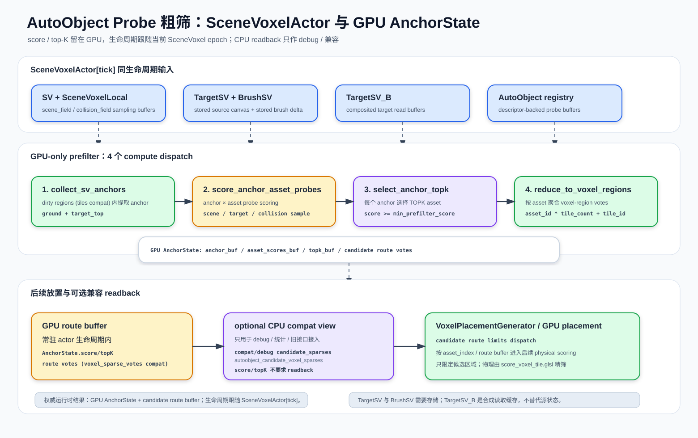

# AutoObject Probe Prefilter

本文记录 AutoObject probe 粗筛的当前实现契约。粗筛从 BlendSV-backed `SV[t - 1]` 与 `TargetSV_B` 中提取 position-only anchors，用 descriptor-backed semantic probes 给可用 `AutoObject` 打分，输出 per-asset candidate voxel regions。最终物理可放置性仍由 `score_voxel_tile.glsl` 精筛。




当前实现已稳定：GPU pipeline、Host、Anchor、Probe source、Candidate regions、Route profile debug 均已实现，CPU scoring path 已删除。以下输入/输出契约仅作为架构参考。

## 输入 / 输出

### 输入

| 数据 | 来源 | 用途 |
| --- | --- | --- |
| `SV[t - 1].complexity_field` | BlendSV-backed resident scene query channel | anchor 可放置性、占用、支撑、probe 场景采样。 |
| `SV[t - 1].collision_field` | BlendSV-backed resident collision query channel | anchor / probe collision sampling。 |
| `target_occupancy` | `TargetSV_B` complexity / collision read buffer | target demand 与 probe collision fit。 |
| `target_color` | `TargetSV_B` packed RGBA8 color / complexity | probe color / complexity fit。 |
| `autoobjects` | 当前可用 asset registry | 提供 semantic probes、collision samples、context radius。 |
| `voxel_sparse_ids` | dirty voxel regions / dirty tiles | 限定 anchor collection 的更新范围。 |

`TargetSV_B` 是 `TargetSV + BrushSV` 的 brush-composited read buffer，只作为 prefilter / routing / scoring / result feedback 的 target 输入。源 `TargetSV` 与 `BrushSV` 需要独立保存，便于重建 `TargetSV_B`。

### 输出

输出字段含义维护在 `scripts/autoobject_probe_prefilter_gpu.gd` 的 `_decode_results()` 和 `_empty_result()` 返回字典旁。

## GPU Pipeline

```text
dirty voxel regions
  -> collect_sv_anchors.glsl
  -> score_anchor_asset_probes.glsl
  -> select_anchor_topk.glsl
  -> reduce_anchor_topk_to_voxel_regions.glsl
  -> readback voxel-region votes
  -> expand by candidate_route_profiles

opt-in route payload branch:
dense voxel-region votes
  -> pack_candidate_route_records_from_votes.glsl
  -> readback schema-v1 record_bytes / range_bytes
```

Shader 职责：

| Shader | 职责 |
| --- | --- |
| `collect_sv_anchors.glsl` | 从 dirty tile / voxel regions 中收集统一 position-only anchors；来源包括 supported candidates 和 column-top candidates。 |
| `score_anchor_asset_probes.glsl` | 每个 anchor / asset 组合按 probes 采样 `SV` 与 `TargetSV_B` buffer，输出 asset score。 |
| `select_anchor_topk.glsl` | 为每个 anchor 选择 top-K assets。 |
| `reduce_anchor_topk_to_voxel_regions.glsl` | 把 anchor top-K 聚合成 `voxel_sparse_votes[asset_id * tile_count + tile_id]`。 |
| `pack_candidate_route_records_from_votes.glsl` | Opt-in producer pass，把 dense votes 按 route radius 标记后输出 schema-v1 `candidate_route_records` / `candidate_route_ranges` bytes。 |

`reduce_anchor_topk_to_voxel_regions.glsl` 只聚合 anchor 所在 tile vote。footprint、probe offset、context radius 和 interpolation guard 的扩张发生在 `autoobject_probe_prefilter_gpu.gd` 的 readback 解码阶段。

Opt-in route payload branch 使用同一份 `candidate_route_profiles.tile_radius` 在 GPU 中扩张候选集合。该分支的 record 顺序是 per-asset tile-id ascending，不声明 CPU score order；默认 CPU pack 仍保持 score desc、tile_id asc 的排序，用于避免静默改变 placement capacity / tie 行为。

## Anchor 规则

当前 anchor 是 position-only：

```text
anchor_buffer[i] = uvec4(voxel_x, voxel_y, voxel_z, 0)
```

来源都是统一的 position-only anchor，不再写入或区分 `ground` / `target_top` kind：

- Supported candidate position：当前 voxel 满足 target 阈值、scene/collision 阈值，并且下方 support 足够。
- Column-top candidate position：dirty tile 覆盖的局部 XZ column 中最高 target-occupied voxel；不强制 support，因为它只是 probe 匹配用的候选位置来源。

最终物理支撑仍由 placement footprint scoring 确认；`ground` / `target_top` 名称只作为配置输入同义词归一到 `anchor`。

## Probe 规则

Probe 通过 `AutoObject.get_semantic_probes(density)` 获取，通常来自 `AutoVoxelDescriptor.semantic_probe_profile`。当前 prefilter 不从 `object_type` 推导语义，也不使用 `object_subtype`。

Probe packed 字段：

Probe packed 字段含义维护在 `scripts/semantic_probe_profile.gd` 的 probe record 构造和 `scripts/autoobject_probe_prefilter_gpu.gd` 的 probe packing 代码旁。

采样越界时，`score_anchor_asset_probes.glsl` 会把 sample position clamp 到 grid 内，再读取 `complexity_field`、`collision_field`、`target_occupancy` 与 `target_color`。这同样适用于 `TargetSV_B` 边界：边界外不会直接视为空白。

## Context Sensing

小型资产可通过 descriptor 或 descriptor fields `context_sensing_radius` 扩大候选 route 的覆盖范围：

- probe 本身仍参与 prefilter score。
- `context_sensing_radius` 会进入 route profile，扩大 readback 后的 candidate voxel regions。
- 该扩张是召回保护，不是最终放置判定。

典型用途：小草、灌木等 mesh AABB 较小的资产，需要读取周围残余 `TargetSV_B` 信号，避免只在 anchor tile 内生成候选。

## Candidate Region Expansion

`autoobject_probe_prefilter_gpu.gd` 为每个 asset 构建 route profile：

```text
tile_radius = footprint bounds
            + semantic probe offset bounds
            + context_sensing_radius
            + interpolation_guard_voxels
```

当前保证：

- `interpolation_guard_voxels` 至少为 `1`。
- route profile 使用 `get_collision()` 烘焙出的 footprint bounds。
- route profile 使用 semantic probe offset bounds。
- `candidate_route_profiles` 暴露这些值用于 debug。
- 扩张后的 docs-facing 结果写入 `candidate_voxel_regions_by_asset`，作为 debug/API 输出；旧 `candidate_voxel_sparses_by_asset` 只作为 legacy/debug alias。
- 默认 `candidate_route_handoff_payload` 由 CPU vote-entry pack 生成，保持 score-sorted route order。
- 启用 `use_gpu_candidate_route_pack` 或同义 option 时，`candidate_route_handoff_payload` 可由 GPU route pack pass 生成，metadata 标记 `source_label = "gpu_vote_buffer_gpu_pack"`、`score_order_preserved = false`。

相关测试覆盖 `candidate_routes_expand_for_probe_footprint_context_guard`。

## 与 Placement 的关系

```text
prefilter candidate_voxel_regions_by_asset / legacy candidate_voxel_sparses_by_asset
  -> VoxelPlacementGenerator.run_multi_asset()
  -> optional same-type exclusion
  -> run_minimal()
  -> score_voxel_tile.glsl
  -> accepted placements
  -> optional GPUAutoObjectRuntime writeback
  -> optional scene_voxel_committer + create_voxel_write_spec
  -> instance_stamp_writeback
  -> dirty SceneVoxelTile / blend_scene_voxels()
```

边界：

- prefilter 只减少候选，不直接写入 scene。
- `candidate_route_profiles` 不参与 physical score。
- 空 candidate regions 表示该 asset 本轮 skip，不回退 full grid。
- `score_voxel_tile.glsl` 仍负责 footprint、support、collision、clearance、target coverage 和 target color fit。
- `score_voxel_tile.glsl` 不做 semantic dot、MLP、`semantic_score` 或 `route_score`。
- runtime writeback 和 `instance_stamp_writeback` 是 accepted placement 之后的显式 opt-in；prefilter 本身不拥有 runtime object state 或 committed SV source。

## TargetSV_B Source 边界

`TargetSV_B` 是 guidance / target 输入，不是 committed source voxel stream：

- `target_occupancy` 和 `target_color` 从 `TargetSV_B` 映射而来。
- `TargetSceneVoxel` guidance record 会跳过 source buffers。
- committed `SceneVoxel` 由 `AutoSceneVoxel` / `BrushSceneVoxel` source write 和 `blend_scene_voxels()` 发布。

更完整的目标画布说明见 [`target-scene-voxel-projection.md`](target-scene-voxel-projection.md)。

## Debug 输出

Debug 输出字段含义维护在 `scripts/autoobject_probe_prefilter_gpu.gd` 的 readback 返回字典旁。

`best_autoobject_id`、`best_probe_score`、`rejected_reason` 等 overlay 信息可以后续扩展，但不是当前 readback 主契约。

## TODO / Open Questions

- 把 CPU debug view 迁移为 actor 生命周期内的 GPU resident route buffer。
- 保持 `candidate_voxel_regions_by_asset` / `candidate_voxel_regions` 为文档和高层接口命名；旧 `sparse` key 只描述兼容 alias。
- Route validation / semantic rerank / MLP 只作为候选内二次验证计划，不能绕过 upstream prefilter。
- 是否增加 tile summary / mip / feedback priority，统一记录在 [`voxel-semantic-routing-todo.md`](voxel-semantic-routing-todo.md)。

## 测试场景

| 场景 | 说明 | Godot 场景 |
| --- | --- | --- |
| [Prefilter 总览](../../demos/placement-autoobject-probe-prefilter/placement-autoobject-probe-prefilter.md) | 测试方法与验收标准 | [`../../demos/placement-autoobject-probe-prefilter/placement-autoobject-probe-prefilter.tscn`](../../demos/placement-autoobject-probe-prefilter/placement-autoobject-probe-prefilter.tscn) |
| [Probe Prefilter Routing](../../demos/modules/probe-prefilter-routing/probe-prefilter-routing.md) | 测试方法与验收标准 | [`../../demos/modules/probe-prefilter-routing/probe-prefilter-routing.tscn`](../../demos/modules/probe-prefilter-routing/probe-prefilter-routing.tscn) |
| [Semantic Probe Authoring](../../demos/modules/semantic-probe-authoring/semantic-probe-authoring.md) | 测试方法与验收标准 | [`../../demos/modules/semantic-probe-authoring/semantic-probe-authoring.tscn`](../../demos/modules/semantic-probe-authoring/semantic-probe-authoring.tscn) |
