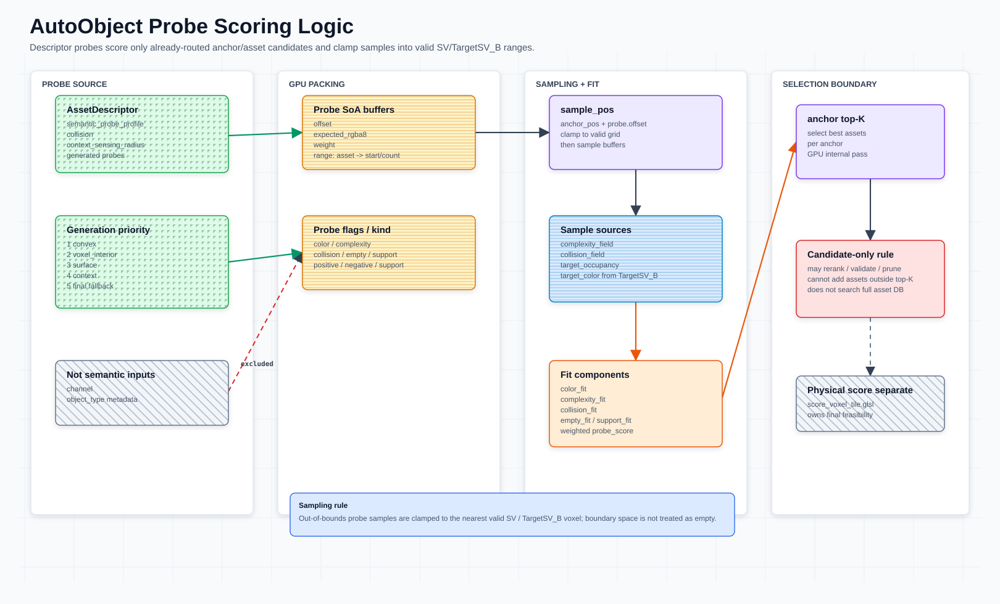

# AutoObject Probe 粗筛选

从 `SceneVoxel`（`SV`）中提取可放置 anchor，用 descriptor-backed semantic probes 对目标体素采样评分，输出每个 anchor 的候选 `AutoObject` top-K，减少后续 GPU footprint scoring 的 dispatch 数量。

粗筛只负责语义匹配筛选，物理可行性由 `score_voxel_tile.glsl` 精筛完成。



---

## 目标与非目标

```text
SV / TargetSV → anchor 提取 → probe 采样 → top-K 选择 → voxel 区域聚合 → dispatch
```

- **目标** — 排除不可放置位置；按 probe 语义匹配排序 asset；输出 `autoobject_candidate_voxel_regions` 候选 voxel 区域以限定 dispatch。
- **非目标** — 不替代 footprint 精筛；不做 mesh/SDF 精确检测；不使用 `AutoObject.scale`（强制 `Vector3.ONE`）。

---

## 输入 / 输出

### 输入

| 数据 | 来源 | 用途 |
| --- | --- | --- |
| `SV` | 当前场景体素 | anchor 可放置性、占用/碰撞/支撑 |
| `TargetSV` | 目标场景体素 | probe 采样目标结构 |
| `AutoObject[]` | 可用资产列表 | 通过 `AutoObject.get_semantic_probes()` 读取 descriptor-backed probes；`allowed_anchor_kinds`、颜色、复杂度、碰撞 voxel 也应来自 descriptor-backed getter 或明确的运行时约束字段 |
| `dirty_tiles` | 编辑/生成阶段 | 限制粗筛 voxel 区域范围 |

Buffer 映射：

| 字段 | Buffer |
| --- | --- |
| 当前占用 | `scene_occupancy` |
| 当前碰撞 | `collision_occupancy` |
| 目标强度 | `target_occupancy` |
| 目标颜色/复杂度 | `target_color` (packed `RGBA8`) |

### 输出

| 输出 | 含义 |
| --- | --- |
| `placeable_anchor_buffer` | 通过可放置测试的 anchor voxel |
| `anchor_autoobject_topk` | 每个 anchor 的优质 `AutoObject` top-K |
| `autoobject_candidate_voxel_regions` | 按 `AutoObject` 聚合的候选 voxel 区域列表；底层仍以离散 voxel 块坐标表示，并应为 probe 插值采样保留扩张边界 |
| `debug_prefilter_score` | 可选调试体素 |

---

## TargetSV 生成

TargetSV 描述每个体素位置应填充的颜色、复杂度（value）和碰撞意图，不包含 asset 标签。目标架构使用 **AutoObject stamp** 绘制 TargetSV；当前实现为纯程序化过渡版。

详细设计见 [`target-scene-voxel-projection.md`](target-scene-voxel-projection.md)。

三条生成路径（可叠加）：

| 路径 | 来源 | 保真度 | 阶段 |
| --- | --- | --- | --- |
| **VDB 导入** | Houdini / DCC 离线导出 | 最高 | 离线基底层 |
| **AutoObject Stamp** | landscape 规则 + AutoObject voxel records | 高 | 运行时 stamp |
| **程序化生成** | landscape slope / height / rock_mask | 低（过渡版） | 当前实现 |

VDB 可作为基底层，stamp 在其上叠加增量修改，程序化版为无外部数据时的回退。

### 外部 VDB 导入

计划路径：未来用 `tools/vdb_to_target_sv.py` 转换器把多个 VDB 离线合并为 TargetSV flat buffer，输出格式与持久化兼容；Godot 侧再通过 `_load_external_target_sv()` 加载。当前仓库还没有这些文件/函数。

每个 VDB 包含 5 维标量 grid：`Cd.x`/`Cd.y`/`Cd.z` → visual.rgb (3), `density` → visual.a/complexity (1), `collision` → target_collision (1)。多 VDB 按顺序合并：visual lerp, collision max。

详见 [`target-scene-voxel-projection.md` § 外部 VDB 导入](target-scene-voxel-projection.md#外部-vdb-导入)。

### 目标架构：AutoObject Stamp

TargetSV 应由 stamp 系统绘制：landscape 规则调度 stamp，每个 stamp 使用 AutoObject 烘焙的 voxel records 作为画笔 kernel，将中性的 color + complexity + collision intent 写入 TargetSV。

```text
landscape height / slope / masks / rules
  ↓ target stamp scheduler
AutoObject voxel records (color, complexity, collision, local_pos)
  ↓ transform by stamp origin / basis / scale
  ↓ blend into TargetSV
TargetSV: color.rgb + complexity/value + collision intent
```

每个 AutoObject voxel 提供：

| Source voxel field | TargetSV usage |
| --- | --- |
| `local_pos` | 变换到目标 voxel 坐标 |
| `color` | 写入目标颜色 |
| `complexity` | 写入目标视觉复杂度 |
| `collision` / occupancy | 写入目标碰撞/solid intent |
| `weight` | 控制该 source voxel 对混合的贡献 |

Blend rule（visual 加权平均，collision 取 max）：

```text
target.rgb        = lerp(target.rgb, source.rgb, alpha)
target.complexity = lerp(target.complexity, source.complexity, alpha)
target.collision  = max(target.collision, source.collision * stamp.collision_opacity)
```

这样能保证 stamp 的目标形状和候选 AutoObject 的视觉/碰撞体积同构，probe 采样时自然匹配。低碰撞 stamp（草、树叶）不会抹掉已有的强碰撞（树干、岩石）。

### 当前实现（程序化过渡版）

当前使用 `target_scene_voxel.glsl` 从 landscape 参数程序化推导 rock/grass 信号，**不使用 AutoObject stamp**。后续应替换为 stamp-based 生成。

```text
scene_depth + target_height + rock_mask
         ↓  target_scene_voxel.glsl (GPU compute)
    evaluate_voxel() per (x, y, slice)
         ↓
    visual[]:    vec4(color.rgb, value)   — rgba32f, 16 bytes/voxel
    collision[]: float                    — r32f, 4 bytes/voxel
    preview:     image2D (rgba16f)        — 调试俯视图
```

| 文件 | 作用 |
| --- | --- |
| `scripts/target_scene_voxel_generator.gd` | GPU 宿主：创建 local RD、上传纹理、dispatch、回读 buffer |
| `shaders/target_scene_voxel.glsl` | compute shader：per-voxel 程序化材质评估 |

参数：

| 参数 | 默认值 | 含义 |
| --- | --- | --- |
| `texture_size` | 256 | XZ 分辨率，从 scene_depth 宽度取 |
| `slice_count` | 8 (`TARGET_SV_SLICE_COUNT`) | 垂直切片数 |
| `vertical_span` | 16.0 (`TARGET_SV_VERTICAL_SPAN`) | 垂直跨度 (m)，每切片 2m |
| `max_height` | 50.0 | 深度图最大高度 |
| `capture_size` | 120.0 | 正交捕获范围 (m) |
| `slope_start` / `slope_full` | `landscape_cliff_slope_*` | 坡度阈值 |

Per-voxel 程序化评估：

```text
terrain_h    = max_height - scene_depth.r
height_delta = max(target_h - terrain_h, 0)
slope        = length(surface_normal.xy)          // 0=平坦, 1=垂直
rock_signal  = max(smoothstep(slope), smoothstep(fill), rock_mask)
local_y      = (slice + 0.5) / slice_count * vertical_span

rock_value   = rock_signal × vertical_falloff(rock_top)
grass_value  = flat_signal × grass_vertical × (1 - rock_signal) × 0.45

color     = weighted blend(rock_color, grass_color)
value     = max(rock_value, grass_value)
collision = max(rock_value × 0.95, grass_value × 0.08)
```

局限性：
- **颜色/复杂度固定** — rock (0.56,0.52,0.46) / grass (0.20,0.48,0.18) 硬编码，不反映实际 AutoObject 材质。
- **无 asset 形状信息** — 纯 2D 高度差 + 坡度推导，不包含树干/树冠/灌木等 3D 结构。
- **probe 匹配精度受限** — stamp-based 生成时 probe 采样到的 TargetSV 与候选 AutoObject 同构，程序化版无此保证。

### TargetSV → Prefilter Buffer 映射

无论由 stamp 还是程序化生成，TargetSV 输出到 prefilter 的映射相同：

| TargetSV 输出 | Prefilter Buffer | 转换 |
| --- | --- | --- |
| `target_visual[].rgb` (color) | `target_color` 的 RGB 通道 | pack 为 RGBA8 高位字节序 |
| `target_visual[].a` (value) | `target_color` 的 A 通道 (complexity) | pack 为 RGBA8 低 8 位 |
| `target_collision[]` | `target_occupancy` | 直接使用 float |

TargetSV 的 `value`（视觉密度）在 prefilter 中作为 `complexity` 参与评分，`collision`（碰撞强度）作为 `target_occupancy` 参与评分。

### Probe 越界处理

当 probe 采样位置超出 GVF grid 边界时（例如大型 asset 的高处或边缘 probe），采样位置 **clamp 到最近的 in-bounds voxel**，而非跳过。这保证所有 probe 都参与评分，避免边缘处因 probe 被跳过导致评分失真。

```text
if not in_bounds(sample_pos):
    sample_pos = clamp(sample_pos, (0,0,0), grid_size - 1)
```

GPU 实现见 `shaders/score_anchor_asset_probes.glsl`；GDScript 只负责 buffer 打包、dispatch 和结果回读。

### 持久化

生成结果保存到 `user://target_scene_voxel/`：

| 文件 | 格式 |
| --- | --- |
| `target_scene_voxel_visual.rgba32f` | flat binary, `voxel_count × 16` bytes |
| `target_scene_voxel_collision.r32f` | flat binary, `voxel_count × 4` bytes |
| `target_scene_voxel_preview.png` | RGBA8 PNG 俯视预览 |
| `target_scene_voxel.json` | 元数据 (version, dims, paths) |

---

## 阶段 1：Anchor 提取

Anchor 分两层提取：

- **Ground anchor** — 现有地面/支撑层，用于 anchor 在底部或脚点的资产。
- **Target top anchor** — 从 `TargetSV` 每个 XZ column 提取最高目标体素，用于 anchor 在顶部的资产，例如部分 rock。

Ground anchor 对 dirty tile 内每个 voxel 判断是否可放置：

```text
scene_occupancy[p]     <= 0.15   // 基本为空
collision_occupancy[p] <= 0.05   // 无明显碰撞
support_below(p)       >= 0.25   // 下方有支撑
target_occupancy[p]    >= 0.01   // 目标有需求
```

`support_below(p)` 初版定义：

```text
support_below = max(scene_occupancy[p + down], collision_occupancy[p + down])
```

Target top anchor 对 dirty tile 覆盖的 XZ column 从全局 Y 顶部向下扫描：

```text
p = highest voxel in whole XZ column where target_occupancy[p] >= 0.01
target_occupancy[p + up] < 0.01 or out_of_bounds(p + up)
scene_occupancy[p]     <= 0.15
collision_occupancy[p] <= 0.05
```

`target_top` 不强制 `support_below >= MIN_SUPPORT`，因为它是语义对齐点，不一定是物理落点。最终物理可行性仍由 footprint scoring 确认。

Anchor 记录：

```text
PlaceableAnchor {
  id: uint,
  voxel_pos: ivec3,
  tile_id: uint,
  anchor_kind: ground | target_top,
  support: float,
  target_value: float
}
```

---

## 阶段 2：Probe 定义

通过 `auto_object.get_semantic_probes(density, anchor_kind)` 获取。该 getter 从 `AutoVoxelDescriptor.semantic_probe_profile` 读取或生成 probes；`AutoObject` 上的同名字段只作为 legacy / Inspector / 配置字典兼容入口。约束：`scale = Vector3.ONE`，`offset` 按 asset/local space 使用。

`probe.offset` 必须相对当前资产声明的 anchor 原点生成：

- **ground** — offset 相对底部/脚点 anchor。
- **target_top** — offset 相对顶部 anchor，适合石头顶部对齐。

同一个 `AutoObject` 若同时支持多种 `anchor_kind`，需要为不同 anchor 原点烘焙对应 probe offset。

| 字段 | 用途 |
| --- | --- |
| `offset` | 相对 anchor 的采样偏移 |
| `expected_rgba8` | 期望颜色与复杂度 |
| `expected_collision` | 期望碰撞/实体强度 |
| `flags` | 控制参与哪些评分项 |
| `weight` | probe 权重 |
| `kind` | `positive` / `negative` |
| `source` | `convex` / `voxel_interior` / `surface` / `context` |

### Context Sensing Probes

小型资产（草、灌木）的 mesh AABB 很小，标准 probe 感受野有限，难以检测周围残余 TargetSV。通过 descriptor 上的 `context_sensing_radius` 在 mesh AABB 外围生成额外 probe；`AutoObject.context_sensing_radius` 只作为 legacy / Inspector / 配置字典兼容入口：

```text
context_sensing_radius = 0.0  → 禁用（默认，适合大型 rock）
context_sensing_radius = 2.0  → 感受野向外扩展 2m（适合 grass）
context_sensing_radius = 1.0  → 中等扩展（适合 bush）
```

Context probe 特征：
- **offset 超出 mesh AABB**，分布在 `[inner_r, inner_r + sensing_radius]` 环形区域
- **flags**: `FLAG_COLLISION | FLAG_COLOR`，主要检测残余 target collision
- **weight 随距离衰减**：`w = r_decay * y_decay * 0.35`，避免远处信号喧宾夺主
- **优先级最低**（Phase 4），核心 mesh probe 先占满预算，剩余位置给 context probe
- `target_count` 按 `context_sensing_radius * density * 4` 追加额外预算（上限 32）

典型场景：石头放置后周围残余 collision voxel 不足以注册新石头，草的 context probe 采样到残余 target → 得分高 → 入 top-K → 精筛通过 → 间隙被填。

`AutoObject.allowed_anchor_kinds` 控制资产参与哪类 anchor：

```text
vegetation / ground props → [ground]
rock top-aligned assets    → [target_top]
generic assets             → [ground, target_top]
```

`target_top` rock 不应强制依赖 support probe；物理支撑与碰撞仍交给 footprint scoring。

---

## 阶段 3：Probe 采样与评分

```text
score_autoobject(anchor, auto_object):
  total_score = 0, total_weight = 0
  for probe in auto_object.get_semantic_probes(density, anchor.kind):
    sample_pos = anchor.voxel_pos + voxelize(probe.offset)
    sample = read TargetSV at sample_pos
    probe_score = score_probe(sample, probe)
    total_score += probe_score * probe.weight
    total_weight += probe.weight
  return total_score / max(total_weight, epsilon)
```

采样字段：`target_color.rgb` → color, `target_color.a` → complexity, `target_occupancy` → collision, `scene_occupancy` → occupied, `SV[p+down]` → support。

### 地下 Probe 规则

当 probe 采样位置处于地面以下（`scene_occupancy[sample_pos] >= UNDERGROUND_OCC_THRESHOLD`，默认 0.5）时：

- **除碰撞检测以外的所有评分内容权重归零**。
- 没有 `FLAG_COLLISION` 的 probe：整条 probe 的 weight = 0（在 `score_autoobject` 中 skip）。
- 有 `FLAG_COLLISION` 的 positive probe：仅计算 `collision_fit`，color/complexity 权重 = 0。
- Empty/negative/support probe 即使带 `FLAG_COLLISION`：返回 0（这些 probe 类型无碰撞评分含义）。

```text
if scene_occupancy[sample_pos] >= UNDERGROUND_OCC_THRESHOLD:
  if !(flags & FLAG_COLLISION): weight = 0, skip
  if flags & FLAG_EMPTY or kind == negative: return 0
  if flags & FLAG_SUPPORT: return 0
  return collision_fit_only
```

### 评分公式

**Positive probe**：

```text
color_fit      = 1 - distance(sample.rgb, expected.rgb) / sqrt(3)
complexity_fit = 1 - abs(sample.a - expected.a)
collision_fit  = 1 - abs(sample_collision - expected_collision)
probe_score    = color_fit * w_color + complexity_fit * w_complexity + collision_fit * w_collision
```

**Empty/negative probe**：`1 - max(sample_complexity, sample_collision, sample_scene_occupied)`

**Support probe**：`clamp(sample_support, 0, 1)`

### Flag 控制

| Flag | 行为 |
| --- | --- |
| `FLAG_COLOR` | 参与 `color_fit` |
| `FLAG_COMPLEXITY` | 参与 `complexity_fit` |
| `FLAG_COLLISION` | 参与 `collision_fit` |
| `FLAG_EMPTY` | 使用 `empty_score` |
| `FLAG_SUPPORT` | 使用 `support_score` |

---

## 阶段 4：Top-K 选择与 Voxel 区域聚合

每个 anchor 先检查自身 256 个 asset 的 probe 汇总评分，过滤低质量结果，再按得分降序取 top-K（`top_k = 4`）。最终是否放置仍由后续 placement 精筛决定。

Voxel 区域聚合：

```text
for anchor in voxel_region:
  for autoobject in anchor.topK:
    for affected_region in asset_footprint_regions(anchor, autoobject):
      vote[autoobject][affected_region] += anchor.score
region_autoobject_topK = topK(vote)
// 输出: autoobject_candidate_voxel_regions[autoobject_id] = [voxel_region_pos: Vector3i...]
```

`run_multi_asset()` 只对命中的候选 voxel 区域运行 footprint scoring。

`target_top` anchor 的资产 footprint 可能位于 anchor 下方，因此 voxel 区域聚合必须按 asset 的 anchor-relative footprint AABB 扩展候选区域，不能只使用 anchor 所在区域。

聚合输出不是精确采样点集合。由于 asset probes 会对 `TargetSV` / `SceneVoxel` 做插值采样，候选 voxel 区域还应覆盖 semantic probe offset bounds、`context_sensing_radius` 和至少 1 voxel 的 interpolation guard；宁可让更多 voxel 进入候选，再交给 footprint scoring 精筛。

---

## 实现

基于现有 `GlobalVoxelField`、`AutoObject`、`SemanticProbeProfile` 接口。Probe prefilter 只保留 GPU 路径；CPU 版已删除，因为 `anchor_count × asset_count × probe_count` 的完整采样量会在 GDScript 上造成过高运算压力。

GPU 落地实现：

| 文件 | 作用 |
| --- | --- |
| `scripts/autoobject_probe_prefilter_gpu.gd` | GPU 宿主：probe 打包、4-pass dispatch、结果回读 |
| `shaders/collect_sv_anchors.glsl` | Dispatch 1 — dirty voxel 区域 → ground + target_top anchor 收集（atomic append） |
| `shaders/score_anchor_asset_probes.glsl` | Dispatch 2 (Pass A) — 16×16 workgroup，anchor×asset probe 评分 |
| `shaders/select_anchor_topk.glsl` | Dispatch 3 (Pass B) — 256 线程/anchor，top-K asset 选择 |
| `shaders/reduce_anchor_topk_to_tiles.glsl` | Dispatch 4 — anchor top-K → per-asset 候选 voxel 区域 vote 聚合 |

GPU-only 约束：

- 不保留 `scripts/autoobject_probe_prefilter.gd` CPU fallback。
- 不在 GDScript 中遍历完整 `anchor × asset × probe` 组合。
- 调试验证通过 GPU readback、debug overlay、少量 fixture 和 RenderDoc 完成。

## GPU Compute Shader

### 约束

```text
MAX_ASSETS_PER_ANCHOR = 256
MAX_PROBES_PER_ASSET  = 128
WORKGROUP_SIZE        = 16 × 16 = 256 threads
ASSET_LANES           = 16 assets / workgroup
PROBE_LANES           = 16 probe lanes / asset
```

### 规模估算

```text
ground anchors     ≈ 256 × 256 = 65536
target_top anchors ≤ 256 × 256 = 65536
assets             = 256
probes             ≤ 128 / asset
总采样             = anchor_count × 256 × 128 (上界，实际按 anchor 层、asset mask、probe 数缩减)
```

### Dispatch 策略：四 Pass Pipeline

完整 GPU 管线拆为 4 个 dispatch：

1. **Collect** — 从 dirty tiles 收集 anchor，atomic append，回读 anchor_count。
2. **Score (Pass A)** — 16 asset lanes × 16 probe lanes，sharedgroup 归约 probe 评分。
3. **Top-K (Pass B)** — 每 anchor 256 线程加载 asset scores，串行 top-K 选择。
4. **Reduce** — 串行扫描 anchor top-K，累加 per-asset tile vote。

Pass A/B 使用二维 anchor dispatch：`anchor_grid_x = ceil(sqrt(anchor_count))`，`anchor_grid_y = ceil(anchor_count / anchor_grid_x)`。

```text
Pass A — score_anchor_asset_probes.glsl (sharedgroup 统计 probe)
  dispatch       = (anchor_grid_x, anchor_grid_y, ceil(asset_count / 16))
  workgroup_size = (16, 16, 1)
  local_x        = asset lane，1 个 workgroup 覆盖 16 个 asset
  local_y        = probe lane，每个 asset 用 16 条 lane stride 处理自身 probes
  sharedgroup    = shared_score[16][16] + shared_weight[16][16]
  输出           = asset_scores[anchor_id * 256 + asset_id]

Pass B — select_anchor_topk.glsl (anchor 内 asset 筛选)
  dispatch       = (anchor_grid_x, anchor_grid_y, 1)
  workgroup_size = (16, 16, 1)
  local_id       = local_y * 16 + local_x = asset_id 0..255
  sharedgroup    = shared_scores[256]
  行为           = 每个 anchor voxel 检查内部 256 个 asset 的 probe 汇总评分
  输出           = anchor_topk[anchor_count * TOPK]
```

映射关系：

```text
Pass A:
  anchor_id   = gl_WorkGroupID.y * anchor_grid_x + gl_WorkGroupID.x
  asset_block = gl_WorkGroupID.z
  asset_lane  = gl_LocalInvocationID.x       // 0..15
  probe_lane  = gl_LocalInvocationID.y       // 0..15
  asset_id    = asset_block * 16 + asset_lane
  probe_i     = probe_lane; probe_i < probe_count; probe_i += 16

Pass B:
  anchor_id   = gl_WorkGroupID.y * anchor_grid_x + gl_WorkGroupID.x
  local_asset = gl_LocalInvocationID.y * 16 + gl_LocalInvocationID.x // 0..255
```

选择理由：

- **固定 16×16** — 每组 256 线程，兼容 Godot/Vulkan compute 的常见 workgroup 规模。
- **按 probe 数分配** — 每个 asset 读取自己的 `probe_count`，16 条 probe lane stride 处理，短 probe asset 自动少循环。
- **sharedgroup 统计** — 线程组内先写 `shared` score/weight，再由每个 asset lane 的 `probe_lane == 0` 做列归约。
- **Pass B 独立筛选** — 每个 anchor 一组，256 线程正好覆盖 256 个 asset score，先阈值过滤再 top-K。
- **二维 anchor dispatch** — `anchor_grid_x * anchor_grid_y >= anchor_count`，避免单维 dispatch 超过设备限制。
- **不依赖 subgroup 扩展** — 不需要 `GL_KHR_shader_subgroup_arithmetic`，避免不同 GPU wave size 差异。

### Buffer 布局

```text
// Probe 扁平打包，按 asset_id 连续排列
asset_probe_range[MAX_ASSETS * 2] // uvec2: { start_index, probe_count }, index = asset_id * 2 + anchor_kind_id
asset_anchor_kind_mask[256]     // uint bitmask: bit0=ground, bit1=target_top
probe_packed[total_probe_count] // 每条 probe = 2 × vec4:
  // vec4[0]: offset.x, offset.y, offset.z, weight
  // vec4[1]: expected_rgba8(as float bits), expected_collision, flags(as float bits), kind(as float bits)

// 场景数据 (已有 buffer 复用)
scene_occupancy[voxel_count]     // float
collision_occupancy[voxel_count] // float
target_occupancy[voxel_count]    // float
target_color[voxel_count]        // uint (packed RGBA8)

// Dispatch 1 输出
anchor_buffer[ANCHOR_CAPACITY]   // uvec4: { voxel_x, voxel_y, voxel_z, anchor_kind_id }
anchor_count                     // uint: atomic counter，Dispatch 1 后回读确定实际 anchor 数

// 中间 (Pass A 输出 → Pass B 输入)
asset_scores[ANCHOR_CAPACITY * 256] // float: 每 anchor 固定保留 256 个 asset 汇总评分

// Pass B 输出 → Dispatch 4 输入
anchor_topk[ANCHOR_CAPACITY * TOPK] // uvec2: { asset_id, score_as_float_bits }

// Dispatch 4 输出
tile_votes[asset_count * tile_count] // float: 每个 (asset, tile) 的累计 vote 分数
```

### Shader 总览

| # | Shader | Dispatch | Workgroup | 说明 |
| --- | --- | --- | --- | --- |
| 1 | `collect_sv_anchors.glsl` | `(dirty_tile_count, 1, 1)` | `(8, 8, 8)` | tile per workgroup, ground + target_top anchor 合并收集，atomic append |
| 2 | `score_anchor_asset_probes.glsl` | `(anchor_grid_x, anchor_grid_y, ceil(asset_count / 16))` | `(16, 16, 1)` | **Pass A** — 16 asset lanes × 16 probe lanes，sharedgroup 归约 |
| 3 | `select_anchor_topk.glsl` | `(anchor_grid_x, anchor_grid_y, 1)` | `(16, 16, 1)` | **Pass B** — 每 anchor 检查 256 asset 分数，阈值过滤 + top-K |
| 4 | `reduce_anchor_topk_to_tiles.glsl` | `(1, 1, 1)` | `(1, 1, 1)` | 串行扫描 anchor top-K，累加 per-asset tile vote |

Dispatch 1 收集 anchor 后需 `submit()+sync()` 回读 `anchor_count`，确定后续 Pass A/B 的 dispatch 维度。

### Dispatch 1 伪代码: `collect_sv_anchors.glsl`

```glsl
#version 450
layout(local_size_x = 8, local_size_y = 8, local_size_z = 8) in;

layout(set = 0, binding = 0, std430) restrict readonly  buffer SceneOcc    { float scene_occ[];    };
layout(set = 0, binding = 1, std430) restrict readonly  buffer CollisionOcc{ float collision_occ[]; };
layout(set = 0, binding = 2, std430) restrict readonly  buffer TargetOcc   { float target_occ[];   };
layout(set = 0, binding = 3, std430) restrict readonly  buffer DirtyTiles  { uint  dirty_tile_ids[];};
layout(set = 0, binding = 4, std430) restrict           buffer AnchorOut   { uvec4 anchors[];      };
layout(set = 0, binding = 5, std430) restrict           buffer AnchorCount { uint  anchor_count;   };

layout(push_constant, std430) uniform Params {
    ivec4 grid_size_pad;          // xyz = grid dims, w = dirty_tile_count
    ivec4 tile_grid_size_pad;     // xyz = tile grid dims, w = anchor_capacity
    vec4  thresholds;             // x=max_scene, y=max_coll, z=min_support, w=min_target
};

shared int s_top_y[8][8];        // target_top: highest Y per (lx, lz) column

// 每个 workgroup 处理一个 dirty tile (8×8×8 voxels)
// ground: 逐 voxel 检查可放置条件 + support_below，atomic append
// target_top: 用 shared atomicMax 找每列最高 target voxel，ly==0 线程 emit
```

### Pass A 伪代码: `score_anchor_asset_probes.glsl`

```glsl
#version 450
layout(local_size_x = 16, local_size_y = 16, local_size_z = 1) in;

layout(set = 0, binding = 0) readonly  buffer AnchorBuf   { uvec4 anchors[];           };
layout(set = 0, binding = 1) readonly  buffer ProbeRange   { uvec2 asset_probe_range[]; };
layout(set = 0, binding = 2) readonly  buffer AnchorMask   { uint  asset_anchor_kind_mask[]; };
layout(set = 0, binding = 3) readonly  buffer ProbeData    { vec4  probe_data[];        };
layout(set = 0, binding = 4) readonly  buffer SceneOcc     { float scene_occ[];         };
layout(set = 0, binding = 5) readonly  buffer CollisionOcc { float collision_occ[];     };
layout(set = 0, binding = 6) readonly  buffer TargetOcc    { float target_occ[];        };
layout(set = 0, binding = 7) readonly  buffer TargetColor  { uint  target_color[];      };
layout(set = 0, binding = 8) writeonly buffer ScoresOut    { float asset_scores[];      };

layout(push_constant, std430) uniform Params {
    ivec4 grid_size_asset_count;  // xyz = grid dims, w = asset_count
    vec4  voxel_size_inv;         // xyz = 1/voxel_size, w = unused
    uint  anchor_count;
    uint  anchor_grid_x;
    float min_prefilter_score;
    float _pad0;
};

const uint MAX_ASSETS      = 256u;
const uint ASSET_LANES     = 16u;
const uint PROBE_LANES     = 16u;
const uint ANCHOR_KIND_GROUND     = 0u;
const uint ANCHOR_KIND_TARGET_TOP = 1u;
const uint FLAG_COLOR      = 1u;
const uint FLAG_COMPLEXITY = 2u;
const uint FLAG_COLLISION  = 4u;
const uint FLAG_EMPTY      = 8u;
const uint FLAG_SUPPORT    = 16u;

shared float shared_score[16][16];
shared float shared_weight[16][16];

int voxel_index(ivec3 p) {
    return p.x + grid_size_asset_count.x * (p.z + grid_size_asset_count.z * p.y);  // XZY order
}

bool in_bounds(ivec3 p) {
    return all(greaterThanEqual(p, ivec3(0))) && all(lessThan(p, grid_size_asset_count.xyz));
}

vec4 unpack_rgba8(uint packed) {
    return vec4(
        float((packed >> 24u) & 0xFFu) / 255.0,  // R
        float((packed >> 16u) & 0xFFu) / 255.0,  // G
        float((packed >>  8u) & 0xFFu) / 255.0,  // B
        float((packed >>  0u) & 0xFFu) / 255.0   // A
    );
}

const float UNDERGROUND_OCC_THRESHOLD = 0.5;

float eval_probe(ivec3 sp, uint flags, uint kind, vec4 e_col, float e_coll) {
    int idx = voxel_index(sp);
    float s_scene = scene_occ[idx];

    // Underground: only collision scoring contributes
    if (s_scene >= UNDERGROUND_OCC_THRESHOLD) {
        if ((flags & FLAG_COLLISION) == 0u) return 0.0;
        if ((flags & FLAG_EMPTY) != 0u || kind == 1u) return 0.0;
        if ((flags & FLAG_SUPPORT) != 0u || kind == 2u) return 0.0;
        return clamp(1.0 - abs(target_occ[idx] - e_coll), 0.0, 1.0);
    }

    // Empty / negative
    if ((flags & FLAG_EMPTY) != 0u || kind == 1u) {
        vec4 sc = unpack_rgba8(target_color[idx]);
        return 1.0 - max(sc.a, max(target_occ[idx], s_scene));
    }

    // Support
    if ((flags & FLAG_SUPPORT) != 0u || kind == 2u) {
        ivec3 below = sp + ivec3(0, -1, 0);
        if (!in_bounds(below)) return 0.0;
        int bi = voxel_index(below);
        return clamp(max(scene_occ[bi], collision_occ[bi]), 0.0, 1.0);
    }

    // Positive
    vec4 sc = unpack_rgba8(target_color[idx]);
    float s_coll = target_occ[idx];
    float score = 0.0, wsum = 0.0;
    if ((flags & FLAG_COLOR) != 0u) {
        score += 1.0 - distance(sc.rgb, e_col.rgb) / 1.732;
        wsum += 1.0;
    }
    if ((flags & FLAG_COMPLEXITY) != 0u) {
        score += 1.0 - abs(sc.a - e_col.a);
        wsum += 1.0;
    }
    if ((flags & FLAG_COLLISION) != 0u) {
        score += 1.0 - abs(s_coll - e_coll);
        wsum += 1.0;
    }
    return score / max(wsum, 1e-6);
}

void main() {
    uint anchor_id   = gl_WorkGroupID.y * anchor_grid_x + gl_WorkGroupID.x;
    uint asset_block = gl_WorkGroupID.z;
    uint asset_lane  = gl_LocalInvocationID.x; // 0..15
    uint probe_lane  = gl_LocalInvocationID.y; // 0..15
    uint asset_count = min(uint(grid_size_asset_count.w), MAX_ASSETS);
    uint asset_id    = asset_block * ASSET_LANES + asset_lane;

    float lane_score  = 0.0;
    float lane_weight = 0.0;

    if (anchor_id < anchor_count && asset_id < asset_count) {
        uvec4 anchor = anchors[anchor_id];
        ivec3 anchor_pos = ivec3(anchor.xyz);
        uint anchor_kind = anchor.w;
        uint anchor_kind_bit = 1u << anchor_kind;

        if ((asset_anchor_kind_mask[asset_id] & anchor_kind_bit) != 0u) {
            uint probe_range_idx = asset_id * 2u + anchor_kind;
            uvec2 range = asset_probe_range[probe_range_idx];
            uint probe_start = range.x;
            uint probe_count = range.y;

            for (uint i = probe_lane; i < probe_count; i += PROBE_LANES) {
                uint pi = (probe_start + i) * 2u;
                vec4 d0 = probe_data[pi];
                vec4 d1 = probe_data[pi + 1u];

                vec3  offset = d0.xyz;
                float weight = max(d0.w, 0.0);
                uint  rgba8  = floatBitsToUint(d1.x);
                float e_coll = d1.y;
                uint  flags  = floatBitsToUint(d1.z);
                uint  kind   = floatBitsToUint(d1.w);

                ivec3 sp = anchor_pos + ivec3(round(offset * voxel_size_inv.xyz));
                if (in_bounds(sp)) {
                    // Underground: skip non-collision probes (weight = 0)
                    float s_scene = scene_occ[voxel_index(sp)];
                    if (s_scene >= UNDERGROUND_OCC_THRESHOLD && (flags & FLAG_COLLISION) == 0u) {
                        continue;
                    }
                    vec4 e_col = unpack_rgba8(rgba8);
                    float ps = eval_probe(sp, flags, kind, e_col, e_coll);
                    lane_score  += ps * weight;
                    lane_weight += weight;
                }
            }
        }
    }

    shared_score[asset_lane][probe_lane] = lane_score;
    shared_weight[asset_lane][probe_lane] = lane_weight;
    barrier();

    if (probe_lane == 0u && anchor_id < anchor_count && asset_id < MAX_ASSETS) {
        float sum_score = 0.0;
        float sum_weight = 0.0;
        for (uint py = 0u; py < PROBE_LANES; py++) {
            sum_score += shared_score[asset_lane][py];
            sum_weight += shared_weight[asset_lane][py];
        }
        float final_score = asset_id < asset_count ? sum_score / max(sum_weight, 1e-6) : -1.0;
        asset_scores[anchor_id * MAX_ASSETS + asset_id] = final_score;
    }
}
```

### Pass B 伪代码: `select_anchor_topk.glsl`

```glsl
#version 450
layout(local_size_x = 16, local_size_y = 16, local_size_z = 1) in;

layout(set = 0, binding = 0) readonly  buffer ScoresIn { float asset_scores[]; };
layout(set = 0, binding = 1) writeonly buffer TopKOut  { uvec2 anchor_topk[];  };

layout(push_constant) uniform Params {
    uint  anchor_count;
    uint  asset_count;
    uint  anchor_grid_x;
    float min_prefilter_score;
};

const uint MAX_ASSETS = 256u;
const uint TOPK = 4u;

shared vec2 shared_scores[256]; // x=score, y=asset_id

void main() {
    uint anchor_id = gl_WorkGroupID.y * anchor_grid_x + gl_WorkGroupID.x;
    uint tid = gl_LocalInvocationID.y * 16u + gl_LocalInvocationID.x;
    uint asset_count_clamped = min(asset_count, MAX_ASSETS);

    float score = -1.0;
    if (anchor_id < anchor_count && tid < asset_count_clamped) {
        score = asset_scores[anchor_id * MAX_ASSETS + tid];
        if (score < min_prefilter_score) {
            score = -1.0;
        }
    }
    shared_scores[tid] = vec2(score, float(tid));
    barrier();

    if (tid == 0u && anchor_id < anchor_count) {
        for (uint k = 0u; k < TOPK; k++) {
            float best = -1.0;
            uint best_id = 0xFFFFFFFFu;

            for (uint j = 0u; j < asset_count_clamped; j++) {
                if (shared_scores[j].x > best) {
                    best = shared_scores[j].x;
                    best_id = uint(shared_scores[j].y);
                }
            }

            if (best_id == 0xFFFFFFFFu) {
                anchor_topk[anchor_id * TOPK + k] = uvec2(0xFFFFFFFFu, floatBitsToUint(-1.0));
            } else {
                anchor_topk[anchor_id * TOPK + k] = uvec2(best_id, floatBitsToUint(best));
                shared_scores[best_id].x = -2.0;
            }
        }
    }
}
```

### Dispatch 4 伪代码: `reduce_anchor_topk_to_tiles.glsl`

```glsl
#version 450
layout(local_size_x = 1, local_size_y = 1, local_size_z = 1) in;

layout(set = 0, binding = 0, std430) restrict readonly  buffer AnchorBuf { uvec4 anchors[];      };
layout(set = 0, binding = 1, std430) restrict readonly  buffer TopKIn    { uvec2 anchor_topk[];  };
layout(set = 0, binding = 2, std430) restrict           buffer TileVotes { float tile_votes[];   };

layout(push_constant, std430) uniform Params {
    ivec4 tile_grid_size_pad;   // xyz = tile grid dims, w = tile_count
    uint  anchor_count;
    uint  asset_count;
    uint  topk;
    uint  _pad0;
};

// 串行扫描所有 anchor 的 top-K 结果
// anchor.xyz → tile_id → tile_votes[asset_id * tile_count + tile_id] += score
// 输出由 CPU 回读后按 asset 降序排列为 Vector3i voxel 区域坐标列表
```

### GPU 宿主调度流程

```text
1. _pack_all_probes()      — 将所有 AutoObject probe 扁平打包为 GPU buffer
2. Dispatch 1: collect     — dirty voxel 区域 → anchor buffer (atomic append)
3. submit() + sync()       — 回读 anchor_count
4. anchor_grid_x = ceil(sqrt(anchor_count))
   anchor_grid_y = ceil(anchor_count / anchor_grid_x)
5. Dispatch 2: score       — (anchor_grid_x, anchor_grid_y, ceil(asset_count/16))
6. submit() + sync()
7. Dispatch 3: topk        — (anchor_grid_x, anchor_grid_y, 1)
8. submit() + sync()
9. Dispatch 4: reduce      — (1, 1, 1)
10. submit() + sync()      — 回读 tile_votes
11. _decode_results()      — tile_votes → per-asset sorted Vector3i voxel 区域列表
```

---

## 与现有放置流程的关系

```text
// 现有流程
collision_voxels → bake_footprint → run_minimal → score_voxel_tile → reduce → stamp

// 加入粗筛
SV/TargetSV → probe prefilter → autoobject_candidate_voxel_regions → run_multi_asset (routed voxel regions) → score_voxel_tile
```

粗筛只减少候选，不直接写入场景。

---

## Debug 输出

| Debug 层 | 含义 |
| --- | --- |
| `placeable_anchor_ground` | 地面/支撑层 anchor |
| `placeable_anchor_target_top` | `TargetSV` 最高表面 anchor |
| `anchor_kind` | `ground` / `target_top` |
| `best_autoobject_id` | 最高分 AutoObject |
| `best_semantic_score` | 最高 probe 分 |
| `rejected_reason` | 支撑不足 / 目标过低 / anchor kind 不匹配 / probe 分数过低 |

---

## 验收标准

### 功能正确性

- 从 `SV` 稳定提取 `ground` anchor。
- 从 `TargetSV` 每个 dirty XZ column 稳定提取最高 `target_top` anchor。
- `anchor_topk` 按 `anchor.id` 存储，不因同一 voxel 的不同 `anchor_kind` 互相覆盖。
- `AutoObject.allowed_anchor_kinds` 能限制资产只参与匹配的 anchor 层。
- 每个 anchor 遍历对应 asset 的 descriptor-backed semantic probes 并计算分数。
- 不同 asset 按 probe 匹配得到不同排序。
- 空白/低目标区域不输出大量 asset。
- 粗筛输出转换为 `autoobject_candidate_voxel_regions` 候选 voxel 区域以限定 dispatch，并为 probe 插值采样保留扩张边界。
- 最终放置由 footprint scoring 物理确认。

### GPU 管线

- 4 个 compute shader 编译成功，无 GLSL → SPIR-V 错误。
- Dispatch 1 atomic counter 正确累计 anchor 数，不超过 `ANCHOR_CAPACITY`。
- Pass A 使用 `16×16` 线程组，结合每个 asset 的 `probe_count` 分配 probe lane，并在 sharedgroup 内完成 score/weight 统计。
- Pass B 让每个 anchor voxel 检查自身 256 个 asset 的 probe 汇总评分，过滤低质量结果后输出 anchor 级 top-K。
- Dispatch 4 候选 voxel 区域 vote 聚合结果能稳定解码为按 asset 分组的 `Vector3i` voxel 区域列表。
- GPU 版 `run_probe_prefilter()` 输出的 `autoobject_candidate_voxel_regions` 字典可直接接入 `VoxelPlacementGenerator`。
- `voxel_index` 使用 XZY 展开顺序，`unpack_rgba8` 使用 R=bits[24:31] 高位优先字节序。

---

## TODO：后续优化

按优先级逐步减少 `anchor_count × asset_count × probe_count` 的完整采样量。

### P0：Asset 粗分流

- [ ] 为 anchor / voxel 区域计算 cheap context signature。
- [ ] 为每个 `AutoObject` 预烘焙 `asset_context_signature`。
- [ ] 先用 context dot / distance 从 256 个 asset 缩到 16~32 个 asset shortlist。
- [ ] 后续 full probe scoring 只处理 shortlist 内 asset。

### P1：Probe 两级评分

- [ ] 将 `semantic_probes` 拆成 `core_probes` 与 `detail_probes`。
- [ ] `core_probes` 保留 support、negative/empty、高权重 convex、关键 collision probe。
- [ ] 第一轮只跑 `core_probes`，淘汰低分 asset。
- [ ] 第二轮只对 core 高分 asset 跑 full probes。

### P2：Probe 排序与提前拒绝

- [ ] 按拒绝能力排序 probe：support → negative/empty → high-weight convex → collision → color/complexity。
- [ ] 每 16 个 probe 做一次 chunk 统计。
- [ ] 根据 `current_score + remaining_weight` 估算最高可能分。
- [ ] 若最高可能分低于 `MIN_PREFILTER_SCORE`，提前拒绝该 asset。

### P3：Probe 数量分桶

- [ ] 按 `probe_count` 分桶：`1~32`、`33~64`、`65~128`。
- [ ] 小 probe asset 使用更短 loop / 专用 dispatch。
- [ ] 避免少 probe asset 与大 probe asset 混合导致 lane 浪费。

### P4：带宽与缓存优化

- [ ] 将 probe buffer 从 `2 × vec4` 压缩为半精度 / packed 格式。
- [ ] 评估 `offset` 使用 `int16` 或 `snorm16`。
- [ ] 评估 `weight` / `expected_collision` 使用 `float16`。
- [ ] 评估 voxel 区域内 expanded TargetSV preload，减少相邻 anchor 重复采样。

### P5：结构级优化

- [ ] 增加 voxel 区域级 prefilter：`region_context → region_asset_shortlist`。
- [ ] anchor probe scoring 只处理所属 voxel 区域的 asset shortlist。
- [ ] 将 asset 按语义 probe 聚类成 group。
- [ ] 先选择 group top-K，再在 group 内选择 asset top-K。

---

## Open Questions

- `SV` 与 `TargetSV` 是否分离：anchor 可放置性读 `SV`，语义匹配读 `TargetSV`。
- `probe.offset` 到 voxel 坐标的换算是否使用统一 `voxel_size`。
- `FLAG_EMPTY` / `FLAG_SUPPORT` 是否需在 `SemanticProbeProfile` 生成阶段补齐。
