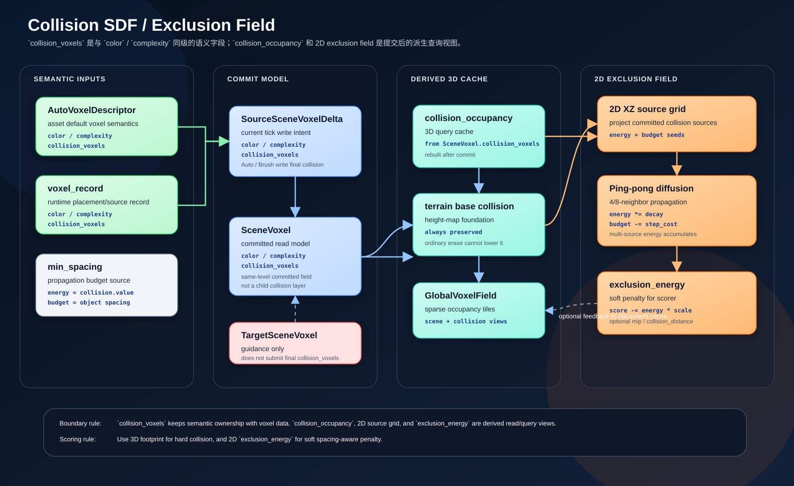

# Collision SDF Exclusion Field

本文记录碰撞互斥排斥场的设计。目标是把碰撞从二值 `block` 升级为 2D (XZ) 可传播、可累积的软排斥场，并让传播范围与 `AutoObject.min_spacing` 挂钩。



互斥判断只需要在 **2D XZ 平面**上进行——这和现有 `AutoObject.get_required_axis_center_distance_to()` 的语义一致。

## 背景

当前 `GlobalVoxelField` 主要保存：

| Buffer | 当前含义 |
| --- | --- |
| `scene_occupancy` | 从已提交 `SceneVoxel` 读取的可视 / 占用查询缓存（3D）。 |
| `collision_occupancy` | 从 committed `SceneVoxel.collision_voxels` 重建的碰撞查询缓存（3D）。 |

这两个 buffer 适合直接碰撞检查，但不适合让小窗口 scorer 感知远处碰撞源。为了解决这个问题，需要在 XZ 平面上额外构建排斥场：

```text
committed SceneVoxel.collision_voxels + terrain base collision
  -> 2D XZ collision source grid
  -> 双通道迭代扩散 (energy + budget)
  -> 2D exclusion_energy field
  -> 可选 mip / pyramid
  -> placement scorer local sampling
```

## 核心原则

| 原则 | 说明 |
| --- | --- |
| 2D XZ 平面 | 互斥判断只在 XZ 投影上进行，不需要 3D 距离场。 |
| 软排斥优先 | "距离过近"不应立即 `block`，而是先变成 penalty。 |
| 硬阻挡保留 | 地形保底碰撞、建筑核心、树干高强度 collision 仍可触发硬拒绝。 |
| 传播范围来自资产 | 排斥场的有效传播距离由来源 `AutoObject.min_spacing` 决定。 |
| 强度来自 collision | `collision_voxels[*].value` 表达源本身的碰撞/排斥强度。 |
| 大对象不被归一化抹平 | 大树、大石头、建筑拥有更多 collision 源和更大的 `min_spacing`，排斥应自然更强。 |
| 多源天然累积 | 多个源的排斥能量在同一位置叠加，不会被最近源遮挡。 |

## `min_spacing` 的职责

`AutoObject` 已有 `min_spacing` 字段。现有逻辑中，`AutoObject.get_required_axis_center_distance_to(other)` 使用：

```text
required_distance = self.min_spacing + other.min_spacing
```

在排斥场里，`min_spacing` 应该成为该对象向外传播排斥影响的主要半径。具体做法是：对象 commit 时，同时写入排斥能量和传播预算，传播预算决定了这份能量能扩散多远。

| 字段 | 用途 |
| --- | --- |
| `AutoObject.min_spacing` | 该对象的排斥传播预算来源（决定扩散多远）。 |
| `AutoObject.min_spacing_auto` | 当未手动配置时，由 bounds 推导默认传播预算。 |
| `AutoObject.bound_min_length` | 自动 spacing 的来源之一；可作为无配置时的 fallback。 |
| `collision_voxels[*].value` | 排斥能量强度（决定扩散多强），不决定传播范围。 |
| `collision_voxels[*].radius` | 碰撞源自身几何半径，投影到 XZ 写入源 grid。 |
| `collision_voxels[*].dilation_radius` | 额外膨胀半径，可作为传播预算的下限补充。 |

## 方案选型

在确定 2D XZ 之后，评估过以下几种构建方法：

### JFA (Jump Flooding Algorithm)

标准 JFA 每个像素只保留最近一个 seed。这意味着：

```text
候选位置 ---- 2m ---- 小树(min_spacing=1, value=0.2)
         ---- 4m ---- 大树(min_spacing=6, value=1.0)
```

JFA 结果：seed = 小树，distance = 2m。大树的排斥完全被遮挡，即使候选明明在大树的 `min_spacing` 范围内。

JFA 适合做 `collision_distance`（"最近碰撞有多远"本身就是单源语义），但不适合做排斥能量。Multi-seed JFA (top-K) 可以缓解遮挡，但内存 × K、复杂度高，且 K 有限。

### 逐源 stamp

每个已放置对象 commit 时，在 XZ grid 上以 `min_spacing` 为半径 additive stamp 排斥能量。

2D 下单源 stamp 成本 O(R²) 可接受，但源数量多时总成本随源数线性增长。大半径源（建筑、大树）单次 stamp 面积大。适合增量更新但不适合批量重建。

### 2D Gaussian blur（分桶）

2D separable blur 成本固定、GPU 友好、天然累积。但单一 sigma 不适应变半径源。分桶方案（按 `min_spacing` 分 3-4 个桶，每桶独立 blur 再求和）可以解决变半径，但需要管理多个桶的分配和合成。

### 双通道迭代扩散（选定方案）

用第二个通道 `budget` 控制每个源能扩散多远。不需要分桶——每个源的 `budget` 直接决定它的传播距离。同一个扩散过程里不同源自然拥有不同的有效半径，`energy` 多源累加不会被遮挡。

| 方法 | 多源累积 | 变半径 | 遮挡问题 | 2D 成本 | 复杂度 |
| --- | --- | --- | --- | --- | --- |
| JFA | 只最近 | 否 | 有 | 低 | 中 |
| 逐源 stamp | 天然 | 每源独立 | 无 | 随源数增长 | 低 |
| 分桶 blur | 天然 | 分桶解决 | 无 | 固定 | 中（多桶管理） |
| **双通道扩散** | **天然** | **budget 控制** | **无** | **固定** | **低** |

选择双通道迭代扩散的原因：统一处理变半径和多源累积，不需要分桶也不需要 JFA，实现简单，compute shader 友好。

## 构建方法：双通道迭代扩散

排斥场通过在 2D XZ grid 上迭代扩散构建。每个像素保存两个通道：

| 通道 | 含义 |
| --- | --- |
| `energy` | 当前位置的排斥能量（可来自多个源累积）。 |
| `budget` | 剩余传播预算。表示从这个位置还能继续向外扩散多远。 |

### 1. 初始化：source seed 写入

每个已提交 `SceneVoxel.collision_voxels` 源写入 2D XZ grid：

```text
energy = collision_value * exclusion_strength
budget = source_propagation_budget
```

其中传播预算来自：

```text
source_propagation_budget = max(
  auto_object.min_spacing,
  collision_voxel.radius + collision_voxel.dilation_radius,
  fallback_radius
)
```

- 小树：`energy` 低，`budget` 小 → 弱排斥，扩散近
- 大树：`energy` 高，`budget` 大 → 强排斥，扩散远

如果一个对象有多个 `collision_voxels`，它们在 XZ 投影上可能覆盖多个像素，每个像素独立写入。同一像素多次写入时 `energy` 累加、`budget` 取 max。

### 2. 迭代扩散

每一步，每个像素从 4 邻域（或 8 邻域）读取邻居，把邻居的能量按衰减传播过来：

```text
for each iteration:
    for each pixel p:
        for each neighbor n of p:
            if n.budget > step_cost:
                incoming_energy = n.energy * decay_factor
                incoming_budget = n.budget - step_cost
                p.energy += incoming_energy
                p.budget  = max(p.budget, incoming_budget)
```

| 参数 | 含义 |
| --- | --- |
| `step_cost` | 每步扩散消耗的 budget，通常等于一个像素的世界距离（`voxel_size.x` 或 `voxel_size.z`）。 |
| `decay_factor` | 能量每步衰减系数，如 `0.8`。控制衰减曲线的陡峭程度。 |

关键性质：

- **`budget` 控制扩散距离**：budget 每步减小，到 0 时停止。大树的 budget 大，能扩散更多步；小树 budget 小，很快停止。
- **`energy` 控制排斥强度**：energy 每步乘以 `decay_factor` 衰减。初始 energy 高的源在远处仍有可感知的残余。
- **多源天然累积**：`energy` 用累加（`+=`），多个源的排斥在同一位置叠加，不存在 JFA 式的最近源遮挡。
- **`budget` 用 max**：同一像素可能从不同方向收到不同源的传播，保留最大 budget 确保最远的源能继续扩散。

### 3. 迭代次数

总迭代次数由全局最大传播预算决定：

```text
max_iterations = ceil(global_max_budget / step_cost)
```

也可以提前终止：当某一步所有像素的 budget 增量都为 0 时，扩散已完全结束。

对于典型场景（最大 `min_spacing` ≈ 8-16 voxel），大约需要 8-16 次迭代。每次迭代是 2D grid 上的简单邻域操作，在 compute shader 中极快。

### 4. 双 buffer ping-pong

扩散需要读上一步、写下一步，使用两个 buffer 交替：

```text
buffer_A (read) -> compute -> buffer_B (write)
buffer_B (read) -> compute -> buffer_A (write)
...
```

每个 buffer 每像素存 2 个 float（`energy`, `budget`），内存开销很小。

## 场通道

扩散完成后，2D XZ grid 上每个像素至少提供：

| 通道 | 来源 | 下采样规则 | 用途 |
| --- | --- | --- | --- |
| `exclusion_energy` | 扩散结果 | `max` 或 saturated sum | 软排斥强度，用于降低 placement score。 |
| `collision_distance` | 可选 2D JFA | `min` | 到最近 collision 表面的 XZ 距离，用于硬约束和 debug。 |

`collision_distance` 是可选的补充通道。如果需要精确的"最近碰撞有多远"，可以在同一个 2D grid 上额外跑一次 JFA；但主要的排斥判断只需要 `exclusion_energy`。

## 排斥场在 scoring 中的使用

placement scorer 采样候选位置的 `exclusion_energy`：

```text
final_score = base_score - exclusion_energy * exclusion_penalty_scale
```

- **低 energy**：允许放置，几乎不扣分。
- **中 energy**：降低分数，排在更好位置之后。
- **高 energy**：分数可能降到 0 以下或超过硬拒绝阈值。

只有在高强度 collision（`hard_block`）或原始 3D footprint 重叠时才硬拒绝。日常互斥通过 energy 软调节。

## 候选对象自身 spacing 的处理

预计算全局场时只能知道已提交源对象，无法知道未来每个候选对象的 `min_spacing`。因此推荐拆成两部分：

| 阶段 | 处理 |
| --- | --- |
| Field build | 已放置对象按自己的 `min_spacing` 作为 `budget` 向外扩散 exclusion。 |
| Candidate scoring | 候选对象按自己的 `min_spacing` 扩大 XZ 采样范围或提高 `exclusion_penalty_scale`。 |

候选 A 与已放置源 B 的最终互斥仍应近似满足：

```text
required_center_distance ≈ A.min_spacing + B.min_spacing
```

B 的 `min_spacing` 已经编码在扩散场的传播距离中；A 的 `min_spacing` 在 scoring 时补充。

## 与硬碰撞的关系

软排斥不能替代现有 3D 硬碰撞。推荐分层：

| 层 | 维度 | 判定方式 |
| --- | --- | --- |
| 原始 collision footprint | 3D | 高分辨率硬碰撞，处理真实穿插。 |
| `collision_distance` (可选) | 2D XZ | 最近碰撞的 XZ 距离，硬约束和 debug。 |
| `exclusion_energy` | 2D XZ | 远处碰撞源扩散过来的软 penalty。 |
| mip exclusion | 2D XZ | 小感受野读取远处趋势。 |

小树靠近候选时只是扣分；大树主干、岩石、地形底座则可以通过高初始 `energy`、高 `budget` 或原始 3D footprint 重叠触发拒绝。

## 与多级下采样的关系

扩散本身已经把远处排斥传播到近处，但如果 scorer 感受野仍然不够大，可以在扩散结果上额外构建 2D mip：

```text
Level 0: 原始 2D XZ field
Level 1: 2x2 聚合
Level 2: 4x4 聚合
Level N: 更大尺度趋势
```

| 数据 | 聚合 |
| --- | --- |
| `exclusion_energy` | `max` 或 `1 - exp(-sum)`。 |
| `collision_distance` | `min`。 |

扩散已经解决了"远处碰撞能被感知"的主要需求。mip 只是额外加速，不是必要步骤。

## 与现有数据流的边界

| 约束 | 说明 |
| --- | --- |
| 只读 committed `SceneVoxel.collision_voxels` | 排斥场应从已提交 `SceneVoxel` 的同级 `collision_voxels` 字段和 terrain base collision 重建，不直接读取未提交 source voxel delta。 |
| 保留 terrain base collision | 地形高度以下 collision 必须进入 2D source grid（XZ 投影全占用），不能被普通 auto/brush/target 清除。 |
| `TargetSceneVoxel` 不直接提交最终 `collision_voxels` | Target 可影响候选和 scoring，但只有实际放置或画笔 source 才写最终 `collision_voxels`。 |
| `GlobalVoxelField` 保持 3D occupancy cache | 2D 排斥场是新增的独立 buffer，不替换从 committed `SceneVoxel.collision_voxels` 派生的 3D `collision_occupancy`。 |

## 推荐实现顺序

1. 新增 2D XZ exclusion grid（双通道 `energy` + `budget`），挂在 `GlobalVoxelField` 或独立管理。
2. 在 source record 或 placement asset def 中携带 `min_spacing` 作为 `budget` 来源。
3. `SceneVoxel` commit 后，把同级 `collision_voxels` 字段投影到 2D XZ grid 并写入初始 `energy` 和 `budget`。
4. 运行迭代扩散（ping-pong compute shader），直到 budget 耗尽或达到 max iterations。
5. 在 GPU scoring 中采样 `exclusion_energy` 作为 penalty。
6. 保留现有 3D footprint 硬碰撞作为最终确认。
7. 可选：在扩散结果上建 2D mip 供远距离粗判。

## 设计结论

排斥场在 2D XZ 平面上通过双通道迭代扩散构建：

- **`energy`** 表达排斥强度，来自 `collision_voxels[*].value`，每步衰减，多源累加。
- **`budget`** 表达传播预算，来自 `AutoObject.min_spacing`，每步递减，到 0 时停止扩散。

```text
小 min_spacing + 低 collision value -> budget 小, energy 弱 -> 近距离弱排斥
大 min_spacing + 高 collision value -> budget 大, energy 强 -> 远距离强排斥
```

这让"小树弱排斥、大树强排斥、多棵小树累积成强排斥、远处碰撞可被小窗口感知"同时成立，不需要分桶也不需要 JFA，只用一个统一的迭代扩散过程。
