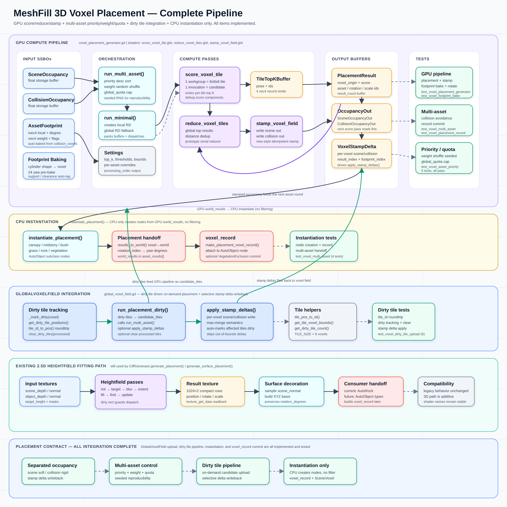

# MeshFill Placement Fitting：石头 Consumer 流程



## 核心思路

**当前石头 consumer 使用石头的高度图（mesh_height_texture）来填充放置区域。**

系统通过 Compute Shader 管线迭代地在场景中放置岩石 Mesh，每次放置后将该石头的高度"印"到场景高度图上，使场景实际高度逐步逼近目标高度（target_height）。

`CliffGenerator.generate_placement()` / `generate_surface_placement()` 是通用同类资产 GPU fitting producer，当前类名仍沿用历史命名。石头路径只是它的一个 consumer：输入一组 `AutoRock` / `AutoCliffRock` 资产、目标高度和遮罩，输出满足候选评分、去重和重叠控制的 placement result。后续 `main.gd` 才把这些结果实例化成 `AutoRock` 子类，并派生 `voxel_record` 写入场景体素系统。

---

## 数据结构

### 输入纹理（256×256，RGBAF）

| 名称 | 含义 |
|------|------|
| `scene_depth` | 场景俯视深度，`height = max_height - depth` 得到地面高度 |
| `scene_normal` | 场景法线 |
| `object_depth` | 已有物体俯视深度（用于遮挡判断） |
| `object_normal` | 已有物体法线（z>0 表示有物体） |
| `height_normal` | 高度法线（用于 ExtentMask 扩展） |
| `target_height` | **目标高度** — 每个像素期望达到的最终高度 |

### 每个 fitted 石头资产（AutoRock / AutoCliffRock）

| 字段 | 含义 |
|------|------|
| `mesh` | 石头的 3D Mesh |
| `mesh_height_texture` | **石头高度图** — 从俯视视角，每像素记录石头在该位置的高度值。小于 -10000 表示该像素无有效几何 |
| `mesh_size` | 石头在纹理空间中的尺寸 |
| `random_rotate` | 随机旋转范围 |
| `random_scale` | 随机缩放范围 |
| `random_height_offset` | 随机高度偏移范围 |

### 工作纹理

| 名称 | 像素通道含义 |
|------|-------------|
| `current_scene_depth` | R=当前高度, G=un_generate_mask, B=generate_mask |
| `target_height` | R=目标高度, G=generate_mask, B=旋转角 |
| `result_a/b` | 放置结果缓冲（Ping-Pong），row0=位置, row1=旋转/缩放/mesh索引 |
| `filter_result` | 每个 16×16 group 的最优候选得分 |
| `save_rotate_scale` | 候选放置的旋转、缩放、高度、mesh索引 |

---

## 管线流程

```
输入纹理
  │
  ▼
Pass 1: Init ─────────────────────── 初始化高度 & 生成遮罩
  │
  ▼
Pass 1.5: Generate Target Height ─── 泛洪传播目标高度到悬崖区域
  │
  ▼
Pass 1.6: Blur ──────────────────── 高斯模糊平滑目标高度
  │
  ▼
Pass 2: Extent Generate Mask ────── 扩展生成遮罩边界
  │
  ▼
┌──────────────────────────────────── 迭代 N 次（默认 50 次）
│  Pass 3: Fill Vertical Rock ────── 评估每个候选位置，利用石头高度图打分
│  Pass 4: Find Best Pixel ───────── 选出最佳放置位置，去重
│  Pass 5: Update Current Height ─── 将石头高度印到场景高度图上
│  Ping-Pong 交换缓冲
└──────────────────────────────────── 循环直到完成
  │
  ▼
回读结果 → 实例化 MeshInstance3D
```

---

## 各 Pass 详解

### Pass 1: Init（`init_vertical_rock.glsl`）

**目的：** 将输入纹理转换为工作格式，计算初始遮罩。

对每个像素：
1. 从 `scene_depth` 算出地面高度：`height = max_height - depth`
2. 从相邻像素深度差计算场景法线
3. 计算两种遮罩：
   - **generate_mask**：法线 Z 分量 < 0.75 且 > 0（即**陡坡区域**，需要放置石头）
   - **un_generate_mask**：已有物体遮挡、边界、或高度为负的区域（**禁止放置**）
4. 从 `target_height` 输入读取目标高度
5. 写入 `current_scene_depth` = (height, un_generate_mask, generate_mask)
6. 写入 `target_height` = (target_h, generate_mask, rotate_angle)

### Pass 1.5: Generate Target Height（`generate_target_height.glsl`）

**目的：** 通过泛洪填充，将目标高度从非悬崖区域传播到悬崖区域。

悬崖区域（generate_mask=1）自身没有明确的目标高度，需要从周围平坦地面"借"高度值：
- 使用 Shared Memory 加速的 4 邻域泛洪
- 如果当前像素 `generate_mask > 0`（需要生成），则从邻居中找 `generate_mask < 1` 且高度更大的像素，取其高度
- 多次迭代（`ceil(256/32) × 2 = 16` 次 Dispatch），保证传播覆盖整个纹理

### Pass 1.6: Blur（`blur_texture.glsl`）

**目的：** 对目标高度做高斯模糊（半径 7），消除泛洪产生的锯齿边界。

### Pass 2: Extent Generate Mask（`extent_generate_mask.glsl`）

**目的：** 将 `generate_mask` 向周围扩展 2 个像素。

Shared Memory 泛洪：如果邻居有 `generate_mask > 0` 且高度较低，就把 mask 传播过来。这让石头可以稍微"越界"放置，避免留下缝隙。

---

### 迭代阶段（每次迭代处理一个石头候选）

#### Pass 3: Fill Vertical Rock（`fill_vertical_rock.glsl`）— 候选评估

**核心逻辑：利用石头高度图评估每个位置的放置质量。**

工作方式（16×16 线程组）：
1. 每个线程代表一个候选放置中心位置
2. 将石头高度图 16×16 采样加载到 Shared Memory
3. 对候选位置，旋转 UV（基于目标高度纹理中存储的法线方向 + 随机旋转）
4. 遍历石头高度图的每个像素（16×16），检查对应场景位置：

```
放置高度 = 石头高度图值 + 目标高度 + 高度偏移
```

5. 统计：
   - `gen_count`：generate_mask > 0 且 un_generate_mask == 0 且**放置高度 > 当前高度**的像素数
   - `un_gen_count`：un_generate_mask > 0 的像素数
   - `height_fix`：当前高度超出放置高度的最大差值（用于向上调整）

6. 通过阈值筛选：
   - `gen_count / total > generate_threshold`（0.5）—— 覆盖面积足够
   - `un_gen_count / total < un_generate_threshold`（0.3）—— 遮挡区域不能太多

7. 打分：`score = gen_count × max_count - un_gen_count`

8. 组内线程 0 选出最高分位置，写入 `filter_result` 和 `save_rotate_scale`

#### Pass 4: Find Best Pixel（`find_best_pixel.glsl`）— 选择 & 去重

1. 读取所有 group 的最优候选
2. **去重**：对 5×5 邻域内的候选进行距离检查，如果两个候选过近（`dist < (size_a + size_b) / 2`），保留分数更高的
3. 使用 Atomic Counter 将通过去重的候选写入 result 缓冲
4. 每个有效候选存储：
   - Row 0: (归一化 UV.x, 归一化 UV.y, 放置基准高度, 0)
   - Row 1: (旋转角, 缩放, mesh索引, 0)

#### Pass 5: Update Current Height（`update_current_height.glsl`）— **高度印章**

**这是场景高度被实际更改的地方。**

对每个像素：
1. 遍历本次迭代新增的所有放置结果
2. 对每个放置的石头：
   - 将当前像素坐标转换到石头局部 UV（减去放置位置、反旋转、反缩放）
   - 如果在石头范围内，采样石头高度图得到 `mesh_h`
   - 计算实际绘制高度：

```
draw_h = mesh_h + scene_h   （石头局部高度 + 放置基准高度）
```

3. 更新场景高度：

```
new_height = clamp(max(current_height, draw_h), 0, max_height)
```

**石头只会抬高场景高度，不会降低。** 每次放置后，`current_height` 向上移动，更接近 `target_height`。

`rock_overlap` 会作为 `overlap_ratio` 传入此 pass，用于控制新石头高度印章与当前高度之间的混合：

```text
effective_draw_h = mix(draw_h, current_height, rock_overlap)
```

当前重叠控制分两层：

| 层 | 位置 | 作用 |
|---|---|---|
| 候选去重 | `find_best_pixel.glsl` | 同一轮候选之间按 5×5 邻域和尺寸距离去重，避免同类岩石中心过近 |
| 高度叠加控制 | `update_current_height.glsl` 的 `rock_overlap` | 控制新石头印章对 `current_height` 的贡献；值越接近 `1.0`，越保守，越少抬高/叠加 |

---

## 高度变化原理图

```
目标高度  ─ ─ ─ ─ ─ ─ ─ ─ ─ ─ ─ ─ ─ ─ ─ ─ ─ ─  target_height
              ┌───┐
          ┌───┤   ├───┐         ┌─────┐
      ┌───┤   │   │   ├─────┐  │Rock3│
  ┌───┤   │ R2│   │ R2│     ├──┤     ├──┐
  │   │ R1│   │   │   │ R1  │  │     │  │
──┴───┴───┴───┴───┴───┴─────┴──┴─────┴──┴──  ground (initial)
  ▲                                     ▲
  │  每次迭代放置石头后，场景高度上升    │
  │  逐渐逼近目标高度                   │
```

每次迭代：
1. `current_height` 和 `target_height` 之间的差距驱动放置评分
2. **石头放在差距最大、且满足遮罩条件的区域**
3. 放置后 `current_height` 上升 → 差距减小 → 下次迭代关注剩余缺口

---

## CPU 侧后处理（main.gd）

迭代完成后，GPU 回传的结果数组包含每个放置的：UV 位置、旋转角、缩放、mesh 索引。

CPU 将其转换为世界坐标并实例化：

```
world_pos.x = uv_x × capture_size - capture_size/2
world_pos.z = uv_y × capture_size - capture_size/2
world_pos.y = result_height  （从 GPU 结果直接读取）
world_scale = scale / mesh_size × capture_size
rotation_y  = result_rotation
```

每个石头会复制对应的 `AutoRock` / `AutoCliffRock` 原型，作为 `AutoObject` 子类节点添加到场景树。

---

## 关键参数

| 参数 | 默认值 | 作用 |
|------|--------|------|
| `num_iterations` | 50 | 迭代次数，每次尝试放置一批石头 |
| `capture_size` | 30m | 俯视捕获的场景范围 |
| `max_height` | 50m | 最大高度限制 |
| `generate_threshold` | 0.5 | 石头覆盖区域中 generate_mask 的最低比例 |
| `un_generate_threshold` | 0.3 | 石头覆盖区域中 un_generate_mask 的最高比例 |
| `rock_overlap` | 0.0 | 新石头高度印章与当前高度混合的比例；越高越保守，越限制同类填充结果继续叠加 |
| `mesh_height_scale` | 0.5 | 石头高度图的缩放系数 |
| `fbx_unit_scale` | 1.0 | FBX 单位到场景单位的缩放 |

---

## 总结

MeshFill 的本质是一个 **基于高度图的贪心填充算法**：

1. 从输入纹理确定"哪里需要石头"（陡坡 → generate_mask）和"目标高度是多少"
2. 每轮迭代，在 GPU 上并行评估每个候选位置的石头高度图与场景的匹配程度
3. 选出最优位置放置，然后将石头的高度贡献**叠加到场景当前高度**
4. 重复迭代，场景高度逐步上升，直到接近目标高度或迭代耗尽
