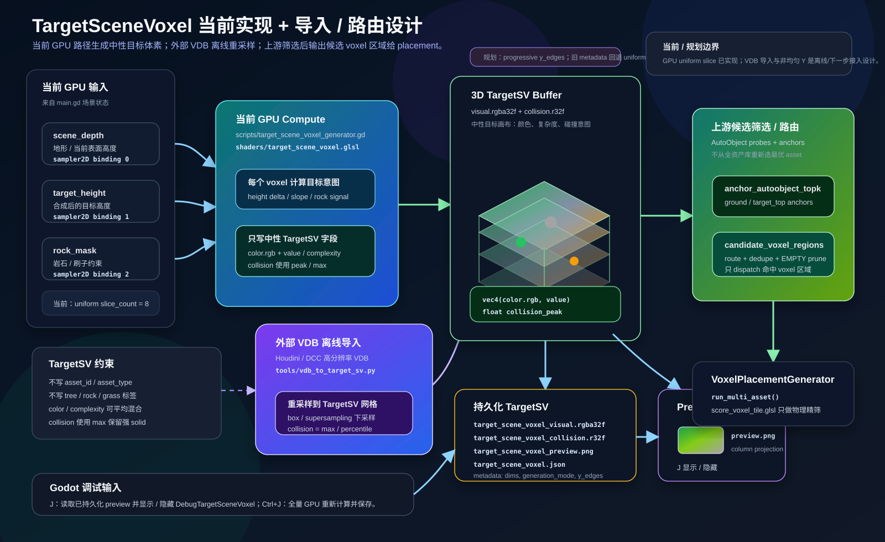

# TargetSceneVoxel Projection — Target Guidance 边界

本文定义 `TargetSceneVoxel`（简称 `TargetSV`）、`BrushSV` 和 `TargetSV_B` 的职责边界。`TargetSV_B` 是 prefilter / routing / scoring / result feedback 的 target guidance 输入，不是 committed `SceneVoxel`，也不是资产选择结果。



## 语义边界

`TargetSV` 表达目标视觉效果：“希望最终场景看起来是什么样”。它不表达“已经放置了哪个 asset”。

允许写入目标画布：

当前已落地的目标画布字段含义维护在 `scripts/target_scene_voxel_generator.gd` 的 buffer 返回字典和 `shaders/target_scene_voxel.glsl` 写入逻辑旁；目标强度统一映射到 `complexity` / `collision`。

不应写入目标画布：

| 禁止字段 | 原因 |
| --- | --- |
| `asset_type` / `asset_group` | 资产类型属于 routing / placement 结果。 |
| `placement_role` | role 应由 probe、projection 或 matcher 推断。 |
| committed source metadata | `TargetSV_B` 不进入 `blend_scene_voxels()`。 |

## 当前实现

| 项 | 当前实现 |
| --- | --- |
| 生成脚本 | `scripts/target_scene_voxel_generator.gd` |
| Compute shader | `shaders/target_scene_voxel.glsl` |
| 数据形态 | `texture_size x slice_count x texture_size` 的 3D flat buffer |
| 源 visual buffer | `target_scene_voxel_visual.rgba32f`，每 voxel 为 `vec4(color.rgb, complexity)` |
| 源 collision buffer | `target_scene_voxel_collision.r32f`，每 voxel 为 `collision_peak` |
| brush-composited visual | `target_scene_voxel_b_visual.rgba32f` |
| brush-composited collision | `target_scene_voxel_b_collision.r32f` |
| preview | `target_scene_voxel_preview.png` / `target_scene_voxel_b_preview.png` |
| metadata | `target_scene_voxel.json` / `target_scene_voxel_b.json` |
| 保存目录 | `user://target_scene_voxel/` |

当前交互：

| 输入 | 行为 |
| --- | --- |
| `Ctrl+J` | 全量重新计算源 `TargetSV`，再与已保存 / 当前 `BrushSV` 合成并保存 `TargetSV_B`。 |
| `J` | 显示 / 隐藏已持久化的 `TargetSV_B` preview overlay。 |

当前生成仍是程序化过渡版：由 terrain depth、target height 和 rock mask 推导目标颜色 / complexity / collision。Stamp 和外部 VDB 导入仍是计划。

## 实现进度

| 项 | 状态 | 代码 / 测试 |
| --- | --- | --- |
| GPU 生成 `TargetSV` / `TargetSV_B` raw buffers | 已实现 | `TargetSceneVoxelGenerator.generate()`、`target_scene_voxel.glsl` |
| 持久化 `rgba32f` / `r32f` / preview / metadata | 已实现 | `main.gd` 的 `_save_target_scene_voxel()` / `_load_persisted_target_scene_voxel_variant()` |
| `TargetSV_B` -> `target_occupancy` / `target_color` 解码 | 已实现 | `TargetSceneVoxelGenerator.decode_target_read_buffers()`、`tools/test_target_sv_buffer_decode.gd` |
| Probe Inspect 使用统一 read arrays | 已实现 | `main.gd` 的 `_decode_target_sv_b_read_buffers()`、`_probe_inspect_at_screen()` |
| Guidance-only 边界 | 已测试 | `tools/test_target_guidance_source_boundary.gd` |
| Stamp rasterizer / 外部 VDB 导入 / projection cache | 未实现 | 仍在计划阶段 |

## Source / Guidance 契约

| 数据 | 归属 | 消费者 |
| --- | --- | --- |
| `TargetSV` | 源目标画布 | 重建、持久化、debug / import 回查。 |
| `BrushSV` | 目标画布笔刷 delta / override | 与源 `TargetSV` 重新合成 `TargetSV_B`。 |
| `TargetSV_B` | brush-composited target read buffer | prefilter、routing、physical target fit、result feedback、debug。 |
| `target_occupancy` | 从 `TargetSV_B` 读取的 target complexity / collision intent | `score_anchor_asset_probes.glsl`、`score_voxel_tile.glsl`。 |
| `target_color` | 从 `TargetSV_B` 读取的 packed RGBA8 color / complexity | `score_anchor_asset_probes.glsl`、`score_voxel_tile.glsl`。 |

当前源码提供 `TargetSceneVoxelGenerator.decode_target_read_buffers()`，用于把 `target_scene_voxel_b_visual.rgba32f` / `target_scene_voxel_b_collision.r32f` 解码为 `target_occupancy` 和 `target_color`。`target_occupancy` 默认取 `max(visual.a, collision)`，使 prefilter、physical target fit 和 result feedback 能同时看到 complexity 与 collision intent；`target_color.a` 保留 visual complexity。

硬边界：

- `TargetSV` / `BrushSV` / `TargetSV_B` 都不参与 committed `SceneVoxel` source write。
- `TargetSV_B` 不进入 `blend_scene_voxels()`。
- `TargetSceneVoxel` guidance record 可作为 queryable metadata 保留，但会跳过 source buffers。
- 当前 record builder 会为 `TargetSceneVoxel` 设置 `target_guidance_only = true`、`height_buffer_applied = false`、`collision_buffer_applied = false`。
- 最终 `collision_field` 由 committed `SceneVoxel.collision` 与 terrain base collision 发布到 SV resident collision channel。

这个边界由 `tools/test_target_guidance_source_boundary.gd` 覆盖。

## Prefilter / Routing 关系

```text
TargetSV + BrushSV
  -> TargetSV_B
  -> target_occupancy + target_color
  -> AutoObject probe prefilter
  -> candidate_voxel_regions_by_asset
  -> score_voxel_tile.glsl
  -> BlendSV[tick] result feedback comparison
```

当前 prefilter 和 physical score 只读取 `target_occupancy` 与 `target_color`。`score_voxel_tile.glsl` 不读取 projection cache，也不做 semantic rerank / MLP。结果级 feedback 是 placement / commit 之后的独立阶段：`SceneVoxelCommitter.score_blendsv_feedback_against_target()` 比较 `BlendSV[tick]` 与 `TargetSV_B` / `TargetSV`，不能写成 `score_voxel_tile.glsl` 的现行能力。

## Anchor 语义

GPU prefilter 从多个位置来源提取 anchors，但写入同一个 position-only `anchor_buffer`。`anchor_kind` 不再作为字段存储，也不再区分 `ground` / `target_top`：

| 位置来源 | 当前定义 |
| --- | --- |
| Supported candidate position | 当前 voxel 满足 target 阈值、scene/collision 阈值，并且下方 support 足够。 |
| Column-top candidate position | dirty tile 覆盖的局部 XZ column 中最高的 target-occupied voxel；不强制 support。 |

Column-top position 不是资产类型，也不是最终 placement 点，只是 probe 匹配用的候选位置来源。`ground` / `target_top` 配置名会归一到单一 `anchor`。

## Candidate Voxel Region 边界

高层使用 `voxel region` 术语；当前 docs-facing route key 是 `candidate_voxel_regions*`，代码中的 `candidate_voxel_sparses*` / `voxel_sparse` 仅作为 legacy/debug 名称。

```text
AutoObject probe prefilter
  -> GPU voxel-region votes
  -> readback expansion
  -> candidate_voxel_regions_by_asset debug view
     (legacy candidate_voxel_sparses_by_asset alias)
  -> VoxelPlacementGenerator.run_multi_asset()
```

候选区域必须偏向召回：GPU prefilter readback 会按 footprint、probe offset、context radius 和至少 1 voxel interpolation guard 扩张。footprint、support、collision、clearance 和 target fit 仍由 `score_voxel_tile.glsl` 精筛。

## Stamp 计划

Stamp 系统仍是目标架构计划，负责把中性的目标视觉效果绘制到 `TargetSV`，不直接生成真实 asset。

```text
landscape slope / masks / procedural rules
  -> target stamp scheduler
  -> stamp rasterizer
  -> TargetSV color + complexity + collision intent
```

计划中的 stamp record：

| Field | Meaning |
| --- | --- |
| `origin_voxel` | stamp 锚点，通常来自 landscape surface 或支撑点。 |
| `basis` | stamp 局部坐标。 |
| `bounds` | stamp 影响的 voxel AABB。 |
| `source_voxels` | 计划中的 stamp-local voxel samples；不是 committed source stream，也不是 canonical `instance_stamp_write_spec` / `ISWS` 名称。 |
| `opacity` | visual 混合权重。 |
| `collision_opacity` | collision intent 混合权重。 |
| `scale` | stamp 缩放。 |
| `priority` | 多 stamp 冲突时的优先级。 |

混合规则计划：

```text
target.rgb        = weighted_average(target.rgb, source.rgb, opacity)
target.complexity = weighted_average(target.complexity, source.complexity, opacity)
target.collision  = max(target.collision, source.collision * collision_opacity)
```

## Projection Cache 计划

Projection cache 是面向 candidate anchors 的压缩特征，不是原始 `TargetSV` 数据，也不是资产标签。

计划缓存：

```text
target_anchor_projection_rgba8[anchor]
```

计划用途：

- 只用于候选 route 内部验证、rerank 或 pruning。
- 不绕过 upstream prefilter。
- 不从全资产库生成新候选。
- 未启用 projection 时，routing 保持当前 `target_occupancy` / `target_color` 路径。

## 外部 VDB 导入计划

外部 VDB 导入仍是计划。当前仓库没有 VDB 转换脚本或 Godot 侧外部 TargetSV 加载接口。

目标流程：

```text
Houdini / DCC
  -> export VDB grids
  -> offline converter
  -> target_scene_voxel_visual.rgba32f
  -> target_scene_voxel_collision.r32f
  -> target_scene_voxel.json
  -> Godot runtime loads TargetSV buffers
```

## TODO / Open Questions

- Stamp rasterizer、外部 VDB importer、projection cache 都仍是计划项。
- Projection score 如实现，只能进入候选 route 内部 rerank / validation。
- 需要继续验证统一 position-only anchors 的 supported / column-top 候选来源对不同 asset probe offset 的覆盖。
- `TargetSV_B` cache 可以持久化，并可解码为当前 placement/readback 使用的 `target_occupancy` / `target_color`；权威来源仍是 `TargetSV` 与 `BrushSV`。

## 测试场景

| 场景 | 说明 | Godot 场景 |
| --- | --- | --- |
| [TargetSV 总览](../../demos/placement-target-scene-voxel-projection/placement-target-scene-voxel-projection.md) | 测试方法与验收标准 | [`../../demos/placement-target-scene-voxel-projection/placement-target-scene-voxel-projection.tscn`](../../demos/placement-target-scene-voxel-projection/placement-target-scene-voxel-projection.tscn) |
| [Target Canvas Guidance](../../demos/modules/target-canvas-guidance/target-canvas-guidance.md) | 测试方法与验收标准 | [`../../demos/modules/target-canvas-guidance/target-canvas-guidance.tscn`](../../demos/modules/target-canvas-guidance/target-canvas-guidance.tscn) |
| [Probe Prefilter Routing](../../demos/modules/probe-prefilter-routing/probe-prefilter-routing.md) | 测试方法与验收标准 | [`../../demos/modules/probe-prefilter-routing/probe-prefilter-routing.tscn`](../../demos/modules/probe-prefilter-routing/probe-prefilter-routing.tscn) |
| [TargetSV Point Cloud Conversion](../../demos/target-sv-point-cloud-conversion/target-sv-point-cloud-conversion.md) | Houdini point-cloud `Cd` / `complex` / `collision` 转 TargetSV guidance buffer 的验收场景 | [`../../demos/target-sv-point-cloud-conversion/target-sv-point-cloud-conversion.tscn`](../../demos/target-sv-point-cloud-conversion/target-sv-point-cloud-conversion.tscn) |
