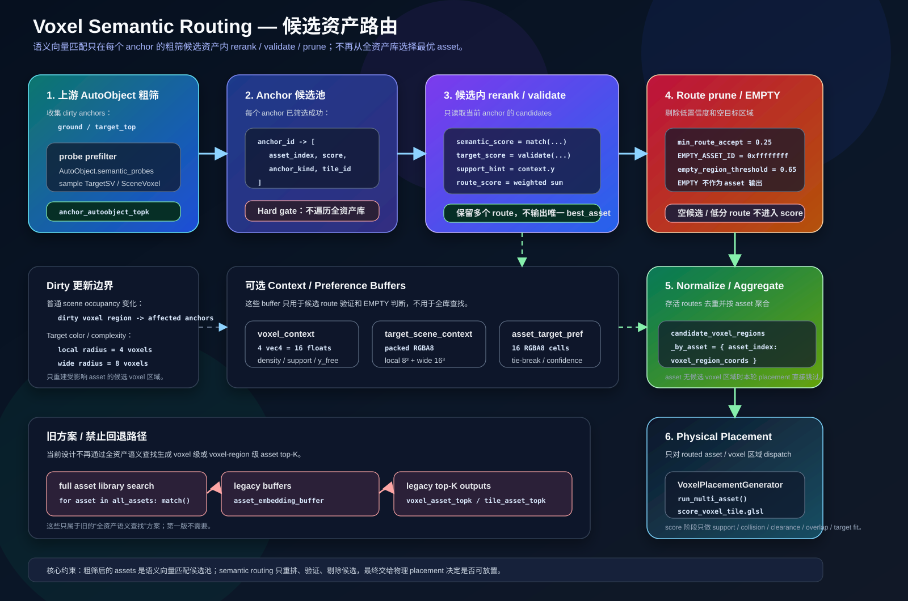

# Voxel Semantic Routing TODO

本文只记录候选路由后续事项。已实现契约见 [`voxel-semantic-routing.md`](voxel-semantic-routing.md) 和 [`autoobject-probe-prefilter.md`](autoobject-probe-prefilter.md)。



## 已落地基线

- GPU probe prefilter 已输出 per-asset candidate voxel-region votes。
- CPU debug view 已提供 docs-facing `candidate_voxel_regions_by_asset`，并保留 `candidate_voxel_sparses_by_asset` 作为 legacy alias。
- `candidate_route_profiles` 已作为 debug 信息输出。
- readback 扩张已覆盖 footprint、probe offset、`context_sensing_radius` 和至少 1 voxel interpolation guard。
- `VoxelPlacementGenerator.run_multi_asset()` 已消费 `candidate_voxel_regions_by_asset`，旧 `candidate_voxel_sparses_by_asset` 仅作为兼容输入。
- 空 candidate regions 已直接 `skipped_prefilter`，不回退 full grid。
- `TargetSV_B` 已作为 target / guidance 输入，且不进入 committed `SceneVoxel`。
- `TargetSV_B` raw cache 已可解码为 `target_occupancy` / `target_color`，供 prefilter、physical score 和 debug 使用。
- `score_voxel_tile.glsl` 保持 physical score / target fit 职责，不做 semantic dot、MLP 或 route score。

## P0：Route Key 命名与测试收敛

- [x] 增加 `candidate_voxel_regions_by_asset` / `candidate_voxel_regions` 作为更准确命名；`candidate_voxel_sparses_by_asset` / `candidate_voxel_sparses` 保留为 legacy alias。
- [ ] 为 `candidate_route_profiles` 明确 debug schema，避免被误用为 placement runtime 输入。
- [x] 补充 `run_multi_asset()` 对 route dictionary 的字符串 / int asset key 映射测试。
- [ ] 补充 dirty voxel-region route rebuild 的集成测试。
- [ ] 文档和测试中统一“voxel region”为高层术语，`tile_id` 只描述底层 storage / workgroup key。

## P1：GPU Resident Route

- [ ] 将 GPU `AnchorState`、candidate route buffer 和 per-asset candidate voxel regions 常驻到 `SceneVoxelCommitter` / SV owner 生命周期内。
- [ ] 减少 `candidate_voxel_regions_by_asset` CPU readback 对正常 placement path 的依赖，只保留 debug / entry；legacy `candidate_voxel_sparses_by_asset` 不作为新接口扩展。
- [ ] 支持 source write / stamp delta 后 partial GPU buffer update，只上传 dirty voxel-region range。
- [ ] 标准化 dirty voxel region guard expansion：asset footprint AABB、probe offset bounds、`context_sensing_radius` 和至少 1 voxel interpolation guard。
- [ ] 增加 tile feedback / priority 统计，记录本帧 probe、placement、debug 实际读取的 tile。

## P2：候选集内部验证

这些项未实现，不能写入 physical score shader 的当前能力。

- [ ] 评估是否需要 `voxel_context_buffer`；若保留，只用于 candidate route validation 和 EMPTY 判断。
- [ ] 评估是否需要 `target_scene_context_rgba8_buffer`；若保留，只用于局部 / wide TargetSV 颜色与复杂度验证。
- [ ] 为所有 TargetSV_B probe / context 采样记录可选 `clamped_sample_count` debug。
- [ ] 评估 `route_score` 默认阈值和 `empty_region_threshold`。
- [ ] 明确 `semantic_score` / `target_score` 与现有 probe prefilter score 是否重复；未明确前不作为主路径。

## P3：TargetSceneVoxel Projection

设计文档：

```text
docs/placement/target-scene-voxel-projection.md
```

- [x] 保持当前 `target_occupancy` / `target_color` 路径稳定：`decode_target_read_buffers()` 和 `tools/test_target_sv_buffer_decode.gd` 覆盖 raw buffer 解码。
- [ ] 新增 `target_anchor_projection_rgba8`，先实现垂直柱压缩。
- [ ] 将 projection 投影到 nearest supported position-only anchor candidate。
- [ ] 增加水平扩散与 falloff，让树冠、岩体或墙体影响多个 anchor。
- [ ] 为 asset 烘焙 `asset_anchor_pref_rgba8`。
- [ ] 只在候选 route 内加入 `projection_score`，不绕过 upstream prefilter。

## P4：Asset Semantic Probes

设计文档：

```text
docs/core/asset-semantic-probes.md
```

- [ ] 明确 `SemanticProbe` flags 的稳定 bit layout。
- [ ] 为 `context` probe 增加可视化 / inspect 输出。
- [ ] 验证统一 position-only anchor 的 supported / column-top 候选来源对 probe offset 的覆盖。
- [ ] 添加测试：probe 生成确定性、context probe 数量、TargetSV_B clamp 采样。

## P5：MLP / Learned Matcher

MLP 只能影响候选集内部 validation，不能恢复全资产查找。

- [ ] 保留手工 16D context 作为 baseline。
- [ ] 新增 tiny MLP：`16 -> 32 -> 16`，输出 `learned_route_context`。
- [ ] 只对 anchor top-K 中已有候选计算 learned score。
- [ ] 增加开关：手工 context / learned context 可切换对比。
- [ ] 记录用户手动放置、修正或拒绝的候选 route 样本。

## P6：SV Tiled Sampling

- [x] 增加 `SceneVoxelTile` metadata / summary GPU buffers：记录 `tile_id`、`epoch`、dirty flag、`non_empty`、`scene_minmax`、`collision_minmax` 和 voxel bounds，并支持 readback 验收。
- [x] 为 `scene_field` / `collision_field` 生成 tile-level min/max summary。
- [ ] 让 shader-side sampling 直接消费 `SceneVoxelTile` metadata / summary buffers。
- [ ] 增加 coarse occupancy / collision mip；先实现每个 `8x8x8` tile 一个 summary cell。
- [ ] 为跨 tile probe / footprint 采样保留 tile border / guard cells。
- [ ] 评估 SV epoch publish：本轮读 `SV[t - 1]`，commit 后发布 `SV[tick]`。
- [ ] 大世界需求明确前，不做 streaming eviction、虚拟页表或 sparse active tile atlas。

## 验收边界

- [ ] 不新增全资产枚举 shader。
- [ ] 不恢复 `voxel_asset_topk_buffer` / `tile_asset_topk_buffer` 作为主路径。
- [ ] `score_voxel_tile.glsl` 保持 physical score / target fit 职责。
- [ ] 未启用 route validation 时，现有 placement 行为保持不变。
- [ ] `TargetSV_B` guidance record 不进入 committed `SceneVoxel`，也不写入 source buffers。

## 测试场景

| 场景 | 说明 | Godot 场景 |
| --- | --- | --- |
| [Routing TODO 总览](../../demos/placement-voxel-semantic-routing-todo/placement-voxel-semantic-routing-todo.md) | 测试方法与验收标准 | [`../../demos/placement-voxel-semantic-routing-todo/placement-voxel-semantic-routing-todo.tscn`](../../demos/placement-voxel-semantic-routing-todo/placement-voxel-semantic-routing-todo.tscn) |
| [Candidate Routing Contract](../../demos/modules/candidate-routing-contract/candidate-routing-contract.md) | 测试方法与验收标准 | [`../../demos/modules/candidate-routing-contract/candidate-routing-contract.tscn`](../../demos/modules/candidate-routing-contract/candidate-routing-contract.tscn) |
| [SceneVoxelTile Dirty](../../demos/modules/scenevoxel-tile-dirty/scenevoxel-tile-dirty.md) | 测试方法与验收标准 | [`../../demos/modules/scenevoxel-tile-dirty/scenevoxel-tile-dirty.tscn`](../../demos/modules/scenevoxel-tile-dirty/scenevoxel-tile-dirty.tscn) |
