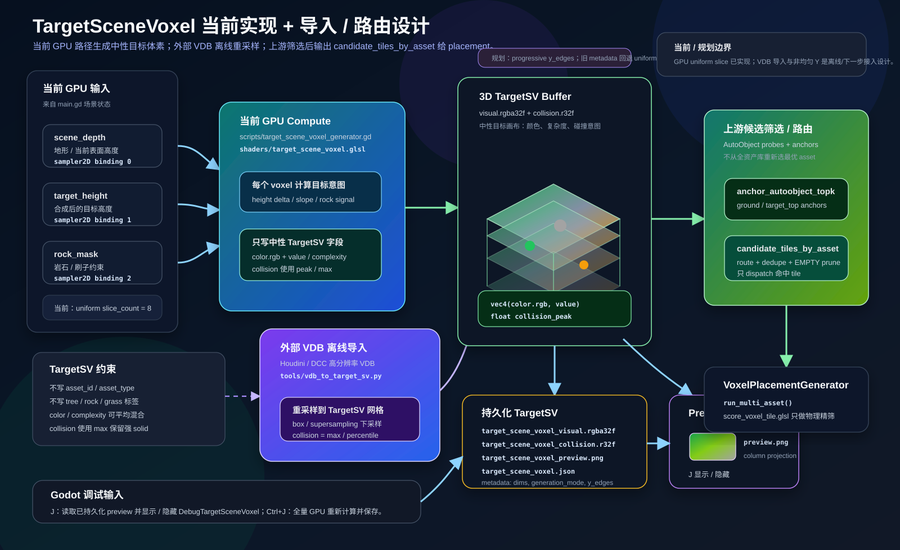

# TargetSceneVoxel Projection — Stamp 画布与 Anchor 投影

## 目标

`TargetSceneVoxel`（简称 `TargetSV`）应保持干净：它只描述目标场的颜色、复杂度、占用/碰撞意图，不直接写入 `tree`、`rock`、`grass` 这类 asset 标签。

在本文语境中，`TargetSceneVoxel` 是目标视觉效果画布。它表达“希望最终目标看起来是什么样”，而不是表达“当前已经放置了哪个 asset”。Landscape、规则系统、编辑器画笔或 AutoObject 派生模板都可以向这张画布写入中性的视觉/碰撞意图。

当前第一版可以只考虑地面 / 可支撑表面的 anchor，不做完整 3D anchor 搜索。

物体放置点通常不在目标体积的中心。例如树的目标形状可能主要在上方树冠，而真正的 anchor 在地面。因此 semantic routing 可以分成两层：

```text
目标绘制层：
landscape slope / masks / procedural rules
  -> TargetSV stamp scheduler
  -> stamp color + complexity + collision intent into TargetSceneVoxel

第一版主线：
ground anchor -> asset semantic probes -> sample upper TargetSceneVoxel -> voxel_asset_topK

可选优化：
target 向 anchor 写：TargetSceneVoxel 将远处/上方信息压缩投影到可能的放置点
```

目标是让地面 anchor 能判断上方 target 形状更适合什么样的 asset，而不污染 `TargetSceneVoxel` 本身。`target_anchor_projection_rgba8` 可以作为后续缓存、debug 或 MLP 输入，不作为第一版必需主线。

---

## 核心概念

### TargetSV 画布 + stamp 画笔

`TargetSceneVoxel` 可以先由一个 stamp 系统绘制出来：

```text
landscape height / slope / masks
  -> target stamp scheduler
  -> target stamp rasterizer
  -> TargetSceneVoxel color + complexity + collision intent
```

这里的 stamp 更像画笔，而不是最终 placement。它的职责是把目标视觉效果画进 `TargetSceneVoxel`：

| Stamp | 触发来源 | 写入 TargetSV 的中性结果 |
|-------|----------|--------------------------|
| `CliffRockStamp` | 高坡度、悬崖 mask、侵蚀噪声 | 灰/土色、高 complexity、高 collision，体积相对地表升高 |
| `GrassPatchStamp` | 绿地 mask、草地权重、低坡度区域 | 贴地绿色、低/中 complexity、低 collision |
| `TrunkStamp` | 树意图点、森林 mask、规则撒点 | 棕色/暗色竖向体积、中 complexity、高 collision |
| `CanopyStamp` | 树意图点上方、冠层规则 | 上空绿色团块、高 complexity、低/中 collision |

这些 stamp 可以直接引用对应 AutoObject 烘焙出的 voxel records 作为画笔形状。Stamp 名称只属于生成器或编辑器内部，不应写入 `TargetSceneVoxel`。写入后的 `TargetSceneVoxel` 仍然只包含颜色、复杂度、占用/碰撞意图。

### Landscape 到目标视觉

Landscape 不只是支撑面来源，也可以驱动目标视觉：

```text
strong slope
  -> raised rock / cliff target volume

green land
  -> near-ground grass color + complexity

tree intent
  -> trunk collision + color
  -> upper leaf color + complexity
```

这意味着 landscape 规则先把“目标效果”画到 `TargetSceneVoxel`，再由 anchor/probe/asset routing 去选择真实 AutoObject。这样可以避免从 landscape mask 直接绑定资产类型。

### Ground anchor + asset probes

第一版主线：

```text
ground anchors only
  -> for each asset
  -> sample TargetSceneVoxel by asset.semantic_probes
  -> compute semantic score
  -> keep voxel_asset_topK
```

这样不需要每个 ground anchor 通过通用 pooling 猜测上方结构，而是由每个 asset 自己定义要关注哪些相对位置。

示例：

```text
tree asset:
  probes: trunk path + canopy center + canopy rim

grass asset:
  probes: near-ground green/complexity

rock asset:
  probes: lower/middle dense volume
```

复杂度在地面范围内可控：

```text
anchors = width * depth
cost    = anchors * assets * probes_per_asset
```

Projection cache 不替代这条主线，只作为后续优化或补充特征。

### Anchor 向外感知

当前 semantic routing 主要是：

```text
candidate anchor voxel
  -> read local/wide target_scene_context_rgba8
  -> compare with asset target preference
  -> voxel_asset_topK
```

优点是简单、局部、dirty 更新容易。缺点是地面 anchor 需要较大的 3D 感受野才能看到上方树冠或远处形状。

### Target 向 anchor 投影

新增方向：

```text
TargetSceneVoxel field
  -> compress/project to likely anchor voxels
  -> target_anchor_projection_rgba8[anchor]
  -> select_voxel_assets.glsl reads projection cache
```

这让高处或远处的目标形状主动把信息传递到真正可放置的位置。

---

## 保持 TargetSceneVoxel 干净

允许 `TargetSceneVoxel` 表达：

```text
color.rgb
complexity/value
collision/solid intent
```

不应表达：

```text
asset_type = tree
asset_group = rock
placement_role = canopy
```

语义含义由 projection/context matcher 推断：

```text
目标颜色 + 复杂度分布 + 碰撞/占用形状
  -> 与 asset baked profile 匹配
  -> 推断适合 tree / bush / rock / empty 等结果
```

---

## TargetSV Stamp 系统

Stamp 系统负责把目标视觉效果绘制到 `TargetSceneVoxel`。它可以复用 AutoObject 的体积、颜色、碰撞、probe 或 profile 信息，但 stamp 的输出必须是中性体素场。

### Stamp record

推荐第一版使用 anchor-relative 的 stamp record：

| Field | Meaning |
|-------|---------|
| `origin_voxel` | stamp 锚点，通常来自 landscape surface 或支撑点 |
| `basis` | stamp 局部坐标，可由 world-up、坡面法线、cliff tangent 生成 |
| `bounds` | stamp 影响的 voxel AABB |
| `source_voxels` | AutoObject 烘焙出的局部 voxel records |
| `opacity` | 混合权重 |
| `scale` | stamp 缩放，用于目标体积变化 |
| `priority` | 多 stamp 冲突时的优先级 |

### AutoObject voxel stamp

第一版可以直接使用 AutoObject 的 voxel 数据作为 stamp kernel，而不是重新设计 SDF 画笔：

```text
AutoObject voxel records
  -> transform by stamp origin / basis / scale
  -> draw each source voxel into TargetSV
```

每个 AutoObject voxel 可以提供或派生：

| Source voxel field | TargetSV usage |
|--------------------|----------------|
| `local_pos` | 变换到目标 voxel 坐标 |
| `color` | 写入目标颜色 |
| `complexity` | 写入目标视觉复杂度 |
| `collision` / occupancy | 写入目标碰撞/solid intent |
| `weight` | 控制该 source voxel 对混合的贡献 |

这种方式能保证 stamp 的目标形状和实际候选 AutoObject 的视觉/碰撞体积同构，便于后续 probe 匹配。

### Blend rule

每次绘制结果不应简单覆盖。颜色和复杂度可以与过去的 `TargetSV` 值做加权平均，但 `collision` / `solid intent` 不应被普通平均稀释。

例如草、树叶这类低碰撞 stamp 如果持续画到树干或岩石区域，普通平均会让原本重要的 trunk/rock collision 逐渐消失。因此推荐第一版把 visual blend 和 collision blend 拆开。

推荐存一个独立的 visual 累积权重或样本计数：

```text
old_weight = target.weight
new_weight = source.weight * stamp.opacity
sum_weight = old_weight + new_weight

target.rgb        = (target.rgb * old_weight + source.rgb * new_weight) / sum_weight
target.complexity = (target.complexity * old_weight + source.complexity * new_weight) / sum_weight
target.collision  = max(target.collision, source.collision * stamp.collision_opacity)
target.weight     = sum_weight
```

如果第一版暂时没有 `target.weight` 通道，可以用固定平均：

```text
target.rgb        = lerp(target.rgb, source.rgb, alpha)
target.complexity = lerp(target.complexity, source.complexity, alpha)
target.collision  = max(target.collision, source.collision * stamp.collision_opacity)
```

这样草和树叶可以反复影响颜色/复杂度，但不会抹掉树干、岩石、墙体等强碰撞目标。

如果后续需要同时表达“平均碰撞倾向”和“强碰撞峰值”，可以拆成两个字段：

| Field | Blend | Meaning |
|-------|-------|---------|
| `collision_avg` | weighted average | 目标区域整体碰撞倾向 |
| `collision_peak` | max | 是否存在必须保留的强 solid intent |

第一版可以只使用 `collision_peak` 语义，把 `target.collision` 按 `max` 混合。

### AutoObject-derived stamp

AutoObject 可以派生 stamp 模板：

```text
AutoObject visual/collision/probes/profile
  -> AutoObjectTargetStamp
  -> draw neutral color + complexity + collision into TargetSV
```

派生时可以保留：

| Source | Stamp usage |
|--------|-------------|
| visual voxel records | 直接作为绘制 TargetSV 的 source voxels |
| collision voxel records | 生成 `collision` / `solid intent` |
| source material color | 写入每个 source voxel 的目标颜色 |
| semantic probes | 生成采样和 debug 对齐点 |
| anchor / pivot | 生成 `origin_voxel` 和相对 offset |

派生结果不应包含 `asset_id` 或 `asset_type`。真实资产选择仍由后续 semantic routing 完成。

---

## 外部 VDB 导入

除 landscape 程序化生成和 AutoObject stamp 外，TargetSV 还应支持从外部 DCC 工具（Houdini 等）导入 VDB 体积作为目标场。这是最高保真的路径：美术在 DCC 中精确雕刻目标视觉效果，导出 VDB，Godot 侧合并为 TargetSV。

外部 VDB 的原始体素分辨率可能远高于运行时 `TargetSV`。转换阶段必须先把 VDB 采样到项目使用的 TargetSV 网格，再写入持久化 flat buffer。运行时不应直接加载高维 dense VDB。

### 流程

```text
Houdini / DCC
  ↓ 导出多个 VDB 文件（每个 VDB 对应一种 stamp / 一个区域 / 一个 asset 类型的目标体积）
  ↓
Python 离线转换脚本 (tools/vdb_to_target_sv.py)
  ↓ 读取 VDB grid → 重采样到非均匀 Y TargetSV 网格 → 合并多个 VDB → 输出 flat binary
  ↓
TargetSV flat buffers (visual.rgba32f + collision.r32f)
  ↓ 放入 target_scene_voxel/ 目录或 res:// 下
  ↓
Godot 运行时加载
  ↓ _load_persisted_target_scene_voxel() 或 _load_external_target_sv()
  ↓
TargetSV buffer → prefilter / placement pipeline
```

### VDB 通道约定

每个 VDB 文件包含 5 个标量 grid，共 5 维：

| VDB Grid Name | 维度 | 类型 | TargetSV 映射 |
|----------------|------|------|---------------|
| `Cd.x` / `color.r` | 1 | `float` | `target_visual[].r` |
| `Cd.y` / `color.g` | 2 | `float` | `target_visual[].g` |
| `Cd.z` / `color.b` | 3 | `float` | `target_visual[].b` |
| `density` / `value` | 4 | `float` | `target_visual[].a` (complexity/value) |
| `collision` | 5 | `float` | `target_collision[]` |

Houdini 中 `Cd` 属性通常拆为 3 个标量 grid（`Cd.x`, `Cd.y`, `Cd.z`）导出。转换脚本应同时支持拆分命名和 `Vec3f` 单 grid 两种形式：

```text
# 优先查找拆分标量 grid
if has_grid('Cd.x'):
    color = (grid['Cd.x'], grid['Cd.y'], grid['Cd.z'])
# 兼容 Vec3f 单 grid
elif has_grid('Cd'):
    color = grid['Cd']  # Vec3f → split to r, g, b
elif has_grid('color'):
    color = grid['color']
else:
    color = default_color  # fallback
```

5 维完整时直接映射；如果 VDB 缺少部分 grid，转换脚本按以下规则填充：

| 缺少的 grid | 填充策略 |
|-------------|----------|
| `Cd.*` / `color` | 使用 `--default-color` 参数或 `(0.5, 0.5, 0.5)` |
| `density` / `value` | 从 collision 派生：`value = collision` |
| `collision` | 从 density 派生：`collision = density * collision_scale` |

### 多 VDB 合并

多个 VDB 按 stamp blend rule 合并到同一个 TargetSV 网格：

```text
for each vdb_file in input_vdbs:
    transform = vdb_file.metadata.get('transform', identity)
    opacity   = vdb_file.metadata.get('opacity', 1.0)
    collision_opacity = vdb_file.metadata.get('collision_opacity', 1.0)

    for each active voxel in vdb_file:
        target_pos = world_to_target_grid(voxel.world_pos, transform)
        if not in_bounds(target_pos): continue

        alpha = source.value * opacity
        target.rgb        = lerp(target.rgb, source.rgb, alpha)
        target.complexity = lerp(target.complexity, source.value, alpha)
        target.collision  = max(target.collision, source.collision * collision_opacity)
```

合并顺序和优先级由 VDB 文件列表顺序或元数据 `priority` 字段决定。collision 使用 `max` 保证强碰撞不被后续低碰撞 VDB 稀释。

### 坐标系与重采样

VDB 使用 Houdini 默认坐标系（Y-up, 右手），TargetSV 使用 Godot 坐标系（Y-up, 左手？需确认）。转换脚本需处理：

| 项 | 处理 |
|----|------|
| 坐标轴翻转 | Z 轴方向，根据 DCC 导出设置确定 |
| XZ voxel size 对齐 | VDB voxel size → TargetSV `capture_size / texture_size` |
| Y voxel size 对齐 | VDB world height → TargetSV 非均匀 Y 层边界 |
| 原点对齐 | VDB world origin → TargetSV grid origin（通常 landscape center） |
| 重采样 | VDB 分辨率可能远高于 TargetSV，需要离线下采样 |
| Grid bounds | VDB sparse grid → dense TargetSV flat buffer，空区域填 0 |

重采样应以 TargetSV 目标 voxel 为主循环，而不是遍历所有高分辨率 VDB voxel 后直接写入。对每个目标 voxel，用它的 world-space 中心和 bounds 去采样源 VDB：

```text
for z in 0..texture_size:
    for y in 0..slice_count:
        for x in 0..texture_size:
            bounds = target_voxel_world_bounds(x, y, z)
            sample = resample_vdb(source_vdb, bounds)
            write_target_sv(x, y, z, sample)
```

推荐采样策略：

| 源 grid | 重采样策略 | 原因 |
|---------|------------|------|
| `Cd.*` / `color` | 按 `density` 或 `collision` 加权平均 | 保留主导视觉颜色，避免空 voxel 污染颜色 |
| `density` / `value` | box filter 平均 + 可选 peak | 高分辨率细节下采样为稳定复杂度 |
| `collision` | `max` 或 high percentile | 保留细树干、岩石边缘等强碰撞意图 |

如果源 VDB 明显高于 TargetSV 分辨率，转换脚本应使用 box filter / supersampling，而不是只在目标 voxel 中心点做单次三线性采样。中心点采样只适合作为低成本预览模式。

### 非均匀 Y 体素层

TargetSV 的 XZ 方向保持均匀网格，Y 方向建议使用自下而上逐渐变大的体素层。低处需要更高精度表达地面、草、树干根部、岩石接触面；高处通常表达树冠、悬崖体块或大形状，可以使用更厚的 voxel。

```text
xz_voxel_size = capture_size / texture_size
y_edges[0] = 0
y_edges[i + 1] = y_edges[i] + y_voxel_size(i)
y_voxel_size(i + 1) >= y_voxel_size(i)
```

第一版推荐用归一化指数分布生成 Y 层边界：

```text
t0 = i / slice_count
t1 = (i + 1) / slice_count
y0 = vertical_span * pow(t0, y_growth_power)
y1 = vertical_span * pow(t1, y_growth_power)
```

推荐默认：

| 参数 | 默认值 | 含义 |
|------|--------|------|
| `y_distribution` | `progressive` | Y 方向使用渐进层高 |
| `y_growth_power` | `1.6` | 大于 1 时，下层更密、上层更疏 |
| `y_edges` | metadata 数组 | 每个 Y 层的 world-space 下/上边界 |

转换脚本、GPU shader、debug overlay 和 semantic probe 采样都必须通过 `y_edges` 做 world Y 与 slice index 的互转，不能再假设 `vertical_span / slice_count` 是固定层高。

```text
slice_to_world_y(y) = 0.5 * (y_edges[y] + y_edges[y + 1])
world_y_to_slice(world_y) = upper_bound(y_edges, world_y) - 1
```

当前实现仍使用均匀 `slice_count` 与 `vertical_span`。引入非均匀 Y 层时，需要在 `target_scene_voxel.json` 中保存 `y_distribution`、`y_growth_power`、`y_edges`，并让旧 metadata 缺少这些字段时回退为 uniform Y。

### 转换脚本接口

```text
python tools/vdb_to_target_sv.py \
    --input rock_target.vdb grass_target.vdb tree_target.vdb \
    --output-dir target_scene_voxel/ \
    --texture-size 256 \
    --slice-count 8 \
    --vertical-span 16.0 \
    --y-distribution progressive \
    --y-growth-power 1.6 \
    --capture-size 120.0 \
    --max-height 50.0 \
    --origin 0,0,0 \
    --coordinate-system godot
```

输出文件与现有持久化格式完全兼容：

| 输出文件 | 格式 |
|----------|------|
| `target_scene_voxel_visual.rgba32f` | flat binary, `texture_size × texture_size × slice_count × 16` bytes |
| `target_scene_voxel_collision.r32f` | flat binary, `texture_size × texture_size × slice_count × 4` bytes |
| `target_scene_voxel_preview.png` | RGBA8 PNG, 全切片加权合成俯视预览 |
| `target_scene_voxel.json` | 元数据 (version, dims, source_files, transforms, y_edges) |

### Godot 侧加载接口

GDScript 侧新增 `_load_external_target_sv(dir_path: String)` 方法，与现有 `_load_persisted_target_scene_voxel()` 共享后续流程：

```text
func _load_external_target_sv(dir_path: String) -> bool:
    # 读取 visual.rgba32f + collision.r32f + metadata.json
    # 校验 texture_size, slice_count 与当前配置兼容
    # 填充 _target_sv_visual_bytes, _target_sv_collision_bytes
    # 生成 preview image（如果 dir 中没有）
    # 标记全量 dirty → 触发 prefilter 重算
```

加载优先级（启动时）：

```text
1. 检查 res://target_scene_voxel/ 下是否有外部导入的 TargetSV（source == "vdb_import"）
2. 检查 user://target_scene_voxel/ 下是否有持久化的 TargetSV
3. 都没有时由 Ctrl+J 触发程序化生成
```

### 与 stamp 系统的关系

VDB 导入和 AutoObject stamp 不互斥。可以将 VDB 作为 TargetSV 的基底层，stamp 系统在其上叠加增量修改：

```text
VDB base layer (offline, high fidelity)
  ↓ load as initial TargetSV
AutoObject stamps (runtime, dirty update)
  ↓ blend on top of VDB base
Final TargetSV → prefilter → placement
```

元数据应记录 `generation_mode`：

| 值 | 含义 |
|----|------|
| `procedural` | 当前程序化生成（过渡版） |
| `vdb_import` | 外部 VDB 导入 |
| `stamp` | AutoObject stamp 生成 |
| `vdb_import+stamp` | VDB 基底 + stamp 叠加 |

---

## Projection Cache

推荐新增 semantic cache：

```text
target_anchor_projection_rgba8[voxel]
```

它是面向 candidate anchor 的缓存，不是原始 target voxel 数据。

第一版可以每 anchor 保存 16 个 packed `RGBA8 uint`：

| Group | 内容 | 含义 |
|-------|------|------|
| 0 | lower vertical bands | 下层颜色/复杂度 |
| 1 | middle vertical bands | 中层颜色/复杂度 |
| 2 | upper vertical bands | 上层颜色/复杂度 |
| 3 | summary cells | 总复杂度、重心、高度、扩散等摘要 |

每个 packed cell 第一版保留加权方式，但避免简单平均导致信息浑浊：

```text
weight = complexity ^ gamma
RGB    = sum(color.rgb * weight) / sum(weight)
A      = peak complexity/value
```

推荐默认：

```text
gamma = 2
```

也就是说，高复杂度 voxel 主导颜色，`A` 保留该 band 中最强目标信号，而不是普通平均复杂度。

---

## 第一版：垂直柱压缩

先不做复杂的水平扩散。对每个 `(x, z)` column：

```text
for y in 0..height:
    read TargetSceneVoxel color / complexity / collision
    accumulate vertical bands

anchor_y = nearest support below target mass, or ground y
write target_anchor_projection[x, anchor_y, z]
```

推荐 vertical bands：

```text
lower  = y range near anchor
middle = body range
upper  = canopy / top range
```

这样可以表达：

| 目标形状 | projection 表现 |
|----------|----------------|
| grass | lower complexity 高，中上层低 |
| bush | lower/middle 团块复杂度高 |
| tree | lower 有细 trunk，upper 有大范围绿色复杂度 |
| rock | lower/middle collision/complexity 稳定，颜色集中 |
| wall | vertical bands 连续高复杂度/碰撞 |

这些仍然是形状统计，不是 asset 标签。

---

## Pooling 方法扩展

直接平均会把稀疏但重要的结构稀释。例如树干很细、树冠分布很散，普通平均会让底部 anchor 收到一组浑浊的低强度特征。

因此 projection pooling 应遵循：

```text
保留强信号
保留质量分布
压缩维度
避免单点噪声主导
```

### 1. 高复杂度加权

第一版基础方法：

```text
weight = complexity ^ gamma
pooled_rgb = sum(color.rgb * weight) / sum(weight)
pooled_a   = max(complexity)
```

推荐：

```text
gamma = 2
```

它适合保留树冠绿色、树干棕色、岩石灰色等强目标区域，空白 voxel 因为 weight 接近 0，不会污染颜色。

### 2. Top-K pooling

每个 band 不使用全部 voxel，而是只取 complexity 最高的 K 个 voxel：

```text
top_voxels = top_k(voxels in band by complexity)
pooled_rgb = weighted_color(top_voxels)
pooled_a   = mean(top_k_complexity)
```

优点：

- 能保留稀疏强结构。
- 比单纯 `max` 更抗噪声。

缺点：

- shader 实现比加权 pooling 稍复杂。
- K 需要固定，例如 `K = 4` 或 `K = 8`。

### 3. Peak + mass

`peak` 和 `mass` 表示不同信息：

```text
peak = max(complexity)
mass = sum(complexity) / expected_band_mass
```

含义：

- `peak`：有没有强结构。
- `mass`：该 band 的目标总量有多少。

推荐第一版在 4 个 band cell 中保存 `peak`；如果扩展到 8 cells，再把 `mass` 放到 summary cell。

### 4. Occupancy ratio

为了避免单点噪声误导，可以记录有效体素比例：

```text
occupancy_ratio = count(complexity > threshold) / voxel_count
```

典型区别：

| 形态 | peak | occupancy_ratio |
|------|------|-----------------|
| 树干 | 高 | 低 |
| 树冠 | 高 | 中/高 |
| 噪声点 | 高 | 极低 |
| 草地 | 中/高 | 低层高 |

`occupancy_ratio` 不一定放入 4 band，可以作为 summary cell。

### 5. Softmax pooling

如果希望介于平均和 max 之间，可以用 softmax 权重：

```text
weight_i = exp(complexity_i * temperature)
pooled_rgb = sum(color_i * weight_i) / sum(weight_i)
pooled_a   = sum(complexity_i * weight_i) / sum(weight_i)
```

`temperature` 越高，越接近 max pooling；越低，越接近平均。

优点是连续、稳定；缺点是 shader 成本高于 `complexity ^ gamma`。

### 6. 双峰/分位数摘要

有些 band 内可能同时有两类强信号，例如树干和树冠边缘混在一个高度范围。可以记录：

```text
primary_peak_color
secondary_peak_color
```

或记录 complexity 分位数：

```text
p50_complexity
p90_complexity
```

这能减少不同结构混在一起导致的颜色浑浊。但第一版不建议做，适合后续扩展或 MLP 输入。

### 7. 与 asset 模板同构压缩

projection 不需要表达全部原始信息，只需要和 asset 侧使用同样的压缩规则：

```text
target_anchor_projection_rgba8
asset_anchor_pref_rgba8
```

两边都用相同 band、相同 pooling、相同 summary 编码，匹配时即使维度较少，也能区分：

```text
tree: lower peak 小，upper green peak/mass 高
rock: lower/middle mass 高，height span 中等，颜色稳定
grass: near_ground green peak 高，其余 band 低
wall: 多个 band 连续 peak/mass 高
```

---

## 当前实现状态

当前 Godot 实现已接入 GPU 版 TargetSV 生成与持久化：



上图展示当前 `TargetSV` 从输入贴图进入 compute shader、写入 3D target buffer、持久化到 `user://target_scene_voxel/`，以及在 Godot 中通过 `J` / `Ctrl+J` 显示和重算的流程。

| 项 | 当前实现 |
|----|----------|
| 生成脚本 | `scripts/target_scene_voxel_generator.gd` |
| Compute shader | `shaders/target_scene_voxel.glsl` |
| 数据形态 | `texture_size × slice_count × texture_size` 的 3D TargetSV buffer |
| visual buffer | `target_scene_voxel_visual.rgba32f`，每 voxel 为 `vec4(color.rgb, complexity/value)` |
| collision buffer | `target_scene_voxel_collision.r32f`，每 voxel 为 `collision_peak` |
| preview | `target_scene_voxel_preview.png`，用于 Godot 调试显示 |
| metadata | `target_scene_voxel.json` |
| 保存目录 | `user://target_scene_voxel/` |

生成阶段全程在 GPU compute 中完成：GDScript 只负责上传输入贴图、dispatch compute shader、最终 readback 持久化文件，以及创建 Godot 调试显示网格。当前 shader 从 landscape height / target height / rock mask 推导中性 TargetSV 视觉和碰撞意图，不写 `asset_id`、`asset_type`、`tree`、`rock`、`grass` 等资产标签。

交互：

- `J`：显示 / 隐藏已持久化的 TargetSV preview。
- `Ctrl+J`：全量重新计算 TargetSV，自动保存 `visual`、`collision`、`preview`、`metadata`，如果当前正在显示则刷新显示。

当前 preview 是 2D column projection，用于观察 TargetSV 强信号；真实持久化数据仍保留 3D slice buffer。后续 `target_anchor_projection_rgba8` 可以直接从持久化 TargetSV buffer 派生。

---

## 第二版：向最近支撑点投影

不总是投影到 `y=0`，而是投影到最近可支撑 anchor：

```text
anchor_y = nearest y below target mass where support_below > threshold
```

这可以支持：

- 地面
- 台阶
- 岩石平台
- 建筑楼板

如果找不到支撑点，则 projection 可以降低权重或写入 `EMPTY` 倾向。

---

## 第三版：水平扩散

高处目标体积可能覆盖多个 anchor。后续可加入水平扩散：

```text
for each target voxel:
    anchor_y = nearest support below
    radius = projection_radius(complexity, height, local_spread)
    for dx,dz in radius:
        add weighted contribution to anchor_context[x + dx, anchor_y, z + dz]
```

权重建议：

```text
weight = complexity * falloff(horizontal_distance)
```

这能表达树冠、岩石团块、墙体等目标形状对多个候选 anchor 的影响。

---

## 与 Semantic Routing 的关系

`select_voxel_assets.glsl` 可以同时读取：

```text
voxel_context
 target_scene_context_rgba8
 target_anchor_projection_rgba8
 asset_embedding
 asset_target_pref_rgba8
 asset_anchor_pref_rgba8
```

推荐评分：

```text
scene_score      = dot(voxel_context, asset_embedding)
target_score     = match(target_scene_context_rgba8, asset_target_pref_rgba8)
projection_score = match(target_anchor_projection_rgba8, asset_anchor_pref_rgba8)

semantic_score =
    scene_score      * scene_weight +
    target_score     * target_weight +
    projection_score * projection_weight
```

资产侧需要一个 baked anchor preference：

```text
asset_anchor_pref_rgba8[asset][16 cells]
```

它可以从 asset 的 footprint / collision voxels / visual voxels 烘焙得到，而不是手写 asset 类型。

---

## Dirty 更新

Stamp 是 `TargetSceneVoxel` 的生产者，因此 dirty 更新应先从 stamp bounds 开始：

```text
dirty landscape / mask / user brush
  -> reschedule affected stamps
  -> clear and rerasterize affected TargetSV bounds
  -> mark dirty target bounds
```

第一版可以使用保守 dirty：

```text
dirty_target_bounds =
    affected_stamp_bounds
      .expand(max_stamp_radius)
      .extend_up(max_stamp_height)
```

然后再进入 projection 或 routing 更新。

Projection 是 target 主动写到 anchor，因此 dirty 范围会比普通 context 更大。

保守规则：

```text
affected_anchor_bounds =
    dirty_target_bounds
      .expand(horizontal_projection_radius)
      .extend_down(max_projection_height)

affected_anchor_tiles = tiles overlapped by affected_anchor_bounds
```

更新流程：

```text
dirty TargetSceneVoxel
  -> update target_anchor_projection for affected anchor tiles
  -> update voxel_asset_topK for affected anchor tiles
  -> reduce tile_asset_topK for affected anchor tiles
  -> rebuild semantic_routing for affected tiles
```

第一版可以只做 vertical column compression，dirty 范围等于 dirty target columns 向下到地面/支撑点。

---

## 推荐阶段

### Phase 0：Landscape 驱动 TargetSV stamp

```text
landscape height / slope / masks
  -> schedule cliff / grass / trunk / canopy stamps
  -> rasterize TargetSceneVoxel color + complexity + collision
```

第一版建议先实现 CPU/GDScript debug 版本，用于验证 stamp 语义和 debug 可视化，再迁移到 compute shader。

当前实现已跳过 CPU debug 版，直接使用 `target_scene_voxel.glsl` 做全量 GPU 生成；CPU 侧不逐 voxel 决定 TargetSV 内容，只进行保存和显示。

### Phase 1：保留现有 anchor 向外感知

```text
target_scene_context_rgba8
local 8×8×8 + wide 16×16×16
```

### Phase 2：新增垂直投影

```text
target_anchor_projection_rgba8
column compression -> nearest support / ground anchor
```

### Phase 3：新增水平扩散

```text
projection radius
falloff
multi-anchor contribution
```

### Phase 4：MLP / learned matcher

```text
target_scene_context + target_anchor_projection -> asset suitability
```

MLP 仍只在 semantic cache / dirty update 阶段运行，不进入 `score_voxel_tile.glsl`。

---

## 验收标准

- `TargetSceneVoxel` 不包含 asset 类型标签。
- `TargetSceneVoxel` 作为目标视觉效果画布，表达期望的颜色、复杂度、占用/碰撞意图。
- Landscape 高坡度区域能通过 stamp 画出升高的悬崖/岩石目标体积。
- 绿地能通过 stamp 画出贴地草色和复杂度。
- 树意图能通过 stamp 分别画出树干碰撞/颜色和上空树叶颜色/复杂度。
- AutoObject-derived stamp 只写中性 TargetSV 字段，不写 `asset_id` 或 `asset_type`。
- projection cache 只保存形状、颜色、复杂度、碰撞/占用统计。
- 高处 target 信息能影响地面或支撑点 anchor 的 asset routing。
- `score_voxel_tile.glsl` 不读取 projection cache。
- dirty target 更新只重算 affected anchor tiles。
- 未启用 projection 时，semantic routing 回退到现有 `target_scene_context_rgba8`。
