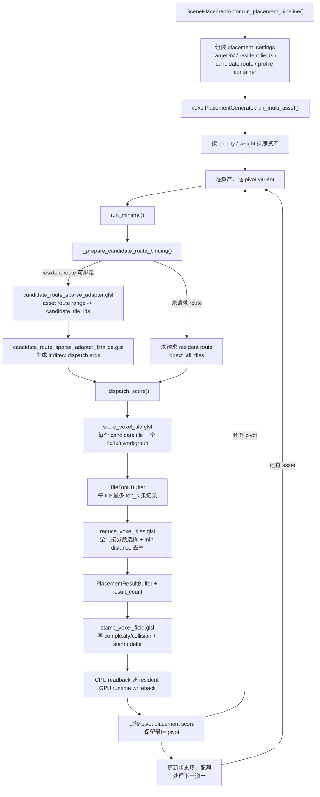
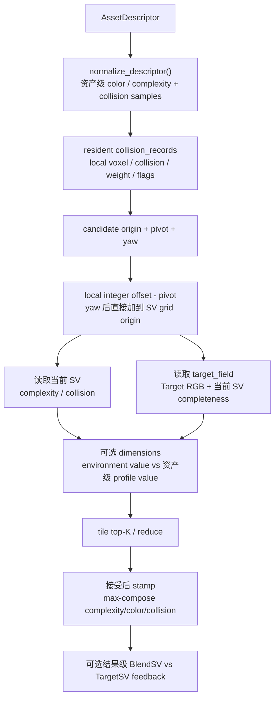
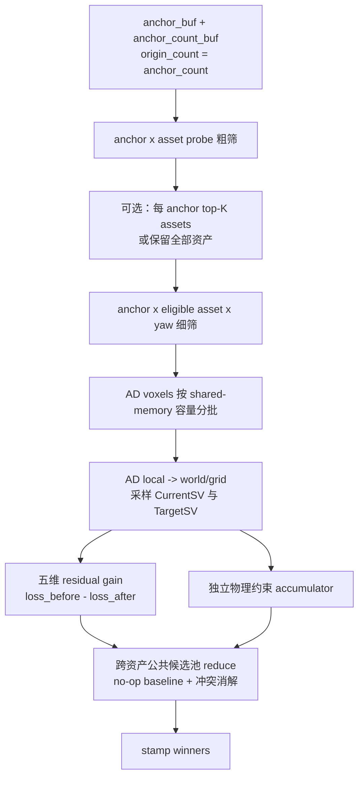

# Probe 粗筛与细筛冗余分析

> **阅读提示（2026-07-13）**：本文 §2–§9 为迁移前分析；混合资产迁移已于 2026-07-13 落盘到工作区，§3 的实现层冗余与 §5.2 / §6 的评分/契约问题均已解决。当前权威现状与落盘记录见第 10 节（尤其 §10.6）。

## 1. 审查结论

Probe 粗筛与 voxel 细筛的核心职责并不重复：

- 粗筛解决“哪些资产值得进入哪些空间区域”。
- 细筛解决“资产具体放在哪里、采用哪个 yaw，并在真实变换后的采样点上完成细粒度语义评分与约束验收”。

当前可以确认的主要冗余集中在实现层，而不是两阶段架构本身：

1. `score_voxel_tile.glsl` 对同一 base candidate 无条件执行第二次完整评分。
2. `cfg_debug_write_mask` 只关闭 debug voxel buffer 写入，没有关闭第二次评分和 contract 统计。
3. `anchor_topk` 对外可配置，但整条实际执行链固定为 `TOPK = 4`。
4. probe 数据在 CPU transient 路径被重复获取，resident 路径构建 route extent 时也没有复用常驻记录。
5. shader 中存在未使用 push constant 和未调用 helper。
6. 按目标 anchor-origin 评分规则，Candidate route 把精确 anchor 降格为 tile 后又穷举 512 个 voxel origin，是可整体移除的过渡桥接；但这属于 score 输入契约迁移，不是删除单个 buffer 就能完成的局部优化。

另外，细筛 shader 中已经存在 dimensions semantic scoring。它是当前细筛职责的一部分，不是仅供演示的可选附加能力。粗筛与细筛都会读取语义相关信息，但二者的比较粒度、采样点和输出目标不同，属于分层语义评分，不是相同计算。

## 2. 两阶段职责边界

### 2.1 Probe 粗筛

主要链路：

```text
AutoObjectProbePrefilterGPU
  -> score_anchor_asset_probes.glsl
  -> select_anchor_topk.glsl
  -> reduce_anchor_topk_to_voxel_regions.glsl
  -> pack_candidate_route_records_from_votes.glsl
```

评分粒度：

```text
anchor x asset x semantic probe
```

粗筛读取资产 probe，在 anchor 周围采样环境中的 collision、complexity 和 color 等信息，为每个 `anchor x asset` 生成语义适配分数。之后选取每个 anchor 的 top-K asset，再聚合并扩张为 per-asset candidate tile route。

粗筛不会决定：

- 最终 placement origin；
- 最终 yaw；
- 完整 collision sample 是否可以放置；
- tile 内哪个 voxel 是最优结果。

### 2.2 Voxel 细筛

主要链路：

```text
VoxelPlacementGenerator
  -> candidate route records / ranges
  -> score_voxel_tile.glsl
  -> per-tile placement top-K
```

评分粒度：

```text
candidate tile x origin x yaw x collision sample
```

细筛在粗筛保留下来的 tile 中搜索实际 origin 和 yaw，在真实 `origin x yaw x transformed collision samples` 上计算 per-dimension semantic fit，并结合 collision、clearance、spacing、target coverage 等 validity/约束选择最终 placement。

因此，即使粗筛 probe 已经检查过局部 collision/complexity，细筛仍然需要在真实变换后的完整 collision samples 上重新读取环境 channel、计算细语义分数并完成约束验收。这部分属于不同粒度的必要重复采样，不应直接合并或删除。

### 2.3 细筛完整执行链路

本节记录的是**当前代码实际执行链路**，用于定位冗余；其中的 candidate tile、每 tile 512 个 origin 和 tile top-K 都是现有 VPG 实现，不等于第 9 节定义的目标细筛架构。

当前生产路径从 `ScenePlacementActor` 开始，经过 `VoxelPlacementGenerator` 的资产/枢轴调度，再进入三个主要 GPU pass：`score -> reduce -> stamp`。



#### 2.3.1 入口和资产级调度

1. `ScenePlacementActor.run_placement_pipeline()` 从粗筛结果中取得 resident candidate route contract，并组装 `placement_settings`。
2. `ScenePlacementActor` 调用 `VoxelPlacementGenerator.run_multi_asset()`。
3. `run_multi_asset()` 在一个 GPU session 中调用 `_run_multi_asset_session()`，避免每个资产和 pivot 重复编译 shader/pipeline。
4. `_run_multi_asset_session()` 按 priority/weight 排序资产，逐资产读取 runtime profile container 中的 collision sample range。
5. 每个资产可包含多个 `pivot_variants`；每个 pivot 调用一次 `run_minimal()`，最后根据 placement output score 和 `score_bias` 保留最佳 pivot。
6. 一个资产完成后，stamp 结果会更新当前 complexity/collision state，后续资产基于更新后的场继续筛选。

对应代码位置：

- `scripts/scene_placement_actor.gd:1836-1918`
- `scripts/voxel_placement_generator.gd:581-599`
- `scripts/voxel_placement_generator.gd:659-733`
- `scripts/voxel_placement_generator.gd:747-817`

#### 2.3.2 Candidate route 转换为 score dispatch

`run_minimal()` 默认先按 `TILE_SIZE = 8` 计算全场 tile 数量，然后准备候选 route：

```text
candidate_route_ranges[asset_index]
  -> (record_start, record_count)
  -> candidate_route_records[record_start ...]
  -> candidate_route_sparse_adapter.glsl
  -> 去重后的 candidate_tile_ids[]
  -> candidate_route_sparse_adapter_finalize.glsl
  -> indirect dispatch args = (candidate_tile_count, 1, 1)
```

关键行为：

- resident route 可绑定时，VPG 不把 route 回读到 CPU，而是在 GPU 上按当前 `asset_index` 展开 range。
- adapter 会过滤越界 tile，并对同一 range 内的重复 tile id 去重。
- finalize pass 将实际候选数量写成 score shader 的 Vulkan indirect dispatch 参数。
- 如果调用方没有请求 resident route，当前实现使用 `direct_all_tiles` 扫描全场。
- 如果明确请求了 resident route，但 route 无法绑定或展开，当前实现硬失败，不静默退化为 all-tiles。

对应代码位置：

- `scripts/voxel_placement_generator.gd:1177-1305`
- `scripts/voxel_placement_generator.gd:2619-2720`
- `scripts/voxel_placement_generator.gd:2895-2978`
- `shaders/candidate_route_sparse_adapter.glsl:53-101`
- `shaders/candidate_route_sparse_adapter_finalize.glsl:27-30`

#### 2.3.3 当前 Tile 内部评分链路

`_dispatch_score()` 为每个候选 tile 派发一个 workgroup。`score_voxel_tile.glsl` 的 local size 是 `8 x 8 x 8`，且 `TILE_SIZE = 8`，所以每个 local invocation 恰好对应 tile 内一个 voxel：

```text
512 = 8 x 8 x 8 = 当前一个 tile 内被穷举的 voxel origin 数
```

这 512 个 origin 的来源不是 anchor 数量，也不是目标评分规则要求的固定 batch size。它产生于当前 Candidate route 只把粗筛结果保留为 `candidate_tile_ids`，没有把原始 anchor 位置直接交给细筛；细筛为了从一个候选 tile 恢复到具体位置，只能再次枚举 tile 内全部 voxel。

```text
score_voxel_tile.glsl::main
  -> tile_id -> tile_origin
  -> 每个 local invocation 对应一个 base_candidate
  -> evaluate_best_near(base_candidate)
       -> 遍历 search_radius 内 origin
       -> evaluate_best_at(origin)
            -> 遍历 rotation_slots
            -> evaluate_candidate(origin, yaw_slot)
                 -> origin/grid/target/runtime exclusion gates
                 -> 遍历 collision samples
                 -> pivot offset -> yaw rotation -> float sample position
                 -> trilinear 读取 complexity/collision
                 -> 读取 dimensions 对应的环境 channel
                 -> 累加 per-dimension semantic fit
                 -> collision / clearance / spacing / target coverage 约束
                 -> 输出细粒度 semantic score
       -> 返回该 invocation 的最佳 origin + yaw + score
  -> 写入 shared s_scores[512] / s_candidate_origins[512]
  -> local invocation 0 从 512 项中选 tile top-K
  -> 回算每个 winner 的完整 EvalResult
  -> 写 TileTopKBuffer
```

`evaluate_candidate()` 的主要分支：

| 阶段 | `dim_count > 0` 细语义评分 | `dim_count == 0` legacy compatibility fallback |
|---|---|---|
| 前置 gate | grid、runtime bounds、同 profile spacing | grid、sample bounds、runtime bounds、同 profile spacing、legacy target-origin gate |
| sample 读取 | collision records、complexity/collision field、env channels、dimension table | collision records + complexity/collision field |
| validity/约束 | spacing、target coverage、semantic weight，并保留 collision/clearance 等候选约束信息 | collision limit、clearance limit、target coverage |
| score | per-dimension MATCH fit | collision/complexity/clearance 的负 penalty |

##### 2.3.3.1 当前五个维度应在同一次细筛中完成

当前五个语义维度是：

- channel 0：资产 `collision-mean` 与环境 collision，weight = `1.0`；
- channel 1：资产 complexity 与环境 complexity，weight = `1.0`；
- channel 2/3/4：资产 color.r/g/b 与环境 color.r/g/b，单通道 weight 约为 `0.34`，三个颜色通道合计约为 `1.0`。

这五个维度彼此没有必须拆成独立 pass 的数据依赖。正确执行方式是在一次 `evaluate_candidate(origin, yaw_slot)` 中：

```text
遍历 transformed collision samples
  -> 计算一次 sample position / voxel index
  -> 读取该 voxel 的五个 environment channels
  -> 对五个 dimensions 分别计算 MATCH fit
  -> 同时累计一个 semantic_score / semantic_weight
  -> 同一 sample 循环继续累计 collision / clearance / coverage 约束
循环结束后统一归一化并产生一个 candidate score
```

当前 shader 已采用这一结构：`score_voxel_tile.glsl:815-883` 只有一层 collision-sample 循环，内部的 `for (d = 0; d < dim_count; d++)` 在同一次 shader invocation 中累计全部维度。这里的“同时”是指同一 candidate、同一 sample traversal、同一 GPU dispatch 内完成；编译器可以展开固定五维循环，但不需要派发五次细筛，也不应调用五次 `evaluate_candidate()`。

语义 collision channel 和物理 collision constraint 可以复用同一采样位置，但必须保留两个独立 accumulator：前者回答“资产画像与环境是否匹配”，后者回答“候选是否碰撞/是否有效”。合并采样不等于混合二者职责。

五维同时累计时，归一化分母应为 `dimension_weight * sample_weight` 的总和：

```glsl
semantic_sum += dimension_weight * fit * sample_weight;
semantic_weight += dimension_weight * sample_weight;
score = semantic_sum / semantic_weight;
```

这样五个维度的权重表示相对贡献；颜色三个 `0.34` 合计后与 collision、complexity 两组各约 `1.0` 对齐。当前实现分母没有乘 `dimension_weight`，详见第 5.2 节。

对应代码位置：

- `scripts/voxel_placement_generator.gd:2459-2576`
- `shaders/score_voxel_tile.glsl:780-923`
- `shaders/score_voxel_tile.glsl:926-962`
- `shaders/score_voxel_tile.glsl:1038-1107`

这里有两类“回算”，性质不同：

1. 第 1054 行对每个 base candidate 再执行一次 `evaluate_best_at()`，只为 debug/contract 数据服务；debug readback 关闭时仍执行，是本报告确认的主要冗余。
2. 第 1105 行只对 tile top-K winner 再执行一次 `evaluate_candidate()`，因为 shared memory 只保存 score、origin 和 rotation slot，没有保存完整 `EvalResult`。这是当前 buffer 布局下用少量回算换 shared memory 的设计权衡，不应与第一项等量看待。

#### 2.3.4 Tile top-K 到最终 placement

score pass 输出的不是最终 placement，而是：

```text
candidate_tile_count x top_k x 4 vec4
```

每条记录包含：

- voxel origin 和 score；
- tile id、asset id、rotation slot、scale index；
- collision/complexity/clearance 等诊断字段；
- valid flag。

`reduce_voxel_tiles.glsl` 使用单 workgroup/单 invocation 串行扫描所有 tile candidates：

1. 跳过 `valid == false` 的记录。
2. 跳过与已选结果距离小于 `min_distance_voxels` 的记录。
3. 从剩余记录中选最高 score。
4. 重复直到达到 `result_capacity` 或没有可选结果。
5. 写入紧凑 `PlacementResultBuffer` 和 `result_count`。

随后 `stamp_voxel_field.glsl` 按 accepted placement 和 collision samples 更新 complexity/collision 场，并生成 stamp delta/bounds。这一步是细筛后的状态提交，不再改变 placement 排名。

结果有两条输出路径：

- CPU/readback 路径：读取 `result_count` 和 records，通过 `_decode_records()` 转成字典，再转换为 world transform。
- resident GPU 路径：保留 placement result buffers，由 GPU runtime 直接转换 world result 并写入 accepted placement runtime，避免批量 CPU readback。

对应代码位置：

- `scripts/voxel_placement_generator.gd:1428-1495`
- `scripts/voxel_placement_generator.gd:3323-3421`
- `shaders/reduce_voxel_tiles.glsl:45-97`
- `scripts/voxel_placement_generator.gd:3428-3478`

### 2.4 当前细筛语义

当前细筛 contract 是：在粗筛给出的 candidate route 内，对真实 `origin x yaw x transformed collision samples` 执行细粒度语义评分，并结合 collision、clearance、spacing、target coverage 等 validity/约束选择最终 placement。

`dim_count > 0` 时，`score_voxel_tile.glsl` 读取 dimension table 和环境 channels，计算 per-dimension MATCH fit，并输出 `semantic_score`。`dim_count == 0` 的 penalty-only 分支只用于 legacy/compatibility fallback，不能用来定义当前生产细筛的职责，也不能据此把细筛描述成“仅物理评分”。

因此：

- 粗筛负责低成本、低粒度的语义路由，决定候选 asset/tile。
- 细筛负责真实变换和完整采样点上的细粒度语义评分，决定最终 origin/yaw/placement。
- 物理场采样、clearance、spacing 和 target coverage 是细筛约束的一部分，不代表细筛只是物理评分。

## 3. 已确认的冗余

> **状态（2026-07-13）**：§3.1–§3.6 的实现层冗余已由落盘迁移全部解决，权威现状见第 10.6 节。对照：§3.1 / §3.2（重复评分与 debug 计算）随 `score_voxel_tile.glsl` 整体退役；§3.3（`anchor_topk` 失效旋钮）已删除、top-4 固化为端到端契约；§3.4（transient probe 重复 getter）随 route extent 死代码删除而消失；§3.5（Pass A 未用 `min_prefilter_score`）改为 ABI pad；§3.6（未调用 helper）随 `score_voxel_tile.glsl` 删除而失效。以下小节保留为迁移前分析依据，内部 `score_voxel_tile.glsl:行号` 引用指向已删除文件。

### 3.1 P1：同一 base origin 的候选评分执行两次

位置：

- `shaders/score_voxel_tile.glsl:1049`
- `shaders/score_voxel_tile.glsl:1054`

`search_radius` 的调用默认值是 `Vector3i.ZERO`（`scripts/voxel_placement_generator.gd:2248`）。这不是“跳过邻域搜索”，而是邻域中只有 `base_candidate + (0, 0, 0)` 这一个 origin。

当前执行顺序：

```glsl
EvalResult local_result = evaluate_best_near(...);
...
EvalResult debug_result = evaluate_best_at(base_candidate, ...);
write_debug_voxel(base_candidate, debug_result, debug_slot);
```

默认半径下的实际调用链是：

```text
evaluate_best_near(base_candidate)
  -> 唯一邻域偏移 (0, 0, 0)
  -> evaluate_best_at(base_candidate)
       -> 遍历全部 yaw slots
       -> 每个 yaw 调用 evaluate_candidate()
       -> 遍历全部 transformed collision samples
       -> 计算细粒度 semantic score 与 placement 约束

随后 main() 继续执行：
  -> evaluate_best_at(base_candidate)  # debug_result
       -> 再次执行相同的 yaw x collision samples 候选评分
```

因此，重复的是每个 base origin 的完整候选评分：全部 yaw、全部 collision samples、环境 channel 读取、细语义计算和约束统计都会再做一次。在当前旧 tile 路径中，一个 tile 有 512 个 local invocations，所以这个重复会发生在 tile 内每个被穷举的 voxel origin 上；目标 anchor-origin 路径不再以 512 为候选基数。

第二次结果只传给 `write_debug_voxel()`；但 `cfg_debug_write_mask` 只控制该函数内部是否写 buffer，不控制前面的 `evaluate_best_at()` 是否执行。因此，即使没有请求 debug voxel readback，第二次评分也会发生。

这里的“完整评分”专指 `evaluate_best_at()` 覆盖的候选级细筛评分，不表示 candidate route 转换、tile top-K、全局 reduce 或 stamp 也执行了两次。tile top-K winner 后续为补齐 `EvalResult` 还有一次小范围回算，那是第 2.3.3 节所述的另一类设计权衡。

#### 3.1.1 合并方案比较

方案 A：只优化默认 `search_radius == 0`。

```glsl
EvalResult local_result = evaluate_best_near(...);
if (radius_x == 0 && radius_y == 0 && radius_z == 0) {
    debug_result = local_result;
    debug_slot = local_best_slot;
} else {
    debug_result = evaluate_best_at(base_candidate, rot_count, debug_slot);
}
```

优点是改动小；缺点是 radius 大于 0 时，`base_candidate` 已经包含在邻域循环中，仍然会被重复评分。它只修复默认配置，没有消除问题根因。

方案 B：在 `evaluate_best_near()` 的既有邻域遍历中捕获 base result，推荐采用。

```glsl
EvalResult evaluate_best_near(
    ivec3 base_candidate,
    int rot_count,
    out ivec3 best_origin,
    out int best_slot,
    out EvalResult base_result,
    out int base_slot
) {
    // 仍按原来的 dz -> dy -> dx 顺序遍历。
    ...
    EvalResult r = evaluate_best_at(candidate, rot_count, candidate_slot);
    if (dx == 0 && dy == 0 && dz == 0) {
        base_result = r;
        base_slot = candidate_slot;
    }
    // 原有 best_result 比较保持不变。
    ...
}

EvalResult base_result;
int base_slot;
EvalResult local_result = evaluate_best_near(
    base_candidate, rot_count, candidate_origin, local_best_slot,
    base_result, base_slot);
write_debug_voxel(base_candidate, base_result, base_slot);
```

该方案有以下性质：

- `base_candidate` 本来就是 search neighborhood 的必经项，因此不会增加任何 field/channel 读取；
- radius 为 0 时，`base_result` 与 `local_result` 是同一评分结果；
- radius 大于 0 时，`local_result` 仍是邻域最佳结果，`base_result` 专门保持现有 per-base debug 语义；
- 邻域遍历顺序和 `score > best.score` 的比较不变，不改变同分候选的 tie-breaking；
- 五个语义维度、全部 yaw 和全部 collision samples 都随 base result 一次性复用，不需要为不同维度设计单独缓存。

不建议先在 main 中单独评分 base、再让 neighborhood 跳过 `(0,0,0)`。这种写法虽然也只计算一次，但会把 base 提前到所有负偏移之前；在分数相等时，可能把当前“最早邻域偏移获胜”改成“base 优先”，产生不必要的行为变化。

设 neighborhood origin 数为：

```text
N = (2 * radius_x + 1) * (2 * radius_y + 1) * (2 * radius_z + 1)
```

当前每个 base invocation 执行 `N + 1` 次 `evaluate_best_at()`，方案 B 降为 `N` 次。默认半径下 `N = 1`，候选级评分调用从 2 次降为 1 次，理论上消除约 50% 的这部分工作；若三个半径都为 1，则从 28 次降为 27 次，收益约 3.6%。每次 `evaluate_best_at()` 内五个维度仍在同一次 sample traversal 中完成。

合并时还需要同步定义 observability contract：`SCORE_DEBUG_CANDIDATE_INVOCATIONS` 当前在 `evaluate_candidate()` 内累加，删除重复调用后计数会下降，但 placement score、base debug 值及各类 `atomicMax` 最大值不应改变。测试应改为验收“唯一候选评估次数”，不能把重复执行次数固化为 contract。

影响：

- search radius 为 0 时，每个 base origin 的候选级评分接近翻倍。
- search radius 大于 0 时，第二次评分仍增加一个完整 origin 的评分成本。
- collision sample 或 yaw 数量越多，重复成本越明显。

建议：

- 采用方案 B，让 `evaluate_best_near()` 在原有遍历中同时返回 `best_result` 和 `base_result`，彻底删除 main 中第二次 `evaluate_best_at(base_candidate)`。
- `write_debug_voxel()` 始终消费已捕获的 `base_result`；`cfg_debug_write_mask` 只决定是否写 debug buffer，不再影响是否需要重新评分。
- 回归测试同时覆盖 `search_radius == 0` 和 `search_radius > 0`，确认 placement winner、base debug result 和 tie-breaking 不变。
- 使用当前五个 dimensions 运行计数测试，确认每个唯一的 `origin x yaw x collision sample` 只累计一次五维 semantic fit。

### 3.2 P1：Debug 开关只关闭写入，没有关闭计算

位置：

- `shaders/score_voxel_tile.glsl:853-920`
- `shaders/score_voxel_tile.glsl:973-999`

`cfg_debug_write_mask` 只包围 `debug_voxel` buffer 写入。以下工作仍会执行：

- target density 累加；
- target complexity fit 累加和归一化；
- RGB distance 累加和归一化；
- 第二次 `evaluate_best_at()`；
- `score_contract_debug` 的多次 `atomicMax()`。

其中 target coverage 参与 validity 判断，不能整体关闭。但 density、complexity fit、color fit 和 per-base debug result 是否需要生产常开，应由明确的 contract/observability 模式决定。

当前注释明确把 contract `atomicMax` 定义为 always-on，所以这部分不是无引用死代码，而是“关闭 debug readback 后仍保留的生产开销”。如果这是有意的 contract，需要保留并记录成本；否则应增加独立开关。

### 3.3 P2：`anchor_topk` 是失效配置

位置：

- `scripts/autoobject_probe_prefilter_gpu.gd:31`
- `scripts/autoobject_probe_prefilter_gpu.gd:83`
- `scripts/scene_placement_actor.gd:1679-1680`
- `scripts/scene_placement_actor.gd:1779`
- `shaders/select_anchor_topk.glsl:36`

表面上，调用方可以设置：

```gdscript
prefilter.anchor_topk = prefilter_topk
```

但实际链路固定为：

```text
AutoObjectProbePrefilterGPU.TOPK = 4
select_anchor_topk.glsl TOPK = 4
topk buffer size = ANCHOR_CAPACITY * 4
reduce pass receives topk = 4
```

因此 `run_placement_pipeline(..., prefilter_topk)` 和 settings 中的 `anchor_topk` 不会改变输出。

处理方式应二选一：

1. 如果产品只支持 top-4，删除公开配置并把它明确为固定 contract。
2. 如果需要可配置 top-K，则 buffer、select shader、reduce stride、route pack 和测试必须端到端统一。

只修改某一处常量会造成 stride 错位，不能局部修复。

### 3.4 P3：CPU 重复获取 semantic probes

位置：

- `scripts/autoobject_probe_prefilter_gpu.gd:650`
- `scripts/autoobject_probe_prefilter_gpu.gd:693`
- `scripts/autoobject_probe_prefilter_gpu.gd:742`
- `scripts/autoobject_probe_prefilter_gpu.gd:1442`

transient 路径中，`_pack_all_probes()` 已经调用 `get_semantic_probes()` 并遍历 probe；构造返回结果时又调用 `_build_route_extents()`，后者再次对每个 AutoObject 调用 `get_semantic_probes()`。

resident container 路径已经持有常驻 probe records/ranges，但 route extent 仍然回到 AutoObject getter 获取 probe 和 collision 数据。

如果迁移期继续保留旧 Candidate route，建议在一次资产遍历中同时生成：

- packed probe records/ranges；
- probe offset bounds；
- collision offset bounds；
- route extent。

或者让 runtime profile container 常驻保存已经归约后的 route extent，避免每次 prefilter 重新回到 descriptor/AutoObject 层。目标 anchor-origin 路径删除 per-asset Candidate route 后，不再需要构建 route extent，这项重复 getter 也应随旧桥接一起消失。

### 3.5 P3：Pass A 中存在未使用参数

位置：`shaders/score_anchor_asset_probes.glsl:59`

Pass A push constant 声明了：

```glsl
float min_prefilter_score;
```

但 shader 不读取该值。阈值实际只在 `select_anchor_topk.glsl` 中使用。

这不会造成明显运行时性能问题，但会让人误以为 Pass A 已提前裁剪低分结果。可以从 Pass A push layout 中删除，或明确标注为 ABI reserved；同步修改 GDScript push constant layout 后才能安全删除。

### 3.6 P3：细筛 shader 中的未调用 helper

位置：

- `shaders/score_voxel_tile.glsl:686`：`VoxelSample` / `sample_voxel()`
- `shaders/score_voxel_tile.glsl:761`：`rotate_sample_offset_y()`
- `shaders/score_voxel_tile.glsl:768`：`yaw_transform_y()`

当前实际使用的是 `rotate_sample_offset_y_f()`，上述 helper 在该 shader 内没有调用点，可以删除以减少维护噪声。

`support_*` 字段虽然当前恒为 0，但仍存在于 `EvalResult` 和输出 record 中。这些字段可能承担跨 shader/CPU buffer 布局兼容，不能与普通死 helper 一样直接删除。

## 4. 粗筛与细筛的分层语义评分

位置：`shaders/score_voxel_tile.glsl:867-895`

细筛会在 transformed collision sample 对应 voxel 上读取环境 channel，计算 asset profile 与环境值之间的 MATCH fit，并写入 `semantic_score`。

如果 dimensions 被配置为 collision、complexity、color 等特征，它与 probe 粗筛会形成如下重叠：

| 项目 | Probe 粗筛 | Dimensions 细筛 |
|---|---|---|
| 资产比较粒度 | `anchor x asset` | `origin x yaw` |
| 采样点 | semantic probe offsets | transformed collision samples |
| 目标 | 路由和裁剪资产候选 | 选择最终 placement |
| 输出 | candidate asset tiles | placement score/result |
| 当前职责 | 低成本语义路由 | 细粒度语义评分与最终选择 |

因此，这属于分层语义重叠而不是相同计算。当前职责边界已经明确：

- 粗筛保留低成本、低粒度的 routing features，优先保证召回率。
- 细筛使用与最终 placement 强相关的 dimensions 和真实变换后采样。
- 两阶段应共享 feature 定义，但不要求共享聚合方式或输出分数尺度；粗筛 direct-sum 还承担大型物体优先级，细筛 weighted mean 负责候选内精确比较。
- 粗筛阈值不能提前拒绝细筛本可接受的资产。

## 5. 与冗余相关的评分问题

### 5.1 粗筛分数直接累加：有意保留的大型物体优先级

`score_anchor_asset_probes.glsl` 将每个 probe 的匹配分数乘权重后直接求和。

该行为当前是设计选择，不作为待修复的冗余：大型物体通常覆盖更大空间并生成更多 probes；匹配成立时，更多正向证据使其更容易进入 per-anchor top-K，从而优先获得该 anchor 上的细筛候选资格。当前实现把这份资格转换成 Candidate route；目标实现则直接把 `anchor_id + asset_id` 交给细筛。

这里形成的是“粗筛候选优先”，不直接决定 VPG 的资产执行顺序；真正的先放/后放仍由 asset `priority` 和 `weight` 调度。两者共同保证大型物体既不在粗筛中被小物体挤掉，也能在需要时先执行。

当前 bipolar color/complexity fit 会让不匹配 probe 产生负分，因此 probe 多并不保证无条件得高分；大型但明显不匹配的资产也会累计更多负向证据。

保留 direct-sum 的代价是：

- probe 更多的资产在正匹配区域天然获得更高总分，这是当前需要的 size/confidence bias；
- 不同资产之间的 score scale 不稳定；
- `min_prefilter_score` 的绝对阈值难以跨 probe profile 比较；
- 与细筛 dimensions score 的归一化尺度不一致。

当前决定是先不按 probe 数量或总权重归一化，也不修改现有排序公式。需要把 `semantic_probe_density`、probe 生成策略和 metric weights 视为粗筛排名 contract 的一部分：改变采样密度会同时改变大型物体偏置，不能只当作精度/性能参数调整。

建议只增加观测而不改变排名：debug 输出同时记录 `probe_count`、总绝对权重和 raw score，便于区分“语义 fit 更好”与“probe evidence 更多”。如果未来需要跨 profile 的统一质量阈值，应先引入独立、显式的 size priority/footprint bias，再评估是否归一化；不能直接用 weighted mean 替换当前总和。

### 5.2 Dimensions weighted mean 分母没有 dimension weight

> **已修复（2026-07-13）**：迁移后细筛移至 `score_anchor_asset_residual.glsl`，五维累计分母已含 `dimension_weight`（见第 10.6 节）。下述为修复前、基于已删除的 `score_voxel_tile.glsl` 的分析。

位置：`shaders/score_voxel_tile.glsl:880-894`

当前实现：

```glsl
r.semantic_score += dimension_weight * fit * sample_weight;
r.semantic_weight += sample_weight;
r.score = r.semantic_score / r.semantic_weight;
```

注释称其为 weighted mean，但分母没有累加 `dimension_weight * sample_weight`。

这意味着整体放大所有 dimension weights 会直接放大最终 score，而不是只改变各 dimension 的相对贡献。由于 dimensions semantic scoring 属于当前细筛 contract，需要确认预期公式并补充相应验收。

## 6. 文档、测试与实现冲突

> **状态（2026-07-13）**：`score_voxel_tile.glsl` 已删除，旧“physical-only”口径彻底失效；契约测试（`test_markdown_contracts` / `test_autoobject_probe_prefilter`）与文档已随迁移同批更新（见第 10.6 节）。下述为迁移前的冲突记录。

旧版 prefilter 文档曾把 `score_voxel_tile.glsl` 定义为 physical-only，并否认它输出 `semantic_score`。测试 `tools/test_markdown_contracts.gd:309` 仍按同一旧口径禁止细筛 shader 出现 `semantic_score`。

但当前 `score_voxel_tile.glsl` 已包含完整的 `semantic_score` 字段和 dimensions 实现；真实 contract 已确定为“细筛执行细粒度语义评分”，因此旧文档与测试断言已经过时。

现有验证结果：

```text
test_markdown_contracts.gd: FAIL
- physical score shader contains routing semantic term 'semantic_score'
- prefilter graph missing candidate_voxel_regions_by_asset node label
```

本文和 prefilter 权威文档已按真实 contract 修正。测试代码不在本次文档修改范围内，后续应删除“细筛 shader 不允许 `semantic_score`”的旧断言，并将验收改为确认细筛 semantic score、dimension bindings 与物理/覆盖约束能够共同工作。`dim_count == 0` 只应作为 legacy fallback 测试，不应再作为生产职责说明。

`test_autoobject_probe_prefilter.gd` 当前还会失败于：

```text
resident TargetSV producer missing resident SV field read RIDs
```

该失败属于当前工作区的 resident TargetSV contract 问题，与本报告中的 probe/细筛冗余没有直接关系。

## 7. 建议处理顺序

1. 先确定迁移边界：新细筛直接消费 `anchor_buf + anchor_count_buf`，以 anchor 作为 candidate origin，并将 Candidate route、tile origin 穷举和 tile top-K 作为一个整体替换。
2. 如果旧 `score_voxel_tile` 在迁移期仍会长期运行，再让 `evaluate_best_near()` 返回 neighborhood best 与 base result，删除第二次 `evaluate_best_at()`；如果会立即退役旧路径，不应优先为其增加过渡接口。
3. 定义独立 AD voxel record、CurrentSV/TargetSV 输入和与 stamp 同构的虚拟 compose，再实现按 shared-memory 容量分批的 residual-gain 细筛。
4. 决定 probe top-K 是否保留为 `anchor -> eligible assets` 粗筛；无论保留与否，都不再转换为 asset tile route。
5. 明确 contract debug 是否必须生产常开，并按新 candidate 定义更新 invocation observability contract。
6. 按已确定的生产细筛 contract 更新过时测试，覆盖五维 residual gain、跨资产竞争、no-op baseline 与约束组合。
7. 保留粗筛 probe direct-sum；补充 probe_count/总权重观测，并把 probe density 变化纳入候选排序回归测试。

## 8. 最终分类

### 可以确认的实现冗余

- 当前旧 tile 路径在 `search_radius == Vector3i.ZERO` 时，同一 base origin 的 `yaw x collision samples` 候选评分执行两次（主评分 + debug 回算）。
- debug readback 关闭后仍执行第二次 debug 评分。
- `anchor_topk` 配置无效。
- transient probe getter 重复调用。
- Pass A 未使用 `min_prefilter_score`。
- 细筛 shader 未调用 helper。

### 目标架构中可以整体删除

- `anchor_topk -> asset_tile_votes -> candidate_route_records/ranges -> candidate_tile_ids` 的 tile 桥接。
- `candidate_route_sparse_adapter` 与 finalize pass。
- 每个候选 tile 的 `8 x 8 x 8 = 512` voxel origin 穷举。
- 为 tile 输出服务的 tile-local top-K；目标路径改为在公共 `anchor x asset x yaw` 候选池上归约。

这些内容在当前实现中仍是 `score_voxel_tile.glsl` 的输入前提，不能先删 route、继续让旧 score shader 工作；它们应与新的 anchor-origin score dispatch 一起原子迁移。

### 必要的两阶段工作

- 粗筛用 probe 对每个 anchor 生成 eligible asset 集合，或保留全部资产以避免 top-K 召回损失。
- 细筛以 anchor 位置作为真实 origin，遍历 yaw 和分批 AD voxels，执行 `compose(CurrentSV, AD)` 对 TargetSV 的细粒度 residual-gain 评分，并完成 placement 约束验收。
- reduce、冲突消解和 stamp 仍然必要，但候选主键应是 `anchor_id + asset_id + yaw`，不再是 `candidate_tile_id + tile_local_origin`。

### 分层语义重叠

- 粗筛和细筛都会读取 collision、complexity、color 等语义相关信息，但采样点、粒度和输出目标不同。
- `dim_count == 0` 的 penalty-only 路径是 legacy compatibility fallback，不代表当前细筛职责。

### 不能直接删除

- 参与 validity 的 target coverage。
- 粗筛 probe direct-sum 形成的大型物体优先级，除非先有显式 size priority/footprint bias 接替该职责。
- always-on contract debug，除非先修改 observability contract。
- `support_*` record 字段，除非确认所有 buffer layout 消费者可以同步迁移。

## 9. 与目标细筛模型的差距

> 本节记录开始实施前的差距基线。当前实际落盘进度与后续执行计划见第 10 节；若本节的“当前状态”与第 10 节冲突，以第 10 节为准。

### 9.1 目标不是“环境像不像资产”，而是“放入资产后是否更接近 TargetSV”

目标细筛应把一个候选定义为：

```text
candidate = asset x pivot x origin x yaw
```

对 AssetDescriptor 的每个语义体素 `ad_voxel`，执行：

```text
ad local voxel position
  -> candidate transform
  -> world position
  -> SV / TargetSV grid position
  -> sample SV_before
  -> sample TargetSV
  -> SV_after = compose(SV_before, ad_voxel)
  -> 比较 distance(SV_after, TargetSV)
```

更稳妥的候选分数不是只看 `SV_after` 的绝对误差，而是看该候选带来的残差改善：

```text
loss_before = D(SV_before, TargetSV)
loss_after  = D(compose(SV_before, AD), TargetSV)
score_gain  = loss_before - loss_after
```

这样可以表达三种结果：

- `score_gain > 0`：放入该资产使当前 SV 更接近 TargetSV；
- `score_gain == 0`：该资产没有填补当前残差；
- `score_gain < 0`：该资产会过填、颜色错误或碰撞强度错误，应拒绝。

“不放资产”应作为隐式 baseline，只有 `score_gain` 超过阈值的候选才进入 reduce。否则即使所有资产都会让结果变差，系统仍可能从中选一个相对最高分资产。

这里的 `SV + AD` 不应按普通数值加法解释。若目标是预测当前 stamp 后的真实状态，`compose()` 必须与 `stamp_voxel_field.glsl` 一致：

- complexity/color：当前是按 alpha/complexity 单调 max；AD complexity 更大时用 AD RGBA，已有值更大或相等时保留 SV；
- collision：当前是 `max(SV.collision, AD.collision)`；
- 相同资产的多个 sample 落入同一 voxel 时，也必须遵循与 stamp 相同的合并与 tie 规则。

如果产品期望的是覆盖、alpha blend 或真正的 additive compose，应先改变正式 compose contract，再让 score 与 stamp 共同调用同一份生成式 GLSL helper。不能只在评分中使用一种 `SV + AD`，stamp 时再写出另一种结果。

### 9.2 当前实际细筛链路



当前 shader 已经有“变换 sample offset、读取当前场、读取 target_field、同一次 sample traversal 累计五维”的骨架，但实际判据仍是：

```text
fit = 1 - abs(environment_channel - asset_profile_constant)
```

它回答“当前位置的环境画像是否像这个资产”，没有计算：

```text
predicted = compose(current_sv_sample, ad_voxel_payload)
fit = 1 - distance(predicted, target_sv_sample)
```

所以当前 dimensions 虽然属于细粒度语义评分，但还不是目标中的候选状态预测评分。

### 9.3 逐项能力矩阵

| 目标能力 | 当前状态 | 差距 |
|---|---|---|
| 遍历候选 asset/origin/yaw | 部分具备 | origin/yaw 搜索完整，但资产按 priority/weight 逐个执行，不在同一 SV 快照上统一竞争 |
| AD 体素位置变换 | 部分具备 | collision local offset 会减 pivot、做 yaw、加 candidate grid origin；没有显式 `local -> world -> grid`、descriptor voxel size、scale、pitch/roll contract |
| 采样当前 SV | 部分具备 | complexity/collision 可在 float 位置三线性采样；颜色没有作为 `FieldSample` 返回，五维颜色依赖外部 env buffer |
| 采样独立 TargetSV | 不完整 | RGB 来自 `target_visual_rgba8_bytes`，但 `target_field.a` 由当前 SV complexity/collision 生成，形成混合场而非完整 TargetSV |
| AD 逐体素语义 payload | 基本缺失 | resident collision record 只有位置、collision strength、weight、flags；逐体素 color/complexity 在 descriptor/runtime profile 中不存在 |
| 候选级虚拟 `compose(SV, AD)` | 缺失 | 只有候选接受后的 stamp，没有评分期 `SV_after` |
| `SV_after` 对 TargetSV 的残差 | 缺失 | 当前 semantic score 比较环境 channel 与资产级常量；target complexity/color fit 主要是 debug/coverage，不是最终主分数 |
| 五维一次累计 | 骨架具备 | collision/complexity/R/G/B 可以在同一 sample 循环内完成，不需要五次 pass；但输入与公式需要改成 before/after/target |
| 在多个资产间决定“用哪个” | 缺失 | `run_multi_asset()` 先按 priority/weight 排序，完成一个资产的 score/reduce/stamp 后才处理下一个资产 |
| 不放置 baseline | 缺失 | 没有要求候选必须让 TargetSV residual 下降 |
| score 与 stamp 同构 | 不完整 | score 使用 float offset + 三线性当前场，stamp 使用 yaw 后 round 到整数 voxel；score 没有复用 stamp compose |
| 结果级 SV/TargetSV 比较 | 已有但位置过晚 | `score_blendsv_feedback_against_target()` 在放置完成后做全局统计，不参与候选资产选择 |

### 9.4 数据在当前链路中的丢失位置

`AssetDescriptorBaker.interior_samples_from_voxel_result()` 曾经可以得到每个占用 voxel 的：

```text
local_pos + color + complexity + collision
```

但这些 interior samples 只用于生成 semantic probes。`descriptor_from_voxel_result()` 最终保存的是：

- 资产级 `color`；
- 资产级 `complexity`；
- 逐体素 `collision` samples；
- 由 interior samples 归约/采样得到的 semantic probes。

进入 `AutoVoxelRuntimeProfileContainer` 后，collision record 进一步固定为：

```text
ivec4(local_voxel.xyz, collision_strength_q8)
vec4(weight, flags, reserved, reserved)
```

因此当前细筛并没有足够数据还原 `AD(voxel)`。颜色和复杂度只能取整件资产的常量，无法表达一个资产内部不同 voxel 的颜色/复杂度，也无法精确预测 stamp 后的局部 SV。

此外，注册期会在 collision records 中加入人工 clearance probes。它们用于物理净空约束，不应默认作为 AD 语义体素参与 `SV_after` 残差；目标实现需要把“资产实际体素”和“约束探针”显式区分。

### 9.5 TargetSV 当前不是独立完整输入

SPA 的 `prepare_target_read_buffers_from_common_gpu()` 调用 `pack_target_field.glsl`。当前合成规则是：

```text
target_field.rgb = target_visual_rgba8_bytes.rgb
target_field.a   = max(current_sv.complexity, current_sv.collision)
```

也就是说，shader binding 名称虽然叫 `target_field`，但它的 alpha/completeness 来自当前 SV，不是 TargetSV。后续 `target_coverage`、`target_complexity_fit` 和 dimensions membership gate 读取的是这个混合值。

目标模型必须提供两个逻辑上独立的输入：

```text
CurrentSV: current visual/complexity + current collision
TargetSV:  target visual/complexity + target collision
```

二者可以共享网格元数据和读取 helper，但不能在进入评分前预先混成一个 field，否则无法分别得到 `loss_before` 与 `loss_after`。

### 9.6 生产 SPA 与 dimensions demo 还存在一层接线差距

`VoxelPlacementGenerator` 支持由调用方传入：

```text
scoring_dimensions
asset_dimension_profile
env_channel_field_floats
env_channel_count
```

`placement-score-3d` demo 会逐资产构造五维 profile 和 env channels，因此能进入 dimensions 分支。但 SPA 的 `_build_placement_asset_defs()` 当前只给每个资产传：

```text
descriptor + asset_index + profile_id
```

它没有从 resident profile 自动生成每资产的 `asset_dimension_profile`/`asset_color`，也没有从 CurrentSV/TargetSV 自动生成五维 env channels。`placement_common` 不显式提供 dimensions 时，VPG 会走 `dim_count == 0` 的 legacy penalty 分支；即使在 common settings 中提供一个 profile，它也会被多个资产共用，不能代表每个 descriptor。

因此需要区分：

- VPG shader 已具备细粒度 dimensions semantic scoring 的能力；
- 当前 SPA 生产编排还没有把这套能力接成“每个 descriptor 的逐体素 TargetSV residual scoring”。

### 9.7 Origin 数量、AD 分批与 Candidate route

#### 9.7.1 目标 origin 数量由 anchor 数量决定

若 anchor 就是允许放置资产的候选基点，则目标 score pass 的定义应为：

```text
origin_id    = anchor_id
origin       = anchors[anchor_id].position
origin_count = anchor_count_buf[0]
```

因此：

```text
origin_count = anchor_count
```

如果未来确实需要在每个 anchor 周围搜索少量离散偏移，应显式提供小型 `local_offsets[]`：

```text
origin_count = anchor_count x local_offset_count
origin(anchor_id, offset_id) = anchor_position + local_offsets[offset_id]
```

这与“把 anchor 映射到 tile 后再穷举 512 个 voxel”不同。局部偏移数量应由 placement 精度需求明确控制，不能隐式固定为 512。

现有 anchor 数据已经满足 GPU-first 调度基础：`anchor_buf` 常驻 GPU，`anchor_count_buf` 保存实际数量，`autoobject_probe_prefilter_gpu.gd` 已把 GPU 端 anchor count 转换为 indirect dispatch args。新细筛可以复用这套 count/indirect-dispatch contract，不需要为了得到 origin 数回读 CPU。

#### 9.7.2 AD shared-memory 分批不改变 origin 数量

AD 采样批次与 origin 数是两个正交维度：

```text
candidate_pair_count = sum(每个 anchor 的 eligible_asset_count)
ad_batch_count(asset) = ceil(ad_voxel_count(asset) / ad_batch_capacity)
```

若粗筛固定保留 top-K，则 `candidate_pair_count <= anchor_count x K`；若不做资产裁剪，则为 `anchor_count x asset_count`。每个 candidate pair 再遍历 yaw。

`ad_batch_capacity` 应根据设备可用 shared memory、每条 `AssetVoxelRecord` 的字节数以及 workgroup 其他固定共享数据计算。一个 workgroup 对当前 `anchor x asset x yaw` 候选循环执行：

```text
for each AD batch
  -> 从 resident AD buffer 载入本批 voxel records 到 shared memory
  -> barrier
  -> AD local voxel -> candidate world/grid position
  -> 分别采样 CurrentSV 与 TargetSV
  -> 虚拟 compose(CurrentSV, AD voxel)
  -> 同时累计 collision / complexity / R / G / B residual gain
  -> 同时累计独立的物理 collision / clearance 约束
  -> barrier 后复用 shared memory 处理下一批
全部 batch 完成后，才输出该候选的最终 score
```

分批只是限制单次驻留的 AD voxel 数量，不应把一个资产拆成多个互相竞争的候选，也不应产生额外 origins。若不同 batch 使用独立 dispatch，则必须写 partial sums 并增加 finalize reduce；优先方案是在同一 workgroup 内循环批次，保持候选 accumulator 在寄存器/shared memory 中。

#### 9.7.3 Candidate route 可以删除，但要连同旧 score 输入契约一起替换

当前 Candidate route 的完整作用是桥接：

```text
anchor x asset probe score
  -> per-anchor asset top-K
  -> asset_tile_votes
  -> candidate_route_records / candidate_route_ranges
  -> candidate_tile_ids
  -> 每个 tile 穷举 512 origins
```

当 anchor 本身就是 candidate origin 时，这段桥接先丢失精确 anchor，再通过 tile 穷举恢复位置分辨率，属于目标架构中的冗余。推荐链路为：



迁移后可删除：

- `reduce_anchor_topk_to_voxel_regions.glsl`；
- `asset_tile_votes`；
- `pack_candidate_route_records_from_votes.glsl` 及 route record/range buffers；
- `candidate_route_sparse_adapter.glsl` 与 finalize pass；
- VPG 的 `candidate_tile_ids` score 输入和 `8^3` origin 枚举。

应保留：

- anchor collection、`anchor_buf`、`anchor_count_buf` 及其 indirect dispatch；
- probe score，以及可选的 per-anchor asset top-K；
- resident AD、CurrentSV、TargetSV、reduce/conflict resolution 和 stamp；
- dirty-tile/范围信息如果仍用于限制 **anchor collection**，但它不再转换成 per-asset Candidate route。

结论是：按目标评分规则，Candidate route 可以直接从最终架构中去掉；但代码迁移必须先让新 score shader 直接消费 anchors。不能只删除 route buffers 后继续调用当前只认识 `candidate_tile_ids` 的 `score_voxel_tile.glsl`。

### 9.8 差距量级与推荐迁移顺序

按纠正后的 anchor-origin 架构估算：

- anchor collection、GPU resident count/indirect dispatch、probe score/top-K、CurrentSV 状态场、部分 reduce/conflict resolution 与 stamp 可以复用；Candidate route、tile dispatch、512-origin 穷举和 tile-local top-K 不再计入可复用部分，运行框架可直接复用约 `40%~50%`；
- 目标的核心决策语义，即 AD 逐体素 payload、独立 CurrentSV/TargetSV、虚拟 compose、残差改善和跨资产竞争，目前完成约 `20%~30%`；
- 端到端按“anchor 作为 origin，选择能让 `SV + AD` 最接近 TargetSV 的资产”验收，当前整体约 `30%~35%`。这些比例只用于表达改造量级，不是经过工时拆分的精确完成率。

这属于中到大型改造，不是替换 `fit` 一行即可完成。推荐顺序：

1. 定义独立 `AssetVoxelRecord`，保存 local voxel、RGBA/complexity、collision、weight 与 kind flags；物理 clearance probes 保留在约束记录中，或至少用 flag 排除出语义 compose。
2. 为 score pass 绑定独立 CurrentSV 与 TargetSV resident field 对，修正当前 Target RGB + CurrentSV alpha 的混合输入。
3. 把 stamp 的 complexity/color/collision compose 提取成 score/stamp 共用 helper；先按 stamp 的整数 voxel 映射做精确预测，再决定是否需要 trilinear/splat 扩展。
4. 在一次 AD voxel traversal 中同时计算 collision、complexity、R、G、B 的 `loss_before`、`loss_after` 和 `score_gain`，物理 collision/clearance 使用独立 accumulator。
5. 新建直接消费 `anchor_buf + anchor_count_buf` 的 score dispatch；候选记录包含 `anchor_id`、`asset_id/profile_id`、yaw 和 residual gain，同一轮先对 eligible assets 评分到公共候选池，再统一 reduce，最后才 stamp winner。
6. 保留 priority、weight、quota 作为调度约束或显式 bias，不再让“哪个资产先执行”替代“哪个资产最能降低 TargetSV residual”。
7. 用 `score_blendsv_feedback_against_target()` 的 completeness/color residual 公式作为验收参考，但候选评分必须在 stamp 前完成，且增加 no-op baseline 与 `score_gain > threshold` gate。

可接受的第一阶段实现不需要为每个候选复制完整 SV。由于未受 AD 影响的 voxel 在 `loss_before - loss_after` 中会抵消，只需以 anchor 为 origin，遍历该候选实际影响的 AD voxels，在寄存器中虚拟 compose 当前 sample，再累计局部 residual gain。AD voxels 超过 shared-memory 容量时分批循环；所有批次共享同一个候选 accumulator。这样可以保留“一次 AD voxel traversal 完成五维”的结构。

## 10. 实施状态与后续计划（2026-07-13）

> **执行记录（2026-07-13，同日晚批次）：第 10.4 节阶段 1–4 已全部落盘，见第 10.6 节；
> 第 10.3 节描述的中间态阻塞点已全部解除。**

### 10.1 当前结论

目标链路不变：

```text
origin_count = anchor_count

anchor_buf + anchor_count_buf + per-anchor top-K
  -> anchor x top-K asset 公共候选
  -> workgroup 内遍历 pivot / yaw
  -> AD voxels 按 shared-memory 容量分批
  -> 同一次 AD 遍历累计 collision / complexity / R / G / B residual gain
  -> 独立累计 physical collision / clearance
  -> 跨资产公共 reduce
  -> stamp winners
```

细筛选择标准为：

```text
score = D(CurrentSV, TargetSV)
      - D(compose(CurrentSV, AD), TargetSV)
```

- `score > 0` 表示放入资产后更接近 TargetSV；
- no-op 是显式 baseline，不能改善残差的候选不应被放置；
- probe 粗筛分数暂不按 probe 数量或总权重归一化，继续保留大型资产优先进入 top-K 的倾向；
- Candidate route、tile adapter、每 tile 512 origins 和 tile-local top-K 均不属于最终架构。

### 10.2 已经落盘

#### A. AD 逐体素数据契约

- `AssetDescriptor` 已增加 `asset_voxels`；
- descriptor baker 已输出每个 AD voxel 的 color、complexity、collision、weight 和 flags；
- `AutoVoxelRuntimeProfileContainer` 已改为常驻 `asset_voxel_records`；
- profile table 的 `16..23` 字段保存 asset-voxel start/count；
- 已提供 `get_asset_voxel_range_for_profile_id()` 和 `get_asset_voxel_records_buffer()`；
- 旧的固定 collision sample 数量截断已从 profile 容器移除，后续由细筛 shader 按 shared-memory 容量分批处理，而不是拒绝大型 AD。

#### B. Probe 粗筛到 anchor 细筛的 GPU handoff

- 粗筛主路径已经收敛为 anchor collect、probe score、per-anchor top-K 和 GPU dispatch finalize；
- prefilter 持久保留：

```text
anchor_buffer_rid
anchor_count_buffer_rid
topk_buffer_rid
origin_contract = one_origin_per_anchor
```

- `ScenePlacementActor` 已校验 `anchor_candidate_handoff` 并注入 placement settings；
- `origin_count` 的权威来源已经确定为 `anchor_count_buf[0]`，不再设计固定 `512 origins`。

#### C. 独立 TargetSV 输入契约

- `target_read_buffer_borrow.gd` 已同时校验 target field 和独立 packed-R8 target collision buffer；
- `pack_target_field.glsl` 已改为只解包 `target_visual_rgba8_bytes`：RGB 为 TargetSV color，alpha 为 TargetSV complexity；
- `collect_sv_anchors.glsl` 和 `score_anchor_asset_probes.glsl` 已使用独立 target collision binding；
- `autoobject_probe_prefilter_gpu.gd` 与 `voxel_placement_target_reader.gd` 已传递 target field/collision 双缓冲；
- `ScenePlacementActor.prepare_target_read_buffers_from_common_gpu()` 已改为生产并持有两块 resident buffer：

```text
target_field_buffer      : vec4, RGB + complexity
target_collision_buffer  : r8_packed_u32
```

- TargetSV producer 不再要求 CurrentSV 的 `resident_complexity_field_read_rid` / `resident_collision_field_read_rid` 来构造目标场；缺少 target collision 输入时生成全零 collision buffer。

### 10.3 中间态阻塞点（已由第 10.6 节批次全部解除 · 历史快照）

> 本节是「同日晚批次」落盘前的迁移中间态记录，保留用于追溯。下列 1–4 项阻塞点均已在第 10.6 节解除，第 5 项验证状态已更新为解除后结果；若与第 10.6 节冲突，以第 10.6 节为准。

（以下为批次前快照）当时工作区处于迁移中间态，还不能视为可运行的新细筛实现。

1. `VoxelPlacementGenerator` 仍是旧 Candidate route / tile 细筛主体，仍加载：

```text
score_voxel_tile.glsl
reduce_voxel_tiles.glsl
stamp_voxel_field.glsl
candidate_route_sparse_adapter*.glsl
```

2. VPG 仍引用已经从 profile 容器删除的：

```text
AutoVoxelRuntimeProfileContainer.COLLISION_SAMPLE_CAPACITY
get_collision_range_for_profile_id()
```

因此当前 `ScenePlacementActor --check-only` 会被依赖脚本阻断，报错点是 `voxel_placement_generator.gd` 的旧 `COLLISION_SAMPLE_CAPACITY` 引用。这里不应恢复旧常量；正确修复是完成 VPG 的 anchor fine pipeline 替换。

3. 下列新细筛阶段尚未实现：

- `anchor x top-K asset` 候选 dispatch；
- workgroup 内 pivot/yaw 搜索；
- shared-memory AD batch traversal；
- 五维 before/after residual gain；
- 独立 physical collision / clearance gate；
- 跨资产公共候选 reduce；
- profile-driven mixed-asset stamp；
- mixed-asset runtime world conversion/writeback。

4. Candidate route 相关的 SPA 字段、helper、shader 和脚本仍在工作区中，尚未删除。删除必须在新 score/reduce/stamp 链路接通后一次完成，避免出现没有可用细筛路径的空档。

5. 验证状态（已更新为第 10.6 节批次解除后）：

- `autoobject_probe_prefilter_gpu.gd --check-only`：通过；
- `voxel_placement_target_reader.gd --check-only`：通过；
- `scene_placement_actor.gd --check-only`：已解除——VPG 旧常量（`COLLISION_SAMPLE_CAPACITY` / `get_collision_range_for_profile_id`）已随 VPG 重写移除，全库零引用；
- 新细筛 shader 已落盘，纳入 `-e` 编辑器门禁验收，见第 10.6 节验证状态。

### 10.4 后续实施计划

#### 阶段 1：用 anchor fine pipeline 替换 VPG 核心

1. 新增 fine dispatch finalize，直接读取 `anchor_count_buf[0]`，生成 `anchor_count x top_k` 的 dispatch 数量；不回读 anchor count，不生成 tile ids。
2. 新增 `score_anchor_asset_residual.glsl`：一个 workgroup 负责一个 `anchor x asset`，在组内遍历该 profile 的 pivot/yaw。
3. 每批把适量 `AssetVoxelRecord` 载入 shared memory，所有批次复用同一个候选 accumulator。
4. 对每个 AD voxel 执行 local AD position -> candidate grid/world position，并分别采样 CurrentSV 与 TargetSV。
5. 使用与 stamp 一致的 compose 规则，在一次遍历中累计五维 residual gain；clearance record 不进入 semantic compose。
6. 每个 `anchor x asset` 只输出最佳 pivot/yaw 候选记录。

建议候选记录暂时保持现有 `4 x vec4 = 64 bytes` 尺寸，便于复用已有 result buffer 消费边界：

```text
record0: origin.xyz, residual_gain
record1: anchor_id, asset_id, yaw_slot, global_pivot_index
record2: physical_collision, loss_before, loss_after, clearance
record3: profile_index, valid, coarse_score, reserved
```

#### 阶段 2：公共 reduce、stamp 和 writeback

1. 将全部资产候选写入同一个公共 candidate buffer；
2. 统一执行 `score_gain > threshold`、quota、最小距离和候选间冲突消解；
3. stamp shader 按 winner 的 `asset_id/profile_index/global_pivot_index` 查 profile 与 AD voxel range；
4. stamp 复用 score 的坐标变换与 compose 规则；
5. mixed-asset runtime writeback 根据 placement record 查 asset metadata，不再逐资产 dispatch；
6. world conversion 从每条 placement record 读取 pivot，而不是依赖一次调用共享的 pivot 参数。

#### 阶段 3：删除旧实现

新链路验证通过后删除：

```text
shaders/score_voxel_tile.glsl
shaders/reduce_voxel_tiles.glsl
shaders/stamp_voxel_field.glsl
shaders/reduce_anchor_topk_to_voxel_regions.glsl
shaders/pack_candidate_route_records_from_votes.glsl
shaders/candidate_route_sparse_adapter.glsl
shaders/candidate_route_sparse_adapter_finalize.glsl
scripts/voxel_placement_candidate_route.gd
```

确认无引用后再删除 `candidate_route_schema.gd` 和 `utils/route_tile_shared_glsl.gd`，并从 SPA 移除全部 `_resident_candidate_route_*` 字段与 build/release/summary helper。

#### 阶段 4：验证和文档收口

1. 对 VPG、SPA、prefilter、target reader 执行 Godot `--check-only`；
2. 更新 prefilter 测试，断言 resident anchor handoff 存在且 Candidate route 不再输出；
3. 更新 TargetSV decode 测试，断言 complexity 与 collision 来自两个独立目标缓冲；
4. 增加 residual-gain 数值测试：同一候选同时覆盖 R/G/B/complexity/collision，并验证 no-op baseline；
5. 增加大型 AD 测试，确认超过单批 shared-memory 容量时分批结果与小批参考结果一致；
6. 增加跨资产竞争测试，确认 winner 由 residual gain 决定，而不是资产执行顺序；
7. 更新 `placement-score-3d` demo 和架构文档，移除 per-tile top-K、Candidate route 和 512 origins 描述。

### 10.5 完成标准

只有同时满足以下条件，才算“删除旧实现并完成新细筛”：

- `origin_count == anchor_count` 的 GPU contract 有测试覆盖；
- score shader 直接消费 anchor/top-K，不读取 Candidate route/tile ids；
- AD 任意数量体素可分批完成同一个候选的五维累计；
- CurrentSV、TargetSV 和 AD 三者数据独立；
- candidate score 等于 before/after residual gain，且 no-op 可胜出；
- 所有资产先进入公共候选池，再 reduce/stamp；
- physical collision 和 clearance 不混入语义五维 compose；
- 旧 Candidate route/tile shader、adapter、SPA handoff 和 VPG API 已无引用并删除；
- Godot parser、shader 编译和相关 headless 测试全部通过。

> 更新（2026-07-13，同日晚批次后）：下方百分比是「批次前」估算，已被第 10.6 节取代。批次落盘后，上述完成标准的实现侧条目（anchor/top-K 直接消费、AD 分批、CurrentSV/TargetSV/AD 三者独立、before/after residual gain、公共候选池 reduce、物理约束与语义五维分离、旧 route/tile 全族删除且全库无残留引用）均已满足；剩余仅为 `-e` 门禁验收与提交（见第 10.6 节验证状态）。

（批次前基线）按当时状态估算：数据与 handoff 契约约完成 `60%~70%`，核心 fine score/reduce/stamp 算法约完成 `10%`，端到端整体约完成 `35%`。下一阶段的主要工作量集中在 VPG 与四个新 GPU pass，而不是 probe 粗筛。

### 10.6 落盘记录（2026-07-13）

阶段 1–4 已按 10.4 的顺序全部执行完毕：

#### 新增

- `shaders/fine_score_dispatch_finalize.glsl`：读 `anchor_count_buf[0]`（clamp 到 capacity，
  collect 计数器可超写）生成 `(256, ceil(count/256), topk)` 间接派发参数；空帧 gy=0 直通。
- `shaders/score_anchor_asset_residual.glsl`：一个 workgroup = 一个 `anchor × top-K slot`；
  64 线程各持一个 `pivot × yaw` 组合（超 64 组合分 chunk）；`AssetVoxelRecord` 以 128 条/批
  经 shared memory 流式遍历，所有批共享同一候选 accumulator（无资产体素数上限）；
  一次遍历同时累计五维 residual gain（分母含 dimension weight，修复第 5.2 节问题）与
  独立物理 collision/clearance/coverage；clearance 记录不进 semantic compose；
  `valid` 要求 `score_gain > gain_threshold`（no-op 隐式 baseline）。compose 与 stamp 逐字
  同构（新 `@@GEN ad_voxel_compose` 块，SSOT = `PlacementSharedGLSL`，verify 门禁覆盖）。
  输出 64B 记录布局与 10.4 阶段 1 的建议一致（record1.w = global_pivot_index，-1 = 零 pivot）。
- `shaders/reduce_anchor_candidates.glsl`：跨资产公共候选池串行归约——valid 门 +
  per-asset quota（`asset_lookup[asset].z`，≤0 不限）+ min-distance + 同 origin 冲突消解。
- `shaders/stamp_asset_voxels.glsl`：mixed-asset stamp——按 record 的 `profile_index` 查
  profile table 的 asset_voxel range、按 `global_pivot_index` 查 pivot_records；逐体素
  color/complexity/collision 来自 `AssetVoxelRecord`（max-by-alpha / collision max，
  平手保留现值），dual-commit 双写保持。
- `asset_lookup`（ivec4[]: profile_id, profile_index, quota, object_type）：score/reduce/
  writeback 三处共用的资产查找表，VPG 按 asset_defs 打包。
- `VoxelPlacementGenerator.build_cpu_anchor_handoff()` / `release_cpu_anchor_handoff()`：
  demo/测试用 CPU 锚点 handoff 构建（与 prefilter 结构同构）；settings
  `debug_read_fine_candidates` 可回读整个候选池（观测口径）。

#### 改动

- `voxel_placement_generator.gd` 核心重写：`run_minimal`、per-asset × per-pivot GPU 循环、
  Candidate route 绑定、tile 机制、object-ref spacing 契约全部移除；`run_multi_asset` 变为
  单次链 `finalize → score(indirect) → reduce → init_stamp_bounds → stamp`，pivot/yaw 竞争
  在 GPU workgroup 内完成；报告 per-asset 结果由公共池按 `asset_index` 分组产生；新增
  `anchor_fine_contract` 契约键；`score_gain_threshold` / `residual_dim_weights`
  （默认 `[1,1,0.34]`）新 settings。
- `placement_results_to_world.glsl` + codec/output/writeback：pivot 改 per-record
  （binding 2 = pivot_records，push `pivot_offset.w` = 开关；遗留共享 push pivot 保留为回退）。
- `autoobject_apply_accepted_placements_resident.glsl` + `gpu_autoobject_runtime.gd`：
  mixed-asset 写回——set0 binding 4 = asset_lookup，`meta.w` 开关；dirty delta 的
  object_type/profile 改为逐 record。writeback 由逐资产循环改为单批
  `_write_mixed_accepted_placements_to_gpu_runtime`。
- prefilter：`anchor_topk` 失效旋钮删除（top-4 固化为端到端契约，第 3.3 节方案 1）；
  Pass A push 的未用 `min_prefilter_score` 槽改 ABI pad（第 3.5 节）；route extent 全族
  死代码删除（第 3.4 节 transient 重复 getter 随之消失）；`tile_summaries_rid` 死参删除。
- SPA：`_resident_candidate_route_*` 全簇（常量/字段/build/release/summary）删除；
  `run_placement_pipeline` 的 `prefilter_topk` 参数删除。
- 3.1/3.2（debug 双评分）随 `score_voxel_tile.glsl` 整体退役；observability 契约改按
  唯一候选评估计数（`SCORE_DEBUG_CANDIDATE_INVOCATIONS` = combo 数），`debug_voxel`
  改写 per-anchor（gain/loss_before/loss_after/coverage/best slot）。
- `volume_score_demo`：单次 run_multi_asset + CPU anchor handoff +
  `debug_read_fine_candidates` 排名；CurrentSV 起始零场、TargetSV 独立双缓冲输入；
  golden 快照升 v2（旧 v1 基线作废需重录）。

#### 删除

```text
shaders/score_voxel_tile.glsl
shaders/reduce_voxel_tiles.glsl
shaders/stamp_voxel_field.glsl
shaders/reduce_anchor_topk_to_voxel_regions.glsl
shaders/pack_candidate_route_records_from_votes.glsl
shaders/candidate_route_sparse_adapter.glsl
shaders/candidate_route_sparse_adapter_finalize.glsl
scripts/voxel_placement_candidate_route.gd
scripts/candidate_route_schema.gd
scripts/utils/route_tile_shared_glsl.gd
ReportSchema.VPG_RUN_REPORT（run_minimal 输出族）
DebugBufferSet.CANDIDATE_ROUTE_BINDING_STATS / CANDIDATE_ROUTE_DEBUG
```

#### 刻意保留 / 未做

- 粗筛 probe direct-sum 与大型物体优先级未动（第 5.1 节决定）。
- 旧 score shader 的 runtime AABB avoidance 与同型 XZ spacing gate 未移植：现有物体经
  stamp 写入 CurrentSV 后由 collision residual + 物理 collision gate + reduce min-distance
  承接；如需跨 run 的同型间距需另行显式设计。
- score 采样按 stamp 的整数 voxel 映射（精确预测）；trilinear/splat 扩展留待后续
  （10.4 阶段 1 第 3 条建议的第一步）。

#### 验证状态

- 全部改动脚本 `--check-only` 通过；`tools/verify_glsl_gen_blocks.gd` 12/12 块一致；
- 契约测试与文档由同批次更新（test_markdown_contracts / test_autoobject_probe_prefilter）；
- `-e` 编辑器门禁（全项目解析 + 桥应答）：2026-07-13 已实跑通过——编辑器干净加载、MCP 桥在 `127.0.0.1:6800` 应答、新细筛管线实际执行（日志 `[VolumeScore] Fine-selection scored 3 assets × 64 anchors`，与 `origin_count == anchor_count == 64` 契约一致），控制台无脚本/shader 报错。
- 提交状态：本批次当前仍在工作区（新 4 个 shader untracked、旧 10 个文件 staged 删除），**尚未提交**；上文所有断言以未提交工作区为准。
